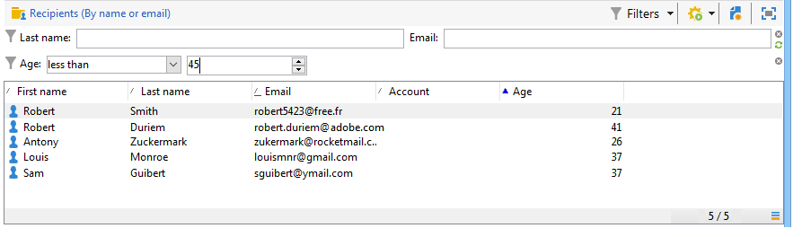
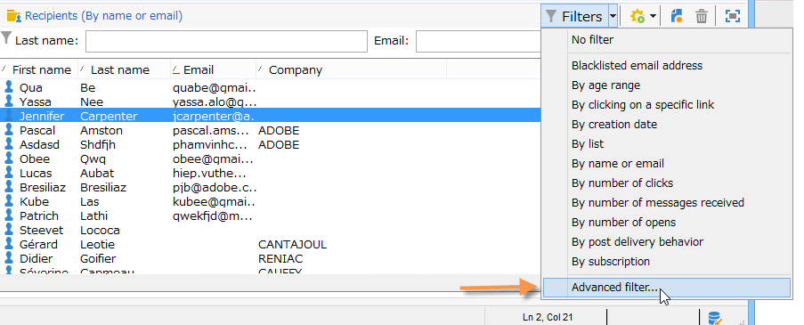
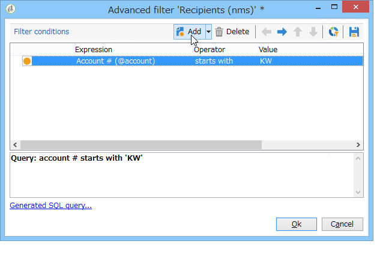
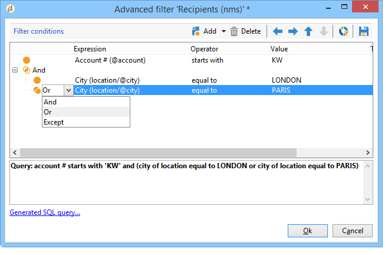
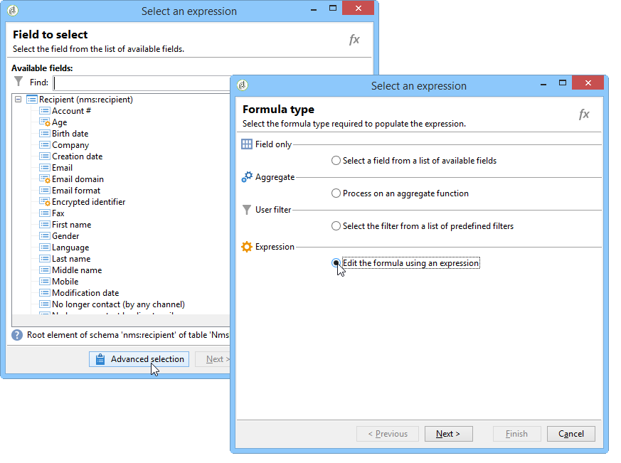
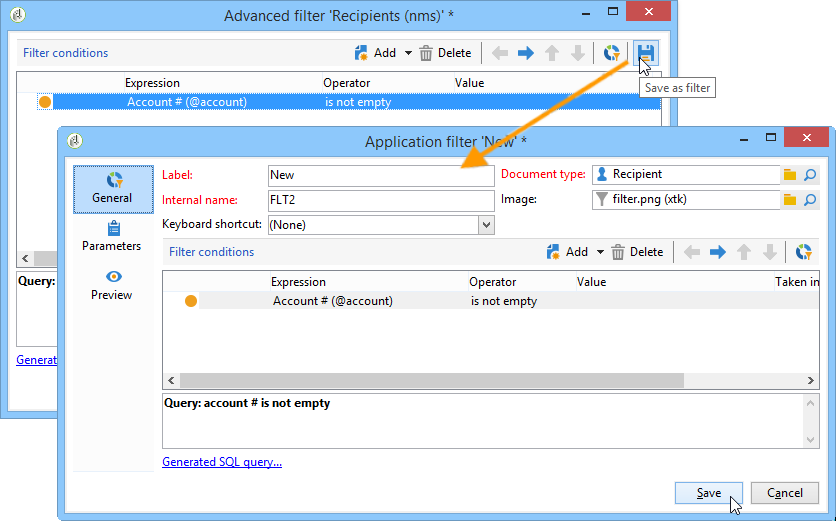

# Skapa filter{#creating-filters}

När du navigerar i Adobe Campaign-trädet (från **[!UICONTROL Explorer]**-menyn på startsidan) visas data i databasen i listor. Dessa listor kan konfigureras så att endast de data som krävs av operatorn visas. Åtgärder kan sedan startas på filtrerade data. Med filterkonfigurationen kan du välja data från en lista **[!UICONTROL dynamically]**. Om data ändras uppdateras de filtrerade data.

>[!NOTE]
>
>Konfigurationsinställningarna för användargränssnittet definieras lokalt på enhetsnivå. Ibland kan det vara nödvändigt att rensa upp dessa data, särskilt om det uppstår problem när data uppdateras. Använd menyn **[!UICONTROL File > Clear the local cache]** om du vill göra det.

## Typologi för tillgängliga filter {#typology-of-available-filters}

Med Adobe Campaign kan du använda filter på datalistor.

Dessa filter kan användas en gång eller så kan du spara dem för framtida bruk. Du kan använda flera filter samtidigt.

Följande filtertyper finns i Adobe Campaign:

* **Standardfilter**

   Standardfiltret **är tillgängligt via fälten ovanför listorna.** Du kan filtrera efter fördefinierade fält (för mottagarprofiler är dessa som standard namn och e-postadress). Du kan använda fälten för att ange tecken som ska filtreras eller för att välja filtervillkor från en nedrullningsbar lista.

   
<!--
  >[!NOTE]
  >
  >The **%** character replaces any character string. For example, the string `%@yahoo.com` lets you display all the profiles with an e-mail address in the domain "yahoo.com".
-->
Du kan ändra standardfiltret för en lista. Mer information finns i [Ändra standardfiltret](#altering-the-default-filter).

* **Enkla filter**

   **Enkla** filter är engångsfilter i kolumnerna. De definieras med ett eller flera enkla sökvillkor i de kolumner som visas.

   Du kan kombinera flera enkla filter i samma datalista för att begränsa sökningen. Filterfälten visas ett under det andra. De kan tas bort oberoende av varandra.

   

   Enkla filter beskrivs i [Skapa ett enkelt filter](#creating-a-simple-filter).

* **Avancerade filter**

   **Avancerade** filter skapas med en fråga eller en kombination av frågor på data.

   Mer information om hur du skapar ett avancerat filter finns i [Skapa ett avancerat filter](#creating-an-advanced-filter).

   Du kan använda funktioner för att definiera filtrets innehåll. Mer information finns i [Skapa ett avancerat filter med funktioner](#creating-an-advanced-filter-with-functions).

   >[!NOTE]
   >
   >Mer information om hur du skapar frågor i Adobe Campaign finns i [det här avsnittet](../../platform/using/about-queries-in-campaign.md).

* **Användarfilter**

   Ett **programfilter** är ett avancerat filter som har sparats för att använda och dela dess konfiguration med andra operatorer.

   Knappen **[!UICONTROL Filters]** ovanför listorna innehåller en uppsättning programfilter som kan kombineras för att förfina filtreringen. Metoden för att skapa dessa filter beskrivs i [Spara ett filter](#saving-a-filter).

## Ändra standardfilter {#altering-the-default-filter}

Om du vill ändra standardfiltret för en mottagarlista klickar du på noden **[!UICONTROL Profiles and Targets > Pre-defined filters]** i trädet.

För alla andra typer av data konfigurerar du standardfiltret via noden **[!UICONTROL Administration > Configuration > Predefined filters]**.

Använd följande steg:

1. Markera det filter som du vill använda som standard.
1. Klicka på fliken **[!UICONTROL Parameters]** och välj **[!UICONTROL Default filter for the associated document type]**.

   

   >[!CAUTION]
   >
   >Om ett standardfilter redan används i listan måste du inaktivera det innan du använder ett nytt filter. Om du vill göra det klickar du på det röda krysset till höger om filtreringsfälten.

1. Klicka på **[!UICONTROL Save]** för att använda filtret.

   >[!NOTE]
   >
   >Filterdefinitionsfönstret beskrivs i [Skapa ett avancerat filter](#creating-an-advanced-filter) och [Spara ett filter](#saving-a-filter).

## Skapa ett enkelt filter {#creating-a-simple-filter}

Så här skapar du ett **enkelt filter**:

1. Högerklicka på det fält som du vill filtrera och välj **[!UICONTROL Filter on this field]**.

   

   Standardfilterfälten visas ovanför listan.

1. Välj filteralternativet i listrutan eller ange filtervillkoren som ska användas (metoden för att välja eller ange villkor beror på fälttypen: text, uppräknad osv.).

   

1. Aktivera filtret genom att trycka på Enter på tangentbordet eller klicka på den gröna pilen till höger om filterfälten.

Om fältet som du vill filtrera data i inte visas som en profil kan du lägga till det i de kolumner som visas och sedan filtrera på den kolumnen. Så här gör du,

1. Klicka på ikonen **[!UICONTROL Configure the list]**.

   

1. Markera den kolumn som ska visas, till exempel mottagarnas ålder.

   

1. Högerklicka på kolumnen **Ålder** i mottagarlistan och välj **[!UICONTROL Filter on this column]**.

   

   Du kan sedan välja alternativ för åldersfiltrering.

   

## Skapa ett avancerat filter {#creating-an-advanced-filter}

Så här skapar du ett **avancerat filter**:

1. Klicka på knappen **[!UICONTROL Filters]** och välj **[!UICONTROL Advanced filter...]**.

   

   Du kan också högerklicka på listan med data som ska filtreras och välja **[!UICONTROL Advanced filter...]**.

   Definitionsfönstret för filtervillkor visas.

1. Klicka på kolumnen **[!UICONTROL Expression]** för att definiera indatavärdet.
1. Klicka på **[!UICONTROL Edit expression]** för att markera fältet som filtret ska tillämpas på.

   

1. I listan markerar du det fält där data ska filtreras. Bekräfta genom att klicka på **[!UICONTROL Finish]**.
1. Klicka på kolumnen **[!UICONTROL Operator]** och välj den operator som ska användas i listrutan.
1. Välj ett förväntat värde i kolumnen **[!UICONTROL Value]**. Du kan kombinera flera filter för att förfina frågan. Om du vill lägga till ett filtervillkor klickar du på **[!UICONTROL Add]**.

   

1. Du kan tilldela uttryck en hierarki eller ändra ordningen på frågeuttrycken med hjälp av pilarna i verktygsfältet.
1. Standardoperatorn mellan uttryck är **And**, men du kan ändra den genom att klicka på fältet. Du kan välja en **eller**-operator.

   

1. Klicka på **[!UICONTROL OK]** för att bekräfta att filter har skapats och använda det i listan.

Filtret som används visas ovanför listan.

Om du vill redigera eller ändra det här filtret klickar du på filtrets etikett.

Om du vill avbryta det här filtret klickar du på ikonen **[!UICONTROL Remove this filter]** till höger om filtret.

Du kan spara ett avancerat filter om du vill behålla det för framtida bruk. Mer information om den här filtertypen finns i [Spara ett filter](#saving-a-filter).

### Skapa ett avancerat filter med funktioner {#creating-an-advanced-filter-with-functions}

Avancerade filter kan använda funktioner; **filter med funktioner** skapas via en uttrycksredigerare där du kan skapa formler med hjälp av databasdata och avancerade funktioner. Om du vill skapa ett filter med funktioner upprepar du stegen 1, 2 och 3 för att skapa avancerade filter och fortsätter sedan enligt följande:

1. Klicka på **[!UICONTROL Advanced selection]** i fältvalsfönstret.
1. Välj formeltyp som ska användas: mängd, befintligt användarfilter eller uttryck.

   

   Följande alternativ är tillgängliga:

   * **[!UICONTROL Field only]** för att markera ett fält. Det här är standardläget.
   * **[!UICONTROL Aggregate]** för att välja den sammanställningsformel som ska användas (antal, summa, genomsnitt, maximum, minimum).
   * **[!UICONTROL User filter]** om du vill välja ett av de befintliga användarfiltren. Användarfilter beskrivs i [Spara ett filter](#saving-a-filter).
   * **[!UICONTROL Expression]** för att komma åt uttrycksredigeraren.

      Med uttrycksredigeraren kan du definiera ett avancerat filter. Det ser ut så här:

      

      Här kan du markera fält i databastabellerna och bifoga avancerade funktioner till dem: Välj den funktion som ska användas i **[!UICONTROL List of functions]**. Tillgängliga funktioner beskrivs i [Lista över funktioner](../../platform/using/defining-filter-conditions.md#list-of-functions). Markera sedan det eller de fält som berörs av funktionerna och klicka på **[!UICONTROL OK]** för att godkänna uttrycket.

      >[!NOTE]
      >
      >Ett exempel på hur du skapar filter baserat på ett uttryck finns i [det här avsnittet](../../workflow/using/sending-a-birthday-email.md#identifying-recipients-whose-birthday-it-is).

## Spara ett filter {#saving-a-filter}

Filter är specifika för varje operator och initieras om varje gång operatorn rensar cachen för sin klientkonsol.

Du kan skapa ett **programfilter** genom att spara ett avancerat filter: kan återanvändas genom att högerklicka i en lista eller via knappen **[!UICONTROL Filters]** ovanför listorna.

Dessa filter kan också nås direkt via leveransguiden i målurvalsfasen (se [det här avsnittet](../../delivery/using/creating-an-email-delivery.md) för mer information om hur du skapar leveranser). Om du vill skapa programfiltret kan du:

* Konvertera ett avancerat filter till ett programfilter. Om du vill göra det klickar du på **[!UICONTROL Save]** innan du stänger den avancerade filterredigeraren.

   

* Skapa det här programfiltret via noden **[!UICONTROL Administration > Configuration > Predefined filters]** (eller **[!UICONTROL Profiles and targets > Predefined filters]** för mottagare) i trädet. Om du vill göra det högerklickar du på filterlistan och väljer **[!UICONTROL New...]**. Proceduren är densamma som när du skapar avancerade filter.

   I fältet **[!UICONTROL Label]** kan du namnge det här filtret. Det här namnet visas i kombinationsrutan för knappen **[!UICONTROL Filters...]**.

   

Du kan ta bort alla filter i den aktuella listan genom att högerklicka och välja **[!UICONTROL No filter]** eller via ikonen **[!UICONTROL Filters]** ovanför listan.

Du kan kombinera filter genom att klicka på knappen **[!UICONTROL Filters]** och använda menyn **[!UICONTROL And...]**.

## Filtrera mottagare {#filtering-recipients}

Med fördefinierade filter (se [Spara ett filter](#saving-a-filter)) kan du filtrera profilerna för mottagarna i databasen. Du kan redigera filter från noden **[!UICONTROL Profiles and Targets > Predefined filters]** i trädet. Filtren visas i den övre delen av arbetsytan med knappen **[!UICONTROL Filters]**.

Markera ett filter om du vill visa dess definition och få tillgång till en förhandsvisning av filtrerade data.

>[!NOTE]
>
>Ett detaljerat exempel på hur du skapar fördefinierade filter finns i [Använd skiftläge](../../platform/using/use-case.md).

De fördefinierade filtren är:

<table> 
 <tbody> 
  <tr> 
   <td> <strong>Etikett</strong>  </td> 
   <td> <strong>Fråga</strong>  </td> 
  </tr> 
  <tr> 
   <td> Öppnad  </td> 
   <td> Väljer mottagare som har öppnat en leverans.  </td> 
  </tr> 
  <tr> 
   <td> Öppnad men inte klickad  </td> 
   <td> Väljer mottagare som har öppnat en leverans men inte klickat på en länk.  </td> 
  </tr> 
  <tr> 
   <td> Inaktiva mottagare  </td> 
   <td> Väljer mottagare som inte har öppnat en leverans på X månader.  </td> 
  </tr> 
  <tr> 
   <td> Senaste aktivitet efter enhetstyp  </td> 
   <td> Väljer mottagare som har klickat eller öppnat leveransadress Y med enhet X de senaste Z-dagarna.  </td> 
  </tr> 
  <tr> 
   <td> Senaste aktivitet efter enhetstyp (spårning)  </td> 
   <td> Väljer mottagare som har klickat eller öppnat leveransadress Y med enhet X de senaste Z-dagarna.  </td> 
  </tr> 
  <tr> 
   <td> Mottagare som inte är målinriktade  </td> 
   <td> Väljer mottagare som aldrig har fått mål via kanal Y på X månader.  </td> 
  </tr> 
  <tr> 
   <td> Mycket aktiva mottagare  </td> 
   <td> Väljer mottagare som har klickat på en leverans minst X gånger de senaste Y-månaderna.  </td> 
  </tr> 
  <tr> 
 <td> Blocklist e-postadress  </td> 
    <td> Väljer mottagare vars e-postadress finns på blockeringslista.  </td>
  </tr> 
  <tr> 
   <td> E-postadress i karantän  </td> 
   <td> Väljer mottagare vars e-postadress är i karantän.  </td> 
  </tr> 
  <tr> 
   <td> E-postadresser som är duplicerade i mappen  </td> 
   <td> Väljer mottagare vars e-postadress är duplicerad i mappen.  </td> 
  </tr> 
  <tr> 
   <td> Varken öppnad eller klickad  </td> 
   <td> Väljer mottagare som inte har öppnat en leverans eller klickat i en leverans.  </td> 
  </tr> 
  <tr> 
   <td> Nya mottagare (dagar)  </td> 
   <td> Väljer mottagare som har skapats de senaste X dagarna.  </td> 
  </tr> 
  <tr> 
   <td> Nya mottagare (minuter)  </td> 
   <td> Väljer mottagare som har skapats de senaste X minuterna.  </td> 
  </tr> 
  <tr> 
   <td> Nya mottagare (månader)  </td> 
   <td> Väljer mottagare som har skapats de senaste X månaderna.  </td> 
  </tr> 
  <tr> 
   <td> Efter prenumeration  </td> 
   <td> Väljer mottagare efter prenumeration.  </td> 
  </tr> 
  <tr> 
   <td> Genom att klicka på en specifik länk  </td> 
   <td> Väljer mottagare som klickat på en viss URL i en leverans.  </td> 
  </tr> 
  <tr> 
   <td> Efter leveransbeteende  </td> 
   <td> Väljer mottagare efter deras beteende efter att de har tagit emot en leverans.  </td> 
  </tr> 
  <tr> 
   <td> Efter skapad den  </td> 
   <td> Väljer mottagare efter skapandedatum, över en period som sträcker sig från X månader (aktuellt datum minus n månader) till Y månader (aktuellt datum minus n månader).  </td> 
  </tr> 
  <tr> 
   <td> Efter lista  </td> 
   <td> Väljer mottagare efter lista.  </td> 
  </tr> 
  <tr> 
   <td> Efter antal klick  </td> 
   <td> Väljer mottagare som klickat på en leverans de senaste X månaderna.  </td> 
  </tr> 
  <tr> 
   <td> Efter antal mottagna meddelanden  </td> 
   <td> Väljer mottagare efter det antal meddelanden de tagit emot.  </td> 
  </tr> 
  <tr> 
   <td> Efter antal öppningar  </td> 
   <td> Väljer mottagare som öppnat mellan X och Y levererar över Z tid.  </td> 
  </tr> 
  <tr> 
   <td> Efter namn eller e-postadress  </td> 
   <td> Väljer mottagare efter namn eller e-postadress.  </td> 
  </tr> 
  <tr> 
   <td> Efter åldersintervall  </td> 
   <td> Väljer mottagare efter deras ålder.  </td> 
  </tr> 
 </tbody> 
</table>

>[!NOTE]
>
>Alla jämförelser som rör räkning och perioder ska förstås i vidare bemärkelse (mottagare som motsvarar frågegränserna inkluderas i jämförelsen).

Exempel på hur data beräknas:

* Väljer mottagare som är yngre än 30 år:

   

* Väljer mottagare som är 18 år eller äldre:

   

* Väljer mottagare mellan 18 och 30 år:

   

## Avancerade inställningar för datafilter {#advanced-settings-for-data-filters}

Klicka på fliken **[!UICONTROL Settings]** för att komma åt följande alternativ:

* **[!UICONTROL Default filter for the associated document type]**: Med det här alternativet kan du som standard föreslå det här filtret i redigeraren för de listor som berörs av sorteringen.

   Filtret **[!UICONTROL By name or login]** används till exempel på operatorer. Det här alternativet är markerat och därför erbjuds filtret alltid i alla operatorlistor.

* **[!UICONTROL Filter shared with other operators]**: Med det här alternativet kan du göra filtret tillgängligt för alla andra operatorer i den aktuella databasen.
* **[!UICONTROL Use parameter entry form]**: Med det här alternativet kan du definiera de filterfält som ska visas ovanför listan när det här filtret är markerat. I dessa fält kan du definiera filterinställningarna. Formuläret måste anges i XML-format med knappen **[!UICONTROL Form]**. Det förkonfigurerade filtret **[!UICONTROL Recipients who have opened]**, som finns i mottagarlistan, visar till exempel ett filterfält där du kan välja den leverans som filtret ska användas för.

   Knappen **[!UICONTROL Preview]** visar resultatet av det valda filtret.

* Med länken **[!UICONTROL Advanced parameters]** kan du definiera ytterligare inställningar. Du kan associera en SQL-tabell med filtret för att göra den gemensam för alla redigerare som delar tabellen.

   Välj alternativet **[!UICONTROL Do not restrict the filter]** om du vill hindra användaren från att åsidosätta det här filtret.

   Det här alternativet är aktiverat för filter för mottagare av en leverans och mottagare av leveranser som tillhör en mapp som finns i leveransguiden och som inte kan överladdas.

   
