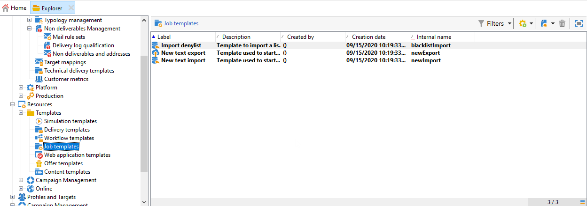

# Skapa import- och exportmallar {#creating-import-export-templates}

Import- och exportmallar lagras i katalogen **[!UICONTROL Resources > Templates > Job templates]** i Adobe Campaign-trädet.

Som standard finns det tre importmallar och en exportmall i den här katalogen. De får inte ändras.

* Den inbyggda mallen **[!UICONTROL Import denylist]** har redan konfigurerats för att importera en lista med e-postadresser som har lagts till i blockeringslista.

* Med hjälp av mallarna **[!UICONTROL New text import]** och **[!UICONTROL New text export]** kan du konfigurera en import- eller exportfunktion från början.

Du kan duplicera befintliga mallar för att skapa egna mallar eller skapa en ny mall via menyn **[!UICONTROL New > Import template]** / **[!UICONTROL Export template]**.

Processen att konfigurera en mall är då densamma som beskrivs i följande avsnitt:

* [Konfigurera ett importjobb](../../platform/using/executing-import-jobs.md)
* [Konfigurera ett exportjobb](../../platform/using/executing-export-jobs.md)
