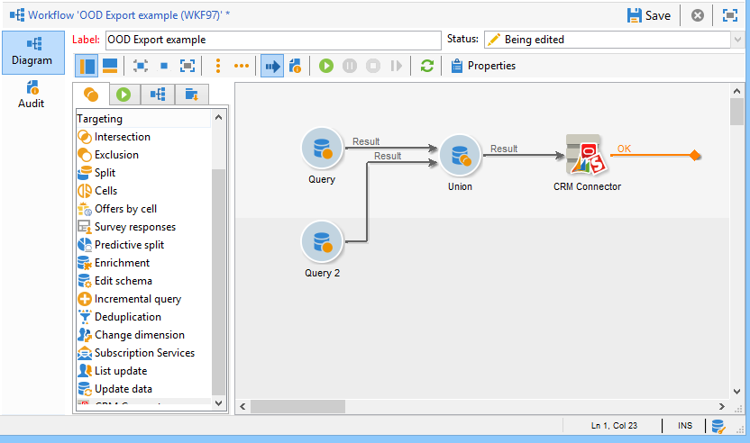

# CRM-kopplingar{#crm-connectors}

## Om CRM-anslutningar {#about-crm-connectors}

Adobe Campaign tillhandahåller olika CRM-kopplingar för att länka din plattform i Adobe Campaign till dina tredjepartssystem. Med dessa CRM-kopplingar kan du synkronisera kontakter, konton och inköp osv. De låter dig enkelt integrera din applikation med olika tredjeparts- och företagsapplikationer.

Dessa kopplingar möjliggör snabb och enkel dataintegrering. Adobe Campaign erbjuder en dedikerad guide för att samla in och välja bland tabellerna i CRM. Detta garanterar dubbelriktad synkronisering för att säkerställa att data alltid är aktuella i alla system.

>[!NOTE]
>
>Den här funktionen är tillgänglig i Adobe Campaign via **CRM-anslutningarna** dedikerade paket.

Anslutningen till CRM sker via dedikerade arbetsflödesaktiviteter. Dessa aktiviteter beskrivs i kapitlet som presenteras i [det här avsnittet](../../workflow/using/crm-connector.md).

### Kompatibla CRM-system och -begränsningar {#compatible-crm-systems-and-limitations}

CRM:er som anges nedan kan integreras i Adobe Campaign.

Versioner som stöds anges i Campaign [kompatibilitetsmatrisen](../../rn/using/compatibility-matrix.md).

* **Salesforce.com**

   Läs [det här avsnittet](#example-for-salesforce-com) om du vill veta mer om hur du konfigurerar anslutningen med Salesforce.com.

   >[!IMPORTANT]
   >
   >När du ansluter Adobe Campaign till Salesforce.com är begränsningarna:
   >
   >    
   >    
   >    * Testproduktionsinstanser stöds.
   >    * Tilldelningsregler stöds.
   >    * Uppräkningar av flera markeringar stöds inte av Adobe Campaign.

* **Oracle On Demand**

   Läs [det här avsnittet](#example-for-oracle-on-demand) om du vill veta hur du konfigurerar anslutningen med Oracle On Demand.

   >[!IMPORTANT]
   >
   >När du ansluter Adobe Campaign till Oracle On Demand är begränsningarna:
   >
   >    
   >    
   >    * Adobe Campaign kan synkronisera alla objekt som finns i Oracle On Demand-mallarna. Om du har lagt till anpassade tabeller i Oracle On Demand, kommer dessa inte att återställas i Adobe Campaign.
   >    * Med API-version v1.0 kan du sortera eller filtrera data under en fråga, men du kan inte göra båda samtidigt.
   >    * Datumen som skickas av Oracle On Demand innehåller ingen tidszonsinformation.
   >    * Uppräkningar av flera markeringar stöds inte av Adobe Campaign.

* **MS Dynamics** CRM och  **MS Dynamics Online**

   Mer information om hur du konfigurerar anslutningen till Microsoft Dynamics finns i [det här avsnittet](#example-for-microsoft-dynamics).

    Läs om hur integreringen mellan Adobe Campaign och Microsoft Dynamics fungerar i  [den här videon](https://helpx.adobe.com/campaign/kt/acc/using/acc-integrate-dynamics365-with-acc-feature-video-set-up.html).

   >[!IMPORTANT]
   >
   >När du ansluter Adobe Campaign med Microsoft Dynamics är begränsningarna:
   >
   >    
   >    
   >    * Att installera plugin-program kan ändra CRM-beteendet, vilket kan leda till kompatibilitetsproblem med Adobe Campaign.
   >    * Uppräkningar av flera markeringar stöds inte av Adobe Campaign.

## Konfigurera anslutningen {#setting-up-the-connection}

Gör så här om du vill använda CRM-anslutningar i Adobe Campaign:

1. Skapa det externa kontot
1. Samla CRM-tabellerna
1. Synkronisera uppräkningar
1. Skapa synkroniseringsarbetsflödet

>[!NOTE]
>
>CRM-anslutningarna fungerar bara med en säker URL (https).

### Exempel på Salesforce.com {#example-for-salesforce-com}

Följ stegen nedan för att konfigurera **Salesforce.com**-anslutningen med Adobe Campaign:

1. Skapa ett nytt externt konto via noden **[!UICONTROL Administration > Platform > External accounts]** i Adobe Campaign-trädet.
1. Kör konfigurationsguiden för att generera tillgängliga CRM-tabeller.

   

   Med konfigurationsguiden kan du samla in tabeller och skapa det matchande schemat.

   Klicka på **[!UICONTROL Start]** för att köra körningen.

   

   >[!NOTE]
   >
   >För att godkänna installationen måste du logga ut och sedan logga in på Adobe Campaign Console igen.

1. Kontrollera schemat som genererats i Adobe Campaign i noden **[!UICONTROL Administration > Configuration > Data schemas]**.

   

1. När schemat har skapats kan du synkronisera uppräkningar automatiskt via CRM till Adobe Campaign.

   Det gör du genom att klicka på länken **[!UICONTROL Synchronizing enumerations...]** och välja den Adobe Campaign-uppräkning som matchar CRM-uppräkningen.

   Du kan ersätta alla värden i en Adobe Campaign-uppräkning med dem i CRM: Om du vill göra det väljer du **[!UICONTROL Yes]** i kolumnen **[!UICONTROL Replace]**.

   

   Klicka på **[!UICONTROL Next]** och sedan på **[!UICONTROL Start]** för att börja importera listan.

1. Kontrollera de importerade värdena på **[!UICONTROL Administration > Platform > Enumerations]**-menyn.

   

1. Om du vill importera Salesforce-data eller exportera Adobe Campaign-data till Salesforce måste du skapa ett arbetsflöde och använda aktiviteten **[!UICONTROL CRM connector]**.

   

### Exempel på Oracle On Demand {#example-for-oracle-on-demand}

Så här konfigurerar du **Oracle On Demand**-anslutningen så att den fungerar med Adobe Campaign:

1. Skapa ett nytt externt konto via noden **[!UICONTROL Administration > Platform > External accounts]** i Adobe Campaign-trädet.

   

1. Öppna konfigurationsguiden: Adobe Campaign visar automatiskt tabellerna i Oracle datamodell. Markera de tabeller som du vill samla in.

   

1. Klicka på **[!UICONTROL Next]** för att börja skapa det matchande schemat.

   Det matchande dataschemat blir tillgängligt i Adobe Campaign.

   

1. Starta synkronisering av uppräkningar mellan Adobe Campaign och Oracle On Demand.

   

1. Om du vill importera Oracle On Demand-data till Adobe Campaign skapar du följande arbetsflöde:

   

   Det här arbetsflödet importerar kontakter via Oracle On Demand, synkroniserar dem med befintliga Adobe Campaign-data, tar bort dubblettkontakter och uppdaterar Adobe Campaign-databasen.

   Aktiviteten **[!UICONTROL CRM Connector]** måste konfigureras enligt följande:

   

1. Om du vill exportera Adobe Campaign-data till Oracle On Demand skapar du följande arbetsflöde:

   

   Det här arbetsflödet samlar in relevanta data med hjälp av frågor och exporterar dem sedan till kontakttabellen för Oracle On Demand.

### Exempel för Microsoft Dynamics {#example-for-microsoft-dynamics}

Så här konfigurerar du Microsoft Dynamics-anslutningen så att den fungerar med Adobe Campaign:

1. Skapa ett nytt externt konto via noden **[!UICONTROL Administration > Platform > External accounts]** i Adobe Campaign-trädet.

   

1. Välj **distributionstyp**: **[!UICONTROL On-premise]**, **[!UICONTROL Office 365]** eller **[!UICONTROL Web API]**, beroende på vilken koppling du vill konfigurera.

   Adobe Campaign Classic stöder Dynamics 365 REST-gränssnittet med OAuth-protokollet för autentisering.

   Om du väljer en **[!UICONTROL WebAPI]**-distribution måste du registrera en app i Azure Directory och hämta **clientId** från Azure-katalogen. Den här registreringen finns i [den här sidan](https://docs.microsoft.com/en-us/powerapps/developer/common-data-service/walkthrough-register-app-azure-active-directory).

   >[!NOTE]
   >
   >Parametern redirectURL krävs inte av Adobe Campaign Classic.

   **clientId**-värdet används med användarnamn/lösenord för att hämta innehavartoken med hjälp av lösenord för anslagstyp. Det här kallas **Resursägarens lösenordsreferenser Bevilja**. Se denna [sida](https://docs.microsoft.com/en-us/azure/active-directory/develop/v2-oauth-ropc) för mer information om detta.

   

   Mer information om kompatibilitet för CRM-versioner finns i [Kompatibilitetsmatrisen](https://helpx.adobe.com/se/campaign/kb/compatibility-matrix.html).

1. Öppna konfigurationsguiden. Adobe Campaign identifierar automatiskt tabellerna från datamallen i Microsoft Dynamics.

   

1. Markera de tabeller som ska återställas.

   

1. Klicka på **[!UICONTROL Next]** och börja skapa motsvarande schema.

   

   >[!NOTE]
   >
   >Om du vill godkänna konfigurationen måste du koppla från/återansluta till Adobe Campaign-konsolen.

   Det matchande dataschemat blir tillgängligt i Adobe Campaign.

   

1. Starta synkronisering av uppräkningar mellan Adobe Campaign och Microsoft Dynamics.

   

1. Om du vill importera Microsoft Dynamics-data till Adobe Campaign skapar du följande typ av arbetsflöde:

   

   Det här arbetsflödet importerar kontakterna via Microsoft Dynamics, synkroniserar dem med befintliga Adobe Campaign-data, tar bort dubblettkontakter och uppdaterar Adobe Campaign-databasen.

   Aktiviteten **[!UICONTROL CRM Connector]** måste konfigureras enligt nedan:

   

## Datasynkronisering {#data-synchronization}

Synkroniseringen mellan Adobe Campaign och CRM utförs via en särskild arbetsflödesaktivitet: [CRM-koppling](../../workflow/using/crm-connector.md).

Med den här aktiviteten kan du:

* Importera från CRM (se [Importera från CRM](#importing-from-the-crm)),
* Exportera till CRM (se [Exportera till CRM](#exporting-to-the-crm)),
* Importera objekt som tagits bort i CRM (se [Importera objekt som tagits bort i CRM](#importing-objects-deleted-in-the-crm)),
* Ta bort objekt i CRM (se [Ta bort objekt i CRM](#deleting-objects-in-the-crm)).

Välj det externa konto som matchar det CRM-konto som du vill konfigurera synkronisering med och välj sedan det objekt som ska synkroniseras (konton, affärsmöjligheter, leads, kontakter osv.).

Aktivitetens konfiguration beror på vilken process som ska utföras. Olika konfigurationer beskrivs nedan.

### Importera från CRM {#importing-from-the-crm}

Om du vill importera data via CRM i Adobe Campaign måste du skapa följande arbetsflöde:

Aktivitetskonfigurationsstegen för **CRM Connector** är följande för en importaktivitet:

1. Välj en **[!UICONTROL Import from the CRM]**-åtgärd.
1. Gå till listrutan **[!UICONTROL Remote object]** och markera objektet som berörs av processen. Det här objektet sammanfaller med en av tabellerna som skapas i Adobe Campaign under anslutningskonfigurationen.
1. Gå till avsnittet **[!UICONTROL Remote fields]** och ange fälten som ska importeras.

   Om du vill lägga till ett fält klickar du på knappen **[!UICONTROL Add]** i verktygsfältet och sedan på ikonen **[!UICONTROL Edit expression]**.

   

   Om det behövs ändrar du dataformatet via listrutan för kolumnerna **[!UICONTROL Conversion]**. Möjliga konverteringstyper anges i [Dataformat](#data-format).

   >[!IMPORTANT]
   >
   >Identifieraren för posten i CRM är obligatorisk för att länka objekt i CRM och Adobe Campaign. Den läggs till automatiskt när förpackningen godkänns.
   >
   >Det sista ändringsdatumet på CRM-sidan är också obligatoriskt för inkrementell dataimport.

1. Du kan även filtrera data som ska importeras efter dina behov. Det gör du genom att klicka på länken **[!UICONTROL Edit the filter...]**.

   I följande exempel kommer Adobe Campaign endast att importera kontakter för vilka viss aktivitet har registrerats sedan 1 november 2012.

   

   >[!IMPORTANT]
   >
   >Begränsningarna som är kopplade till datafiltreringslägen beskrivs i [Filtrera data](#filtering-data).

1. Med alternativet **[!UICONTROL Use automatic index...]** kan du automatiskt hantera inkrementell objektsynkronisering mellan CRM och Adobe Campaign, beroende på datum och senaste ändring.

   Mer information finns i [Variabelhantering](#variable-management).

#### Variabelhantering {#variable-management}

Om du aktiverar alternativet **[!UICONTROL Automatic index]** kan du bara samla in objekt som ändrats sedan den senaste importen.

Datumet för den senaste synkroniseringen lagras som standard i ett alternativ som anges i konfigurationsfönstret: **LASTIMPORT_&lt;%=instance.internalName%>_&lt;%=activityName%>**.

>[!NOTE]
>
>Den här anteckningen gäller endast för den allmänna **[!UICONTROL CRM Connector]**-aktiviteten. För andra CRM-aktiviteter är processen automatisk.
>
>Det här alternativet måste skapas och fyllas i manuellt under **[!UICONTROL Administration]** > **[!UICONTROL Platform]** > **[!UICONTROL Options]**. Det måste vara ett textalternativ och dess värde måste matcha följande format: **ååå/MM/dd hh:mm:ss**.
> 
>Du måste uppdatera det här alternativet manuellt för ytterligare import.

Du kan ange vilket CRM-fjärrfält som ska beaktas för att identifiera de senaste ändringarna.

Som standard används följande fält (i den angivna ordningen):

* För Microsoft Dynamics: **modifiedon**,
* För Oracle On Demand: **Senast uppdaterad**, **ModifiedDate**, **LastLoggedIn**,
* För Salesforce.com: **LastModifiedDate**, **SystemModstamp**.

När du aktiverar alternativet **[!UICONTROL Automatic index]** genereras tre variabler som kan användas i synkroniseringsarbetsflödet via en **[!UICONTROL JavaScript code]**-typaktivitet. Dessa verksamheter är följande:

* **vars.crmOptionName**: representerar namnet på alternativet som innehåller det senaste importdatumet.
* **vars.crmStartImport**: representerar startdatumet (inkluderat) för den senaste dataåterställningen.
* **vars.crmEndDate**: representerar slutdatumet (exkluderat) för den senaste dataåterställningen.

   >[!NOTE]
   >
   >Dessa datum visas i följande format: **ååå/MM/dd hh:mm:ss**.

#### Filtrera data {#filtering-data}

För att de olika CRM-systemen ska fungera effektivt måste du skapa filter enligt följande regler:

* Varje filtreringsnivå får endast använda en typ av operator.
* Operatorn AND NOT stöds inte.
* Jämförelser kan bara gälla null-värden (&#39;är tom&#39;/&#39;är inte tom&#39;) eller tal. Detta innebär att värdet (högerkolumnen) bedöms och att resultatet av denna bedömning måste vara ett tal. JOBIN-typjämförelser stöds därför inte.
* Värdet i den högra kolumnen utvärderas i JavaScript.
* JOIN-jämförelser stöds inte.
* Uttrycket i den vänstra kolumnen måste vara ett fält. Det kan inte vara en kombination av flera uttryck, ett tal osv.

Följande filtreringsvillkor gäller till exempel INTE för en CRM-import eftersom OR-operatorn är placerad på samma nivå som AND-operatorerna:

* Operatorn OR placeras på samma nivå som operatorn AND
* Jämförelser görs av textsträngar.

#### Beställ av {#order-by}

I Microsoft Dynamics och Salesforce.com kan du sortera de fjärrfält som ska importeras i stigande eller fallande ordning.

Det gör du genom att klicka på länken **[!UICONTROL Order by]** och lägga till kolumnerna i listan.

Sorteringsordningen för kolumnerna i listan är:

#### Registrera identifiering {#record-identification}

I stället för att importera element som ingår (och eventuellt filtreras) i CRM kan du använda en population som beräknas i förväg i arbetsflödet.

Det gör du genom att markera alternativet **[!UICONTROL Use the population calculated upstream]** och ange fältet som innehåller fjärtidentifieraren.

Markera sedan fälten för den inkommande ifyllning som du vill importera, så som visas nedan:

### Exporterar till CRM {#exporting-to-the-crm}

Genom att exportera Adobe Campaign-data till CRM kan du kopiera hela innehållet till en CRM-databas.

Om du vill exportera data till CRM måste du skapa följande arbetsflöde:

Om du vill exportera använder du följande konfiguration för aktiviteten **CRM Connector**:

1. Välj en **[!UICONTROL Export to CRM]**-åtgärd.
1. Gå till listrutan **[!UICONTROL Remote object]** och markera objektet som berörs av processen. Det här objektet sammanfaller med en av tabellerna som skapas i Adobe Campaign under anslutningskonfigurationen.

   >[!IMPORTANT]
   >
   >Exportfunktionen för aktiviteten **CRM Connectors** kan infoga eller uppdatera fält på CRM-sidan. Om du vill aktivera fältuppdateringar i CRM måste du ange fjärrtabellens primärnyckel. Om nyckeln saknas infogas data (i stället för att uppdateras).

1. I avsnittet **[!UICONTROL Mapping]** anger du fälten som ska exporteras och deras mappning i CRM.

   

   Om du vill lägga till ett fält klickar du på knappen **[!UICONTROL Add]** i verktygsfältet och sedan på ikonen **[!UICONTROL Edit expression]**.

   >[!NOTE]
   >
   >Om ingen matchning har definierats på CRM-sidan för ett givet fält kan värdena inte uppdateras: De infogas direkt i CRM.

   Om det behövs ändrar du dataformatet via listrutan för kolumnerna **[!UICONTROL Conversion]**. Möjliga konverteringstyper anges i [Dataformat](#data-format).

   >[!NOTE]
   >
   >Listan med poster som ska exporteras och resultatet av exporten sparas i en temporär fil som är tillgänglig tills arbetsflödet har slutförts eller startats om. Detta gör att du kan starta processen igen om fel uppstår utan att riskera att exportera samma post flera gånger eller förlora data.

### Ytterligare konfigurationer {#additional-configurations}

#### Dataformat {#data-format}

Du kan konvertera dataformat direkt när du importerar dem till eller från CRM.

Det gör du genom att välja den konvertering som ska användas i den matchande kolumnen.

Läget **[!UICONTROL Default]** tillämpar automatisk datakonvertering, som i de flesta fall motsvarar en kopia/inklistring av data. Tidszonshantering används dock.

Andra konverteringar är:

* **[!UICONTROL Date only]**: I det här läget tas datum- och tidstypsfält bort.
* **[!UICONTROL Without time offset]**: I det här läget avbryts den tidszonshantering som används i standardläget.
* **[!UICONTROL Copy/Paste]**: I det här läget används rådata som strängar (ingen konvertering).

#### Fel vid bearbetning av {#error-processing}

Inom ramen för import och export av data kan du tillämpa en specifik process på fel och avslag. Det gör du genom att välja alternativen **[!UICONTROL Process rejects]** och **[!UICONTROL Process errors]** på fliken **[!UICONTROL Behavior]**.

Dessa alternativ placerar de matchande utdataövergångarna.

Placera sedan de aktiviteter som är relevanta för de processer du vill tillämpa.

Om du till exempel vill behandla fel kan du lägga till en vänteruta och schemalägga nya försök.

Avvisade registreras med sin felkod och det relaterade meddelandet, vilket innebär att du kan ställa in spårning av avvisade för att optimera synkroniseringsprocessen.

>[!NOTE]
>
>Även om alternativet **[!UICONTROL Process rejects]** inte är aktiverat genereras en varning för varje avvisad kolumn med en felkod och ett meddelande.

Utdataövergången **[!UICONTROL Reject]** ger dig åtkomst till utdataschemat som innehåller de specifika kolumner som är relevanta för felmeddelanden och koder. Följande kolumner är:

* För Oracle On Demand: **errorLogFilename** (loggfilens namn på Oracle-sidan), **errorCode** (felkod), **errorSymbol** (felsymbol, skiljer sig från felkoden), **errorMessage** (beskrivning av felkontexten).
* För Salesforce.com: **errorSymbol** (felsymbol, skiljer sig från felkoden), **errorMessage** (beskrivning av felkontexten).

### Importerar objekt som har tagits bort i CRM {#importing-objects-deleted-in-the-crm}

Om du vill kunna konfigurera en omfattande datasynkroniseringsprocess kan du importera objekt som tagits bort i CRM till Adobe Campaign.

Gör så här:

1. Välj en **[!UICONTROL Import objects deleted in the CRM]**-åtgärd.
1. Gå till listrutan **[!UICONTROL Remote object]** och markera objektet som berörs av processen. Det här objektet sammanfaller med en av tabellerna som skapas i Adobe Campaign under anslutningskonfigurationen.
1. Ange den borttagningsperiod som ska beaktas i fälten **[!UICONTROL Start date]** och **[!UICONTROL End date]**. Dessa datum inkluderas i perioden.

   

   >[!IMPORTANT]
   >
   >Elementets raderingsperiod måste sammanfalla med de begränsningar som är specifika för CRM. Det innebär att för Salesforce.com kan element som togs bort för över 30 dagar sedan inte återställas.

### Tar bort objekt i CRM {#deleting-objects-in-the-crm}

Om du vill ta bort objekt på CRM-sidan måste du ange primärnyckeln för de fjärrelement som ska tas bort.

På fliken **[!UICONTROL Behavior]** kan du aktivera bearbetning av avslag. Det här alternativet genererar en andra utdataövergång för aktiviteten **[!UICONTROL CRM connector]**. Mer information finns i [Felbearbetning](#error-processing).

>[!NOTE]
>
>Även om alternativet **[!UICONTROL Process rejects]** är inaktiverat genereras en varning för varje avvisad kolumn.

