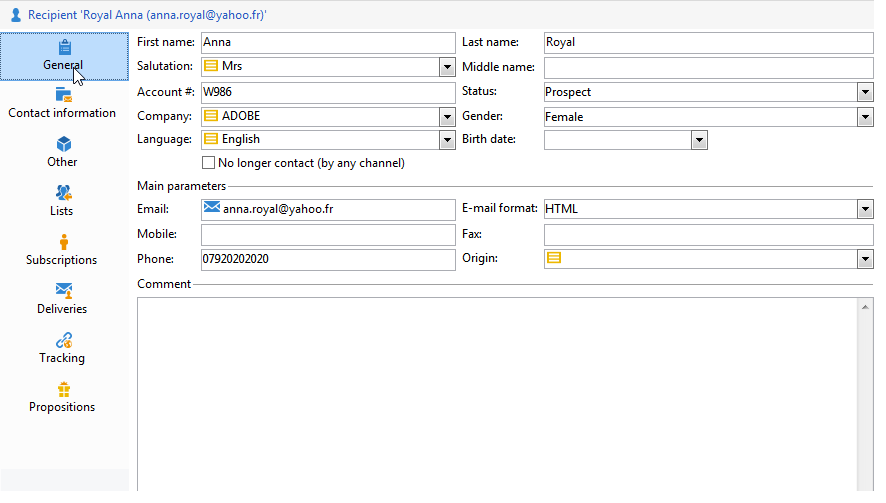

# Redigera en profil{#editing-a-profile}

Om du vill visa information om en profil klickar du på profilens namn i profillistan.

Profilinformationen visas på en ny flik.

Data som rör profiler grupperas i flikar.

Flikar och deras innehåll beror på din konfiguration och installerade paket.

>[!CAUTION]
>
>XML-schemat och det formulär som gäller fälten i profiltabellen är tillgängliga via noden **[!UICONTROL Administration > Configuration > Data schemas]** i Adobe Campaign-trädet. Endast expertanvändare får göra ändringar i dessa scheman.
>
>For further information, refer to [this page](../../configuration/using/about-schema-edition.md).

## Fliken Allmänt {#general-tab}

Den här skärmen innehåller alla allmänna data om den valda profilen. Den innehåller i synnerhet efternamn, förnamn, e-postadress, e-postmottagningsformat osv. Det ser ut så här:

>[!NOTE]
>
>När du väljer **[!UICONTROL No longer contact (by any channel)]** alternativet innebär det att profilen är på blockeringslista, dvs. att profilen har uttryckt en önskan om att inte bli kontaktad (t.ex. genom att klicka på en länk för att avbryta prenumerationen i ett nyhetsbrev). De kommer inte längre att vara inriktade på leveranser i någon kanal (e-post, direktreklam osv.). Se denna [sida](../../delivery/using/understanding-quarantine-management.md) för mer information om detta.

## Fliken Kontaktinformation {#contact-information-tab}

Den här skärmen innehåller den valda profilens e-postadress. Det ser ut så här:

På den här skärmen visas adressens kvalitetsindex samt hur många fel adressen innehåller. Denna information används direkt av postföretaget baserat på antalet fel som påträffats under tidigare leveranser och kan inte ändras manuellt.

## Fliken Annan {#other-tab}

Den här skärmen innehåller användardefinierade fält som kan anpassas efter behov. Du kan också ändra namn på fälten och definiera deras format via **[!UICONTROL Field properties...]** enligt nedan:

>[!NOTE]
>
>Mer information om fältegenskaper och om hur du lägger till fält finns på [den här sidan](../../configuration/using/new-field-wizard.md).

## Fliken Listor {#lists-tab}

På den här skärmen visas de grupper som den valda profilen tillhör. Klicka **[!UICONTROL Add]** för att prenumerera på profilen i en lista. Klicka **[!UICONTROL Detail]** för att visa beskrivningen och listan med profiler i den markerade listan.

Mer information finns i [Skapa och hantera listor](../../platform/using/creating-and-managing-lists.md).

## Fliken Prenumerationer {#subscriptions-tab}

Den här skärmen innehåller de informationstjänster som profilen har prenumererat på.

Knappen **[!UICONTROL Detail]** visar egenskaperna för den valda prenumerationen. Knappen **[!UICONTROL Add]** används för att lägga till en ny prenumeration manuellt.

Se denna [sida](../../delivery/using/managing-subscriptions.md) för mer information om detta.

## Fliken Leveranser {#deliveries-tab}

På den här skärmen visas leveransloggarna för den valda profilen. Du kan även visa etiketter, datum och status för leveransåtgärder som adresserats till profilen via alla kanaler.

## Fliken Spårning {#tracking-tab}

På den här skärmen kan du visa spårningsloggarna för den valda profilen. Den här informationen används för att spåra profilbeteende efter leveranser.

På den här fliken visas den kumulativa summan av alla URL:er som spåras i leveranser.

Listan är konfigurerbar och innehåller vanligtvis: klickad URL-adress, datum och tid för klickningen samt dokumentet som innehöll URL-adressen.

>[!NOTE]
>
>Mer information om spårningsfunktioner finns på [den här sidan](../../delivery/using/monitoring-a-delivery.md).

