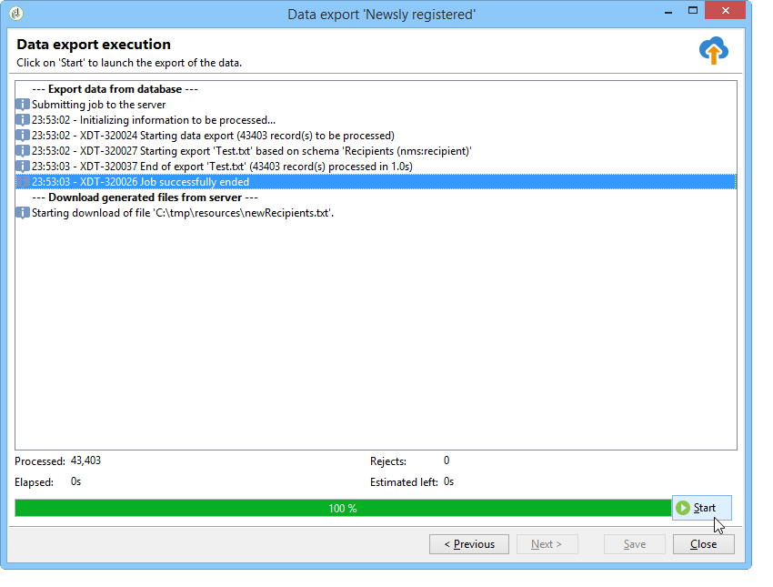

# Konfigurera exportjobb {#executing-export-jobs}

Med exportjobben kan du komma åt och extrahera data från databasen: kontakter, klienter, listor, segment osv.

Det kan till exempel vara användbart att använda kampanjspårningsdata (historik för spårning osv.) i ett kalkylblad. Utdata kan vara i formaten txt, CSV, TAB eller XML.

Med exportguiden kan du konfigurera och exportera, definiera alternativ och starta körningen. Det är en serie skärmar vars innehåll är beroende av typen av export (enkel eller flera) och operatörens rättigheter.

Exportguiden visas när du har skapat ett nytt exportjobb (se [Skapa import- och exportjobb](../../platform/using/creating-import-export-jobs.md)).

## Steg 1 - Välj exportmall {#step-1---choosing-the-export-template}

När du startar exportguiden måste du först välja en mall. Om du till exempel vill konfigurera exporten av mottagare som nyligen har registrerat sig följer du stegen nedan:

1. Markera mappen **[!UICONTROL Profiles and Targets > Job > Generic imports and exports]**.
1. Klicka på **Nytt** och sedan på **Exportera** för att skapa exportmallen.

   

1. Klicka på pilen till höger om fältet **[!UICONTROL Export template]** för att välja mallen eller klicka på **[!UICONTROL Select link]** för att bläddra i trädet.

   Den interna mallen är **[!UICONTROL New text export]**. Den här mallen får inte ändras, men du kan duplicera den för att konfigurera en ny mall. Som standard sparas exportmallar i noden **[!UICONTROL Resources > Templates > Job templates]**.

1. Ange ett namn för export i fältet **[!UICONTROL Label]**. Du kan lägga till en beskrivning.
1. Välj exporttyp. Det finns två typer av export: **[!UICONTROL Simple export]** om du bara vill exportera en fil och **[!UICONTROL Multiple export]** om du vill exportera flera filer i en enda körning från en eller flera typer av källdokument.

## Steg 2 - Filtyp att exportera {#step-2---type-of-file-to-export}

Välj den typ av dokument som ska exporteras, dvs. schemat för de data som ska exporteras.

Som standard hämtas data från mottagartabellen när exporten startas från noden **[!UICONTROL Jobs]**. När exporten startas från en lista med data (från menyn **[!UICONTROL right click > Export]**) fylls tabellen som data tillhör automatiskt i fältet **[!UICONTROL Document type]**.

* Som standard är alternativet **[!UICONTROL Download the file generated on the server after the export]** markerat. I fältet **[!UICONTROL Local file]** fyller du i namnet och sökvägen för filen som ska skapas eller bläddrar på den lokala hårddisken genom att klicka på mappen till höger om fältet. Du kan avmarkera det här alternativet om du vill ange åtkomstsökväg och namn för serverutdatafilen.

  >[!NOTE]
  >
  >Automatiska import- och exportjobb utförs alltid på servern.
  >
  >Om du bara vill exportera vissa data klickar du på **[!UICONTROL Advanced parameters]** och anger antalet rader som ska exporteras i lämpligt fält.

* Du kan skapa en differentiell export om du bara vill exportera poster som har ändrats sedan den senaste körningen. Det gör du genom att klicka på länken **[!UICONTROL Advanced parameters]**, sedan på fliken **[!UICONTROL Differential export]** och sedan välja **[!UICONTROL Activate differential export]**.

  

  Du måste ange datumet för den senaste ändringen. Den kan hämtas från ett fält eller beräknas.

## Steg 3 - Definiera utdataformatet {#step-3---defining-the-output-format}

Välj ett utdataformat för exportfilen. Följande format kan användas: text, text med fasta kolumner, CSV och XML.

* För formatet **[!UICONTROL Text]** markerar du avgränsarna för att separera kolumnerna (tabbar, kommatecken, semikolon eller egna) och strängarna (enkla eller dubbla citattecken eller inga).
* För **[!UICONTROL text]** och **[!UICONTROL CSV]** kan du välja alternativet **[!UICONTROL Use first lines as column titles]**.
* Ange datumformat och talformat. Det gör du genom att klicka på knappen **[!UICONTROL Edit]** för fältet i fråga och använda redigeraren.
* För fält som innehåller uppräknade värden kan du välja **[!UICONTROL Export labels instead of internal values of enumerations]**. Titeln kan till exempel sparas i formatet **1=Mr.**, **2=Miss**, **3=Mrs.**. Om det här alternativet väljs exporteras **Mr.**, **miss** och **Mrs.**.

## Steg 4 - Val av data {#step-4---data-selection}

Markera de fält som ska exporteras. Så här gör du:

1. Dubbelklicka på önskade fält i listan **[!UICONTROL Available fields]** för att lägga till dem i avsnittet **[!UICONTROL Output columns]**.
1. Använd pilarna till höger om listan för att definiera fältordningen i utdatafilen.

   

1. Klicka på knappen **[!UICONTROL Add]** för att anropa funktioner. Mer information finns i [Lista över funktioner](../../platform/using/defining-filter-conditions.md#list-of-functions).

## Steg 5 - Sortera kolumner {#step-5---sorting-columns}

Välj sorteringsordning för kolumnerna.

## Steg 6 - Filtervillkor {#step-6---filter-conditions-}

Du kan lägga till filtervillkor för att undvika att exportera alla data. Konfigurationen för den här filtreringen är densamma som målinriktningen för mottagare i leveransguiden. Se [den här sidan](../../delivery/using/steps-defining-the-target-population.md).

## Steg 7 - Dataformatering {#step-7---data-formatting}

Du kan ändra ordningen och etiketten på fälten för utdatafilen och använda omformningar på källdata.

* Om du vill ändra ordningen på de kolumner som ska exporteras markerar du den aktuella kolumnen och använder de blå pilarna till höger om tabellen.
* Om du vill ändra etiketten för ett fält klickar du i cellen i kolumnen **[!UICONTROL Label]** som matchar fältet som ska ändras och anger den nya etiketten. Tryck på Enter på tangentbordet för att bekräfta.
* Om du vill tillämpa en skiftlägesomvandling på innehållet i ett fält markerar du det i kolumnen **[!UICONTROL Transformation]**. Du kan välja:

   * Växla till gemener
   * Växla till versal
   * Första bokstaven i versaler

  

* Klicka på **[!UICONTROL Add a calculated field]** om du vill skapa ett nytt beräknat fält (till exempel en kolumn som innehåller efternamn + förnamn). Mer information finns i [Beräknade fält](../../platform/using/executing-import-jobs.md#calculated-fields).

Om du exporterar en samling element (t.ex. mottagarnas prenumerationer, de listor som de hör till osv.) måste du ange antalet element i samlingen som du vill exportera.

## Steg 8 - Förhandsgranska data {#step-8---data-preview}

Klicka på **[!UICONTROL Start the preview of the data]** om du vill se en förhandsgranskning av exportresultatet. Som standard visas de första 200 raderna. Om du vill ändra det här värdet klickar du på pilarna till höger om fältet **[!UICONTROL Lines to display]**.

Klicka på flikarna längst ned i guiden för att växla från förhandsgranskningen av resultat i kolumner till resultaten i XML-format. Du kan även visa de genererade SQL-frågorna.

## Steg 9 - Starta exporten {#step-9---launching-the-export}

Klicka på **[!UICONTROL Start]** om du vill starta dataexporten.

Du kan sedan övervaka körningen av importjobbet (se [Övervaka jobbkörning](../../platform/using/monitoring-jobs-execution.md)).
