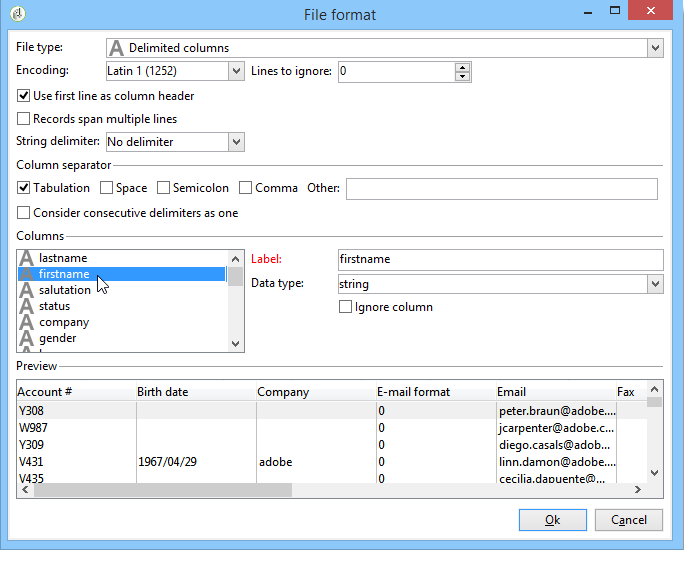
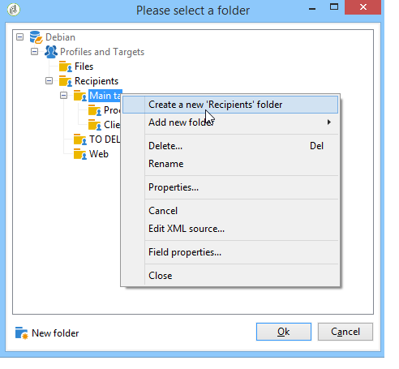

# Konfigurera importjobb {#executing-import-jobs}

Med Adobe Campaign kan du importera data till databasen från en eller flera filer i text-, CSV-, TAB- eller XML-format. De här filerna är kopplade till en tabell (huvud eller länkad) och varje fält i källfilen/källfilerna är kopplat till ett fält i databasen.

>[!NOTE]
>
>Du kan importera data utan att mappa dem till databasdata med funktionen **[!UICONTROL Import a list]**. Data kan sedan användas enbart i arbetsflöden via objektet **[!UICONTROL Read list]**. Mer information finns på [den här sidan](../../workflow/using/read-list.md).

Med importassistenten kan du konfigurera en import, definiera dess alternativ (till exempel dataomvandling) och starta körningen. Det är en serie skärmar vars innehåll beror på typen av import (enkel eller flera) och operatörens rättigheter.

Importassistenten visas när du har skapat ett nytt importjobb (se [Skapa import- och exportjobb](../../platform/using/creating-import-export-jobs.md)).

>[!NOTE]
>
>Om du använder en IIS-webbserver kan en konfiguration behövas för att tillåta överföring av stora filer (>28 MB). Mer information hittar du i [det här avsnittet](../../installation/using/integration-into-a-web-server-for-windows.md#changing-the-upload-file-size-limit).

## Source {#source-file}

I källfilen sammanfaller varje rad med en post. Data i poster avgränsas med avgränsare (blanksteg, tabb, tecken osv.). Det innebär att data hämtas i form av kolumner, och varje kolumn är kopplad till ett fält i databasen.

## Steg 1 - Välj importmall {#step-1---choosing-the-import-template}

När du startar importassistenten måste du först välja en mall. Om du till exempel vill konfigurera import av mottagare som har fått ett nyhetsbrev följer du stegen nedan:

1. Markera mappen **[!UICONTROL Profiles and Targets > Job > Generic imports and exports]**.
1. Klicka på **Nytt** och sedan på **Importera** för att skapa importmallen.

   

1. Klicka på pilen till höger om fältet **[!UICONTROL Import template]** för att välja mallen eller klicka på **[!UICONTROL Select link]** för att bläddra i trädet.

   Den interna mallen är **[!UICONTROL New text import]**. Den här mallen får inte ändras, men du kan duplicera den för att konfigurera en ny mall beroende på dina behov. Som standard sparas importmallar i noden **[!UICONTROL Profiles and targets > Templates > Job templates]**.

1. Ange ett namn för importen i fältet **[!UICONTROL Label]**. Du kan lägga till en beskrivning.
1. Välj importtyp i lämpligt fält. Det finns två typer av import: **[!UICONTROL Simple import]** om du bara vill importera en fil och **[!UICONTROL Multiple import]** om du vill importera flera filer i en enda körning.

   Om du vill importera flera filer väljer du **[!UICONTROL Multiple import]** i listrutan **[!UICONTROL Import type]** på första skärmen i importassistenten.

   

1. Ange de fält som du vill importera genom att klicka på **[!UICONTROL Add]**.

   

   Varje gång en fil läggs till visas skärmen för assistenten **[!UICONTROL File to import]**. Se avsnitt [Steg 2 - Val av Source-fil](#step-2---source-file-selection) och följ stegen i assistenten för att definiera importalternativen på samma sätt som vid en enkel import.

   >[!NOTE]
   >
   >Multipla importer bör endast tillgodose specifika behov och rekommenderas inte.

### Avancerade parametrar {#advanced-parameters}

Med länken **[!UICONTROL Advanced parameters]** kan du komma åt följande alternativ:

* Fliken **[!UICONTROL General]**

   * **[!UICONTROL Stop execution if there are too many rejects]**

     Det här alternativet är markerat som standard. Du kan avmarkera den om du vill fortsätta att köra importen oavsett antalet avvisade. Körningen stoppas som standard om de första 100 raderna avvisas.

   * **[!UICONTROL Trace mode]**

     Välj det här alternativet om du vill spåra importkörningen för varje rad.

   * **[!UICONTROL Start the job in a detached process]**

     Det här alternativet är markerat som standard. Du kan koppla loss körningen av importen så att den inte påverkar andra pågående jobb i databasen.

   * **[!UICONTROL Do not update enumerations]**

     Välj det här alternativet om du inte vill att listan med uppräknade värden i databasen ska vara upphöjd. Se [Hantera uppräkningar](../../platform/using/managing-enumerations.md).

* Fliken **[!UICONTROL Variables]**

  Du kan definiera variabler som är associerade med jobbet och som ska vara tillgängliga i frågeredigerarna och beräkningsfälten. Om du vill skapa en variabel klickar du på **[!UICONTROL Add]** och använder variabelredigeraren.

  >[!IMPORTANT]
  >
  >Fliken **[!UICONTROL Variables]** är endast avsedd för programmering av arbetsflödestyp och bör endast konfigureras av expertanvändare.

## Steg 2 - Source filval {#step-2---source-file-selection}

Källfilen kan vara i textformat (txt, csv, tab, fixed columns) eller xml.

Som standard är **[!UICONTROL Upload file on the server]** markerat. Klicka på mappen till höger om fältet **[!UICONTROL Local file]** för att bläddra på den lokala disken och markera filen som ska importeras. Du kan avmarkera det här alternativet om du vill ange åtkomstsökvägen och namnet på filen som ska importeras om den finns på servern.

När filen har angetts kan du visa dess data i fönstrets nedre del genom att klicka på **[!UICONTROL Auto-detect format]**. I den här förhandsvisningen visas de första 200 raderna i källfilen.

Använd alternativen ovan för att konfigurera importen. De parametrar som definieras med dessa alternativ överförs till förhandsvisningen. Följande alternativ är tillgängliga:

* Med **[!UICONTROL Click here to change the file format...]** kan du kontrollera filformatet och finjustera konfigurationen.
* Med **[!UICONTROL Update on server...]** kan du överföra den lokala filen till servern. Det här alternativet är bara tillgängligt om **[!UICONTROL Upload file on the server]** har valts.
* **[!UICONTROL Download]** är bara tillgängligt om filen har överförts till servern.
* **[!UICONTROL Auto-detect format]** används för att initiera om datakällans format. Med det här alternativet kan du återanvända originalformaten på data som har formaterats med alternativet **[!UICONTROL Click here to change the file format...]**.
* Med länken **[!UICONTROL Advanced parameters]** kan du filtrera källdata och komma åt avancerade alternativ. På den här skärmen kan du välja att bara importera en del av filen. Du kan också definiera ett filter, t.ex. för att importera endast användare av typen &quot;Prospect&quot; eller &quot;Customer&quot; enligt värdet för motsvarande rad. Dessa alternativ bör endast användas av JavaScript expertanvändare.

### Ändra filformatet {#changing-the-file-format}

Med alternativet **[!UICONTROL Click here to change the file format...]** kan du formatera källfilens data, särskilt för att ange kolumnavgränsaren och datatypen för varje fält. Den här konfigurationen utförs via följande fönster:

I det här steget beskriver du hur värdena i filfälten ska läsas. Om det till exempel gäller ett datum kan data för Datum eller Datum + Tid kopplas till ett format (dd/mm/åååå, mm/dd/åå osv.). Om indata inte överensstämmer med det förväntade formatet, avvisas under importen.

Du kan visa resultatet av konfigurationen i förhandsvisningszonen i fönstrets nedre del.

Klicka på **[!UICONTROL OK]** för att spara formateringen och klicka sedan på **[!UICONTROL Next]** för att visa nästa steg.

## Steg 3 - Fältmappning {#step-3---field-mapping}

Du måste sedan välja målschemat och mappa data för varje kolumn till fält i databasen.

* I fältet **[!UICONTROL Destination schema]** kan du välja det schema som data ska importeras till. Denna information är obligatorisk. Klicka på ikonen **[!UICONTROL Select link]** för att välja ett av de befintliga schemana. Klicka på **[!UICONTROL Edit link]** om du vill visa innehållet i den markerade tabellen.
* I den centrala tabellen visas alla fält som definierats i källfilen. Markera de fält som ska importeras för att associera en målfil med dem. Dessa fält kan mappas manuellt eller automatiskt.

  Om du vill mappa ett fält manuellt markerar du källfältet genom att klicka i kryssrutan och aktiverar sedan cellen som motsvarar det markerade fältet genom att klicka på den andra kolumnen. Klicka sedan på ikonen **[!UICONTROL Edit expression]** för att visa alla fält i den aktuella tabellen. Markera målfältet och klicka på **[!UICONTROL OK]** för att validera mappningen.

  Om du vill associera källfälten och målfälten automatiskt klickar du på ikonen **[!UICONTROL Guess the destination fields]** till höger om listan med fält. De föreslagna fälten kan ändras vid behov.

  >[!IMPORTANT]
  >
  >Resultatet av den här åtgärden måste alltid valideras innan du fortsätter till nästa steg.

* Du kan använda en omformning på de importerade fälten. Det gör du genom att klicka i cellen i kolumnen **[!UICONTROL Transformation]** som är relaterad till det aktuella fältet och välja den omformning som ska användas.

  

  >[!IMPORTANT]
  >
  >Omformningen används vid tiden för importen. Om begränsningar för målfältet har definierats (i ovanstående exempel i fältet @lastname) får dessa begränsningar prioritet.

* Du kan lägga till beräkningsfält med lämplig ikon till höger om den centrala tabellen. Med beräkningsfält kan du utföra komplexa omformningar, lägga till virtuella kolumner eller sammanfoga data från flera kolumner. I följande avsnitt finns mer information om de olika möjligheterna.

### Beräknade fält {#calculated-fields}

Beräknade fält är nya kolumner som läggs till i källfilen och beräknas från andra kolumner. Beräkningsfält kan sedan kopplas till fält i Adobe Campaign-databasen. Avstämningsåtgärder är dock inte möjliga för beräknade fält.

Det finns fyra typer av beräknade fält:

* **[!UICONTROL Fixed string]**: Värdet för beräkningsfältet är detsamma för alla rader i källfilen. Här kan du ange värdet för ett fält med poster som har infogats eller uppdaterats. Du kan t.ex. ange en markör som &quot;ja&quot; för alla importerade poster.
* **[!UICONTROL String with JavaScript tags]**: Värdet för beräkningsfältet är en teckensträng som innehåller JavaScript-kommandon.
* **[!UICONTROL JavaScript expression]**: Värdet för beräkningsfältet är resultatet av utvärderingen av en JavaScript-funktion. Det returnerade värdet kan vara ett tal, ett datum osv.
* **[!UICONTROL Enumeration]**: fältets värde tilldelas enligt ett värde i källfilen. I redigeraren kan du ange källkolumnen och ange en lista med uppräkningsvärden, som i följande exempel:

  

  På fliken **[!UICONTROL Preview]** kan du visa resultatet av den definierade konfigurationen. Här har kolumnen **[!UICONTROL Subscription]** lagts till. Värdet beräknas från fältet **Status**.

  

## Steg 4 - Avstämning {#step-4---reconciliation}

I importassistentens avstämningssteg kan du definiera läget för att stämma av data från filen med befintliga data i databasen och ange prioritetsregler mellan fildata och databasdata. Konfigurationsfönstret ser ut så här:

Skärmens centrala del innehåller ett träd med fälten och tabellerna i den Adobe Campaign-databas som data ska importeras till.

Det finns särskilda alternativ för varje nod (tabell eller fält). När du klickar på den berörda noden i listan visas dess parametrar och en kort beskrivning nedan. Beteendet som definierats för varje element visas i motsvarande **[!UICONTROL Behavior]**-kolumn.

### Typ av åtgärd {#types-of-operation}

För varje tabell som berörs av importen måste du definiera typen av åtgärd. Följande åtgärder är tillgängliga för databasens huvudelement:

* **[!UICONTROL Update or insertion]**: uppdaterar posten om den finns i databasen och skapar den om den inte finns.
* **[!UICONTROL Insertion]**: infogar poster i databasen.
* **[!UICONTROL Update]**: endast befintliga poster uppdateras (andra poster ignoreras).
* **[!UICONTROL Reconciliation only]**: söker efter posten i databasen, men utför ingen uppdatering. Med kan du till exempel associera mappen med mottagare som ska importeras enligt en kolumn i filen utan att uppdatera data i mapparna.
* **[!UICONTROL Deletion]**: låter dig förstöra poster i databasen.

Följande alternativ är tillgängliga för varje fält i den tabell som berörs av importen:

* **[!UICONTROL Update (empty) if source value is empty]**: om en uppdatering inträffar kommer värdet i fältet att ta bort databasvärdet om fältet är tomt i källfilen. I annat fall behålls databasfältet.
* **[!UICONTROL Update only if destination is empty]**: Värdet från källfilen skriver inte över värdet i databasfältet såvida inte databasfältet är tomt. I så fall får källfilens värde.
* **[!UICONTROL Update the field only when the record is inserted]**: Under en uppdatering- eller infogningsåtgärd importeras endast källfilsposter som är nya.

>[!NOTE]
>
>Definitionen för en avstämningsnyckel är alltid **obligatorisk**, utom vid infogning utan deduplicering.

### Avstämningsnycklar {#reconciliation-keys}

Minst en avstämningsnyckel måste fyllas i för att hantera deduplicering.

En avstämningsnyckel är en uppsättning fält som används för att identifiera en post. Om du till exempel vill importera mottagare kan avstämningsnyckeln vara kontonumret, e-postfältet eller fälten Efternamn, Förnamn, Företag osv.

I det här fallet, för att ta reda på om en rad i en fil matchar en befintlig mottagare i databasen, jämför importmotorn filens värden med databasens värden för alla fält i nyckeln. När fält är specifika för en post kan en detaljerad jämförelse mellan käll- och måldata utföras, vilket garanterar dataintegriteten efter importen. En andra avstämningsnyckel kan fyllas i för samma tabell. Den används för de rader vars första nyckel är tom.

Undvik att välja ett fält som kan ändras under importen. Om detta inträffar kan motorn skapa ytterligare poster.

>[!NOTE]
>
>För en mottagarimport läggs identifieraren för den valda mappen implicit till i nyckeln.
>
>Avstämning utförs därför endast för den här mappen (såvida ingen mapp har valts).

### Deduplicering {#deduplication}

>[!NOTE]
>
>Ett double-värde är ett objekt som finns två eller flera gånger i filen som ska importeras.
>
>En dubblett är ett objekt som finns både i filen som ska importeras och i databasen.

I fältet **[!UICONTROL Management of doubles]** kan du konfigurera borttagning av datadubbletter. Deduplicering gäller poster som förekommer flera gånger **i källfilen** (eller källfiler om flera filer importeras), dvs. rader för vilka fälten i avstämningsnyckeln är identiska.

* Duplicerad hantering i **[!UICONTROL Update]**-läge (standardläge) utför inte borttagning av dubbletter. Den sista posten har därför prioritet (eftersom den uppdaterar data från föregående poster). Räkning av dubbletter utförs inte i det här läget.
* Duplicerad hantering i **[!UICONTROL Ignore]**-läge eller **[!UICONTROL Reject entity]** exkluderar dubbletter från importen. I det här fallet importeras ingen post.
* I läget **[!UICONTROL Reject entity]** importeras inte elementet och ett fel genereras i importloggarna.
* I **[!UICONTROL Ignore]**-läget importeras inte elementet, men inga spår av felet behålls. I det här läget kan du optimera prestanda.

>[!IMPORTANT]
>
>Deduplicering utförs endast i minnet. Storleken på en import med borttagning av dubbletter är därför begränsad. Gränsen beror på flera parametrar (programserverns kapacitet, aktivitet, antalet fält i nyckeln, osv.). Den största tillåtna storleken för borttagning av dubbletter är 1 000 000 rader.

Deduplicering gäller en post som finns både i källfilen och i databasen. Det gäller endast åtgärder med uppdatering (t.ex. **[!UICONTROL Update and insertion]** eller **[!UICONTROL Update]**). Med alternativet **[!UICONTROL Duplicate management]** kan du uppdatera eller ignorera posten om den finns både i källfilen och i databasen. Alternativet **[!UICONTROL Update or insert based on origin]** tillhör den valfria modulen och kan inte användas i en standardkontext.

Alternativen **[!UICONTROL Reject]** och **[!UICONTROL Ignore]** fungerar enligt ovan.

### Om fel uppstår {#behavior-in-the-event-of-an-error}

De flesta dataöverföringsåtgärder genererar olika typer av fel (inkonsekvent radformat, ogiltig e-postadress osv.). Alla fel och alla varningar som genereras av importmotorn lagras och länkas till importinstansen.

Information om dessa avslag kan visas via fliken **[!UICONTROL Rejects]**.

Det finns två typer av avslag (typen visas i kolumnen **[!UICONTROL Connector]**):

* Avvisanden av textkopplingen rör fel som inträffar när filraden bearbetas (beräkningsfält, dataanalys osv.). I det här fallet avvisas alltid hela raden om ett fel inträffar.
* Databaskopplingen avvisar fel som inträffar under datavstämning eller skrivning till databasen. Om du importerar till flera tabeller kan refuseringen endast gälla en del av posten (t.ex. om du importerar mottagare och associerade händelser kan ett fel förhindra att en händelse uppdateras utan att mottagaren avvisas).

På datavstämningssidan kan du definiera önskat felhanteringstypfält efter fält och tabell efter tabell.

* **[!UICONTROL Ignore and log a warning]**: alla fält importeras till databasen utom det som genererade ett fel.
* **[!UICONTROL Reject parent element]**: hela raden i posten nekas, inte bara fältet som orsakade ett fel.
* **[!UICONTROL Reject all elements]**: importen stoppas och alla element i posten nekas.

  

Trädet på avvisningsskärmen för en importinstans anger vilka fält som avvisats och var felen inträffade.

Du kan generera en fil som innehåller dessa poster via ikonen **[!UICONTROL Export rejects]**:

## Steg 5 - ytterligare steg vid import av mottagare {#step-5---additional-step-when-importing-recipients}

I nästa steg i importassistenten kan du markera eller skapa den mapp i vilken data ska importeras, automatiskt mappa importerade mottagare med en (ny eller befintlig) lista och prenumerera på mottagare för en tjänst.

>[!NOTE]
>
>Det här steget visas endast när du importerar mottagare och när du använder Adobe Campaign standardmottagartabell (**nms:mottagare**).

* Klicka på **[!UICONTROL Edit]**-länkarna för att markera mappen, listan eller tjänsten som du vill associera eller prenumerera på mottagarna.

   1. Importera till en mapp

      Med länken **[!UICONTROL Edit...]** i avsnittet **[!UICONTROL Import into a folder]** kan du markera eller skapa den mapp som mottagarna ska importeras till. Om ingen partition är definierad importeras data som standard till operatörens standardmapp.

      >[!NOTE]
      >
      >Standardmappen för en operator är den första mappen som operatorn har skrivåtkomst till. Läs mer i [Mappåtkomsthantering](../../platform/using/access-management-folders.md).

      Om du vill välja importmappen klickar du på pilen till höger om fältet **[!UICONTROL Folder]** och väljer den aktuella mappen. Du kan också använda ikonen **[!UICONTROL Select link]** för att visa trädet i ett nytt fönster eller skapa en ny mapp.

      

      Om du vill skapa en ny mapp markerar du noden som du vill lägga till en mapp från och högerklickar. Välj **[!UICONTROL Create a new 'Recipients' folder]**.

      

      Mappen läggs till under den aktuella noden. Ange namnet på den nya mappen, tryck på Enter för att bekräfta och klicka sedan på **[!UICONTROL OK]**.

      

   1. Associera med en lista

      Med länken **[!UICONTROL Edit...]** i avsnittet **[!UICONTROL Add recipients to a list]** kan du markera eller skapa en lista som mottagarna ska importeras till.

      

      Du kan skapa en ny lista för dessa mottagare genom att klicka på **[!UICONTROL Select link]** och sedan på **[!UICONTROL Create]**. Skapandet och hanteringen av listor beskrivs i [det här avsnittet](../../platform/using/creating-and-managing-lists.md).

      

      Du kan välja att lägga till mottagare till de som redan finns i en lista eller att återskapa listan med de nya mottagarna. Om listan redan innehåller mottagare tas de bort och ersätts av de importerade mottagarna.

   1. Prenumerera på en tjänst

      Om du vill prenumerera alla importerade mottagare på en informationstjänst klickar du på länken **[!UICONTROL Edit...]** i avsnittet **[!UICONTROL Subscribe recipients to a service]** för att markera eller skapa den informationstjänst som mottagarna ska prenumerera på. Du kan välja alternativet **[!UICONTROL Send a confirmation message]**: Innehållet i det här meddelandet definieras i leveransmallen som är kopplad till prenumerationstjänsten.

      

      Du kan skapa en ny tjänst för dessa mottagare genom att klicka på **[!UICONTROL Select link]** och sedan på ikonen **[!UICONTROL Create]** . Hanteringen av informationstjänster presenteras i [det här avsnittet](../../delivery/using/managing-subscriptions.md).

* Använd fältet **[!UICONTROL Origin]** för att lägga till information om mottagarnas ursprung i deras profiler. Denna information är särskilt användbar vid import av flera produkter.

Klicka på **[!UICONTROL Next]** för att validera det här steget och visa följande steg.

## Steg 6 - Starta importen {#step-6---launching-the-import}

I det sista steget i assistenten kan du starta dataimporten. Klicka på knappen **[!UICONTROL Start]** om du vill göra det.

Du kan sedan övervaka körningen av importjobbet (se [Övervaka jobbkörning](../../platform/using/monitoring-jobs-execution.md)).
