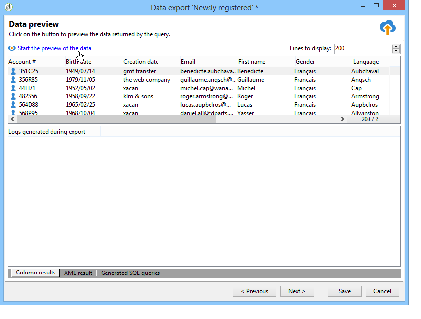

# Exportera data{#exporting-data}

## Exportguiden {#export-wizard}

Exportparametrarna registreras via en guide. Den generiska exportmodulen är tillgänglig som standard och gör att du kan hämta och extrahera data från databasen: kontakter, kunder, listor, segment osv. Det kan till exempel vara användbart att använda kampanjspårningsdata (historik för spårning osv.) i ett kalkylblad. Utdata kan vara i formaten txt, CSV, TAB eller XML.

### Steg 1 - Välj exportmall {#step-1---choosing-the-export-template}

När du startar exportguiden måste du först välja en mall. Om du till exempel vill konfigurera exporten av mottagare som nyligen har registrerat sig följer du stegen nedan:

1. Markera **[!UICONTROL Profiles and Targets > Job > Generic imports and exports]** mappen.
1. Klicka på **Ny** och sedan på **Exportera** för att skapa exportmallen.

   

1. Klicka på pilen till höger om **[!UICONTROL Export template]** fältet för att välja mallen eller klicka på **[!UICONTROL Select link]** för att bläddra i trädet.

   Den interna mallen är **[!UICONTROL New text export]**. Den här mallen får inte ändras, men du kan duplicera den för att konfigurera en ny mall. Som standard sparas exportmallar i **[!UICONTROL Resources > Templates > Job templates]** noden.

1. Ange ett exportnamn i **[!UICONTROL Label]** fältet. Du kan lägga till en beskrivning.
1. Välj exporttyp. Det finns två möjliga typer av export: om du bara vill exportera en fil och **[!UICONTROL Simple export]** **[!UICONTROL Multiple export]** exportera flera filer i en enda körning från en eller flera typer av källdokument.

### Steg 2 - Typ av fil som ska exporteras {#step-2---type-of-file-to-export}

Välj den typ av dokument som ska exporteras, dvs. schemat för de data som ska exporteras.

Som standard hämtas data från mottagartabellen när exporten startas från **[!UICONTROL Jobs]** noden. När exporten startas från en lista med data (från **[!UICONTROL right click > Export]** menyn) fylls tabellen som data hör till automatiskt i **[!UICONTROL Document type]** fältet.

* Som standard är **[!UICONTROL Download the file generated on the server after the export]** alternativet markerat. I **[!UICONTROL Local file]** fältet fyller du i namnet och sökvägen för filen som ska skapas eller bläddrar på den lokala hårddisken genom att klicka på mappen till höger om fältet. Du kan avmarkera det här alternativet om du vill ange åtkomstsökväg och namn för serverutdatafilen.

   >[!NOTE]
   >
   >Automatiska import- och exportjobb utförs alltid på servern.
   >
   >Om du bara vill exportera en del data klickar du på **[!UICONTROL Advanced parameters]** och anger antalet rader som ska exporteras i det aktuella fältet.

* Du kan skapa en differentiell export om du bara vill exportera poster som har ändrats sedan den senaste körningen. Klicka på **[!UICONTROL Advanced parameters]** länken, klicka på **[!UICONTROL Differential export]** fliken och välj sedan **[!UICONTROL Activate differential export]**.

   

   Du måste ange datumet för den senaste ändringen. Den kan hämtas från ett fält eller beräknas.

### Steg 3 - Definiera utdataformatet {#step-3---defining-the-output-format}

Välj ett utdataformat för exportfilen. Följande format kan användas: text, text med fasta kolumner, CSV och XML.

* För **[!UICONTROL Text]** format markerar du avgränsarna för att separera kolumnerna (tabbar, kommatecken, semikolon eller egna) och strängarna (enkla eller dubbla citattecken eller inga).
* För **[!UICONTROL text]** och **[!UICONTROL CSV]** kan du välja alternativet **[!UICONTROL Use first lines as column titles]**.
* Ange datumformat och talformat. Det gör du genom att klicka på **[!UICONTROL Edit]** knappen för fältet i fråga och använda redigeraren.
* För fält som innehåller uppräknade värden kan du välja **[!UICONTROL Export labels instead of internal values of enumerations]**. Titeln kan till exempel sparas i formatet **1=Mr.**, **2=Fröken**,** 3=Mrs.**. Om det här alternativet väljs exporteras **Mr.**, **miss** och **Mrs.** .

### Steg 4 - Val av data {#step-4---data-selection}

Markera de fält som ska exporteras. Så här gör du:

1. Dubbelklicka på önskade fält i **[!UICONTROL Available fields]** listan för att lägga till dem i **[!UICONTROL Output columns]** avsnittet.
1. Använd pilarna till höger om listan för att definiera fältordningen i utdatafilen.

   

1. Klicka på **[!UICONTROL Add]** knappen för att anropa funktioner. Mer information finns i [Lista över funktioner](../../platform/using/defining-filter-conditions.md#list-of-functions).

### Steg 5 - Sortera kolumner {#step-5---sorting-columns}

Välj sorteringsordning för kolumnerna.

### Steg 6 - Filtervillkor {#step-6---filter-conditions-}

Du kan lägga till filtervillkor för att undvika att exportera alla data. Konfigurationen för den här filtreringen är densamma som målinriktningen för mottagare i leveransguiden. Se [den här sidan](../../delivery/using/steps-defining-the-target-population.md).

### Steg 7 - Dataformatering {#step-7---data-formatting}

Du kan ändra ordningen och etiketten på fälten för utdatafilen och använda omformningar på källdata.

* Om du vill ändra ordningen på de kolumner som ska exporteras markerar du den aktuella kolumnen och använder de blå pilarna till höger om tabellen.
* Om du vill ändra etiketten för ett fält klickar du i cellen i kolumnen som **[!UICONTROL Label]** matchar fältet som ska ändras och anger den nya etiketten. Tryck på Enter på tangentbordet för att bekräfta.
* Om du vill tillämpa en skiftlägesomformning på innehållet i ett fält markerar du det i **[!UICONTROL Transformation]** kolumnen. Du kan välja:

   * Växla till gemener
   * Växla till versaler
   * Första bokstaven i versaler
   

* Klicka **[!UICONTROL Add a calculated field]** om du vill skapa ett nytt beräkningsfält (t.ex. en kolumn som innehåller efternamn + förnamn). Mer information finns i [Beräkningsfält](../../platform/using/importing-data.md#calculated-fields).

Om du exporterar en samling element (t.ex. mottagarnas prenumerationer, de listor som de hör till osv.) måste du ange antalet element i samlingen som du vill exportera.

### Steg 8 - Förhandsgranska data {#step-8---data-preview}

Klicka **[!UICONTROL Start the preview of the data]** om du vill förhandsgranska exportresultatet. Som standard visas de första 200 raderna. Om du vill ändra det här värdet klickar du på pilarna till höger om **[!UICONTROL Lines to display]** fältet.

Klicka på flikarna längst ned i guiden för att växla från förhandsgranskningen av resultat i kolumner till resultaten i XML-format. Du kan även visa de genererade SQL-frågorna.

### Steg 9 - Starta exporten {#step-9---launching-the-export}

Klicka **[!UICONTROL Start]** för att starta dataexporten.

## Exportera data via ett arbetsflöde {#exporting-data-via-a-workflow}

Arbetsflöden kan vara ett användbart sätt att automatisera vissa av dina exportprocesser eller exportera exakta datauppsättningar efter att ha använt några av de tillgängliga datahanteringsaktiviteterna för att omvandla data.

Mer information om hur du exporterar data från ett arbetsflöde finns i [det här avsnittet](../../workflow/using/how-to-use-workflow-data.md).
