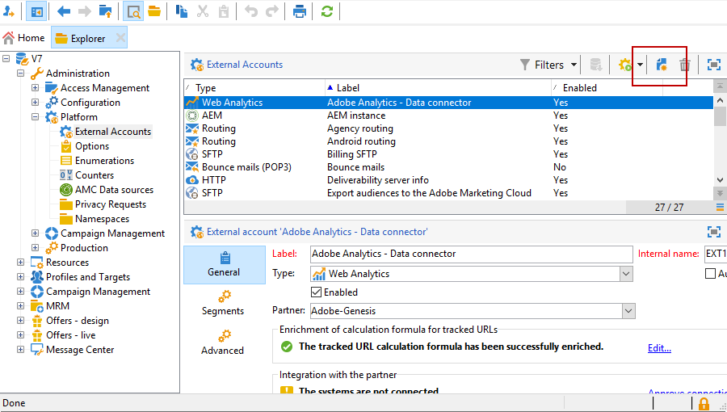
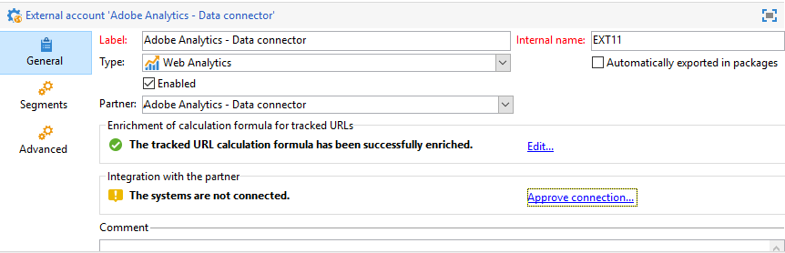

# Externa konton{#external-accounts}

Ett externt konto är en konfiguration som gör att du kan konfigurera och testa åtkomsten till en server utanför Adobe Campaign. Dessa externa konton kan användas i Campaign-arbetsflöden för att få tillgång till och hantera data.

Du kan ställa in följande typer av externa konton:

* [Routning av externt konto](#routing-external-account)
* [Externt FTP-konto](#ftp-external-account)
* [Externt konto för extern databas](#external-database-external-account)
* [Externt konto för Web Analytics](#web-analytics-external-account)
* [Externt konto för Facebook-anslutning](#facebook-connect-external-account)
* [Externt konto för körningsinstans](#execution-instance-external-account)
* [Externt Adobe Experience Cloud-konto](#adobe-experience-cloud-external-account)
* [Externt SFTP-konto](#sftp-external-account)
* [Externt Adobe Experience Manager-konto](#adobe-experience-manager-external-account)
* [Externt konto för Amazon Simple Storage Service (S3)](#amazon-simple-storage-service--s3--external-account)
* [Externt Azure-konto](#azure-external-account)
* [Hadoop-externt konto](#hadoop-external-account)
* [Externt Microsoft Dynamics CRM-konto](#microsoft-dynamics-crm-external-account)
* [Oracle on demand-konto](#oracle-on-demand-external-account)
* [Externt konto för Salesforce CRM](#salesforce-crm-external-account)

## Skapa ett externt konto {#creating-an-external-account}

Adobe Campaign innehåller en uppsättning fördefinierade externa konton. Om du vill skapa anslutningar till externa system, t.ex. FTP-servrar som används för filöverföringar, kan du skapa egna externa konton.

Externa konton används av tekniska processer som tekniska arbetsflöden eller kampanjarbetsflöden. När du konfigurerar en filöverföring i ett arbetsflöde eller ett datautbyte med något annat program (Adobe Target, Experience Manager osv.) måste du välja ett externt konto.

1. Öppna **[!UICONTROL Explorer]** och visa **[!UICONTROL Administration]** menyn.
1. Öppna **[!UICONTROL Platform]** menyn och klicka på **[!UICONTROL External accounts]**.

   

1. Klicka på **[!UICONTROL New]** knappen.

   

1. Ange ett **[!UICONTROL Label]** och **[!UICONTROL Internal Name]**. Båda används när du väljer externa konton i arbetsflöden.
1. Kontrollera **[!UICONTROL Enabled]** om du vill att anslutningen ska aktiveras.
1. Välj det externa konto **[!UICONTROL Type]** som du vill skapa.
1. Konfigurera åtkomsten till kontot genom att ange autentiseringsuppgifter beroende på vald extern kontotyp.

   Den nödvändiga informationen tillhandahålls vanligtvis av providern för den server som du ansluter till.

1. Klicka på **[!UICONTROL Save]**.

Det externa kontot skapas och läggs till i listan över externa konton. Den är nu tillgänglig för dina data-/filöverföringar eller routningskonfigurationer i arbetsflödesaktiviteter och leveransegenskaper.

## Externt konto för studsmeddelanden {#bounce-mails-external-account}

Det externa kontot för **studs-e-post** anger det externa POP3-kontot som ska användas för att ansluta till e-posttjänsten. Mer information om det här externa kontot finns på den här [sidan](../../workflow/using/inbound-emails.md).

Alla servrar som konfigurerats för POP3-åtkomst kan användas för att ta emot returmeddelanden.


Så här konfigurerar du det **[!UICONTROL Bounce mails (defaultPopAccount)]** externa kontot:

* **[!UICONTROL Server]**

   URL för POP3-servern.

* **[!UICONTROL Port]**

   Portnummer för POP3-anslutning. Standardporten är 110.

* **[!UICONTROL Account]**

   Användarens namn.

* **[!UICONTROL Password]**

   Lösenord för användarkonto.

* **[!UICONTROL Encryption]**

   Typ av vald kryptering mellan **[!UICONTROL By default]**, **[!UICONTROL POP3 + STARTTLS]** eller **[!UICONTROL POP3]** **[!UICONTROL POP3S]**.

## Routning av externt konto {#routing-external-account}

Med det **[!UICONTROL Routing]** externa kontot kan ni konfigurera varje kanal som är tillgänglig i Adobe Campaign beroende på vilka paket som är installerade.


Följande kanaler kan konfigureras:

* [E-post](../../installation/using/deploying-an-instance.md#email-channel-parameters)
* [Mobil (SMS)](../../delivery/using/sms-channel.md#activating-an-external-account).
* [Telefon](../../delivery/using/other-channels.md)
* [Direktreklam](../../delivery/using/about-direct-mail-channel.md)
* [byrå](../../delivery/using/other-channels.md)
* [Facebook](../../social/using/publishing-on-facebook-walls.md#delegating-write-access-to-adobe-campaign)
* [Twitter](../../social/using/configuring-publishing-on-twitter.md)
* [iOS-kanal](../../delivery/using/configuring-the-mobile-application.md#configuring-the-mobile-application-ios)
* [Android-kanal](../../delivery/using/configuring-the-mobile-application.md#configuring-the-mobile-application-android)

## Externt FTP-konto {#ftp-external-account}

Med det externa FTP-kontot kan du konfigurera och testa åtkomst till en server utanför Adobe Campaign. Om du vill konfigurera anslutningar med externa system, t.ex. FTP-servrar 898 som används för filöverföringar, kan du skapa egna externa konton. Mer information finns på den här [sidan](../../workflow/using/file-transfer.md).

Om du vill göra det anger du den adress och de autentiseringsuppgifter som ska användas för att upprätta anslutningen till FTP-servern i det här externa kontot


* **[!UICONTROL Server]**

   FTP-serverns namn.

* **[!UICONTROL Port]**

   Portnummer för FTP-anslutning. Standardporten är 21.

* **[!UICONTROL Account]**

   Användarens namn.

* **[!UICONTROL Password]**

   Lösenord för användarkonto.

* **[!UICONTROL Encryption]**

   Typ av vald kryptering mellan **[!UICONTROL None]** eller **[!UICONTROL SSL]**.

Om du vill veta var du hittar dessa autentiseringsuppgifter kan du gå till den här [sidan](https://help.dreamhost.com/hc/en-us/articles/115000675027-FTP-overview-and-credentials).

## Externt konto för extern databas {#external-database-external-account}

Adobe Campaign har flera kontakter som gör att du kan kommunicera med externa program och ansluta till databasmotorer.


Följande anslutningstyper kan konfigureras:

* Oracle. Mer information finns på den här [sidan](../../platform/using/specific-configuration-database.md#configure-access-to-oracle).
* Netezza. Mer information finns på den här [sidan](../../platform/using/specific-configuration-database.md#configure-access-to-netezza).
* SAP HANA. Mer information finns på den här [sidan](../../platform/using/specific-configuration-database.md#configure-access-to-sap-hana).
* InfiniDB
* Microsoft SQL Server
* AsterData
* PostgreSQL
* Teradata
* DB2
* Amazon Redshift
* ODBC (Sybase ASE, Sybase IQ)
* HTTP-relä till fjärrdatabas

### Snöflinga externt konto {#snowflake-external-account}

Med det **externa kontot Snowflake** kan du ansluta Campaign-instansen till din externa Snowflake-databas. Mer information om hur du konfigurerar Campaign Classic med Snowflake finns på den här [sidan](../../platform/using/specific-configuration-database.md#configure-access-to-snowflake).

Om du vill konfigurera det här externa kontot så att det fungerar med Adobe Campaign måste du ange följande information:

* **[!UICONTROL Server]**

       Webbadress till Snowflake-servern.
   
* **[!UICONTROL Account]**

       Användarens namn.
   
* **[!UICONTROL Password]**

       Lösenord för användarkonto.
   
* **[!UICONTROL Database]**

       Namn på databasen.
   


### Externt Teradata-konto {#teradata-external-account}

Med det **externa Teradata** -kontot kan du ansluta Campaign-instansen till din externa Teradata-databas. Mer information om hur du konfigurerar Campaign Classic med Teradata finns på den här [sidan](https://helpx.adobe.com/campaign/kb/campaign_fda_teradata.html) eller i det här [avsnittet](../../platform/using/specific-configuration-database.md#configure-access-to-teradata).


Om du vill konfigurera det här externa kontot så att det fungerar med Adobe Campaign måste du ange följande information:

* **[!UICONTROL Type]**

   Välj **[!UICONTROL Teradata]** typ.

* **[!UICONTROL Server]**

   URL eller namnet på Teradata-servern.

* **[!UICONTROL Account]**

   Namnet på kontot som används för att komma åt Teradata-databasen.

* **[!UICONTROL Password]**

   Lösenord som används för att ansluta till Teradata-databasen.

* **[!UICONTROL Database]**

   Det här fältet kan lämnas tomt.

* **[!UICONTROL Options]**

   Alternativ som ska skickas via Teradata.

* **[!UICONTROL Timezone]**

   Tidszon angiven i Teradata.


När flera Adobe Campaign-användare ansluter till samma externa FDA Teradata-konto kan du med fliken **[!UICONTROL Query banding]** ställa in ett frågeband, dvs. en uppsättning nyckel/värde-par, för en session.

Varje gång en Campaign-användare utför en fråga i Teradata-databasen skickar Adobe Campaign metadata, som består av en lista med nycklar som är kopplade till den här användaren. Dessa data kan sedan användas av Teradata-administratörer för revision eller för att hantera åtkomsträttigheter.

Markera **[!UICONTROL Active]** rutan för att aktivera den här funktionen

I **[!UICONTROL Default]** fältet kan du ange ett standardfrågeband som ska användas om en användare inte har något associerat frågeband. Om det här fältet lämnas tomt kommer användare utan frågeband inte att kunna använda Teradata.

I **[!UICONTROL Users]** fältet kan du ange ett frågeband för varje användare. Du kan lägga till så många nyckel/värde-par du behöver, t.ex. priority=1;workload=high. Om användaren inte har något tilldelat frågeband används **[!UICONTROL Default]** fältet.

Mer information om **[!UICONTROL Query banding]** finns i [Teradata-dokumentationen](https://docs.teradata.com/reader/cY5B~oeEUFWjgN2kBnH3Vw/a5G1iz~ve68yTMa24kVjVw).

## Externt konto för Web Analytics {#web-analytics-external-account}

Med det **[!UICONTROL Web Analytics (Adobe Analytics - Data connector)]** externa kontot kan ni vidarebefordra data från Adobe Analytics till Adobe Campaign i form av segment. Omvänt skickas indikatorer och attribut för e-postkampanjer från Adobe Campaign till Adobe Analytics - Data Connector.



För det här externa kontot måste beräkningsformeln för spårade URL:er förbättras och anslutningen mellan de två lösningarna måste godkännas. Mer information finns på den här [sidan](../../platform/using/adobe-analytics-data-connector.md#step-2--create-the-external-account-in-campaign).

## Externt konto för Facebook-anslutning {#facebook-connect-external-account}

Med det **[!UICONTROL Facebook Connect]** externa kontot kan du visa anpassat innehåll i dina Facebook-program, vilket gör det enklare att hitta potentiella kunder via det här sociala nätverket.

För varje Facebook-program måste du skapa ett externt konto av **[!UICONTROL Facebook Connect]** typen. Mer information finns på [sidan](../../social/using/creating-a-facebook-application.md#configuring-external-accounts).


* **[!UICONTROL Hosting mode]**

   Programmets värdläge mellan **[!UICONTROL hosted by a partner]** eller **[!UICONTROL hosted by this instance]**.

* **[!UICONTROL Application ID]**

   Program-ID för ditt Facebook-program.

* **[!UICONTROL Application secret]**

   Apphemlighet för ditt Facebook-program.

Om du väljer värdserver för det här instansläget måste webbadressen för den säkra arbetsytan klistras in i fältet **Facebook-webbspel (https)** på Facebook

Om du vill veta var du hittar dessa autentiseringsuppgifter kan du gå till den här [sidan](https://developers.facebook.com/docs/facebook-login/access-tokens).

## Externt konto för körningsinstans {#execution-instance-external-account}

Om du har en uppdelad arkitektur måste du ange de körningsinstanser som är länkade till kontrollinstansen och ansluta dem. Mallar för transaktionsmeddelanden distribueras till körningsinstansen


* **[!UICONTROL URL]**

   URL för servern där körningsinstansen är installerad.

* **[!UICONTROL Account]**

   Namnet på kontot måste matcha Message Center Agent enligt operatormappen.

* **[!UICONTROL Password]**

   Lösenord för kontot enligt definitionen i mappen operator.

Mer information om den här konfigurationen finns på den här [sidan](../../message-center/using/creating-a-shared-connection.md#control-instance).

## Externt Adobe Experience Cloud-konto {#adobe-experience-cloud-external-account}

Om du vill ansluta till Adobe Campaign-konsolen med ett Adobe-id måste du konfigurera det **[!UICONTROL Adobe Experience Cloud (MAC)]** externa kontot.


* **[!UICONTROL IMS server]**

   URL för IMS-servern. Se till att både fas- och produktionsinstanser pekar på samma IMS-produktionsslutpunkt.

* **[!UICONTROL IMS scope]**

   Omfattningar som definieras här måste vara en delmängd av de som tillhandahålls av IMS.

* **[!UICONTROL IMS client identifier]**

   ID för IMS-klienten.

* **[!UICONTROL IMS client secret]**

   Autentiseringsuppgifter för din IMS-klienthemlighet.

* **[!UICONTROL Callback server]**

   Åtkomst-URL för Adobe Campaign-instansen.

* **[!UICONTROL IMS organization ID]**

   ID för din IMS-organisation. Se den här [sidan](https://marketing.adobe.com/resources/help/en_US/mcloud/faq.html) för att hitta ditt organisations-ID (**Var hittar jag mitt IMS-organisations-ID?**).

* **[!UICONTROL Association mask]**

   Syntax som gör att konfigurationsnamn i Enterprise Dashboard kan synkroniseras med grupperna i Adobe Campaign.

* **[!UICONTROL Server]**

   URL för din Adobe Experience Cloud-instans.

* **[!UICONTROL Tenant]**

   Namnet på din Adobe Experience Cloud-klient.

Mer information om den här konfigurationen finns på den här [sidan](../../integrations/using/configuring-ims.md).

## Externt SFTP-konto {#sftp-external-account}

Med det externa SFTP-kontot kan du konfigurera och testa åtkomst till en server utanför Adobe Campaign. Om du vill konfigurera anslutningar till externa system, t.ex. SFTP, som används för filöverföringar, kan du skapa egna externa konton. Mer information finns på den här [sidan](../../workflow/using/file-transfer.md).


* **[!UICONTROL Server]**

   URL för SFTP-servern.

* **[!UICONTROL Port]**

   Portnummer för FTP-anslutning. Standardporten är 22.

* **[!UICONTROL Account]**

   Kontonamn som används för att ansluta till SFTP-servern.

* **[!UICONTROL Password]**

   Lösenord som används för att ansluta till SFTP-servern.

## Externt Adobe Experience Manager-konto {#adobe-experience-manager-external-account}

Med det **[!UICONTROL AEM (AEM instance)]** externa kontot kan ni hantera innehållet i era e-postleveranser och era formulär direkt i Adobe Experience Manager.


* **[!UICONTROL Server]**

   URL för Adobe Experience Manager-servern.

* **[!UICONTROL Port]**

   Kontonamn som används för att ansluta till Adobe Experience Manager-redigeringsinstansen.

* **[!UICONTROL Password]**

   Lösenord som används för att ansluta till Adobe Experience Manager-redigeringsinstansen.

For more on this, refer to this [section](../../integrations/using/about-adobe-experience-manager.md).

## Externt konto för Amazon Simple Storage Service (S3) {#amazon-simple-storage-service--s3--external-account}

Kopplingen till Amazon Simple Storage Service (S3) kan användas för att importera eller exportera data till Adobe Campaign. Den kan konfigureras i en arbetsflödesaktivitet. Mer information finns på den här [sidan](../../workflow/using/file-transfer.md).


När du konfigurerar det nya externa kontot måste du ange följande information:

* **[!UICONTROL AWS S3 Account Server]**

   URL-adressen till servern ska fyllas i enligt följande:

   ```
   <S3bucket name>.s3.amazonaws.com/<s3object path>
   ```

* **[!UICONTROL AWS access key ID]**

   Om du vill veta var du hittar ditt ID för AWS-åtkomstnyckel kan du gå till den här [sidan](https://docs.aws.amazon.com/general/latest/gr/aws-sec-cred-types.html#access-keys-and-secret-access-keys) .

* **[!UICONTROL Secret access key to AWS]**

   Om du vill veta var du hittar din hemliga åtkomstnyckel till AWS kan du läsa den här [sidan](https://aws.amazon.com/fr/blogs/security/wheres-my-secret-access-key/).

* **[!UICONTROL AWS Region]**

   Mer information om AWS finns på den här [sidan](https://aws.amazon.com/about-aws/global-infrastructure/regions_az/).

* Med **[!UICONTROL Use server side encryption]** kryssrutan kan du lagra filen i S3-krypterat läge.

Om du vill veta var du hittar nyckel-ID:t och den hemliga åtkomstnyckeln kan du läsa Amazon Web services- [dokumentationen](https://docs.aws.amazon.com/general/latest/gr/aws-sec-cred-types.html#access-keys-and-secret-access-keys) .

## Externt Azure-konto {#azure-external-account}

Det **[!UICONTROL Azure]** externa kontot möjliggör anslutning till en delad extern databas, så länge som anslutningen är aktiv, kan databasen nås via Adobe Campaign.


* **[!UICONTROL Server]**

   URL för Azure-servern.

* **[!UICONTROL Encryption]**

   Typ av vald kryptering mellan **[!UICONTROL None]** eller **[!UICONTROL SSL]**.

* **[!UICONTROL Access key]**

   Om du vill veta var du hittar din åtkomstnyckel kan du gå till den här [sidan](https://docs.microsoft.com/en-us/azure/storage/common/storage-account-manage) (avsnittsvy **och kopiera nycklar**).

## Hadoop-externt konto {#hadoop-external-account}

Det **[!UICONTROL Hadoop]** externa kontot möjliggör anslutning till en delad extern databas, så länge som anslutningen är aktiv, kan databasen nås via Adobe Campaign. Mer information om hur du konfigurerar åtkomst till Hadoop finns i det här [avsnittet](../../platform/using/specific-configuration-database.md#configure-access-to-hadoop).


* **[!UICONTROL Server]**

   URL för Hadoop-servern.

* **[!UICONTROL User account name]**

   Namnet på kontot som används för att komma åt Hadoop.

## Externt Microsoft Dynamics CRM-konto {#microsoft-dynamics-crm-external-account}

Med det **[!UICONTROL Microsoft Dynamics CRM]** externa kontot kan du importera och exportera Microsoft Dynamics-data till Adobe Campaign.

Konfigurationen för Microsoft Dynamics-anslutningen som ska fungera med Adobe Campaign beror på din distributionstyp.
Med **[!UICONTROL On-premise]** - och **[!UICONTROL Office 365]** distributionstyper måste du ange följande information:


* **[!UICONTROL Account]**

   Det konto som används för att logga in på Microsoft CRM.

* **[!UICONTROL Server]**

   URL till din Microsoft CRM-server.

* **[!UICONTROL Password]**

   Lösenord som används för att logga in på Microsoft CRM.

* **[!UICONTROL Company name]** för lokal driftsättning och Office 365-driftsättning

   Namn på ditt företag.

* **[!UICONTROL Organization name]** för lokal driftsättning

   Organisationens namn.
Organisationsnamn som finns i kontrollpanelen för utvecklarresurser i Microsoft Dynamics- **[!UICONTROL Unique Name]** fältet.

* **[!UICONTROL CRM version]** för lokal

   CRM-version mellan **[!UICONTROL Dynamics CRM 2007]**, **[!UICONTROL Dynamics CRM 2015]** eller **[!UICONTROL Dynamics CRM 2016]**.

Med **[!UICONTROL Web API]** distributionstyp och **[!UICONTROL Password credentials]** autentisering måste du ange följande information:


* **[!UICONTROL Account]**

   Det konto som används för att logga in på Microsoft CRM.

* **[!UICONTROL Server]**

   URL till din Microsoft CRM-server.

* **[!UICONTROL Client identifier]**

   Klient-ID som kan hittas från Microsoft Azure-hanteringsportalen i **[!UICONTROL Update your code]** kategorifältet **[!UICONTROL Client ID]** .

* **[!UICONTROL CRM version]**

   CRM-version mellan **[!UICONTROL Dynamics CRM 2007]**, **[!UICONTROL Dynamics CRM 2015]** eller **[!UICONTROL Dynamics CRM 2016]**.

Med **[!UICONTROL Web API]** distributionstyp och **[!UICONTROL Certificate]** autentisering måste du ange följande information:


* **[!UICONTROL Server]**

   URL till din Microsoft CRM-server.

* **[!UICONTROL Private Key (Base64 encoded)]**

   Privat nyckel kodad till Base64

* **[!UICONTROL Custom Key identifier]**

* **[!UICONTROL Key ID]**

* **[!UICONTROL Client identifier]**

   Klient-ID som kan hittas från Microsoft Azure-hanteringsportalen i **[!UICONTROL Update your code]** kategorifältet **[!UICONTROL Client ID]** .

* **[!UICONTROL CRM version]**

   CRM-version mellan **[!UICONTROL Dynamics CRM 2007]**, **[!UICONTROL Dynamics CRM 2015]** eller **[!UICONTROL Dynamics CRM 2016]**.

Mer information om den här konfigurationen finns på den här [sidan](../../platform/using/crm-connectors.md#example-for-microsoft-dynamics).

## Oracle on demand-konto {#oracle-on-demand-external-account}

Med det **[!UICONTROL Oracle on demand]** externa kontot kan du importera och exportera Oracle-data till Adobe Campaign.


Om du vill konfigurera det externa Oracle on demand-kontot så att det fungerar med Adobe Campaign måste du ange följande information:

* **[!UICONTROL Account]**

   Konto som används för att logga in på Oracle CRM på begäran.

* **[!UICONTROL Server]**

   URL för Oracle CRM-servern på begäran.

* **[!UICONTROL Password]**

   Lösenord som används för att logga in på Oracle CRM på begäran.

Mer information om den här konfigurationen finns på den här [sidan](../../platform/using/crm-connectors.md#example-for-oracle-on-demand).

## Externt konto för Salesforce CRM {#salesforce-crm-external-account}

Med det **[!UICONTROL Salesforce CRM]** externa kontot kan du importera och exportera Salesforce-data till Adobe Campaign.


Om du vill konfigurera det externa Salesforce CRM-kontot så att det fungerar med Adobe Campaign måste du ange följande information:

* **[!UICONTROL Account]**

   Det konto som används för att logga in i Salesforce CRM.

* **[!UICONTROL Password]**

   Lösenord som används för att logga in i Salesforce CRM.

* **[!UICONTROL Client identifier]**

   Om du vill veta var du kan hitta din klientidentifierare kan du gå till den här [sidan](https://help.salesforce.com/articleView?id=000205876&amp;type=1).

* **[!UICONTROL Security token]**

   Om du vill veta var du hittar din säkerhetstoken kan du gå till den här [sidan](https://help.salesforce.com/articleView?id=000205876&amp;type=1).

* **[!UICONTROL API version]**

   API-version mellan **[!UICONTROL Version 37]**, **[!UICONTROL Version 21]** eller **[!UICONTROL Version 15]**.

För det här externa kontot måste du konfigurera Salesforce CRM med konfigurationsguiden.

Mer information om den här konfigurationen finns på den här [sidan](../../platform/using/crm-connectors.md#example-for-salesforce-com).
