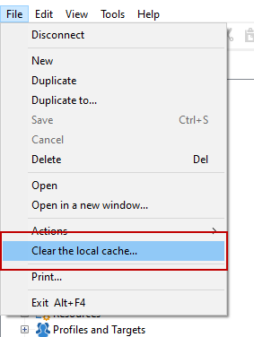

# Vanliga frågor om kampanjinställningar {#settings-faq}

Lär dig viktiga konfigurationer för att konfigurera Campaign-instansen så att den passar dina behov.

## Kan jag ändra språket i Campaign-gränssnittet? {#can-i-change-the-language-of-campaign-interface-}

Kampanjspråk väljs när instansen skapas. Du kan inte ändra den i efterhand. For more on this, refer to [this section](../../installation/using/creating-an-instance-and-logging-on.md).

Användargränssnittet i Adobe Campaign finns på fyra språk: Engelska, franska, tyska och japanska. Observera att klientkonsolen och servern måste vara inställda på samma språk. Varje Campaign-instans kan bara köras på ett språk.

För engelska kan du välja antingen amerikansk engelska eller brittisk engelska när du installerar Campaign: de skiljer sig åt när det gäller datum- och tidsformat. For more on these differences refer to [this section](../../platform/using/adobe-campaign-workspace.md#date-and-time).

## Kan jag använda Campaign Classic med andra Adobe-lösningar? {#can-i-use-campaign-classic-with-other-adobe-solutions-}

Ni kan kombinera leveransfunktionerna och de avancerade kampanjhanteringsfunktionerna i Adobe Campaign med en uppsättning lösningar som hjälper er att personalisera användarnas upplevelse.

Klicka här för att lära dig [hur du arbetar med andra Adobe-lösningar](../../integrations/using/about-campaign-integrations.md) och [hur du konfigurerar IMS i Campaign](../../integrations/using/about-adobe-id.md).

## Hur ställer jag in spårningsfunktioner för min Campaign-instans? {#how-can-i-set-up-tracking-capabilities-on-my-campaign-instance-}

Som expertanvändare kan du konfigurera spårningsfunktioner i Campaign-instansen.

[Klicka här om du vill veta mer](../../installation/using/deploying-an-instance.md#tracking-configuration).

## Hur konfigurerar man e-postleveransen? {#how-to-configure-email-deliverability-}

Förutom avsnittet [Leveranskonfiguration](../../delivery/using/about-deliverability.md#configuration) kan du läsa igenom de tekniska rekommendationerna för leverans för att förstå hur du konfigurerar instansen för att maximera kapaciteten för kampanjleverans.

[Klicka här om du vill veta mer](../../delivery/using/technical-recommendations.md).

## Hur kan jag implementera innehållsgodkännande? {#how-can-i-implement-content-approval-}

Med Campaign kan ni skapa godkännandeprocesser för de viktigaste stegen i marknadsföringskampanjen, i samverkansbaserat läge. För varje kampanj kan du godkänna leveransmålet, innehållet och kostnaderna. De Adobe Campaign-operatörer som ansvarar för godkännandet kan meddelas via e-post och godkänna eller avvisa godkännanden från konsolen eller via en webbanslutning.

[Klicka här om du vill veta mer](../../campaign/using/marketing-campaign-approval.md#checking-and-approving-deliveries) och se hur du implementerar ditt godkännande av leveransinnehåll i Campaign.

## Hur får jag åtkomst till data som lagras i en extern databas? {#how-can-i-access-data-stored-in-an-external-database-}

I Adobe Campaign finns alternativet FDA (Federated Data Access) för att bearbeta information som lagras i en eller flera externa databaser: kan ni få åtkomst till externa data utan att ändra strukturen på Adobe Campaign-data.

[Klicka här om du vill veta mer](../../platform/using/connecting-to-database.md).

## Vilka externa databaser kan jag ansluta Campaign till? {#which-external-databases-can-i-connect-campaign-to-}

Extern databas som är kompatibel med Campaign via FDA (Federated Data Access) listas i [kompatibilitetsmatrisen](https://helpx.adobe.com/campaign/kb/compatibility-matrix.html).

## Kan Adobe Campaign integreras med LDAP? {#can-adobe-campaign-integrate-with-ldap-}

Som lokal/blandad kund kan ni integrera Campaign Classic med LDAP-katalogen.

[Klicka här om du vill veta mer](../../installation/using/connecting-through-ldap.md).

## Hur konfigurerar jag CRM-anslutningar i Campaign? {#how-can-i-set-up-crm-connectors-in-campaign-}

Adobe Campaign innehåller olika CRM-anslutningar för att länka din Adobe Campaign-plattform till dina tredjepartssystem. Med dessa CRM-anslutningar kan du synkronisera kontakter, konton, inköp osv. De gör att du enkelt kan integrera ditt program med olika tredjeparts- och affärsprogram.

Dessa kopplingar möjliggör snabb och enkel dataintegrering: I Adobe Campaign finns en dedikerad guide för att samla in och välja bland tabellerna som finns i CRM. Detta garanterar dubbelriktad synkronisering för att säkerställa att data alltid är aktuella i alla system.

Läs mer i [Konfigurera CRM-anslutningar](../../platform/using/crm-connectors.md) om du vill veta hur du synkroniserar CRM-verktyget med Adobe Campaign. Titta på den här fallvideon om [Adobe Campaign och Microsoft Dynamics 365-integrering](https://helpx.adobe.com/campaign/kt/acc/using/acc-integrate-dynamics365-with-acc-feature-video-set-up.html).

## Hur utför jag rensning av mjuk cache när problemen är datorspecifika eller användarspecifika? {#perform-soft-cache-clear}

Om du har problem med till exempel att de nya logotyperna återspeglas korrekt och kan exportera data som är datorspecifika/användarspecifika, kan du behöva utföra en rensning på mjuk cache med Windows (Windows 7, Windows XP, Windows 10).

När du har loggat in går du till **[!UICONTROL File]** > **[!UICONTROL Clear the local cache]**. Logga sedan ut och in igen.

Om detta fortfarande inte hjälper kan du försöka rensa hårddisken genom att utföra stegen nedan.

## Hur rensar du hårddisken när problemen är datorspecifika eller användarspecifika? {#perform-hard-cache-clear}

Om du har problem med till exempel att de nya logotyperna återspeglas korrekt och kan exportera data som är datorspecifika/användarspecifika, kan du behöva utföra en rensning av hårddisken med Windows (Windows 7, Windows XP, Windows 10).

1. På klientkonsolen väljer du **[!UICONTROL File]** > **[!UICONTROL Clear the local cache]**.

1. Logga ut och stäng klientkonsolen (Rich Client).

1. Gå till följande platser, baserat på operativsystemsversion:

   * Windows 7: C:\Users\&lt; Användarnamn >\AppData\Roaming\Neolane\NL_5\
   * Windows XP: C:\Documents and Settings\&lt; Användarnamn >\Application Data\Neolane\NL_5
   Här ser du många XML-filer med namnet nlclient-config-&lt; alfanumeriskt värde >.xml.

1. Ta bort dessa XML-filer och associerade mappar.

   >[!IMPORTANT]
   >
   >Ta inte bort filen nlclient_cnx.xml.

1. Logga in på klientkonsolen.