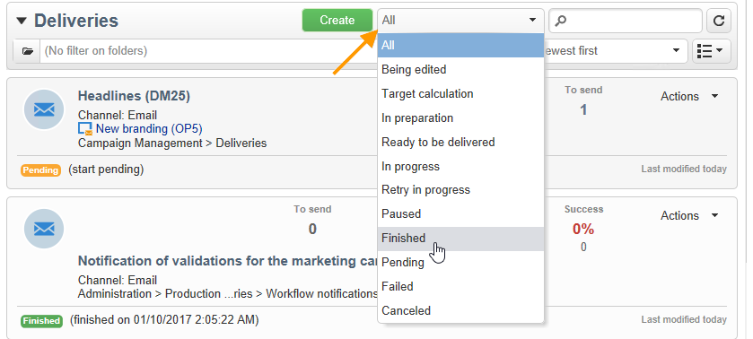

# Filtreringsalternativ{#filtering-options}

## Om filtrering {#about-filtering}

Som standard visar Adobe Campaign alla data i databasen som den berörda operatorn har läsbehörighet för.

Dessa data kan filtreras med hjälp av alternativen i det övre avsnittet i webbläsarfönstret.

Det finns flera sätt att filtrera data som ska visas. Dessa kan vid behov användas tillsammans:

* Filtrera på mappar, se [Filtrera efter mapp](#filter-by-folder),
* Filtrera efter status, se [Filtrera efter status](#filter-by-status),
* Datasortering, se [Beställ av](#order-by),
* Sök, se [Snabbsökning](#quick-search).

## Filtrera efter mapp {#filter-by-folder}

Klicka på **[!UICONTROL Folder]** om du vill välja den mapp som innehåller de data som ska visas.

Endast profilerna i mappen visas:

Använd krysset till höger om mappmarkeringsfältet för att återgå till standardvisningsläget.

## Filtrera efter status {#filter-by-status}

Beroende på vilken typ av information som visas kan du använda ett filter efter status eller efter läge. För leveranser kan du t.ex. välja att bara visa de färdiga leveranserna enligt nedan:

## Beställ av {#order-by}

Du kan välja sorteringsordning för de data som finns på sidorna via den nedrullningsbara listan till höger om filtreringsfältet per mapp. Innehållet i det här fältet beror på vilken typ av data som finns på sidan.

Du kan till exempel sortera uppgifter efter prioritet, skapandedatum eller i alfabetisk ordning.

## Snabbsökning {#quick-search}

Använd sökfältet för att snabbt komma åt det objekt du söker efter: Ange de tecken som finns i etiketten eller det interna namnet på det objekt som du vill visa och bekräfta sedan att du vill använda ett automatiskt filter på data på sidan.

Om du vill visa alla objekt igen klickar du på krysset för att ta bort innehållet i sökfältet.
