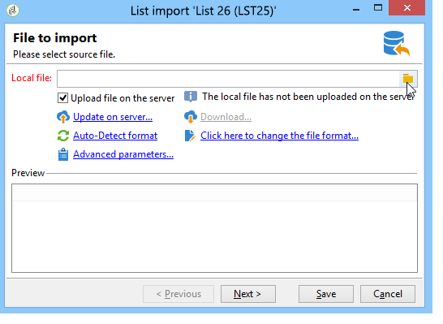
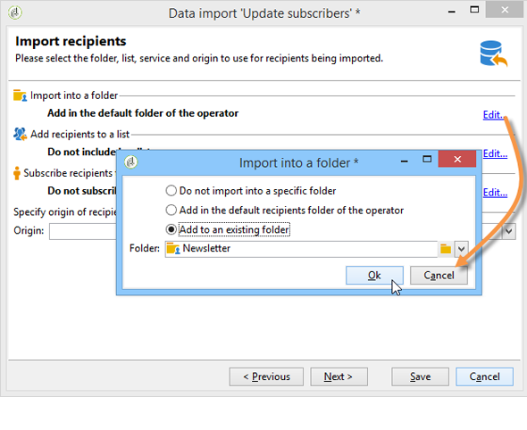
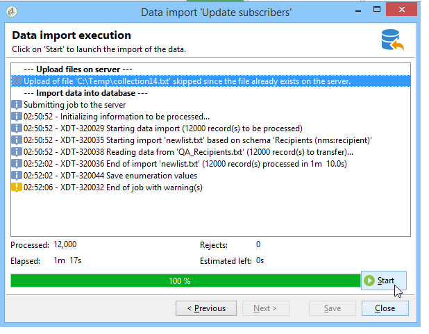

# Generiska importexempel {#import-operations-samples}

## Importera från en lista med mottagare {#example--import-from-a-list-of-recipients}

Om du vill skapa och ange en lista med mottagare från översikten över listor gör du så här:

1. Skapa listan

   * Klicka på **[!UICONTROL Lists]** i **[!UICONTROL Profiles and targets]** på Adobe Campaign hemsida.
   * Klicka på **[!UICONTROL Create]** och sedan **[!UICONTROL Import a list]** -knappen.

1. Markera filen som ska importeras

   Klicka på mappen till höger om **[!UICONTROL Local file]** och markera filen som innehåller listan som ska importeras.

   

1. Listnamn och lagring

   Ange namnet på listan och välj den katalog där den ska sparas.

   

1. Starta importen

   Klicka **[!UICONTROL Next]** och sedan **[!UICONTROL Start]** för att börja importera listan.

   

## Importera nya poster från en textfil {#example--import-new-records-from-a-text-file-}

Så här importerar du nya mottagarprofiler som lagras i en textfil till Adobe Campaign-databasen:

1. Välja en mall

   * På Adobe Campaign hemsida klickar du på **[!UICONTROL Profiles and targets]** länk, sedan **[!UICONTROL Jobs]**. Ovanför listan med jobb klickar du på **[!UICONTROL New import]**.
   * Behåll **[!UICONTROL New text import]** -mall vald som standard.
   * Ändra etiketten och beskrivningen.
   * Välj **[!UICONTROL Simple import]**.
   * Behåll standardjobbmappen.
   * Klicka **[!UICONTROL Advanced parameters]** och väljer **[!UICONTROL Tracking mode]** om du vill visa information om importen under körningen.

1. Markera filen som ska importeras

   Klicka på mappen till höger om **[!UICONTROL Local file]** och välj den fil som du vill importera.

   

1. Associerar fält

   Klicka på **[!UICONTROL Guess the destination fields]** om du vill mappa käll- och målscheman automatiskt. Kontrollera informationen i det här fönstret innan du klickar **[!UICONTROL Next]**.

   

1. Avstämning

   * Gå till **Mottagare (nms:mottagare)** tabell.
   * Välj **[!UICONTROL Insertion]** och lämna standardvärdena i de andra fälten.

      

1. Importerar mottagare

   * Om det behövs anger du en mapp där posterna ska importeras till.

      

1. Starta importen

   * Klicka på **[!UICONTROL Start]**.

      I mitten av redigeraren kan du kontrollera att importen har slutförts och se hur många poster som har bearbetats.

      

      The **[!UICONTROL Tracking]** I kan du spåra importinformationen för varje post i källfilen. Det gör du genom att klicka på **[!UICONTROL Profiles and Targets]** sedan **[!UICONTROL Processes]** väljer du relevant import och letar upp **[!UICONTROL General]**, **[!UICONTROL Journal]** och **[!UICONTROL Rejects]** -tabbar.

      * Kontrollerar importförloppet

         

      * Processvisning för varje post

         

## Uppdatera och infoga mottagare {#example--update-and-insert-recipients}

Vi vill uppdatera befintliga poster i databasen och skapa nya från en textfil. Här följer ett exempel på proceduren:

1. Välja en mall

   Upprepa stegen som beskrivs i exempel 2 ovan.

1. Fil som ska importeras

   Markera filen som du vill importera.

   I vårt exempel visar översikten över de första raderna i filen att filen innehåller uppdateringar för tre poster och att en post skapas.

   

1. Associerar fält

   Använd proceduren i exempel 2 ovan.

1. Avstämning

   * Behåll **[!UICONTROL Update or insert]** som standard.
   * Behåll alternativet **[!UICONTROL Management of duplicates]** in **[!UICONTROL Update]** så att befintliga poster i databasen ändras med data från textfilen.
   * Markera fälten **[!UICONTROL Birth date]**, **[!UICONTROL Name]** och **[!UICONTROL Company]** och tilldela dem en avstämningsnyckel.

      

1. Starta importen

   * Klicka på **[!UICONTROL Start]**.

      I spårningsfönstret kan du kontrollera att importen har slutförts och se hur många poster som har bearbetats.

      

   * Kontrollera i mottagartabellen att posterna har ändrats av den här åtgärden.

      

## Förbättra värdena med värdena i en extern fil {#example--enrich-the-values-with-those-of-an-external-file}

Vi vill ändra vissa fält i en databastabell från en textfil och prioritera värdena i databasen.

I det här exemplet ser du att vissa fält i textfilen har ett värde, medan motsvarande fält i databasen är tomma. Andra fält innehåller ett annat värde än det som finns i databasen.

* Innehållet i den textfil som ska importeras.

   

* Databasstatus före import

   

Använd följande steg:

1. Välja en mall

   Använd proceduren i exempel 2 ovan.

1. Fil som ska importeras

   Markera filen som du vill importera.

1. Associerar fält

   Använd proceduren i exempel 2 ovan.

   I förhandsgranskningen av de första raderna i filen ser du att filen innehåller uppdateringar för vissa poster.

1. Avstämning

   * Gå till tabellen och välj **[!UICONTROL Update]** operation.
   * Välj alternativet **[!UICONTROL Reject entity]** för **[!UICONTROL Management of doubles]** fält.
   * Behåll alternativet **[!UICONTROL Management of duplicates]** in **[!UICONTROL Update]** så att befintliga poster i databasen ändras med data från textfilen.
   * Placera markören på **[!UICONTROL Last name (@lastName)]** och väljer **[!UICONTROL Update only if destination is empty]** alternativ.
   * Upprepa den här åtgärden för **[!UICONTROL Company (@company)]** nod.
   * Tilldela en avstämningsnyckel till fälten **[!UICONTROL Birth date]**, **[!UICONTROL Email]** och **[!UICONTROL First name]**.

      

1. Starta importen

   Klicka på **[!UICONTROL Start]**.

   Kontrollera i mottagartabellen att posterna har ändrats av importen.

   

   Endast värden som var tomma har ersatts av värden från textfilen, men det befintliga värdet i databasen har inte ersatts av värdet från importfilen.

## Uppdatera och förbättra värden från dem i en extern fil {#example--update-and-enrich-the-values-from-those-in-an-external-file}

Vi vill ändra vissa fält i en databastabell från en textfil och prioritera värdena i textfilen.

I det här exemplet ser du att vissa fält i textfilen har ett tomt värde, medan motsvarande fält i databasen inte är tomma. Andra fält innehåller ett annat värde än det i databasen.

* Innehållet i den textfil som ska importeras.

   

* Databasstatus före import

   

1. Välja en mall

   Använd proceduren i exempel 2 ovan.

1. Fil som ska importeras

   Markera filen som du vill importera.

   I förhandsgranskningen av de första raderna i filen ser du att filen innehåller tomma fält och uppdateringar för vissa poster.

1. Associerar fält

   Använd proceduren i exempel 2 ovan.

1. Avstämning

   * Gå till tabellen och markera **[!UICONTROL Update]**.
   * Välj alternativet **[!UICONTROL Reject entity]** för **[!UICONTROL Management of doubles]** fält.
   * Lämna alternativet **[!UICONTROL Management of duplicates]** in **[!UICONTROL Update]** läge för befintliga poster i databasen som ska ändras med data från textfilen.
   * Placera markören på **[!UICONTROL Account number (@account)]** nod och välj alternativet **[!UICONTROL Take empty values into account]**.
   * Markera fälten **[!UICONTROL Birth date]**, **[!UICONTROL Email]** och **[!UICONTROL First name]** och tilldela dem en avstämningsnyckel.

      

1. Starta importen

   * Klicka på **[!UICONTROL Start]**.
   * Kontrollera i mottagartabellen att posterna har ändrats av åtgärden.

      

      Värdena för textfilen som var tom har skrivit över värdena i databasen. De befintliga värdena i databasen uppdaterades med värdena i importfilen i enlighet med **[!UICONTROL Update]** för dubbletter i steg 4.
