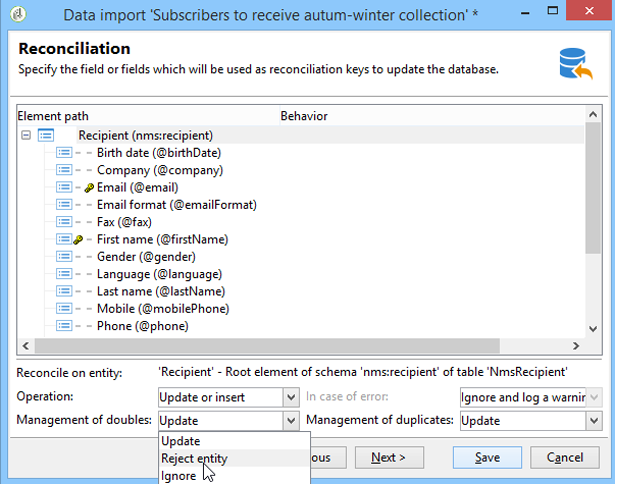

# Importera data{#importing-data}

Med Adobe Campaign kan du importera data till databasen från en eller flera filer i text-, CSV-, TAB- eller XML-format. De här filerna är kopplade till en tabell (huvud eller länkad) och varje fält i källfilen/källfilerna är kopplat till ett fält i databasen. Importkonfigurationen kan sparas för återanvändning så att du kan schemalägga importaktiviteter som automatiserar replikeringsåtgärderna.

>[!NOTE]
>
>Du kan importera data utan att mappa dem till databasdata med hjälp av **[!UICONTROL Import a list]** funktionen.
> 
>Data kan sedan användas exklusivt i arbetsflöden via **[!UICONTROL Read list]** objektet. Mer information finns på [den här sidan](../../workflow/using/read-list.md).
>
>Titta på videon [Importera profiler](https://docs.adobe.com/content/help/en/campaign-learn/campaign-classic-tutorials/getting-started/importing-profiles.html) om du vill ha mer information.

## Struktur för de data som ska importeras {#structure-of-the-data-to-import}

I källfilen sammanfaller varje rad med en post. Data i poster avgränsas med avgränsare (blanksteg, tabb, tecken osv.). Det innebär att data hämtas i form av kolumner, och varje kolumn är kopplad till ett fält i databasen.

## Importguiden {#import-wizard}

Med importguiden kan du konfigurera importen, definiera alternativ (till exempel dataomvandling) och starta körningen. Det är en serie skärmar vars innehåll beror på typen av import (enkel eller flera) och operatörens rättigheter.

>[!NOTE]
>
>Om du använder en IIS-webbserver kan en konfiguration behövas för att tillåta överföring av stora filer (>28 MB).
>
>Mer information finns i [det här avsnittet](../../installation/using/integration-into-a-web-server-for-windows.md#changing-the-upload-file-size-limit).

### Steg 1 - Välj importmall {#step-1---choosing-the-import-template}

När du startar importguiden måste du först välja en mall. Om du till exempel vill konfigurera import av mottagare som har fått ett nyhetsbrev följer du stegen nedan:

1. Markera **[!UICONTROL Profiles and Targets > Job > Generic imports and exports]** mappen.
1. Klicka på **Nytt** och sedan på **Importera** för att skapa importmallen.

   

1. Klicka på pilen till höger om **[!UICONTROL Import template]** fältet för att välja mallen eller klicka på **[!UICONTROL Select link]** för att bläddra i trädet.

   Den interna mallen är **[!UICONTROL New text import]**. Den här mallen får inte ändras, men du kan duplicera den för att konfigurera en ny mall beroende på dina behov. Som standard sparas importmallar i **[!UICONTROL Profiles and targets > Templates > Job templates]** noden.

1. Ange ett namn för importen i **[!UICONTROL Label]** fältet. Du kan lägga till en beskrivning.
1. Välj importtyp i lämpligt fält. Det finns två typer av import: om du bara **[!UICONTROL Simple import]** vill importera en fil och **[!UICONTROL Multiple import]** importera flera filer i en enda körning.

   Om du vill importera flera filer väljer du **[!UICONTROL Multiple import]** i den **[!UICONTROL Import type]** nedrullningsbara listan på den första skärmen i importguiden.

   

1. Ange de fält du vill importera genom att klicka på **[!UICONTROL Add]**.

   

   Varje gång en fil läggs till visas skärmen för **[!UICONTROL File to import]** guiden. Se avsnitt [Steg 2 - Val](#step-2---source-file-selection) av källfil och följ stegen i guiden för att definiera importalternativen på samma sätt som vid en enkel import.

   >[!NOTE]
   >
   >Multipla importer bör endast tillgodose specifika behov och rekommenderas inte.

#### Avancerade parametrar {#advanced-parameters}

Med hjälp av **[!UICONTROL Advanced parameters]** länken kommer du åt följande alternativ:

* **[!UICONTROL General]** tab

   * **[!UICONTROL Stop execution if there are too many rejects]**

      Det här alternativet är markerat som standard. Du kan avmarkera den om du vill fortsätta att köra importen oavsett antalet avvisade. Körningen stoppas som standard om de första 100 raderna avvisas.

   * **[!UICONTROL Trace mode]**

      Välj det här alternativet om du vill spåra importkörningen för varje rad.

   * **[!UICONTROL Start the job in a detached process]**

      Det här alternativet är markerat som standard. Du kan koppla loss körningen av importen så att den inte påverkar andra pågående jobb i databasen.

   * **[!UICONTROL Do not update enumerations]**

      Välj det här alternativet om du inte vill att listan med uppräknade värden i databasen ska vara upphöjd. Se [Hantera uppräkningar](../../platform/using/managing-enumerations.md).

* **[!UICONTROL Variables]** tab

   Du kan definiera variabler som är associerade med jobbet och som ska vara tillgängliga i frågeredigerarna och beräkningsfälten. Om du vill skapa en variabel klickar du på **[!UICONTROL Add]** och använder variabelredigeraren.

   >[!CAUTION]
   >
   >Fliken är bara avsedd för programmering av arbetsflödestyp och bör konfigureras av enbart expertanvändare. **[!UICONTROL Variables]**

### Steg 2 - Välj källfil {#step-2---source-file-selection}

Källfilen kan vara i textformat (txt, csv, tab, fixed columns) eller xml.

Som standard **[!UICONTROL Upload file on the server]** är markerat. Klicka på mappen till höger om **[!UICONTROL Local file]** fältet för att bläddra på den lokala disken och markera filen som ska importeras. Du kan avmarkera det här alternativet om du vill ange åtkomstsökvägen och namnet på filen som ska importeras om den finns på servern.

När filen har angetts kan du visa dess data i fönstrets nedre del genom att klicka på **[!UICONTROL Auto-detect format]**. I den här förhandsvisningen visas de första 200 raderna i källfilen.

Använd alternativen ovan för att konfigurera importen. De parametrar som definieras med dessa alternativ överförs till förhandsvisningen. Följande alternativ är tillgängliga:

* **[!UICONTROL Click here to change the file format...]** gör att du kan kontrollera filformatet och finjustera konfigurationen.
* **[!UICONTROL Update on server...]** I kan du överföra den lokala filen till servern. Det här alternativet är bara tillgängligt om du **[!UICONTROL Upload file on the server]** har valt det.
* **[!UICONTROL Download]** är bara tillgängligt om filen har överförts till servern.
* **[!UICONTROL Auto-detect format]** används för att initiera om datakällans format. Med det här alternativet kan du återanvända originalformaten på data som har formaterats med **[!UICONTROL Click here to change the file format...]** alternativet.
* Med hjälp av **[!UICONTROL Advanced parameters]** länken kan du filtrera källdata och komma åt avancerade alternativ. På den här skärmen kan du välja att bara importera en del av filen. Du kan också definiera ett filter, t.ex. för att importera endast användare av typen &quot;Prospect&quot; eller &quot;Customer&quot; enligt värdet för motsvarande rad. Dessa alternativ bör endast användas av JavaScript-expertanvändare.

#### Ändra filformatet {#changing-the-file-format}

Med det här **[!UICONTROL Click here to change the file format...]** alternativet kan du formatera källfilens data, särskilt för att ange kolumnavgränsare och datatyp för varje fält. Den här konfigurationen utförs via följande fönster:

I det här steget beskriver du hur värdena i filfälten ska läsas. Om det till exempel gäller ett datum kan data för Datum eller Datum + Tid kopplas till ett format (dd/mm/åååå, mm/dd/åå osv.). Om indata inte överensstämmer med det förväntade formatet, avvisas under importen.

Du kan visa resultatet av konfigurationen i förhandsvisningszonen i fönstrets nedre del.

Klicka **[!UICONTROL OK]** för att spara formateringen och klicka sedan för **[!UICONTROL Next]** att visa nästa steg.

### Steg 3 - Fältmappning {#step-3---field-mapping}

Du måste sedan välja målschemat och mappa data för varje kolumn till fält i databasen.

* I **[!UICONTROL Destination schema]** fältet kan du välja vilket schema som data ska importeras till. Denna information är obligatorisk. Klicka på **[!UICONTROL Select link]** ikonen för att välja ett av de befintliga schemana. Klicka **[!UICONTROL Edit link]** för att visa innehållet i den markerade tabellen.
* I den centrala tabellen visas alla fält som definierats i källfilen. Markera de fält som ska importeras för att associera en målfil med dem. Dessa fält kan mappas manuellt eller automatiskt.

   Om du vill mappa ett fält manuellt markerar du källfältet genom att klicka i kryssrutan och aktiverar sedan cellen som motsvarar det markerade fältet genom att klicka på den andra kolumnen. Klicka sedan på **[!UICONTROL Edit expression]** ikonen för att visa alla fält i den aktuella tabellen. Markera målfältet och klicka på **[!UICONTROL OK]** för att validera mappningen.

   Om du vill associera källfälten och målfälten automatiskt klickar du på **[!UICONTROL Guess the destination fields]** ikonen till höger om listan med fält. De föreslagna fälten kan ändras vid behov.

   >[!CAUTION]
   >
   >Resultatet av den här åtgärden måste alltid valideras innan du fortsätter till nästa steg.

* Du kan använda en omformning på de importerade fälten. Det gör du genom att klicka i cellen i den kolumn som är **[!UICONTROL Transformation]** relaterad till det aktuella fältet och välja den omformning som ska användas.

   

   >[!CAUTION]
   >
   >Omformningen används vid tiden för importen. Om begränsningar för målfältet har definierats (i ovanstående exempel i fältet @lastname) får dessa begränsningar prioritet.

* Du kan lägga till beräkningsfält med lämplig ikon till höger om den centrala tabellen. Med beräkningsfält kan du utföra komplexa omformningar, lägga till virtuella kolumner eller sammanfoga data från flera kolumner. I följande avsnitt finns mer information om de olika möjligheterna.

#### Beräknade fält {#calculated-fields}

Beräknade fält är nya kolumner som läggs till i källfilen och beräknas från andra kolumner. Beräknade fält kan sedan kopplas till fält i Adobe Campaign-databasen. Avstämningsåtgärder är dock inte möjliga för beräknade fält.

Det finns fyra typer av beräknade fält:

* **[!UICONTROL Fixed string]**: värdet för beräkningsfältet är detsamma för alla rader i källfilen. Här kan du ange värdet för ett fält med poster som infogats eller uppdaterats. Du kan t.ex. ange en markör som &quot;ja&quot; för alla importerade poster.
* **[!UICONTROL String with JavaScript tags]**: värdet för beräkningsfältet är en teckensträng som innehåller JavaScript-kommandon.
* **[!UICONTROL JavaScript expression]**: värdet för beräkningsfältet är resultatet av utvärderingen av en JavaScript-funktion. Det returnerade värdet kan vara ett tal, ett datum osv.
* **[!UICONTROL Enumeration]**: fältets värde tilldelas enligt ett värde i källfilen. I redigeraren kan du ange källkolumnen och ange en lista med uppräkningsvärden, som i följande exempel:

   

   På fliken **[!UICONTROL Preview]** kan du visa resultatet av den definierade konfigurationen. Här har **[!UICONTROL Subscription]** kolumnen lagts till. Värdet beräknas från **statusfältet** .

   

### Steg 4 - Avstämning {#step-4---reconciliation}

I importguidens avstämningssteg kan du definiera läget för att stämma av data från filen med befintliga data i databasen och ange prioritetsregler mellan fildata och databasdata. Konfigurationsfönstret ser ut så här:

Skärmens centrala del innehåller ett träd med fälten och tabellerna i Adobe Campaign-databasen som data ska importeras till.

Det finns särskilda alternativ för varje nod (tabell eller fält). När du klickar på den berörda noden i listan visas dess parametrar och en kort beskrivning nedan. Beteendet som definieras för varje element visas i motsvarande **[!UICONTROL Behavior]** kolumn.

#### Typ av åtgärd {#types-of-operation}

För varje tabell som berörs av importen måste du definiera typen av åtgärd. Följande åtgärder är tillgängliga för databasens huvudelement:

* **[!UICONTROL Update or insertion]**: uppdaterar posten om den finns i databasen och skapar den om den inte finns.
* **[!UICONTROL Insertion]**: infogar poster i databasen.
* **[!UICONTROL Update]**: uppdaterar bara befintliga poster (ignorerar andra poster).
* **[!UICONTROL Reconciliation only]**: söker efter posten i databasen, men utför ingen uppdatering. Med kan du till exempel associera mappen med mottagare som ska importeras enligt en kolumn i filen utan att uppdatera data i mapparna.
* **[!UICONTROL Deletion]**: I kan du förstöra poster i databasen.

Följande alternativ är tillgängliga för varje fält i den tabell som berörs av importen:

* **[!UICONTROL Update (empty) if source value is empty]**: om en uppdatering görs, kommer värdet i fältet att ta bort databasvärdet om fältet är tomt i källfilen. I annat fall behålls databasfältet.
* **[!UICONTROL Update only if destination is empty]**: värdet från källfilen skriver inte över värdet i databasfältet såvida inte databasfältet är tomt. I så fall får källfilens värde.
* **[!UICONTROL Update the field only when the record is inserted]**: under en uppdatering- eller infogningsåtgärd importeras endast nya källfilsposter.

>[!NOTE]
>
>Definitionen av en avstämningsnyckel är alltid **obligatorisk**, förutom vid infogning utan borttagning av dubbletter.

#### Avstämningsnycklar {#reconciliation-keys}

Minst en avstämningsnyckel måste fyllas i för att hantera deduplicering.

En avstämningsnyckel är en uppsättning fält som används för att identifiera en post. Om du till exempel vill importera mottagare kan avstämningsnyckeln vara kontonumret, e-postfältet eller fälten Efternamn, Förnamn, Företag osv.

I det här fallet, för att ta reda på om en rad i en fil matchar en befintlig mottagare i databasen, jämför importmotorn filens värden med databasens för alla fält i nyckeln. När fält är specifika för en post kan en detaljerad jämförelse mellan käll- och måldata utföras, vilket garanterar dataintegriteten efter importen. En andra avstämningsnyckel kan fyllas i för samma tabell. används för de rader vars första nyckel är tom.

Undvik att välja ett fält som kan ändras vid import. om detta inträffar kan motorn skapa ytterligare poster.

>[!NOTE]
>
>För en mottagarimport läggs identifieraren för den valda mappen implicit till i nyckeln.
>
>Avstämning utförs därför endast för den här mappen (såvida ingen mapp har valts).

#### Deduplicering {#deduplication}

>[!NOTE]
>
>Ett double-värde är ett objekt som finns två eller flera gånger i filen som ska importeras.
>
>En dubblett är ett objekt som finns både i filen som ska importeras och i databasen.

I **[!UICONTROL Management of doubles]** fältet kan du konfigurera borttagning av datadubbletter. Deduplicering avser poster som förekommer flera gånger **i källfilen** (eller källfiler vid import av flera filer), dvs. rader för vilka fälten i avstämningsnyckeln är identiska.

* Duplicerad hantering i **[!UICONTROL Update]** läge (standardläge) utför inte borttagning av dubbletter. Den sista posten har därför prioritet (eftersom den uppdaterar data från föregående poster). Räkning av dubbletter utförs inte i det här läget.
* Duplicera hantering i **[!UICONTROL Ignore]** läge eller **[!UICONTROL Reject entity]** exkluderar dubbletter från importen. I det här fallet importeras ingen post.
* I **[!UICONTROL Reject entity]** läget importeras elementet inte och ett fel genereras i importloggarna.
* I **[!UICONTROL Ignore]** läget importeras inte elementet, men inga spår av felet behålls. I det här läget kan du optimera prestanda.

>[!CAUTION]
>
>Deduplicering utförs endast i minnet. Storleken på en import med borttagning av dubbletter är därför begränsad. Gränsen beror på flera parametrar (programserverns kapacitet, aktivitet, antalet fält i nyckeln, osv.). Den största tillåtna storleken för borttagning av dubbletter är 1 000 000 rader.

Deduplicering gäller en post som finns både i källfilen och i databasen. Det gäller åtgärder med enbart uppdatering (dvs. **[!UICONTROL Update and insertion]** eller **[!UICONTROL Update]**). Med det här **[!UICONTROL Duplicate management]** alternativet kan du uppdatera eller ignorera posten om den finns både i källfilen och i databasen. Alternativet tillhör den valfria modulen och kan inte användas i en standardkontext. **[!UICONTROL Update or insert based on origin]**

Alternativen **[!UICONTROL Reject]** och **[!UICONTROL Ignore]** fungerar enligt ovan.

#### Beteende i händelse av ett fel {#behavior-in-the-event-of-an-error}

De flesta dataöverföringsåtgärder genererar olika typer av fel (inkonsekvent radformat, ogiltig e-postadress osv.). Alla fel och alla varningar som genereras av importmotorn lagras och länkas till importinstansen.

Information om de här avvisningarna kan visas via **[!UICONTROL Rejects]** fliken.

Det finns två typer av avslag (typen visas i **[!UICONTROL Connector]** kolumnen):

* Avvisanden av textkopplingen rör fel som inträffar när filraden bearbetas (beräkningsfält, dataanalys osv.). I det här fallet avvisas alltid hela raden om ett fel inträffar.
* Databaskopplingen avvisar fel som inträffar under datavstämning eller skrivning till databasen. Om du importerar till flera tabeller kan refuseringen endast gälla en del av posten (t.ex. om du importerar mottagare och associerade händelser kan ett fel förhindra att en händelse uppdateras utan att mottagaren avvisas).

På datavstämningssidan kan du definiera önskat felhanteringstypfält efter fält och tabell efter tabell.

* **[!UICONTROL Ignore and log a warning]**: alla fält importeras till databasen utom det som genererade ett fel.
* **[!UICONTROL Reject parent element]**: hela raden i posten avvisas, inte bara fältet som orsakade ett fel.
* **[!UICONTROL Reject all elements]**: importstoppen och alla element i posten avvisas.

   

Trädet på avvisningsskärmen för en importinstans anger vilka fält som avvisats och var felen inträffade.

Du kan generera en fil som innehåller dessa poster via **[!UICONTROL Export rejects]** ikonen:

### Steg 5 - ytterligare steg vid import av mottagare {#step-5---additional-step-when-importing-recipients}

I nästa steg i importguiden kan du välja eller skapa den mapp i vilken data ska importeras, automatiskt mappa importerade mottagare med en (ny eller befintlig) lista och prenumerera på mottagare för en tjänst.

>[!NOTE]
>
>Det här steget visas endast när du importerar mottagare och när du använder Adobe Campaign-standardmottagartabellen (**nms:mottagare**).

* Klicka på **[!UICONTROL Edit]** länkarna för att markera mappen, listan eller tjänsten som du vill associera eller abonnera på mottagarna till.

   1. Importera till en mapp

      Med **[!UICONTROL Edit...]** länken i **[!UICONTROL Import into a folder]** avsnittet kan du markera eller skapa den mapp som mottagarna ska importeras till. Om ingen partition är definierad importeras data som standard till operatörens standardmapp.

      >[!NOTE]
      >
      >Standardmappen för en operator är den första mappen som operatorn har skrivåtkomst till. Se [Mappåtkomsthantering](../../platform/using/access-management.md#folder-access-management).

      Om du vill välja importmapp klickar du på pilen till höger om **[!UICONTROL Folder]** fältet och väljer den aktuella mappen. Du kan också använda **[!UICONTROL Select link]** ikonen för att visa trädet i ett nytt fönster eller skapa en ny mapp.

      

      Om du vill skapa en ny mapp markerar du noden som du vill lägga till en mapp från och högerklickar. Välj **[!UICONTROL Create a new 'Recipients' folder]**.

      

      Mappen läggs till under den aktuella noden. Ange namnet på den nya mappen, tryck på Enter för att bekräfta och klicka sedan på **[!UICONTROL OK]**.

      

   1. Associera med en lista

      Med **[!UICONTROL Edit...]** länken i **[!UICONTROL Add recipients to a list]** avsnittet kan du markera eller skapa en lista som mottagarna ska importeras till.

      

      Du kan skapa en ny lista för dessa mottagare genom att klicka på **[!UICONTROL Select link]** och sedan **[!UICONTROL Create]**. Hur listor skapas och hanteras presenteras i [Skapa och hantera listor](../../platform/using/creating-and-managing-lists.md).

      

      Du kan välja att lägga till mottagare till de som redan finns i en lista eller att återskapa listan med de nya mottagarna. Om listan redan innehåller mottagare tas de bort och ersätts av de importerade mottagarna.

   1. Prenumerera på en tjänst

      Om du vill prenumerera alla importerade mottagare på en informationstjänst klickar du på **[!UICONTROL Edit...]** länken i **[!UICONTROL Subscribe recipients to a service]** avsnittet för att markera eller skapa den informationstjänst som mottagarna ska prenumerera på. Du kan välja **[!UICONTROL Send a confirmation message]** alternativet: Innehållet i det här meddelandet definieras i den leveransmall som är kopplad till prenumerationstjänsten.

      

      Du kan skapa en ny tjänst för dessa mottagare genom att klicka på **[!UICONTROL Select link]** och sedan på **[!UICONTROL Create]** ikonen . Hanteringen av informationstjänster presenteras i [detta avsnitt](../../delivery/using/managing-subscriptions.md).

* Använd **[!UICONTROL Origin]** fältet för att lägga till information om mottagarnas ursprung i deras profiler. Denna information är särskilt användbar vid import av flera produkter.

Klicka **[!UICONTROL Next]** för att validera det här steget och visa följande steg.

### Steg 6 - Starta importen {#step-6---launching-the-import}

I det sista steget i guiden kan du starta dataimport. Klicka på **[!UICONTROL Start]** knappen om du vill göra det.

### Jobbstatus {#job-statuses}

Jobbstatus anger aktuell status för ett jobb. Varje status representeras av en speciell ikon och etikett. Den här informationen visas i listan över jobb. Statuserna och ikonerna för dem listas nedan:

* **Redigering pågår**

   Jobbet skapas.

* **Körning pågår**

   Jobbet körs.

* **Avbryt**

   Klicka på **[!UICONTROL Cancel]** knappen: jobbet avbryts.

* **Avbokning pågår**

   Kommandot för att avbryta har tagits med i beräkningen och jobbet avbryts.

* **Paus pågår**

   Klicka **[!UICONTROL Pause]**: jobbet pausas.

* **Pausad**

   Klicka **[!UICONTROL Pause]**: jobbet har pausats. Du kan starta om programmet genom att klicka **[!UICONTROL Start]**.

* **Slutförd**

   Jobbet har körts klart.

* **Slutförd med fel**

   Jobbet utfördes inte på grund av ett tekniskt fel.

* **Serveravstängning pågår**

   Jobbet avbryts eftersom Adobe Campaign-servern har stängts av.

## Allmänna importexempel {#generic-import-samples}

### Exempel: Importera från en lista med mottagare {#example--import-from-a-list-of-recipients}

Om du vill skapa och ange en lista med mottagare från översikten över listor gör du så här:

1. Skapa listan

   * Klicka på **[!UICONTROL Lists]** länken på **[!UICONTROL Profiles and targets]** menyn på hemsidan för Adobe Campaign.
   * Klicka på **[!UICONTROL Create]** och sedan på **[!UICONTROL Import a list]** knappen.

1. Markera filen som ska importeras

   Klicka på mappen till höger om **[!UICONTROL Local file]** fältet och markera filen som innehåller listan som ska importeras.

   

1. Listnamn och lagring

   Ange namnet på listan och välj den katalog där den ska sparas.

   

1. Starta importen

   Klicka på **[!UICONTROL Next]** och sedan **[!UICONTROL Start]** för att börja importera listan.

   

### Exempel: importera nya poster från en textfil {#example--import-new-records-from-a-text-file-}

Så här importerar du nya mottagarprofiler som lagras i en textfil till Adobe Campaign-databasen:

1. Välja en mall

   * Klicka på **[!UICONTROL Profiles and targets]** länken på startsidan för Adobe Campaign och sedan **[!UICONTROL Jobs]**. Ovanför listan med jobb klickar du på **[!UICONTROL New import]**.
   * Behåll **[!UICONTROL New text import]** mallen markerad som standard.
   * Ändra etiketten och beskrivningen.
   * Välj **[!UICONTROL Simple import]**.
   * Behåll standardjobbmappen.
   * Klicka på **[!UICONTROL Advanced parameters]** och välj **[!UICONTROL Tracking mode]** alternativet för att visa information om importen under körningen.

1. Markera filen som ska importeras

   Klicka på mappen till höger om **[!UICONTROL Local file]** fältet och markera den fil du vill importera.

   

1. Associerar fält

   Klicka på **[!UICONTROL Guess the destination fields]** ikonen för att automatiskt mappa käll- och målscheman. Kontrollera informationen i det här fönstret innan du klickar **[!UICONTROL Next]**.

   

1. Avstämning

   * Gå till tabellen **Mottagare (nms:mottagare)** .
   * Markera **[!UICONTROL Insertion]** åtgärden och lämna standardvärdena i de andra fälten.

      

1. Importerar mottagare

   * Om det behövs anger du en mapp där posterna ska importeras till.

      

1. Starta importen

   * Klicka **[!UICONTROL Start]**.

      I mitten av redigeraren kan du kontrollera att importen har slutförts och se hur många poster som har bearbetats.

      

      I **[!UICONTROL Tracking]** läget kan du spåra importinformationen för varje post i källfilen. Det gör du genom att klicka på startsidan **[!UICONTROL Profiles and Targets]** och sedan **[!UICONTROL Processes]** markera importen och leta upp **[!UICONTROL General]** flikarna **[!UICONTROL Journal]** och **[!UICONTROL Rejects]** flikarna.

      * Kontrollerar importförloppet

         

      * Processvisning för varje post

         

### Exempel: Uppdatera och infoga mottagare {#example--update-and-insert-recipients}

Vi vill uppdatera befintliga poster i databasen och skapa nya från en textfil. Här följer ett exempel på proceduren:

1. Välja en mall

   Upprepa stegen som beskrivs i exempel 2 ovan.

1. Fil som ska importeras

   Markera filen som du vill importera.

   I vårt exempel visar översikten över de första raderna i filen att filen innehåller uppdateringar för tre poster och att en post skapas.

   

1. Associerar fält

   Använd proceduren i exempel 2 ovan.

1. Avstämning

   * Behåll **[!UICONTROL Update or insert]** markerat som standard.
   * Behåll alternativet **[!UICONTROL Management of duplicates]** i **[!UICONTROL Update]** läge så att befintliga poster i databasen ändras med data från textfilen.
   * Markera fälten **[!UICONTROL Birth date]** och **[!UICONTROL Name]** **[!UICONTROL Company]** tilldela dem en avstämningsnyckel.

      

1. Starta importen

   * Klicka **[!UICONTROL Start]**.

      I spårningsfönstret kan du kontrollera att importen har slutförts och se hur många poster som har bearbetats.

      

   * Kontrollera i mottagartabellen att posterna har ändrats av den här åtgärden.

      

### Exempel: Förbättra värdena med värdena i en extern fil {#example--enrich-the-values-with-those-of-an-external-file}

Vi vill ändra vissa fält i en databastabell från en textfil och prioritera värdena i databasen.

I det här exemplet ser du att vissa fält i textfilen har ett värde, medan motsvarande fält i databasen är tomma. Andra fält innehåller ett annat värde än det som finns i databasen.

* Innehållet i den textfil som ska importeras.

   

* Databasstatus före import

   

Använd följande steg:

1. Välja en mall

   Använd proceduren i exempel 2 ovan.

1. Fil som ska importeras

   Markera filen som du vill importera.

1. Associerar fält

   Använd proceduren i exempel 2 ovan.

   I förhandsgranskningen av de första raderna i filen ser du att filen innehåller uppdateringar för vissa poster.

1. Avstämning

   * Gå till tabellen och välj **[!UICONTROL Update]** åtgärden.
   * Välj alternativet **[!UICONTROL Reject entity]** för **[!UICONTROL Management of doubles]** fältet.
   * Behåll alternativet **[!UICONTROL Management of duplicates]** i **[!UICONTROL Update]** läge så att befintliga poster i databasen ändras med data från textfilen.
   * Placera markören på **[!UICONTROL Last name (@lastName)]** noden och markera **[!UICONTROL Update only if destination is empty]** alternativet.
   * Upprepa den här åtgärden för **[!UICONTROL Company (@company)]** noden.
   * Tilldela en avstämningsnyckel till fälten **[!UICONTROL Birth date]** och **[!UICONTROL E-mail]** **[!UICONTROL First name]**.

      

1. Starta importen

   Klicka **[!UICONTROL Start]**.

   Kontrollera i mottagartabellen att posterna har ändrats av importen.

   

   Endast värden som var tomma har ersatts med värden från textfilen, men det befintliga värdet i databasen har inte ersatts med värdet från importfilen.

### Exempel: Uppdatera och förbättra värden från dem i en extern fil {#example--update-and-enrich-the-values-from-those-in-an-external-file}

Vi vill ändra vissa fält i en databastabell från en textfil och prioritera värdena i textfilen.

I det här exemplet ser du att vissa fält i textfilen har ett tomt värde, medan motsvarande fält i databasen inte är tomma. Andra fält innehåller ett annat värde än det i databasen.

* Innehållet i den textfil som ska importeras.

   

* Databasstatus före import

   

1. Välja en mall

   Använd proceduren i exempel 2 ovan.

1. Fil som ska importeras

   Markera filen som du vill importera.

   I förhandsgranskningen av de första raderna i filen ser du att filen innehåller tomma fält och uppdateringar för vissa poster.

1. Associerar fält

   Använd proceduren i exempel 2 ovan.

1. Avstämning

   * Gå till tabellen och markera **[!UICONTROL Update]**.
   * Välj alternativet **[!UICONTROL Reject entity]** för **[!UICONTROL Management of doubles]** fältet.
   * Låt alternativet vara **[!UICONTROL Management of duplicates]** i **[!UICONTROL Update]** läge för befintliga poster i databasen som ska ändras med data från textfilen.
   * Placera markören på **[!UICONTROL Account number (@account)]** noden och markera alternativet **[!UICONTROL Take empty values into account]**.
   * Markera fälten **[!UICONTROL Birth date]** och **[!UICONTROL E-mail]** **[!UICONTROL First name]** tilldela dem en avstämningsnyckel.

      

1. Starta importen

   * Klicka **[!UICONTROL Start]**.
   * Kontrollera i mottagartabellen att posterna har ändrats av åtgärden.

      

      Värdena för textfilen som var tom har skrivit över värdena i databasen. De befintliga värdena i databasen uppdaterades med värdena i importfilen i enlighet med det **[!UICONTROL Update]** alternativ som valts för dubbletter i steg 4.

## Importera data från ett arbetsflöde {#importing-data-from-a-workflow}

Arbetsflöden kan vara ett användbart sätt att automatisera vissa importprocesser. Oavsett om du importerar data från en lokal fil eller från en SFTP kan du använda arbetsflöden för att standardisera datahanteringsprocesserna.

Mer information om hur du importerar data från ett arbetsflöde finns i [det här avsnittet](../../workflow/using/importing-data.md).
