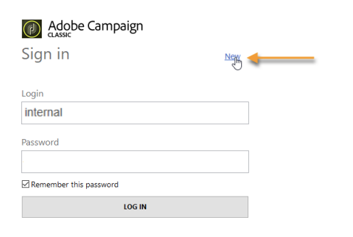

# Starta Adobe Campaign{#launching-adobe-campaign}

Campaign Client-konsolen är en avancerad klient som gör att du kan ansluta till dina Campaign-programservrar. Lär dig hur du hämtar och konfigurerar klientkonsolen i [den här sidan](../../installation/using/installing-the-client-console.md).

>[!CAUTION]
>
>Kontrollera system- och verktygskompatibiliteten med Adobe Campaign Client Console i [Kompatibilitetsmatris](../../rn/using/compatibility-matrix.md#ClientConsoleoperatingsystems)

## Starta Adobe Campaign {#starting-adobe-campaign}

Du kan starta Adobe Campaign genom att välja **[!UICONTROL Start / All Programs / Adobe Campaign v.X / Adobe Campaign client console]**.

I klientkonsolens anslutningsfönster kan du välja eller konfigurera befintliga databaser och ansluta till dem med ett användarnamn och lösenord:

## Anslut till Adobe Campaign {#connecting-to-adobe-campaign}

Du kan ansluta till Adobe Campaign med din Adobe ID. Mer information finns på [den här sidan](../../integrations/using/about-adobe-id.md).

Du kan även ansluta med en dedikerad inloggning/ett dedikerat lösenord:

1. Ange operatorkontots identifierare i dialogrutan **[!UICONTROL Login]** fält.

   Din identifierare anges av administratören för din Adobe Campaign-plattform.

1. Ange ditt lösenord i dialogrutan **[!UICONTROL Password]** fält.

   Första gången du öppnar databasen är ditt lösenord det du får av administratören. När du är ansluten kan du ändra ditt lösenord via **[!UICONTROL Tools > Change password...]** -menyn. Information om operatorer och anslutningar finns i [Åtkomsthantering](../../platform/using/access-management.md).

1. Klicka på **[!UICONTROL LOG IN]** för att bekräfta.<!--You can also press the **Enter** key to launch connection.-->

Nu kan du komma åt [Adobe Campaign arbetsyta](../../platform/using/adobe-campaign-workspace.md).

Vissa kortkommandon finns på **[!UICONTROL Sign in screen]**:
* Alla åtgärdbara objekt kan markeras via **Tabb** eller uppifrån och ned **Tabb** + **Skift** tangenter (nerifrån och upp).
* Om du vill starta anslutningen trycker du på **Retur** -tangenten.
* Du kan använda **Escape** för att återställa **[!UICONTROL Login]** och **[!UICONTROL Password]** till de senast slutförda anslutningsvärdena.

## Konfigurera anslutningar {#setting-up-connections}

Du kommer åt inställningarna för serveranslutningen via länken ovanför indatazonen.

I **[!UICONTROL Connections]** fönster, klicka **[!UICONTROL Add > Connection]**.

Du måste sedan definiera anslutningsinställningarna. Så här gör du:

1. Ange en **[!UICONTROL Label]** för att tilldela en databasanslutning ett namn.

1. Lägg till adressen till programservern i **[!UICONTROL URL]** fält. Kontakta administratören om du inte känner till anslutnings-URL:en.

1. Kontrollera **[!UICONTROL Connect with an Adobe ID]** för att operatörerna ska kunna ansluta till konsolen med sin Adobe ID. Mer information finns på [den här sidan](../../integrations/using/about-adobe-id.md).

1. Klicka **[!UICONTROL OK]** för att validera.

## Operatörer och behörigheter {#operators-and-permissions}

Identifierare och lösenord för operatorer med åtkomst till programvaran och deras respektive behörigheter definieras av din Adobe Campaign-systemadministratör i **[!UICONTROL Administration > Access management > Operators]** noden i Adobe Campaign-trädet.

Den här funktionaliteten beskrivs i [Åtkomsthantering](../../platform/using/access-management.md) -avsnitt.

## Koppla från Adobe Campaign {#disconnecting-from-adobe-campaign}

Om du vill koppla från Adobe Campaign använder du den första ikonen i ikonfältet.

>[!NOTE]
>
>Du kan också stänga programmet utan att logga ut först.

## Skaffa en Adobe Campaign-version {#getting-your-campaign-version}

The **[!UICONTROL Help > About...]** kan du komma åt följande information:

* **version** nummer för Campaign-klientkonsolen och programservern
* **bygg** nummer för Campaign-klientkonsolen och programservern
* en länk till att kontakta Adobe kundtjänst
* länkar till Adobe sekretesspolicy, användarvillkor och cookies

När du kontaktar kundtjänstteamet på Adobe måste du ange versionsnummer och build-nummer för Adobe Campaign klientkonsol och programserver.

**Relaterade ämnen**:

* [Adobe Campaign hjälp- och supportalternativ](../../support.md)
* [Adobe Campaign Software Distribution](https://experience.adobe.com/#/downloads/content/software-distribution/en/campaign.html)
* [Adobe Experience Cloud support- och expertsessioner](https://helpx.adobe.com/se/enterprise/admin-guide.html/enterprise/using/support-for-experience-cloud.ug.html)
