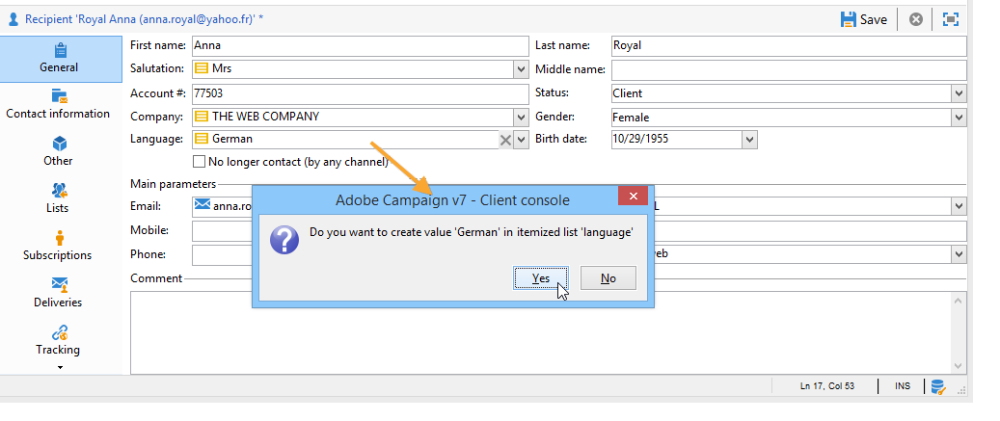
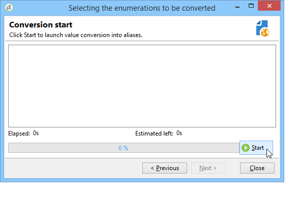
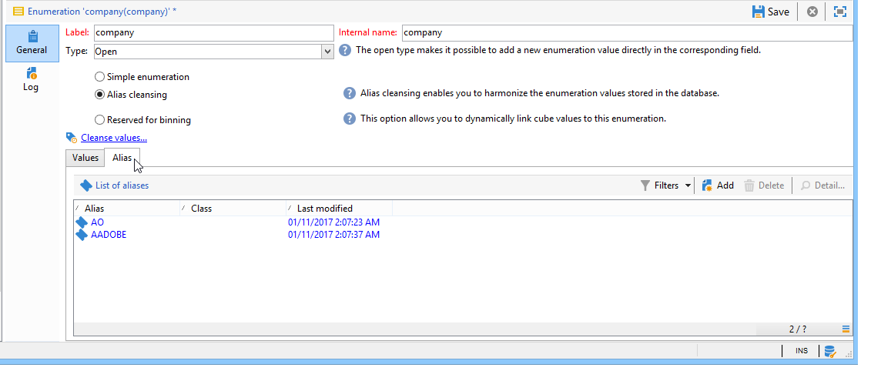

# Hantera uppräkningar{#managing-enumerations}

## Om uppräkningar {#about-enumerations}

En uppräkning (kallas även&quot;lista med specificerade värden&quot;) är en lista med värden som föreslås av systemet för att fylla i vissa fält. Med uppräkningar kan du standardisera värdena för dessa fält och hjälpa till med inmatning eller användning av data i frågor.

Värdelistan visas som en nedrullningsbar lista där du kan välja vilket värde som ska anges i fältet. Listrutan möjliggör även prediktiv inmatning, där operatorn anger de första bokstäverna och programmet fyller i resten.

Vissa konsolfält har definierats med den här typen av uppräkningar. Uppräkningar kallas&quot;öppna&quot; om du kan lägga till värden genom direktinmatning i motsvarande fält.

## Åtkomst till värden {#access-to-values}

Värdena för den här typen av fält definieras och den övergripande administrationen av dessa fält (genom att lägga till/ta bort ett värde) utförs via trädnoden **[!UICONTROL Administration > Platform > Enumerations]** .

* I det övre avsnittet finns en lista med fält för vilka en specificerad lista har definierats.
* I det nedre avsnittet visas de föreslagna värdena. Dessa värden upprepas i redigerarna som använder det här fältet.

   

   Om du vill skapa ett nytt uppräkningsvärde klickar du på **[!UICONTROL Add]**.

   

   Om alternativet är markerat kan användaren lägga till ett nytt specificerat listvärde direkt i motsvarande fält. **[!UICONTROL Open]** Ett bekräftelsemeddelande låter dig skapa det här värdet.

   

* Om du väljer det här **[!UICONTROL Closed]** alternativet kan användarna inte skapa nya värden, utan bara välja bland de tillgängliga värdena.

## Standardisera data {#standardizing-data}

### Om aliasrensning {#about-alias-cleansing}

I de specificerade listfälten kan du ange andra värden än uppräkningsvärden. Dessa kan antingen lagras som de är eller rensas.

>[!CAUTION]
>
>Datarensning är en kritisk process som påverkar data i databasen. Adobe Campaign genomför massuppdateringar, vilket kan leda till att vissa värden tas bort. Den här åtgärden är därför reserverad för expertanvändare.

Det angivna värdet är då antingen:

* Tillagt i de specificerade listvärdena: i det här fallet måste **[!UICONTROL Open]** alternativet väljas,
* eller ersätts automatiskt av motsvarande alias: I det här fallet måste det definieras på fliken **[!UICONTROL Alias]** i den specificerade listan.
* eller lagras i listan över alias: ett alias som kan tilldelas det senare.

   >[!NOTE]
   >
   >Om du behöver använda datarensningsfunktionerna väljer du **[!UICONTROL Alias cleansing]** alternativet i den specificerade listan.

### Använda alias {#using-aliases}

Med det här alternativet **[!UICONTROL Alias cleansing]** kan du använda alias för den valda specificerade listan. När det här alternativet är markerat visas **[!UICONTROL Alias]** fliken längst ned i fönstret.

#### Skapa ett alias {#creating-an-alias}

Om du vill skapa ett alias klickar du på **[!UICONTROL Add]**.

Ange det alias som du vill konvertera och det värde som ska användas och klicka på **[!UICONTROL Ok]**.

Kontrollera parametrarna innan du bekräftar åtgärden.

>[!CAUTION]
>
>När det här steget har bekräftats kan de tidigare angivna värdena inte återställas: de har ersatts.

När en användare anger värdet **NEILSEN** i ett&quot;företag&quot;-fält (i Adobe Campaign-konsolen eller i en form) ersätts det automatiskt av värdet **NIELSEN Ltd**. Värdersättning utförs av **aliasrensningsarbetsflödet** . Se [Rensning](#running-data-cleansing)av data.

#### Konvertera värden till alias {#converting-values-into-aliases}

Om du vill konvertera ett uppräkningsvärde till ett alias högerklickar du i listan med värden och väljer **[!UICONTROL Convert values into aliases...]**.

Välj de värden som du vill konvertera och klicka på **[!UICONTROL Next]**.

Klicka **[!UICONTROL Start]** för att köra konverteringen.

När körningen är klar läggs aliaset till i listan över alias.

#### Hämtar aliasträffar {#retrieving-alias-hits}

De värden som anges av användarna kan konverteras till alias. När användaren anger ett värde som inte finns med i den specificerade listan, lagras värdet på **[!UICONTROL Alias]** fliken.

Med **Alias rensar** du det tekniska arbetsflödet återställs dessa värden varje kväll för att uppdatera den specificerade listan. Se [Köra datarensning](#running-data-cleansing)

Om det behövs kan kolumnen visa hur många gånger det här värdet har angetts **[!UICONTROL Hits]** . Det kan ta både tid och minne att beräkna det här värdet. Mer information finns i [Beräkna anmälningsförekomster](#calculating-entry-occurrences).

### Datarensning körs {#running-data-cleansing}

Datarensning utförs i det **[!UICONTROL Alias cleansing]** tekniska arbetsflödet. De konfigurationer som definieras för uppräkningar tillämpas under körningen. Se [rensningsarbetsflödet](#alias-cleansing-workflow)för Alias.

Rensningen kan aktiveras via **[!UICONTROL Cleanse values...]** länken.

Med hjälp av **[!UICONTROL Advanced parameters...]** länken kan du ange vilket datum som ska börja när insamlade värden ska tas med i beräkningen.

Klicka på **[!UICONTROL Start]** knappen för att köra datarensning.

#### Beräknar anmälningsförekomster {#calculating-entry-occurrences}

På **[!UICONTROL Alias]** underfliken till en specificerad lista kan antalet förekomster av ett alias visas bland alla värden som anges. Den här informationen är en uppskattning och kommer att visas i **[!UICONTROL Hits]** kolumnen.

>[!CAUTION]
>
>Det kan ta lång tid att beräkna aliaspostförekomster. Därför bör försiktighet iakttas när den här funktionen används.

Du kan köra träffberäkning manuellt via **[!UICONTROL Cleanse values...]** länken. Om du vill göra det klickar du på **[!UICONTROL Advanced parameters...]** länken och väljer önskade alternativ.

* **[!UICONTROL Update the number of alias hits]**: gör att du kan uppdatera träffar som redan har beräknats, baserat på det angivna datumet.
* **[!UICONTROL Recalculate the number of alias hits from the start]**: gör att du kan köra beräkningar på hela Adobe Campaign-plattformen.

Du kan också skapa ett dedikerat arbetsflöde så att beräkningen körs automatiskt för en viss period, till exempel en gång i veckan.

Det gör du genom att skapa en kopia av **[!UICONTROL Alias cleansing]** arbetsflödet, ändra schemaläggaren och använda följande inställningar i **[!UICONTROL Enumeration value cleansing]** aktiviteten:

* **-updateHits** för att uppdatera antalet aliasträffar,
* **-updateHits:full** för att beräkna om alla aliasträffar.

#### Rensningsarbetsflöde för alias {#alias-cleansing-workflow}

Arbetsflödet för **aliasrensning** kör uppräkningsvärderensning. Som standard utförs den dagligen.

Den nås via **[!UICONTROL Administration > Production > Technical workflows]** noden.

