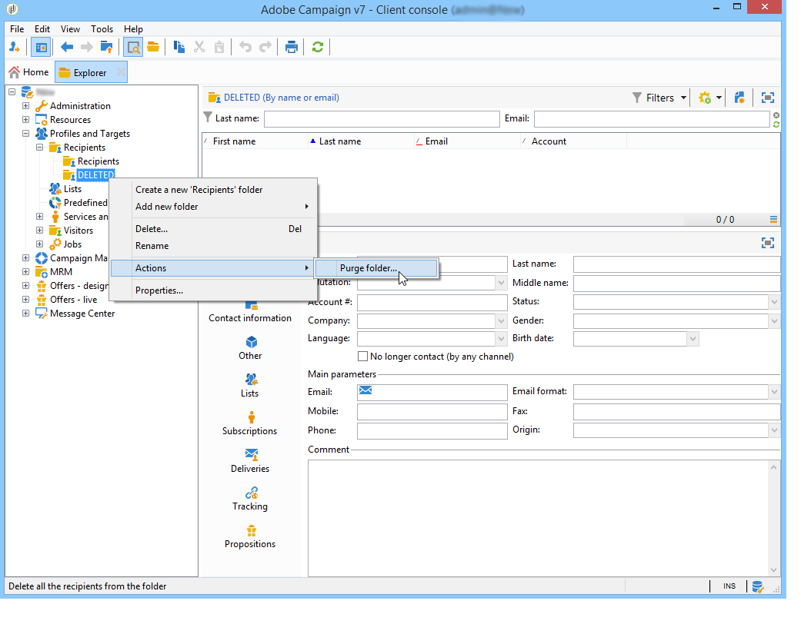

# Hantera profiler{#managing-profiles}

## Mottagarträd {#recipient-tree}

För att få tillgång till de avancerade funktionerna för mottagarhantering måste du redigera Adobe Campaign-trädet. Det gör du genom att klicka på **[!UICONTROL Explorer]** knappen i verktygsfältet.

Som standard lagras mottagarna i noden **[!UICONTROL Profiles and targets]** i Adobe Campaign-trädet. Från samma nod kan du skapa en eller flera mappar och undermappar för att lagra mottagarprofiler.

Varje nod sammanfaller med en mapp. Data från varje mapp måste anses vara partitionerade från varandra. Det innebär att hanteringen av dubbletter blir svårare för flera mottagarmappar.

>[!NOTE]
>
>Om du vill visa listan över alla mottagare i databasen måste du skapa en vy. Se [Mappar och vyer](../../platform/using/access-management.md#folders-and-views).

## Flytta mottagare {#moving-recipients}

Du kan markera en eller flera mottagare, dra dem från mottagarlistan och släppa dem i önskad mapp. Ett varningsmeddelande ber dig bekräfta den här åtgärden.

## Kopiera en mottagare {#copying-a-recipient}

Du kan kopiera en mottagare i samma mapp genom att högerklicka på önskad mottagare och välja **[!UICONTROL Copy]**.

## Tar bort mottagare {#deleting-recipients}

Om du vill ta bort mottagare flyttar du dem till en viss mapp och tömmer sedan innehållet i den här mappen. Vi rekommenderar **starkt att du inte använder** **[!UICONTROL Delete]** alternativet i detta fall.

Om du vill rensa en mapp använder du **[!UICONTROL Actions > Purge folder]** menyn som du kommer åt genom att högerklicka på önskad mapp.

Klicka **[!UICONTROL Start]** för att starta åtgärden. I fönstrets mellersta del visas förloppsstatusen enligt nedan:

