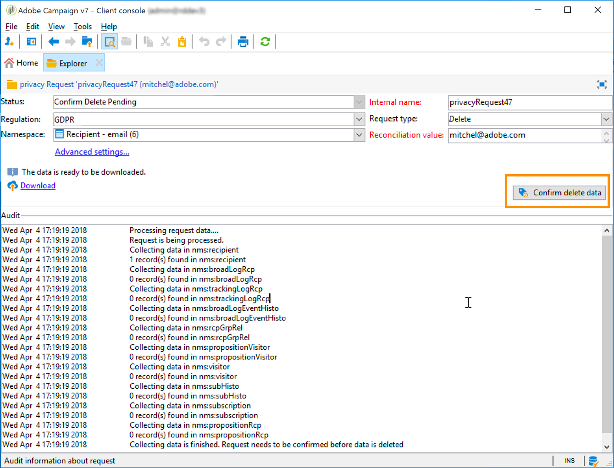
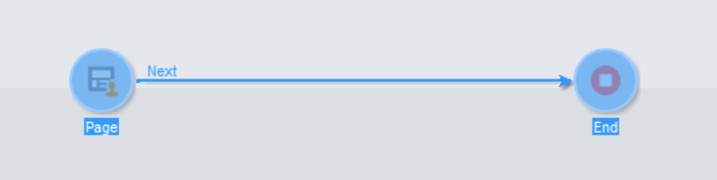

# Skapa och hantera förfrågningar om användarens information {#privacy-request-ui}


I det här avsnittet beskrivs hur du kan skapa förfrågningar om åtkomst och radering, samt hur de bearbetas av Adobe Campaign.

## Skapa en förfrågan om användarens information {#create-privacy-request-ui}

Med **Adobe Campaign-gränssnittet** kan du skapa dina förfrågningar om användarens information och spåra deras utveckling. Följ de här anvisningarna för att skapa en ny förfrågan om användarens information:

1. Gå till mappen Privacy request under **[!UICONTROL Administration]** > **[!UICONTROL Platform]** > **[!UICONTROL Privacy Requests]**.

   

1. På den här skärmen kan du visa alla aktuella förfrågningar om användarens information och deras status och loggar. Klicka på **[!UICONTROL New]** för att skapa en förfrågan om användarens information.

   

1. Markera **[!UICONTROL Regulation]** (GDPR, CCPA, PDPA eller LGPD), **[!UICONTROL Request type]** (Access eller Delete), välj en **[!UICONTROL Namespace]** och ange **[!UICONTROL Reconciliation value]**. Om du använder e-postadresser som namnutrymme anger du den registrerades e-postadress.

   

De tekniska arbetsflödena för sekretess körs en gång om dagen och behandlar alla nya förfrågningar:

* Raderingsförfrågan: mottagarens data som lagras i Adobe Campaign raderas.
* Åtkomstförfrågan: mottagarens data som lagras i Adobe Campaign genereras och görs tillgängliga som en XML-fil till vänster på skärmen.


## Lista över tabeller {#list-of-tables}

När en förfrågan om radering eller åtkomst till användarens information utförs söker Adobe Campaign igenom alla den registrerades data baserat på **[!UICONTROL Reconciliation value]** i alla tabeller som har en länk till mottagartabellen (egen typ).

Här följer en lista över färdiga tabeller som tas i beaktande när förfrågningar om användarens information utförs:

* Mottagare (recipient)
* Logg över mottagarleverans (broadLogRcp)
* Logg över mottagarspårning (trackingLogRcp)
* Arkiverad logg över händelseleverans (broadLogEventHistory)
* Innehåll i mottagarlista (rcpGrpRel)
* Erbjudandeförslag för besökare (propositionVisitor)
* Besökare (visitor)
* Prenumerationshistorik (subHisto)
* Prenumerationer (subscription)
* Erbjudandeförslag för mottagare (propositionRcp)

Om du har skapat anpassade tabeller som har en länk till mottagartabellen (egen typ) beaktas även de. Om du till exempel har en transaktionstabell länkad till mottagartabellen och en transaktionsinformationstabell länkad till transaktionstabellen beaktas båda.

>[!IMPORTANT]
>
>Om du utför batchförfrågningar om användarens information med arbetsflöden för profilradering bör du tänka på följande:
>* Radering av profiler via arbetsflöden bearbetar inte underordnade tabeller.
>* Du måste hantera raderingen för alla underordnade tabeller.
>* Adobe rekommenderar att du skapar ett ETL-arbetsflöde som lägger till de rader som ska tas bort i tabellen för sekretessåtkomst och låter arbetsflödet **[!UICONTROL Delete privacy requests data]** utföra raderingen. Vi rekommenderar att du av prestandaskäl begränsar dig till att radera 200 profiler per dag.

## Status gällande förfrågningar om användarens information {#privacy-request-statuses}

Här följer de olika statusarna gällande förfrågningar om användarens information:

* **[!UICONTROL New]**/**[!UICONTROL Retry pending]**: arbetsflödet har inte bearbetat förfrågan ännu.
* **[!UICONTROL Processing]**/**[!UICONTROL Retry in progress]**: arbetsflödet bearbetar förfrågan.
* **[!UICONTROL Delete pending]**: arbetsflödet har identifierat alla mottagardata för borttagning.
* **[!UICONTROL Delete in progress]**: arbetsflödet bearbetar borttagningen.
* **[!UICONTROL Delete Confirmation Pending]** (raderingsförfrågan i processläge med två steg): arbetsflödet har bearbetat åtkomstförfrågan. Manuell bekräftelse krävs för att utföra raderingen. Knappen är tillgänglig i 15 dagar.
* **[!UICONTROL Complete]**: behandlingen av förfrågan har slutförts utan fel.
* **[!UICONTROL Error]**: arbetsflödet har påträffat ett fel. Orsaken visas i listan över förfrågningar om användarens information i kolumnen **[!UICONTROL Request status]**. Till exempel innebär **[!UICONTROL Error data not found]** att inga mottagardata som matchar den registrerades **[!UICONTROL Reconciliation value]** har hittats i databasen.

## 2-stegsprocess {#two-step-process}

Som standard är **tvåstegsprocessen** aktiverad. När du skapar en ny raderingsförfrågan i det här läget utförs alltid en åtkomstförfrågan först i Adobe Campaign. På så sätt kan du kontrollera data innan du bekräftar raderingen.

Du kan ändra det här läget från skärmen om förfrågan om användarens information. Klicka på **[!UICONTROL Advanced settings]**.


När 2-stegsläget är aktiverat ändras statusen för en ny raderingsförfrågan till **[!UICONTROL Confirm Delete Pending]**. Hämta den genererade XML-filen från skärmen om förfrågan om användarens information och kontrollera datan. Bekräfta att du vill radera data genom att klicka på knappen **[!UICONTROL Confirm delete data]**.



## JSSP-URL {#jspp-url}

När åtkomstförfrågningar behandlas genererar Adobe Campaign en JSSP som hämtar mottagarens data från databasen och exporterar dem till en XML-fil som lagras på den lokala datorn. JSSP-URL:en definieras så här:

```
"$(serverUrl)+'/nms/gdpr.jssp?id='+@id"
```

där @id är ID:et för förfrågan om användarens information.

Den här URL:en lagras i fältet **[!UICONTROL "File location" (@urlFile)]** i schemat **[!UICONTROL Privacy Requests (gdprRequest)]**.

Informationen är tillgänglig i databasen i 90 dagar. När förfrågan har rensats bort av det tekniska arbetsflödet tas informationen bort från databasen och URL:en blir inaktuell. Kontrollera att URL:en fortfarande är giltig innan du hämtar data från en webbplats.

Här är ett exempel på en registrerad persons datafil:


Personuppgiftsansvariga kan enkelt skapa en webbapplikation med motsvarande JSSP-URL för att göra den registrerades datafil tillgänglig från en webbplats.


Här är ett kodfragment som du kan använda som exempel i webbapplikationsaktiviteten **[!UICONTROL Page]**.



```
<!DOCTYPE html PUBLIC "-//W3C//DTD XHTML 1.0 Transitional//EN" "http://www.w3.org/TR/xhtml1/DTD/xhtml1-transitional.dtd"> <html xmlns="http://www.w3.org/1999/xhtml"> <head> <meta http-equiv="Content-Language" content="en"> <meta http-equiv="Content-Type" content="text/html; charset=utf-8" /> <link rel="stylesheet" type="text/css" href="/nl/webForms/landingPage.css"/> <title>Clickthrough</title> <style type="text/css" media="all"> /* override formulary area */ .formulary { top: 200px; position: absolute; left: 0; } </style> </head> <body style="" class="">
<center>
<div id="wrap">
<div id="header">
<div class="header-title center-title">DOWNLOAD GDPR DATA</div>
<div class="formulary center-formulary"><form>
<div class="button large-button"><a href=[SERVER_URL]/nms/gdpr.jssp?id=13000" data-nl-type="externalLink">CLICK TO DOWNLOAD</a></div>
</form></div>
</div>
<div id="content">
<div class="row">
<div class="info">
<div class="desc">
<div class="title">EFFICIENCY</div>
<div class="desc">Our service is guaranteed to improve your efficiency. Increase performance and use our high-technology service to implement even the most ambitious of projects.</div>
</div>
</div>
</div>
</div>
<div id="footer">
<div style="text-align: center;">
<div style="float: left;"><a href="#">Contact us</a></div>
<div style="float: right;">&copy; Copyrights</div>
<div><a href="#"></a> <a href="#"></a> <a href="#"></a> <a href="#"></a></div>
</div>
</div>
</div>
</center>
</body> </html>
```

Eftersom åtkomsten till den registrerades datafil är begränsad måste anonym åtkomst till webbplatsen inaktiveras. Det är bara operatören med den namngivna behörigheten **[!UICONTROL Privacy Data Right]** som kan logga in på sidan och hämta data.
