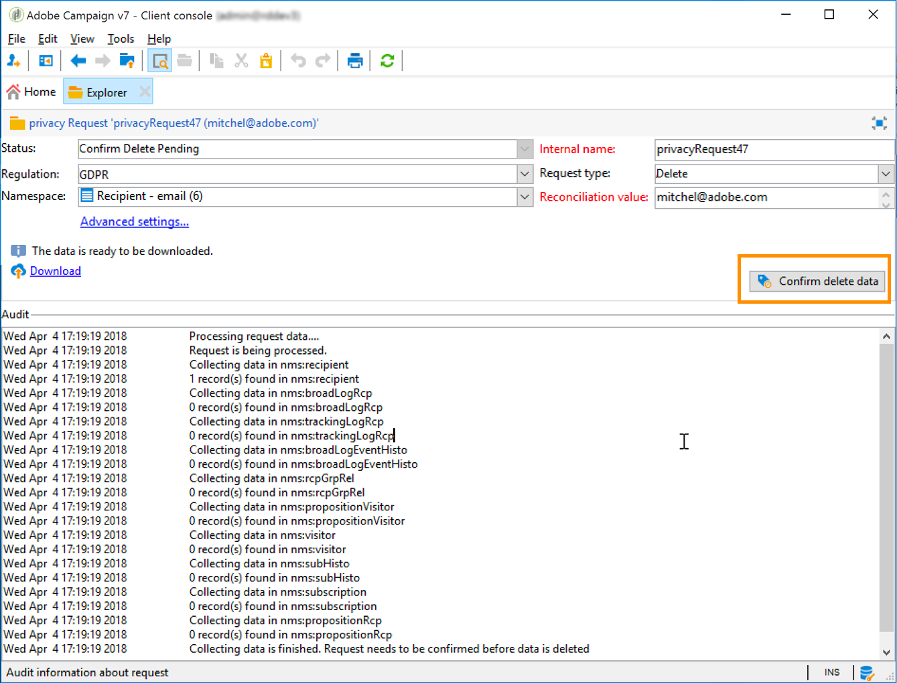
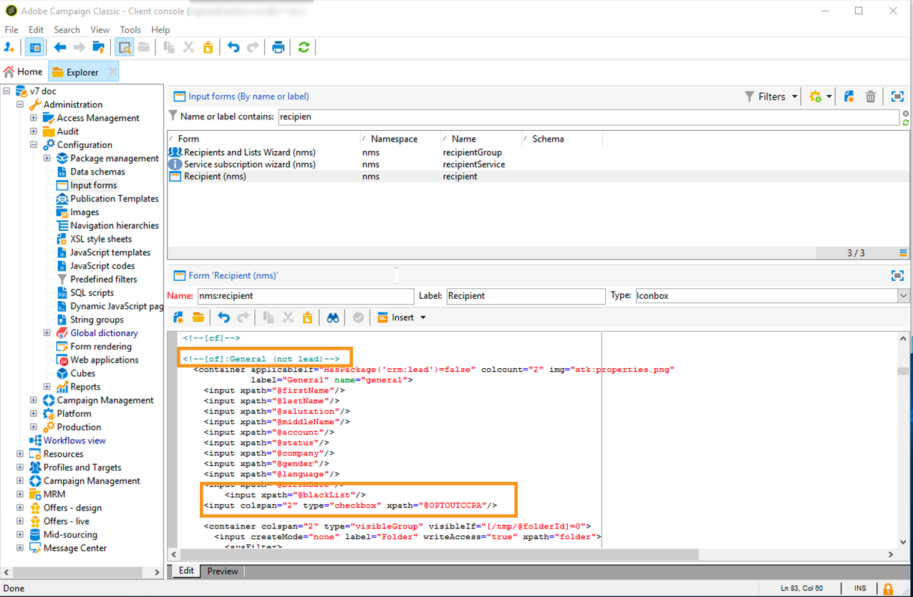

# Hantera förfrågningar om användarens information {#privacy-requests}


Se [det här avsnittet](../../platform/using/privacy-management.md) för en allmän presentation om sekretesshantering.

Denna information gäller för GDPR, CCPA, PDPA och LGPD. Se [det här avsnittet](../../platform/using/privacy-management.md#privacy-management-regulations) för mer information om dessa regelverk.

[Det här avsnittet](#sale-of-personal-information-ccpa) förklarar avanmälan till försäljning av personuppgifter vilken är specifik för CCPA.

<!--Installation procedures described in this document are applicable starting Campaign Classic 18.4 (build 8931+). If you are running on a previous version, refer to this [technote](https://helpx.adobe.com/campaign/kb/how-to-install-gdpr-package-on-legacy-versions.html).-->

## Om förfrågningar om användarens information {#about-privacy-requests}

För att underlätta beredskapen gällande din integritet kan du hantera förfrågningar om åtkomst och borttagning med Adobe Campaign. **Det här avsnittet** beskriver **åtkomsträttigheter** och [rätten att glömmas](../../platform/using/privacy-management.md#right-access-forgotten) (borttagningsbegäran).

Låt oss se hur du kan skapa förfrågningar om åtkomst och radering, samt hur de behandlas i Adobe Campaign.

### Principer {#privacy-principles}

Adobe Campaign erbjuder personuppgiftsansvariga två möjligheter att utföra förfrågningar om åtkomst till eller radering av användarens information:

* Via **Adobe Campaign-gränssnittet**: För varje förfrågan om användarens information skapar den personuppgiftsansvariga en ny förfrågan om användaren information i Adobe Campaign. Se [det här avsnittet](#create-privacy-request-ui).
* Via **API:et**: Adobe Campaign tillhandahåller ett API som tillåter automatisk behandling av förfrågningar om användarens information med SOAP. Se [det här avsnittet](#automatic-privacy-request-api).

>[!NOTE]
>
>Mer information om personuppgifter och de olika enheter som hanterar data (personuppgiftsansvarig, personuppgiftsbiträde och registrerad) finns i [Personuppgifter och personer](../../platform/using/privacy-and-recommendations.md#personal-data).

### Förhandskrav {#prerequesites}

Adobe Campaign erbjuder verktyg för personuppgiftsansvarig som låter dig skapa och bearbeta förfrågningar om användarens information gällande data som lagras i Adobe Campaign. Det är dock den personuppgiftsansvariges ansvar att hantera relationen med den registrerade (e-post, kundtjänst eller en webbportal).

Det är därför ditt ansvar som personuppgiftsansvarig att bekräfta identiteten på den registrerade som gör förfrågan och bekräfta att de uppgifter som skickas tillbaka till den som utförde förfrågan avser den registrerade.

### Installera sekretesspaketet {#install-privacy-package}

Om du vill använda den här funktionen måste du installera **[!UICONTROL Privacy Data Protection Regulation]**-paketet via menyn **[!UICONTROL Tools]** > **[!UICONTROL Advanced]** > **[!UICONTROL Import package]** > **[!UICONTROL Adobe Campaign Package]**. Mer information om hur du installerar paket finns i den [detaljerade dokumentationen](../../installation/using/installing-campaign-standard-packages.md).

Två nya mappar, som är specifika för sekretess, skapas under **[!UICONTROL Administration]** > **[!UICONTROL Platform]**:

* **[!UICONTROL Privacy Requests]**: Här skapar du dina förfrågningar om användarens information och följer deras utveckling.
* **[!UICONTROL Namespaces]**: Här definierar du fältet som används för att identifiera den registrerade i databasen i Adobe Campaign.


I **[!UICONTROL Administration]** > **[!UICONTROL Production]** > **[!UICONTROL Technical workflows]** körs tre tekniska arbetsflöden varje dag för att behandla förfrågningar om användarens information.


* **[!UICONTROL Collect privacy requests]**: Det här arbetsflödet genererar mottagarens data som lagras i Adobe Campaign och gör dem tillgängliga att hämta på skärmen om förfrågan om användarens information.
* **[!UICONTROL Delete privacy requests data]**: Det här arbetsflödet tar bort mottagarens data som lagras i Adobe Campaign.
* **[!UICONTROL Privacy request cleanup]**: Det här arbetsflödet raderar de filer för åtkomstförfrågan som är äldre än 90 dagar.

Den namngivna rättigheten **[!UICONTROL Privacy Data Right]** har lagts till i **[!UICONTROL Administration]** > **[!UICONTROL Access Management]** > **[!UICONTROL Named rights]**. Den här namngivna rättigheten krävs för att personuppgiftsansvariga ska kunna använda sekretessverktyg. På så sätt kan de skapa nya förfrågningar, spåra deras utveckling, använda API:et, osv.


### Namnrymder {#namesspaces}

Innan du skapar förfrågningar om användarens information måste du definiera det namnutrymme som ska användas. Det här är nyckeln som används för att identifiera den registrerade i databasen i Adobe Campaign.

Tre namnutrymmen är tillgängliga direkt: e-post, telefon och mobiltelefon. Om du behöver ett annat namnutrymme (till exempel ett anpassat mottagarfält) kan du skapa ett nytt från **[!UICONTROL Administration]** > **[!UICONTROL Platform]** > **[!UICONTROL Namespaces]**.

>[!NOTE]
>
>För att få bästa möjliga prestanda bör du använda färdiga namnutrymmen.

## Skapa en förfrågan om användarens information {#create-privacy-request-ui}

Med **Adobe Campaign-gränssnittet** kan du skapa dina förfrågningar om användarens information och spåra deras utveckling. Följ de här anvisningarna för att skapa en ny förfrågan om användarens information:

1. Gå till mappen Privacy request under **[!UICONTROL Administration]** > **[!UICONTROL Platform]** > **[!UICONTROL Privacy Requests]**.

   

1. På den här skärmen kan du visa alla aktuella förfrågningar om användarens information och deras status och loggar. Klicka på **[!UICONTROL New]** för att skapa en förfrågan om användarens information.

   

1. Markera **[!UICONTROL Regulation]** (GDPR, CCPA, PDPA eller LGPD), **[!UICONTROL Request type]** (Access eller Delete), välj en **[!UICONTROL Namespace]** och ange **[!UICONTROL Reconciliation value]**. Om du använder e-postadresser som namnutrymme anger du den registrerades e-postadress.

   

De tekniska arbetsflödena för sekretess körs en gång om dagen och behandlar alla nya förfrågningar:

* Raderingsförfrågan: mottagarens data som lagras i Adobe Campaign raderas.
* Åtkomstförfrågan: mottagarens data som lagras i Adobe Campaign genereras och görs tillgängliga som en XML-fil till vänster på skärmen.


### Lista över tabeller {#list-of-tables}

När en förfrågan om radering eller åtkomst till användarens information utförs söker Adobe Campaign igenom alla den registrerades data baserat på **[!UICONTROL Reconciliation value]** i alla tabeller som har en länk till mottagartabellen (egen typ).

Här följer en lista över färdiga tabeller som tas i beaktande när förfrågningar om användarens information utförs:

* Mottagare (recipient)
* Logg över mottagarleverans (broadLogRcp)
* Logg över mottagarspårning (trackingLogRcp)
* Arkiverad logg över händelseleverans (broadLogEventHistory)
* Innehåll i mottagarlista (rcpGrpRel)
* Erbjudandeförslag för besökare (propositionVisitor)
* Besökare (visitor)
* Prenumerationshistorik (subHisto)
* Prenumerationer (subscription)
* Erbjudandeförslag för mottagare (propositionRcp)

Om du har skapat anpassade tabeller som har en länk till mottagartabellen (egen typ) beaktas även de. Om du till exempel har en transaktionstabell länkad till mottagartabellen och en transaktionsinformationstabell länkad till transaktionstabellen beaktas båda.

>[!IMPORTANT]
>
>Om du utför batchförfrågningar om användarens information med arbetsflöden för profilradering bör du tänka på följande:
>* Radering av profiler via arbetsflöden bearbetar inte underordnade tabeller.
>* Du måste hantera raderingen för alla underordnade tabeller.
>* Adobe rekommenderar att du skapar ett ETL-arbetsflöde som lägger till de rader som ska tas bort i tabellen för sekretessåtkomst och låter arbetsflödet **[!UICONTROL Delete privacy requests data]** utföra raderingen. Vi rekommenderar att du av prestandaskäl begränsar dig till att radera 200 profiler per dag.


### Status gällande förfrågningar om användarens information {#privacy-request-statuses}

Här följer de olika statusarna gällande förfrågningar om användarens information:

* **[!UICONTROL New]**/**[!UICONTROL Retry pending]**: arbetsflödet har inte bearbetat förfrågan ännu.
* **[!UICONTROL Processing]**/**[!UICONTROL Retry in progress]**: arbetsflödet bearbetar förfrågan.
* **[!UICONTROL Delete pending]**: arbetsflödet har identifierat alla mottagardata för borttagning.
* **[!UICONTROL Delete in progress]**: arbetsflödet bearbetar borttagningen.
* **[!UICONTROL Delete Confirmation Pending]** (raderingsförfrågan i processläge med två steg): arbetsflödet har bearbetat åtkomstförfrågan. Manuell bekräftelse krävs för att utföra raderingen. Knappen är tillgänglig i 15 dagar.
* **[!UICONTROL Complete]**: behandlingen av förfrågan har slutförts utan fel.
* **[!UICONTROL Error]**: arbetsflödet har påträffat ett fel. Orsaken visas i listan över förfrågningar om användarens information i kolumnen **[!UICONTROL Request status]**. Till exempel innebär **[!UICONTROL Error data not found]** att inga mottagardata som matchar den registrerades **[!UICONTROL Reconciliation value]** har hittats i databasen.

### 2-stegsprocess {#two-step-process}

Som standard är **tvåstegsprocessen** aktiverad. När du skapar en ny raderingsförfrågan i det här läget utförs alltid en åtkomstförfrågan först i Adobe Campaign. På så sätt kan du kontrollera data innan du bekräftar raderingen.

Du kan ändra det här läget från skärmen om förfrågan om användarens information. Klicka på **[!UICONTROL Advanced settings]**.


När 2-stegsläget är aktiverat ändras statusen för en ny raderingsförfrågan till **[!UICONTROL Confirm Delete Pending]**. Hämta den genererade XML-filen från skärmen om förfrågan om användarens information och kontrollera datan. Bekräfta att du vill radera data genom att klicka på knappen **[!UICONTROL Confirm delete data]**.



### JSSP-URL {#jspp-url}

När åtkomstförfrågningar behandlas genererar Adobe Campaign en JSSP som hämtar mottagarens data från databasen och exporterar dem till en XML-fil som lagras på den lokala datorn. JSSP-URL:en definieras så här:

```
"$(serverUrl)+'/nms/gdpr.jssp?id='+@id"
```

där @id är ID:et för förfrågan om användarens information.

Den här URL:en lagras i fältet **[!UICONTROL "File location" (@urlFile)]** i schemat **[!UICONTROL Privacy Requests (gdprRequest)]**.

Informationen är tillgänglig i databasen i 90 dagar. När förfrågan har rensats bort av det tekniska arbetsflödet tas informationen bort från databasen och URL:en blir inaktuell. Kontrollera att URL:en fortfarande är giltig innan du hämtar data från en webbplats.

Här är ett exempel på en registrerad persons datafil:


Personuppgiftsansvariga kan enkelt skapa en webbapplikation med motsvarande JSSP-URL för att göra den registrerades datafil tillgänglig från en webbplats.


Här är ett kodfragment som du kan använda som exempel i webbapplikationsaktiviteten **[!UICONTROL Page]**.


```
<!DOCTYPE html PUBLIC "-//W3C//DTD XHTML 1.0 Transitional//EN" "http://www.w3.org/TR/xhtml1/DTD/xhtml1-transitional.dtd"> <html xmlns="http://www.w3.org/1999/xhtml"> <head> <meta http-equiv="Content-Language" content="en"> <meta http-equiv="Content-Type" content="text/html; charset=utf-8" /> <link rel="stylesheet" type="text/css" href="/nl/webForms/landingPage.css"/> <title>Clickthrough</title> <style type="text/css" media="all"> /* override formulary area */ .formulary { top: 200px; position: absolute; left: 0; } </style> </head> <body style="" class="">
<center>
<div id="wrap">
<div id="header">
<div class="header-title center-title">DOWNLOAD GDPR DATA</div>
<div class="formulary center-formulary"><form>
<div class="button large-button"><a href=[SERVER_URL]/nms/gdpr.jssp?id=13000" data-nl-type="externalLink">CLICK TO DOWNLOAD</a></div>
</form></div>
</div>
<div id="content">
<div class="row">
<div class="info">
<div class="desc">
<div class="title">EFFICIENCY</div>
<div class="desc">Our service is guaranteed to improve your efficiency. Increase performance and use our high-technology service to implement even the most ambitious of projects.</div>
</div>
</div>
</div>
</div>
<div id="footer">
<div style="text-align: center;">
<div style="float: left;"><a href="#">Contact us</a></div>
<div style="float: right;">&copy; Copyrights</div>
<div><a href="#"></a> <a href="#"></a> <a href="#"></a> <a href="#"></a></div>
</div>
</div>
</div>
</center>
</body> </html>
```

Eftersom åtkomsten till den registrerades datafil är begränsad måste anonym åtkomst till webbplatsen inaktiveras. Det är bara operatören med den namngivna behörigheten **[!UICONTROL Privacy Data Right]** som kan logga in på sidan och hämta data.

## Automatisk process med förfrågan om användarens information {#automatic-privacy-request-api}

Adobe Campaign tillhandahåller ett **API** som gör att du kan konfigurera en automatisk process för förfrågningar om användarens information.

Med API:et är den allmänna sekretessprocessen densamma som när du [använder gränssnittet](#create-privacy-request-ui). Den enda skillnaden är hur förfrågan om användarens information skapas. I stället för att skapa förfrågan i Adobe Campaign skickas en POST med förfrågningsinformationen till Campaign. För varje förfrågan läggs en ny post till på skärmen **[!UICONTROL Privacy Requests]**. De tekniska arbetsflödena för sekretess behandlar sedan förfrågan på samma sätt som en förfrågan som läggs till via gränssnittet.

Om du använder API:et för att skicka in förfrågningar om användarens information rekommenderar vi att du låter **tvåstegsprocessen** vara aktiverad för de första raderingsförfrågningarna för att testa returnerade data. När testerna är klara kan du inaktivera tvåstegsprocessen så att processen för raderingsförfrågan kan köras automatiskt.

JS-API:t **[!UICONTROL CreateRequestByName]** definieras så här.

>[!NOTE]
>
>Om du använde API:et **gdprRequest** kan du fortfarande använda det, men vi rekommenderar att du använder det nya API:et **privacyRequest**.

>[!IMPORTANT]
>
>Den namngivna behörigheten **[!UICONTROL Privacy Data Right]** krävs för att använda API:et.

```
<method library="nms:gdpr.js" name="CreateRequestByName" static="true">
 <help>Create a new GDPR Request using namespace internal name</help>
 <parameters>
  <param name="namespaceName" type="string" desc="Namespace internal name"/>
  <param name="reconciliationValue" type="string" desc="Reconciliation value"/>
  <param name="type" type="long" desc="Reconciliation value"/>
  <param name="confirmDeletePending" type="boolean" desc="Request confirm before deleting data"/>
  <param name="regulation" type="long" desc="regulation of newly created request"/>
  <param name="id" type="long" inout="out" desc="ID of newly created request"/>
 </parameters>
</method>
```

>[!NOTE]
>
>Fältet ”regulation” är bara tillgängligt om du använder Campaign Classic 20.2 (build 9178+).
>
>Om du migrerar till 20.2 och om du redan använde API:et måste du lägga till fältet ”regulation” enligt ovan. Om du använder en tidigare build kan du fortsätta att använda API:et utan fältet ”regulation”.

### Anropa API:et externt {#invoking-api-externally}

Här är ett exempel på hur du kan anropa API:et externt (specifikt autentisering via API:et och information om sekretess-API:et). Mer information om sekretess-API:et finns i [API-dokumentationen](https://experienceleague.adobe.com/developer/campaign-api/api/s-nms-privacyRequest.html?lang=sv). Du kan även läsa [dokumentationen om webbtjänstanrop](../../configuration/using/web-service-calls.md).

Först och främst måste du utföra autentiseringen via API:et:

1. Hämta WSDL för **xtk:session** via den här webbadressen: **`<server url>`/nl/jsp/schemawsdl.jsp?schema=xtk:session**.

1. Använd metoden Logon och ange ett användarnamn och lösenord som parametrar i förfrågan. Du får ett svar som innehåller en sessionstoken. Här är ett exempel som använder SoapUI.

   

1. Använd den returnerade sessionstoken som autentisering för alla efterföljande API-anrop. Den går ut efter 24 timmar.

Anropa sedan sekretess-API:et:

1. Hämta WSDL från den här URL:en: **`<server url>`/nl/jsp/schemawsdl.jsp?schema=nms:privacyRequest**.

1. Använd **[!UICONTROL CreateRequestByName]** för att skapa en specifik förfrågan om användarens information.

   Här är ett exempel som använder **[!UICONTROL CreateRequestByName]**. Observera hur vi använder sessionstoken ovan som autentisering. Svaret är ID:et för den skapade förfrågan.

   

   Om du vill ha hjälp med att utföra stegen ovan bör du tänka på följande:

   * Du kan använda ett **queryDef**-schema på **nms:gdprRequest**-schemat för att kontrollera statusen på åtkomstförfrågan.
   * Du kan använda ett **queryDef**-schema på **nms:gdprRequestData**-schemat för att få resultatet av åtkomstförfrågan.
   * Om du vill kunna hämta XML-filen från **&quot;$(serverUrl)&#39;/nms/gdpr.jssp?id=&#39;@id&quot;**, måste du vara inloggad och komma åt den från en IP-adress som ingår i tillåtelselistan. Detta gör du genom att skapa ett webbprogram som ger dig åtkomst till filen som genereras av JSSP.

### Anropa API:et med JS {#invoking-api-from-js}

Här är ett exempel på hur du kan anropa API:et med JS i Campaign Classic.

>[!NOTE]
>
>Fältet ”regulation” är bara tillgängligt om du använder Campaign Classic 20.2 (build 9178+).
>
>Om du migrerar till 20.2 och om du redan använde API:et måste du lägga till fältet ”regulation”. Om du använder en tidigare build kan du fortsätta att använda API:et utan fältet ”regulation”.

* Om du **använder en tidigare build (med GDPR-paket)** kan du fortsätta använda API:et utan fältet ”regulation” enligt nedan:

   ```
   loadLibrary("nms:gdpr.js");
   /**************************** 
   This code calls an API to create new Privacy request on the DB.
   It requires 4 parameters below.
   Feel free to change parameter values.
   ****************************/
   // 1. Namespace internal name
   var namespaceName = "defaultNamespace1";
   // 2. Reconciliation value for privacy request
   var reconciliationValue = "example@adobe.com";
   // 3. Privacy request type
   // GDPR_REQUEST_TYPE_ACCESS = 1;
   // GDPR_REQUEST_TYPE_DELETE = 2;
   var requestType = GDPR_REQUEST_TYPE_ACCESS;
   // 4. Confirm deleting data required.
   // value : true or false
   var ConfirmDeletePending = true;
   // BEGIN
   var requestId = nms.privacyRequest.CreateRequestByName(namespaceName, reconciliationValue, requestType, ConfirmDeletePending);
   // User can use a simple queryDef with requestID as a parameter to check request status.
   ```

* Om du **migrerar till 20.2** och om du redan använder API:et måste du lägga till fältet ”regulation” enligt nedan:

   ```
   loadLibrary("nms:gdpr.js");
   /**************************** 
   This code calls an API to create new Privacy request on the DB.
   It requires 5 parameters below.
   Feel free to change parameter values.
   ****************************/
   // 1. Namespace internal name
   var namespaceName = "defaultNamespace1";
   // 2. Reconciliation value for privacy request
   var reconciliationValue = "example@adobe.com";
   // 3. Privacy request type
   // PRIVACY_REQUEST_TYPE_ACCESS = 1;
   // PRIVACY_REQUEST_TYPE_DELETE = 2;
   var requestType = PRIVACY_REQUEST_TYPE_ACCESS;
   // 4. Confirm deleting data required.
   // value : true or false
   var ConfirmDeletePending = true;
   // 5. Specify which regulation applies to newly created request. This is mandatory parameter.
   // GDPR = 1
   // CCPA = 2
   // PDPA = 3
   // LGPD = 4
   var regulation = 1;
   // BEGIN
   var requestId = nms.privacyRequest.CreateRequestByName(namespaceName, reconciliationValue, requestType, ConfirmDeletePending, regulation);
   // User can use a simple queryDef with requestID as a parameter to check request status.
   ```

* Om du använder **Campaign Classic 20.2 (build 9178+) eller senare** är fältet ”regulation” valfritt enligt nedan:

   ```
   loadLibrary("nms:gdpr.js");
   /**************************** 
   This code calls an API to create new Privacy request on the DB.
   It requires 5 parameters below.
   Feel free to change parameter values 
   ****************************/
   // 1. Namespace internal name
   var namespaceName = "defaultNamespace1";
   // 2. Reconciliation value for privacy request
   var reconciliationValue = "example@adobe.com";
   // 3. Privacy request type
   // PRIVACY_REQUEST_TYPE_ACCESS = 1;
   // PRIVACY_REQUEST_TYPE_DELETE = 2;
   var requestType = PRIVACY_REQUEST_TYPE_ACCESS;
   // 4. Confirm deleting data required.
   // value : true or false
   var ConfirmDeletePending = true;
   // 5. Specify which regulation applies to newly created request. This is optional parameter.
   // GDPR = 1
   // CCPA = 2
   // PDPA = 3
   // LGPD = 4
   var regulation = 1;
   // BEGIN
   var requestId = nms.privacyRequest.CreateRequestByName(namespaceName, reconciliationValue, requestType, ConfirmDeletePending, regulation);
   // User can use a simple queryDef with requestID as a parameter to check request status.
   ```

## Avanmäl dig till försäljning av personuppgifter (CCPA) {#sale-of-personal-information-ccpa}

**CCPA (California Consumer Privacy Act)** ger personer bosatta i Kalifornien nya rättigheter när det gäller deras personuppgifter och ålägger vissa företag som bedriver verksamhet i Kalifornien skyldigheter när det gäller uppgiftsskydd.

Konfigurationen och användningen av förfrågningar gällande åtkomst och borttagning är gemensamma för både GDPR och CCPA. Det här avsnittet presenterar avanmälan för försäljning av personuppgifter vilken är specifik för CCPA.

Förutom verktygen för [medgivandehantering](../../platform/using/privacy-management.md#consent-management) som finns i Adobe Campaign har du möjligheten att spåra om en konsument har avanmält sig till försäljning av personuppgifter.

Kontakter kan via ditt system bestämma att de inte tillåter att deras personuppgifter säljs till tredje part. I Adobe Campaign kan du lagra och spåra den här informationen.

För att det här ska fungera måste du utöka profiltabellen och lägga till ett **[!UICONTROL Opt-Out for CCPA]**-fält.

>[!IMPORTANT]
>
>Det är ditt ansvar som personuppgiftsansvarig att ta emot den registrerades förfrågan och att hålla reda på förfrågningsdatum för CCPA. Som teknikleverantör erbjuder vi bara ett sätt att avanmäla sig. Mer information om din roll som personuppgiftsansvarig finns i [Personuppgifter och personer](../../platform/using/privacy-and-recommendations.md#personal-data).

### Förutsättning {#ccpa-prerequisite}

För att kunna dra nytta av den här informationen måste du skapa det här fältet i Adobe Campaign Classic. För det här ska du lägga till ett booleskt fält i tabellen **[!UICONTROL Recipient]**. När ett nytt fält skapas stöds det automatiskt av API:et i Campaign.

Du måste också utföra den här åtgärden, om du använder en anpassad mottagartabell 

Mer detaljerad information om hur du skapar ett nytt fält finns i [schemadokumentationen](../../configuration/using/about-schema-edition.md).

>[!IMPORTANT]
>
>Att ändra schema är en känslig åtgärd som endast får utföras av expertanvändare.

1. Gå till **[!UICONTROL Tools]** > **[!UICONTROL Advanced]** > **[!UICONTROL Add new fields]**, välj **[!UICONTROL Recipients]** som **[!UICONTROL Document type]** och klicka på **[!UICONTROL Next]**. Mer information om hur du lägger till fält i en tabell finns i [det här avsnittet](../../configuration/using/new-field-wizard.md).

   

1. Välj **[!UICONTROL SQL field]** för **[!UICONTROL Field type]**. Använd **[!UICONTROL Opt-Out for CCPA]** som etikett. Välj typen **[!UICONTROL 8-bit integer (boolean)]** och definiera följande unika **[!UICONTROL Relative path]**: @OPTOUTCCPA. Klicka på **[!UICONTROL Finish]**.

   

   Det här utökar eller skapar schemat **[!UICONTROL Recipient (cus)]**. Kontrollera att fältet har lagts till korrekt genom att klicka på det.

   

1. Klicka på noden **[!UICONTROL Configuration]** > **[!UICONTROL Input forms]** i Utforskaren. Lägg till ett `<input>`-element i **[!UICONTROL Recipient (nms)]** under General Package och använd den relativa sökvägen som definieras i steg 2 för xpath-värdet. Mer information om att identifiera ett formulär finns i [det här avsnittet](../../configuration/using/identifying-a-form.md).

   ```
   <input  colspan="2" type="checkbox" xpath="@OPTOUTCCPA"/>
   ```

   

1. Koppla från och återanslut. Följ stegen som beskrivs i nästa avsnitt för att verifiera att fältet är tillgängligt i mottagarinformationen.

### Användning {#usage}

Det är den personuppgiftsansvariges ansvar att fylla i fältets värde och följa CCPA:s riktlinjer och regler för försäljning av personuppgifter.

Du kan använda flera olika metoder för att fylla i värdena:

* Använda gränssnittet i Campaign genom att redigera mottagarinformationen
* Använda API:et
* Via ett arbetsflöde för dataimport

Du ska sedan se till att du aldrig säljer personuppgifter, från profiler som har avanmält sig, till någon tredje part.

1. Om du vill ändra avanmälningsstatus går du till **[!UICONTROL Profiles and Target]** > **[!UICONTROL Recipients]** och väljer en mottagare. På fliken **[!UICONTROL General]** ser du fältet som konfigurerades i föregående avsnitt.

   

1. Konfigurera mottagarlistan så att avanmälningskolumnen visas. Mer information om hur du konfigurerar listor finns i den [detaljerade dokumentationen](../../platform/using/adobe-campaign-workspace.md#configuring-lists).

   

1. Du kan klicka på kolumnen för att sortera mottagare enligt avanmälningsinformationen. Du kan också skapa ett filter så att endast mottagare som har avanmält sig visas. Mer information om att skapa filter finns i [det här avsnittet](../../platform/using/creating-filters.md).

   
