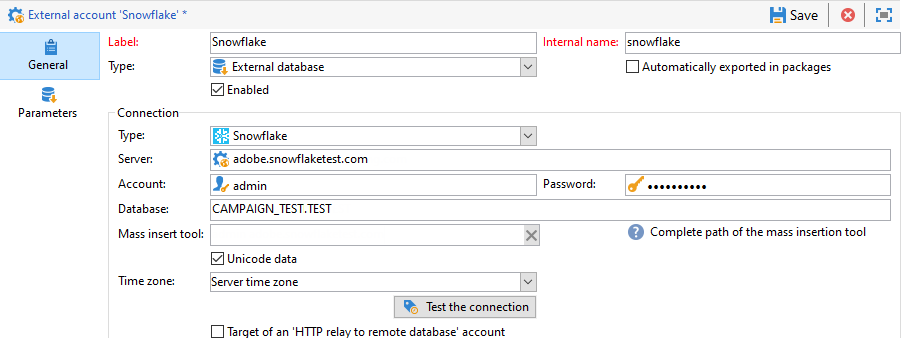

# Specifika konfigurationer efter databastyp {#specific-configurations-by-database-type}

Beroende på vilka externa databaser du vill kunna komma åt från Adobe Campaign måste du utföra vissa specifika konfigurationer. Dessa konfigurationer innebär i princip att installera drivrutiner och deklarera miljövariabler som tillhör varje RDBMS på Adobe Campaign-servern.

Som regel måste du installera motsvarande klientlager på den externa databasen på Adobe Campaign-servern.

>[!NOTE]
>
>Kompatibla versioner visas i [Campaign-kompatibilitetsmatrisen](https://helpx.adobe.com/campaign/kb/compatibility-matrix.html#FederatedDataAccessFDA).

<!--
## Configure access to Azure Synapse {#configure-access-to-azure-synapse}

### Azure Synapse on CentOS {#azure-centos}

1. Download mysql57-community-release.noarch.rpm. You can find it in this [page](https://dev.mysql.com/downloads/repo/yum).

1. Install the client library:

    ```
    $ yum install mysql57-community-release-el7-9.noarch.rpm
    $ yum install mysql-community-libs
    ```

1. You now need to configure the external account. In Campaign Classic, unfold the **[!UICONTROL Platform]** menu and click **[!UICONTROL External accounts]**.

1. Select the out-of-the box **[!UICONTROL Azure Synapse]** external account.

1. To configure the **[!UICONTROL Azure Synapse]** external account:

    * **[!UICONTROL Server]**
  
      URL of the Azure Synapse server.

    * **[!UICONTROL Account]**

      Name of the user.

    * **[!UICONTROL Password]**

      User account password.

    * **[!UICONTROL Database]**

      Name of your database

    >[!NOTE]
    >
    >Make sure the **[!UICONTROL Time zone]** and **[!UICONTROL Unicode data]** are set according to your database.

### Azure Synapse on Debian {#azure-debian}

1. Download mysql-apt-config.deb. You can find it in this [page](https://dev.mysql.com/doc/mysql-apt-repo-quick-guide/en).

1. Install the client library:

    ```
    $ dpkg -i mysql-apt-config_*_all.deb # choose mysql-5.7 in the configuration menu
    $ apt update
    $ apt install libmysqlclient20
    ```

1. You now need to configure the external account. In Campaign Classic, unfold the **[!UICONTROL Platform]** menu and click **[!UICONTROL External accounts]**.

1. Select the out-of-the box **[!UICONTROL Azure Synapse]** external account.

1. To configure the **[!UICONTROL Azure Synapse]** external account:

    * **[!UICONTROL Server]**
  
      URL of the Azure Synapse server.

    * **[!UICONTROL Account]**

      Name of the user.

    * **[!UICONTROL Password]**

      User account password.

    * **[!UICONTROL Database]**

      Name of your database

    >[!NOTE]
    >
    >Make sure the **[!UICONTROL Time zone]** and **[!UICONTROL Unicode data]** are set according to your database.

### Azure Synapse on Windows {#azure-windows}

1. Download the C connector. You can find it in this [page](https://dev.mysql.com/downloads/connector/c).

1. Make sure the directory that contains libmysqlclient.dll is added to the PATH environment variable that nlserver will use.

1. You now need to configure the external account. In Campaign Classic, unfold the **[!UICONTROL Platform]** menu and click **[!UICONTROL External accounts]**.

1. You now need to configure the external account. In Campaign Classic, unfold the **[!UICONTROL Platform]** menu and click **[!UICONTROL External accounts]**.

1. Select the out-of-the box **[!UICONTROL Azure Synapse]** external account.

1. To configure the **[!UICONTROL Azure Synapse]** external account:

    * **[!UICONTROL Server]**
  
      URL of the Azure Synapse server.

    * **[!UICONTROL Account]**

      Name of the user.

    * **[!UICONTROL Password]**

      User account password.

    * **[!UICONTROL Database]**

      Name of your database

    >[!NOTE]
    >
    >Make sure the **[!UICONTROL Time zone]** and **[!UICONTROL Unicode data]** are set according to your database.

-->

## Konfigurera åtkomst till Snowflake {#configure-access-to-snowflake}

>[!NOTE]
>
>Snöflingskontakt är tillgänglig för värdbaserade och lokala distributioner. Mer information finns på den här [sidan](https://helpx.adobe.com/campaign/kb/acc-on-prem-vs-hosted.html).


### Snöflinga i CentOS {#snowflake-centos}

1. Ladda ned ODBC-drivrutinerna för Snowflake. Drivrutiner för Snowflake finns [här](https://sfc-repo.snowflakecomputing.com/odbc/linux/latest/snowflake-odbc-2.20.2.x86_64.rpm).

1. Du måste sedan installera ODBC-drivrutinerna på CentOS med följande kommando:

   ```
   rpm -Uvh unixodbc
   rpm -Uvh snowflake-odbc-2.20.2.x86_64.rpm
   ```

1. När du har hämtat och installerat ODBC-drivrutinerna måste du starta om Campaign Classic. Om du vill göra det kör du följande kommando:

   ```
   /etc/init.d/nlserver6 stop
   /etc/init.d/nlserver6 start
   ```
1. I Campaign Classic konfigurerar du ditt externa konto för Snowflake i Campaign Classic. Öppna **[!UICONTROL Explorer]** och visa **[!UICONTROL Administration]** menyn.

1. Öppna **[!UICONTROL Platform]** menyn och klicka på **[!UICONTROL External accounts]**.

1. Välj det färdiga **[!UICONTROL Snowflake]** externa kontot.

1. Så här konfigurerar du det **[!UICONTROL Snowflake]** externa kontot:

   * **[!UICONTROL Server]**

      Webbadress till Snowflake-servern.

   * **[!UICONTROL Account]**

      Användarens namn.

   * **[!UICONTROL Password]**

      Lösenord för användarkonto.

   * **[!UICONTROL Database]**

      Namn på databasen.
   

1. Klicka på **[!UICONTROL Parameters]** fliken och sedan på **[!UICONTROL Deploy function]** knappen för att skapa funktioner.

   

Kopplingen stöder följande alternativ:

| Alternativ | Värde | Beskrivning |
|---|---|---|
| arbetsschema |  | Databasschema som ska användas för arbetsregister |
| lagerställe |  | Namnet på standardlagerstället som ska användas. Det åsidosätter användarens standardvärde. |
| TimeZoneName |  | Som standard är den tom, vilket innebär att systemtidszonen för Campaign Classic-appservern används. Alternativet kan användas för att framtvinga TIMEZONE-sessionsparametern. <br>Mer information finns på den här [sidan](https://docs.snowflake.net/manuals/sql-reference/parameters.html#timezone). |
| WeekStart | 0, 1-7 | Standardinställningen är 0. (WEEK_START-sessionsparameter) <br>Mer information finns på den här [sidan](https://docs.snowflake.net/manuals/sql-reference/parameters.html#week-start). |
| AnvändCachedResult | TRUE/FALSE | Standardinställningen är TRUE. Det här alternativet kan användas för att inaktivera cachelagrade Snowflake-resultat (sessionsparametern USE_CACHED_RESULTS) <br>Mer information finns på den här [sidan](https://docs.snowflake.net/manuals/user-guide/querying-persisted-results.html). |

### Snöflinga på Debian {#snowflake-debian}

1. Ladda ned ODBC-drivrutinerna för Snowflake. Drivrutiner för Snowflake finns [här](https://sfc-repo.snowflakecomputing.com/odbc/linux/latest/index.html).

1. Du måste sedan installera ODBC-drivrutinerna på Debian med följande kommando:

   ```
   apt-get install unixodbc
   apt-get install snowflake-odbc-x.xx.x.x86_64.deb
   ```

1. När du har hämtat och installerat ODBC-drivrutinerna måste du starta om Campaign Classic. Om du vill göra det kör du följande kommando:

   ```
   systemctl stop nlserver.service
   systemctl start nlserver.service
   ```

1. I Campaign Classic konfigurerar du ditt externa konto för Snowflake i Campaign Classic. Öppna **[!UICONTROL Explorer]** och visa **[!UICONTROL Administration]** menyn.

1. Öppna **[!UICONTROL Platform]** menyn och klicka på **[!UICONTROL External accounts]**.

1. Välj det färdiga **[!UICONTROL Snowflake]** externa kontot.

1. Så här konfigurerar du det **[!UICONTROL Snowflake]** externa kontot:

   * **[!UICONTROL Server]**

      Webbadress till Snowflake-servern.

   * **[!UICONTROL Account]**

      Användarens namn.

   * **[!UICONTROL Password]**

      Lösenord för användarkonto.

   * **[!UICONTROL Database]**

      Namn på databasen
   

1. Klicka på **[!UICONTROL Parameters]** fliken och sedan på **[!UICONTROL Deploy function]** knappen för att skapa funktioner.

   

Kopplingen stöder följande alternativ:

| Alternativ | Värde | Beskrivning |
|---|---|---|
| arbetsschema |   | Databasschema som ska användas för arbetsregister |
| lagerställe |   | Namnet på standardlagerstället som ska användas. Det åsidosätter användarens standardvärde. |
| TimeZoneName |   | Som standard är den tom, vilket innebär att systemtidszonen för Campaign Classic-appservern används. Alternativet kan användas för att framtvinga TIMEZONE-sessionsparametern. <br>Mer information finns på den här [sidan](https://docs.snowflake.net/manuals/sql-reference/parameters.html#timezone). |
| WeekStart | 0, 1-7 | Standardinställningen är 0. (WEEK_START-sessionsparameter) <br>Mer information finns på den här [sidan](https://docs.snowflake.net/manuals/sql-reference/parameters.html#week-start). |
| AnvändCachedResult | TRUE/FALSE | Standardinställningen är TRUE. Det här alternativet kan användas för att inaktivera cachelagrade Snowflake-resultat (sessionsparametern USE_CACHED_RESULTS) <br>Mer information finns på den här [sidan](https://docs.snowflake.net/manuals/user-guide/querying-persisted-results.html). |

### Snöflinga i Windows {#snowflake-windows}

1. Hämta [ODBC-drivrutinen för Windows](https://docs.snowflake.net/manuals/user-guide/odbc-download.html). Observera att du behöver administratörsbehörighet för att installera drivrutinen. Mer information finns på den här [sidan](https://docs.snowflake.net/manuals/user-guide/admin-user-management.html)

1. Konfigurera ODBC-drivrutinen. Mer information finns på den här [sidan](https://docs.snowflake.net/manuals/user-guide/odbc-windows.html#step-2-configure-the-odbc-driver)

1. När ODBC-drivrutinen har installerats och konfigurerats måste du konfigurera ditt externa konto för Snowflake i Campaign Classic. Öppna **[!UICONTROL Explorer]** och visa **[!UICONTROL Administration]** menyn.

1. Öppna **[!UICONTROL Platform]** menyn och klicka på **[!UICONTROL External accounts]**.

1. Välj det färdiga **[!UICONTROL Snowflake]** externa kontot.

1. Så här konfigurerar du det **[!UICONTROL Snowflake]** externa kontot:

   * **[!UICONTROL Server]**

      Webbadress till Snowflake-servern.

   * **[!UICONTROL Account]**

      Användarens namn.

   * **[!UICONTROL Password]**

      Lösenord för användarkonto.

   * **[!UICONTROL Database]**

      Namn på databasen
   

1. Klicka på **[!UICONTROL Parameters]** fliken och sedan på **[!UICONTROL Deploy function]** knappen för att skapa funktioner.

   

Kopplingen stöder följande alternativ:

| Alternativ | Värde | Beskrivning |
|---|---|---|
| arbetsschema |   | Databasschema som ska användas för arbetsregister |
| lagerställe |   | Namnet på standardlagerstället som ska användas. Det åsidosätter användarens standardvärde. |
| TimeZoneName |   | Som standard är den tom, vilket innebär att systemtidszonen för Campaign Classic-appservern används. Alternativet kan användas för att framtvinga TIMEZONE-sessionsparametern. <br>Mer information finns på den här [sidan](https://docs.snowflake.net/manuals/sql-reference/parameters.html#timezone). |
| WeekStart | 0, 1-7 | Standardinställningen är 0. (WEEK_START-sessionsparameter) <br>Mer information finns på den här [sidan](https://docs.snowflake.net/manuals/sql-reference/parameters.html#week-start). |
| AnvändCachedResult | TRUE/FALSE | Standardinställningen är TRUE. Det här alternativet kan användas för att inaktivera cachelagrade Snowflake-resultat (sessionsparametern USE_CACHED_RESULTS) <br>Mer information finns på den här [sidan](https://docs.snowflake.net/manuals/user-guide/querying-persisted-results.html). |

## Konfigurera åtkomst till Hadoop 3.0 {#configure-access-to-hadoop-3}

För att ansluta till en extern Hadoop-databas i FDA krävs följande konfigurationer på Adobe Campaign-servern. Observera att den här konfigurationen är tillgänglig för både Windows och Linux.

1. Hämta ODBC-drivrutinerna för Hadoop beroende på vilken OS-version du har. Drivrutiner finns på den här [sidan](https://www.cloudera.com/downloads.html).

1. Du måste sedan installera ODBC-drivrutinerna och skapa ett DSN för din Hive-anslutning. Instruktioner finns [här](https://docs.cloudera.com/documentation/other/connectors/hive-odbc/2-6-5/Cloudera-ODBC-Driver-for-Apache-Hive-Install-Guide.pdf)

1. När du har hämtat och installerat ODBC-drivrutinerna måste du starta om Campaign Classic. Om du vill göra det kör du följande kommando:

   ```
   systemctl stop nlserver.service
   systemctl start nlserver.service
   ```

1. Konfigurera ditt externa Hadoop-konto i Campaign Classic i Campaign Classic. Öppna **[!UICONTROL Explorer]** och visa **[!UICONTROL Administration]** menyn.

1. Öppna **[!UICONTROL Platform]** menyn och klicka på **[!UICONTROL External accounts]**.

1. Klicka **[!UICONTROL Create]** och välj **[!UICONTROL External database]** kontotyp.

1. Så här konfigurerar du det **[!UICONTROL  Hadoop]** externa kontot:

   * **[!UICONTROL Type]**

      ODBC (Sybase ASE, Sybase IQ)

   * **[!UICONTROL Server]**

      Namn på DNS.

   * **[!UICONTROL Account]**

      Användarens namn.

   * **[!UICONTROL Password]**

      Lösenord för användarkonto.

   * **[!UICONTROL Database]**

      Namnet på databasen om det inte anges i DSN. Den kan lämnas tom om den anges i DSN.

   * **[!UICONTROL Time zone]**

      Tidszon för server
   

Kopplingen stöder följande ODBC-alternativ:

| Namn | Värde |
|---|---|
| ODBCMgr | iODBC |
| lagerställe | 1/2/4 |

Kopplingen stöder även följande Hive-alternativ:

| Namn | Värde | Beskrivning |
|---|---|---|
| bulkKey | Åtkomstnyckel för Azure-blob eller DataLake | För wasb:// eller wasbs:// massinläsare (dvs. om massinläsningsverktyget börjar med wasb:// eller wasbs://). <br>Det är åtkomstnyckeln för blob- eller DataLake-bucket för massinläsning. |
| hdfsPort | portnummer <br>inställt på 8020 som standard | För HDFS-massinläsning (d.v.s. om massinläsningsverktyget börjar med webhdfs:// eller webhdfss://). |
| buficknummer | 20 | Antal grupper när en klustrad tabell skapas. |
| fileFormat | PARQUET | Standardfilformat för arbetsregister. |

## Konfigurera åtkomst till Hadoop 2.1 {#configure-access-to-hadoop}

Mer information om hur du konfigurerar din externa Hadoop-databas i FDA finns i den här [artikeln](https://helpx.adobe.com/campaign/kb/access-hadoop-2.html).

### För Windows {#for-windows}

1. Installera ODBC- och [Azure HD Insight](https://www.microsoft.com/en-us/download/details.aspx?id=40886) -drivrutiner för Windows.
1. Skapa DSN (namn på datakälla) genom att köra administrationsverktyget för ODBC-datakälla. Du kan ändra ett system-DSN-exempel för Hive.

   ```
   Description: vorac (or any name you like)
   Host: vorac.azurehdinsight.net
   Port: 443
   Database: sm_tst611 (or your database name)
   Mechanism: Azure HDInsight Service
   User/Password: admin/<your password here>
   ```

1. Skapa det externa Hadoop-kontot enligt informationen i avsnittet [Skapa en delad anslutning](../../message-center/using/creating-a-shared-connection.md) .

### För Linux {#for-linux}

1. Installera unixodbc för Linux.

   ```
   apt-get install unixodbc
   ```

1. Hämta och installera ODBC-drivrutiner för Apache Hive från HortonWorks: [https://www.hortonworks.com/downloads/](https://www.hortonworks.com/downloads/).

   ```
   dpkg -i hive-odbc-native_2.1.10.1014-2_amd64.deb
   ```

1. Kontrollera ODBC-filens plats.

   ```
   root@campadpac71:/tmp# odbcinst -j
   unixODBC 2.3.1
   DRIVERS............: /etc/odbcinst.ini
   SYSTEM DATA SOURCES: /etc/odbc.ini
   FILE DATA SOURCES..: /etc/ODBCDataSources
   USER DATA SOURCES..: /root/.odbc.ini
   SQLULEN Size.......: 8
   SQLLEN Size........: 8
   SQLSETPOSIROW Size.: 8
   ```

1. Skapa DSN (Data Source Name) och redigera filen odbc.ini. Skapa sedan ett DSN för din Hive-anslutning.

   Här är ett exempel för HDInsight som skapar en anslutning som kallas&quot;viral&quot;:

   ```
   [ODBC Data Sources]
   vorac 
   
   [vorac]
   Driver=/usr/lib/hive/lib/native/Linux-amd64-64/libhortonworkshiveodbc64.so
   HOST=vorac.azurehdinsight.net
   PORT=443
   Schema=sm_tst611
   HiveServerType=2
   AuthMech=6
   UID=admin
   PWD=<your password here>
   HTTPPath=
   UseNativeQuery=1
   ```

   >[!NOTE]
   >
   >Parametern **UseNativeQuery** är mycket viktig. Campaign är Hive-medveten och fungerar inte korrekt om inte UseNativeQuery har angetts. Vanligtvis skriver drivrutinen eller Hive SQL Connector om frågor och ändrar kolumnordningen.

   Inställningen av autentisering beror på konfigurationen av Hive/Hadoop. För HD Insight använder du till exempel AuthMech=6 för användar-/lösenordsautentisering enligt beskrivningen [här](https://www.simba.com/products/Spark/doc/ODBC_InstallGuide/unix/content/odbc/hi/configuring/authenticating/azuresvc.htm).

1. Exportera variablerna.

   ```
   export ODBCINI=/etc/myodbc.ini
   export ODBCSYSINI=/etc/myodbcinst.ini
   ```

1. Konfigurera drivrutiner för Hortonworks via /usr/lib/hive/lib/native/Linux-amd64-64/hortonworks.hiveodbc.ini.

   Du måste använda UTF-16 för att kunna ansluta till Campaign och unix-odbc (libodbcinst).

   ```
   [Driver]
   
   DriverManagerEncoding=UTF-16
   ErrorMessagesPath=/usr/lib/hive/lib/native/hiveodbc/ErrorMessages/
   LogLevel=0
   LogPath=/tmp/hive
   SwapFilePath=/tmp
   
   ODBCInstLib=libodbcinst.so
   ```

1. Nu kan du testa anslutningen med isql.

   ```
   isql vorac
   isql vorac -v
   ```

1. Skapa det externa Hadoop-kontot enligt informationen i avsnittet [Skapa en delad anslutning](../../message-center/using/creating-a-shared-connection.md) .

## Konfigurera åtkomst till Netezza {#configure-access-to-netezza}

För att ansluta till en extern Netezza-databas i FDA krävs ytterligare konfigurationer nedan på Adobe Campaign-servern:

1. Installera ODBC-drivrutinerna för Netezza, enligt det operativsystem du använder:

   * **nz-linuxclient-v7.2.0.0.tar.gz** för Linux. Markera den mapp som motsvarar ditt operativsystem (Linux eller Linux64) och starta uppackningskommandot. Du kan lämna installationen som ska utföras i den databas som föreslås som standard: &quot;/usr/local/nz&quot;.
   * **nz-winclient-v7.2.0.0.zip** för Windows. Zippa upp filen och starta det körbara skript som hör till ditt operativsystem: nzodbcsetup.exe eller nzodbcsetup64.exe. Följ instruktionerna i guiden för att slutföra installationen av drivrutinerna.

1. Konfigurera ODBC-drivrutinen. Konfigurationen kan utföras i standardfilerna: **/etc/odbc.ini** för allmänna parametrar och **/etc/odbcinst.ini** för att deklarera drivrutiner.

   * **/etc/odbc.ini**

      ```
      [ODBC]
      InstallDir=/etc/
      ```

      &quot;InstallDir&quot; motsvarar platsen för filen odbcinst.ini.

   * **/etc/odbcinst.ini**

      ```
      [ODBC Drivers]
      NetezzaSQL = Installed
      
      [NetezzaSQL]
      Driver           = /usr/local/nz/lib/libnzsqlodbc3.so
      Setup            = /usr/local/nz/lib/libnzsqlodbc3.so
      APILevel         = 1
      ConnectFunctions = YYN
      Description      = Netezza ODBC driver
      DriverODBCVer    = 03.51
      DebugLogging     = false
      LogPath          = /tmp
      UnicodeTranslationOption = utf8
      CharacterTranslationOption = all
      PreFetch         = 256
      Socket           = 16384
      ```

1. Ange miljövariablerna för Adobe Campaign-servern:

   * **LD_LIBRARY_PATH**: /usr/local/nz/lib och /usr/local/nz/lib64. &quot;/usr/local/nz&quot; motsvarar den installationsdatabas som finns som standard när du installerar drivrutinerna. Här måste du ange vilken databas du har valt för installationen.
   * **ODBCINI**: platsen för filen odbc.ini (till exempel /etc/odbc.ini).
   * **NZ_ODBC_INI_PATH**: platsen för filen odbc.ini. Netezza kräver också den andra variabeln för att kunna använda filen odbc.ini.

1. Skapa det externa Netezza-kontot, vilket beskrivs i avsnittet [Skapa en delad anslutning](../../message-center/using/creating-a-shared-connection.md) .

>[!NOTE]
>
>Åtgärder för scheman som innehåller automatiskt genererade primärnycklar beaktas inte.
>
>Tabellen använder **Organizer on** -satsen för det första indexvärdet som definieras i schemat. Eftersom den här satsen är begränsad till 1 till 4 kolumner med Netezza, får indexet inte innehålla fler än 4 kolumner.

## Konfigurera åtkomst till Oracle {#configure-access-to-oracle}

För att ansluta till en extern Oracle-databas i FDA krävs ytterligare konfigurationer nedan på Adobe Campaign-servern.

### För Linux {#for-linux-1}

1. Installera den fullständiga Oracle-klienten som motsvarar din version av Oracle.
1. Lägg till dina TNS-definitioner i installationen. Om du vill göra det anger du dem i en **namnfil.ora** i databasen /etc/oracle. Om den här databasen inte finns skapar du den.

   Skapa sedan en ny TNS_ADMIN-miljövariabel: exportera TNS_ADMIN=/etc/oracle och starta om datorn.

1. Integrera Oracle med er Adobe Campaign-server (nlserver). Det gör du genom att kontrollera att filen **customer.sh** finns i mappen &quot;nl6&quot; i serverstrukturen för Adobe Campaign och att den innehåller länkarna till Oracle-biblioteken.

   Exempel: för en klient i 11.2:

   ```
   export ORACLE_HOME=/usr/lib/oracle/11.2
   export TNS_ADMIN=/etc/oracle
   export LD_LIBRARY_PATH=$ORACLE_HOME/client64/lib:$LD_LIBRARY_PATH
   ```

   >[!NOTE]
   >
   >Dessa värden (särskilt ORACLE_HOME) beror på installationsdatabaserna. Kontrollera trädstrukturen innan du refererar till dessa värden.

1. Installera de bibliotek som krävs för Oracle:

   * **libclntsh.so**

      ```
      cd /usr/lib/oracle/<version>/client<architecture>/lib
      ln -s libclntsh.so.<version> libclntsh.so
      ```

   * **libaio1**

      ```
      aptitude install libaio1
      or
      yum install libaio1
      ```

### För Windows {#for-windows-1}

1. Installera Oracle-klienten.
1. I mappen C:Oracle skapar du en **namnfil.ora** som innehåller din TNS-definition.

   Lägg till en TNS_ADMIN-miljövariabel med C:Oracle som-värde och starta om datorn.

## Konfigurera åtkomst till Sybase IQ {#configure-access-to-sybase-iq}

För att ansluta till en extern Sybase IQ-databas i FDA krävs ytterligare konfigurationer nedan på Adobe Campaign-servern:

1. Kontrollera att Unixodbc-paketet finns på servern.
1. Installera **iq_odbc**. Ett fel kan uppstå i slutet av installationen. Det här felet kan ignoreras.
1. Installera **iq_client_common**. Ett Java-fel kan uppstå när installationen är klar. Det här felet kan ignoreras.
1. Konfigurera ODBC-drivrutinen. Konfigurationen kan utföras i standardfilerna: /etc/odbc.ini för allmänna parametrar och /etc/odbcinst.ini för att deklarera drivrutiner:

   * **/etc/odbc.ini** (ersätt värden som `<server_alias>` tecken med egna):

      ```
      [ODBC Data Sources]
      <server_alias>=libdbodbc.so
      
      [<server_alias>]
      Driver=/opt/sybase/IQ-16_0/lib64/libdbodbc16.so
      Description=<description>
      Username=<username>
      Password=<password>
      ServerName=<server_name>
      CommLinks=tcpip(host=<host>)
      ```

   * **/etc/odbcinst.ini**

      ```
      [ODBC DRIVERS]
      SAP SybaseIQ=Installed
      
      [SAP SybaseIQ]
      Driver=/opt/sybase/IQ-16_0/lib64/libdbodbc16.so
      ```

1. Lägg till sökvägen för det nya biblioteket libodbc16.so i variabeln LD_LIBRARY_PATH. Så här gör du:

   * Om du använder en customer.sh-fil för att deklarera sökvägen: lägg till sökvägen /opt/sybase/IQ-16_0/lib64 för variabeln LD_LIBRARY_PATH.
   * Annars använder du ett Unix-kommando.

1. Skapa ett nytt externt FDA-konto enligt beskrivningen i avsnittet [Skapa en delad anslutning](../../message-center/using/creating-a-shared-connection.md) . För Sybase IQ motsvarar servernamnet ODBC-anslutningen (`<server_alias>`) som definieras i steg 5. Det behöver inte vara namnet på själva servern.

>[!NOTE]
>
>För Windows måste du installera Sybase IQ-klienten på Adobe Campaign-servern och skapa en ODBC-anslutning. Se till att du skapar en systemdatakälla när Adobe Campaign-servern (nlserver) körs som en tjänst i Windows.

## Konfigurera åtkomst till Teradata {#configure-access-to-teradata}

För anslutning till en extern Teradata-databas i FDA krävs vissa ytterligare konfigurationer på Adobe Campaign-servern. Mer information om hur du konfigurerar Teradata-databasen finns i den här [artikeln](https://helpx.adobe.com/campaign/kb/campaign_fda_teradata.html).

1. Installera [ODBC-drivrutinen för Teradata](https://downloads.teradata.com/download/connectivity/odbc-driver/linux).

   Den består av tre paket som kan installeras på Red Hat (eller CentOS)/Suse i följande ordning:

   * TeraGSS
   * tdicu1510 (installera den med setup_wrapper.sh)
   * tdodbc1510 (installera den med setup_wrapper.sh)

1. Konfigurera ODBC-drivrutinen. Konfigurationen kan utföras i standardfilerna: /etc/odbc.ini **** för allmänna parametrar och /etc/odbcinst.ini för att deklarera drivrutiner:

   * **/etc/odbc.ini**

      ```
      [ODBC]
      InstallDir=/etc/
      ```

      &quot;InstallDir&quot; motsvarar platsen för filen **odbcinst.ini** .

   * **/etc/odbcinst.ini**

      ```
      [ODBC DRIVERS]
      teradata=Installed
      
      [teradata]
      Driver=/opt/teradata/client/15.10/lib64/tdata.so
      APILevel=CORE
      ConnectFunctions=YYY
      DriverODBCVer=3.51
      SQLLevel=1
      ```

1. Ange miljövariablerna för Adobe Campaign-servern:

   * **LD_LIBRARY_PATH**: /opt/teradata/client/15.10/lib64 och /opt/teradata/client/15.10/odbc_64/lib.
   * **ODBCINI**: platsen för filen odbc.ini (till exempel /etc/odbc.ini).
   * **NLSPATH**: plats för filen opermsgs.cat (/opt/teradata/client/15.10/msg/opermsgs.cat)

## Konfigurera åtkomst till SAP HANA {#configure-access-to-sap-hana}

Anslutning till en extern SAP HANA-databas i FDA kräver vissa ytterligare konfigurationer på Adobe Campaign-servern:

1. Installera ODBC-drivrutinerna för SAP HANA, enligt det operativsystem du använder:

   * **hdb_client_linux.tgz** för Linux. När du har packat upp en fil startar du kommandot hdbinst och följer instruktionerna för att slutföra installationen av drivrutinerna.
   * **hdb_client_windows.zip** för Windows. Zippa upp filen och starta den körbara filen: **hdbinst.exe**. Följ instruktionerna i guiden för att slutföra installationen av drivrutinerna.

1. Konfigurera ODBC-drivrutinen. Konfigurationen kan utföras i standardfilerna: /etc/odbc.ini för allmänna parametrar och /etc/odbcinst.ini för att deklarera drivrutiner.

   * **/etc/odbc.ini**

      ```
      [ODBC]
      InstallDir=/etc/
      
      [HDB]
      Driver=HDBODBC
      servernode=localhost:39013 (this value depend of your server)
      User:SYSTEM
      ```

      &quot;InstallDir&quot; motsvarar platsen för filen **odbcinst.ini** .

   * **/etc/odbcinst.ini**

      ```
      [HDBODBC]
      Description = "SmartCloudPT HANA"
      Driver = /usr/sap/hdbclient/libodbcHDB.so
      ```

1. Ange miljövariablerna för Adobe Campaign-servern:

   * **LD_LIBRARY_PATH**: Den bör innehålla länken till SAP Hana-klienten (/usr/sap/hdbclient/libodbcHDB.so) som standard.
   * **ODBCINI**: platsen för filen odbc.ini (till exempel /etc/odbc.ini).

1. Skapa det externa SAP Hana-kontot, vilket beskrivs i avsnittet [Skapa en delad anslutning](../../message-center/using/creating-a-shared-connection.md) .
