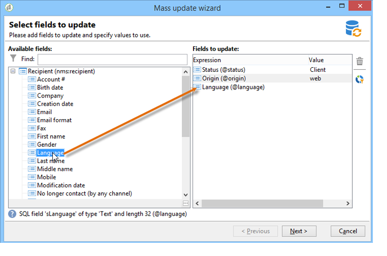
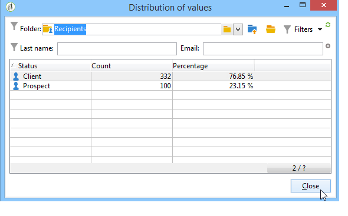
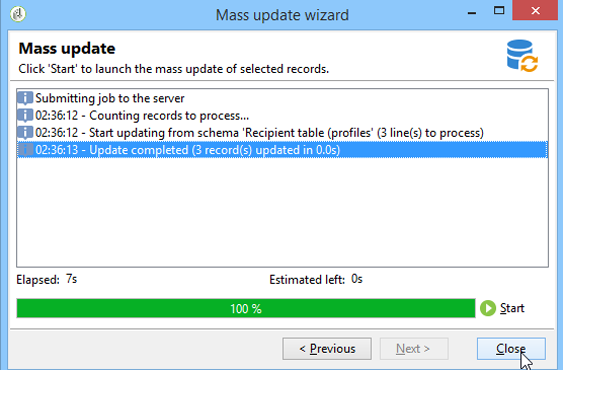
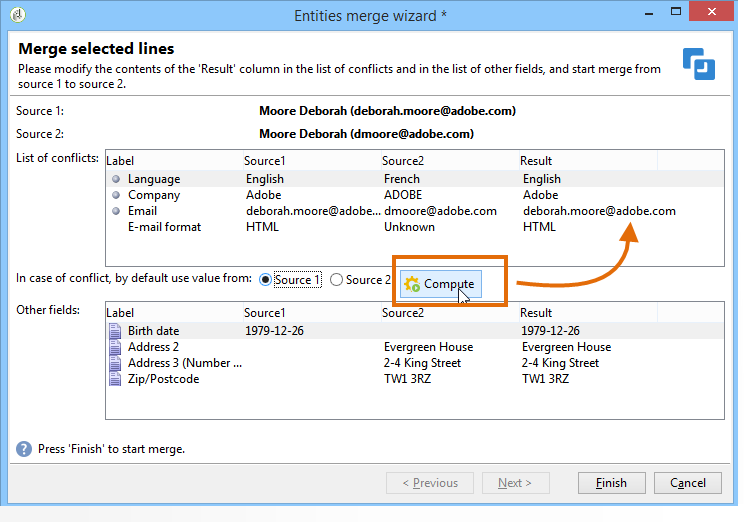

# Uppdaterar data{#updating-data}

De data som är länkade till en mottagares profil kan uppdateras manuellt eller automatiskt.

## Konfigurera en automatisk uppdatering {#setting-up-an-automatic-update}

En automatisk uppdatering kan konfigureras via ett arbetsflöde. Mer information finns i [det här avsnittet](../../workflow/using/update-data.md).

## Genomföra en massuppdatering {#performing-a-mass-update}

Om du vill utföra manuella uppdateringar högerklickar du på de valda mottagarna för att använda **[!UICONTROL Actions]** snabbmenyn eller använder **[!UICONTROL Actions]** -ikonen.

Det finns två typer av uppdateringar: massuppdatering för en uppsättning mottagare och datasammanfogning mellan två profiler. För varje åtgärd kan du konfigurera uppdateringen med hjälp av en guide.

### Massuppdatering {#mass-update}

Använd **[!UICONTROL Action > Mass update of selected lines...]** massuppdatering. Guiden hjälper dig att konfigurera och köra uppdateringen.

Det första steget i guiden är att ange vilka fält som ska uppdateras.

I den vänstra delen av guiden visas en lista med tillgängliga fält. Använd **[!UICONTROL Find]** fältet för att göra en sökning i dessa fält. Tryck på **Retur** för att bläddra i listan. Fältnamnen som matchar inmatningen visas i fet stil, vilket visas nedan.

Dubbelklicka på de fält som ska uppdateras för att visa dem i den högra delen av guiden.

Om ett fel uppstår tar du bort ett fält från listan med fält som ska uppdateras med hjälp av **[!UICONTROL Delete]** knappen .

Välj eller ange de värden som ska användas för de profiler som ska uppdateras.

Du kan klicka **[!UICONTROL Distribution of values]** för att visa värdefördelningen för det markerade fältet för mottagarna i den aktuella mappen (inte bara mottagarna som påverkas av uppdateringen).

Du kan definiera filter för att visa värdefördelningen i det här fönstret eller ändra den aktuella mappen för att visa värdefördelningen i en annan mapp. Detta är skrivskyddade åtgärder. påverkar inte konfigurationen för den uppdatering som definieras.

Stäng det här fönstret och klicka **[!UICONTROL Next]** för att visa det andra uppdateringsguiden. I det här steget kan du starta uppdateringen genom att klicka på **[!UICONTROL Start]**.

Information om uppdateringskörning visas i den övre delen av guiden.

Du kan **[!UICONTROL Stop]** avbryta uppdateringen, men vissa poster kan ha uppdaterats och om du stoppar processen kommer uppdateringarna inte att avbrytas. Förloppsindikatorn visar hur långt åtgärden har kommit.

### Sammanfoga data {#merge-data}

Välj **[!UICONTROL Merge selected lines...]** om du vill starta sammanfogningen av två mottagarprofiler. Profilerna som ska sammanfogas måste vara markerade innan du väljer alternativet. Sammanfogningen konfigureras och startas med en guide.

I guiden visas de värden som ska hämtas för varje fält som har slutförts i en eller flera av källprofilerna. Om ett eller flera fält i de profiler som ska sammanfogas har olika värden visas de i **[!UICONTROL List of conflicts]** avsnittet. Du kan sedan välja standardprofil med alternativknapparna under listan, som i följande exempel:

Klicka **[!UICONTROL Compute]** för att visa det önskade resultatet.

Kontrollera **[!UICONTROL Result]** kolumnerna i fönstrets båda avsnitt och klicka för **[!UICONTROL Finish]** att köra sammanfogningen.

## Exportera data {#exporting-data}

Innehållet i en lista kan exporteras. Så här konfigurerar och kör du exporten:

1. Välj de poster som ska exporteras.
1. Högerklicka och välj **[!UICONTROL Export...]**.

   

1. Markera sedan de data som ska extraheras. Som standard läggs alla kolumner som visas till i utdatakolumnerna.

   

   Mer information om hur du konfigurerar exportguiden finns i [exportguiden](../../platform/using/exporting-data.md#export-wizard).

## Prenumerera på en tjänst {#subscribing-to-a-service}

I de flesta fall prenumererar mottagarna på ett nyhetsbrev via en särskild landningssida, vilket förklaras i [detta avsnitt](../../delivery/using/managing-subscriptions.md). Filtrerade mottagarprofiler kan dock prenumerera på en tjänst (nyhetsbrev eller virala tjänster) manuellt. Så här gör du:

1. Markera de mottagare som du vill prenumerera på och högerklicka.
1. Välj **[!UICONTROL Actions > Subscribe selection to a service]**.

   

1. Välj önskad tjänst och klicka på **[!UICONTROL Next]**:

   

   >[!NOTE]
   >
   >Med den här redigeraren kan du skapa en ny tjänst: klicka på **[!UICONTROL Create]** knappen.

1. Du kan **[!UICONTROL Send a confirmation message]** göra det för mottagarna. Innehållet i det här meddelandet kan konfigureras i det prenumerationsscenario som är länkat till den valda tjänsten.
1. Klicka på **[!UICONTROL Start]** knappen för att köra prenumerationsprocessen.

   

I fönstrets övre del kan du övervaka körningsprocessen. Med knappen **[!UICONTROL Stop]** kan du stoppa processen. Mottagare som redan har bearbetats kommer dock att prenumereras.

Om du avmarkerar **[!UICONTROL Do not keep a trace of this job in the database]** alternativet kan du välja (eller skapa) körningsmappen där informationen om processen ska lagras.

Om du vill kontrollera processen går du till fliken **[!UICONTROL Subscriptions]** på profilerna för de mottagare som berörs av den här åtgärden, eller till fliken **[!UICONTROL Subscriptions]** som nås via **[!UICONTROL Profiles and Targets > Services and Subscriptions]** noden.

>[!NOTE]
>
>Mer information om hur du skapar och konfigurerar informationstjänster finns på [den här sidan](../../delivery/using/managing-subscriptions.md).

