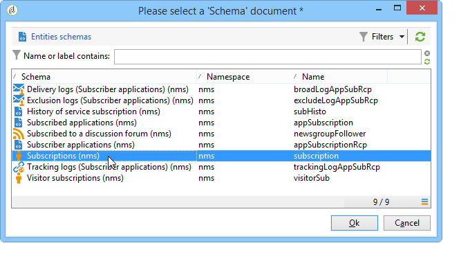

# Användningsfall{#use-case}

## Skapa ett filter för e-postformat för prenumeranter {#creating-a-filter-on-the-email-format-of-subscribers}

I det här exemplet visas hur du skapar ett filter för att sortera nyhetsbrevsprenumerationer baserat på mottagarnas e-postformat.

För att göra detta måste vi använda en fördefinierad filhanterare: Dessa filter är länkade till en dokumenttyp och nås via noden **[!UICONTROL Administration > Configuration > Predefined filters]**. Dessa datafilter kan användas för varje typ av redigerare (eller dokument) i programmet.

Datafilter skapas på samma sätt som fördefinierade filter, men det finns ytterligare ett fält där du kan välja dokumenttypen som filtret ska tillämpas på.

Använd följande steg:

1. Skapa ett nytt filter via noden **[!UICONTROL Administration > Configuration > Predefined filters]**.
1. Klicka på ikonen **[!UICONTROL Select link]** för att välja det berörda dokumentet:

   

1. Välj prenumerationsschemat (nms:subscription) och klicka på **[!UICONTROL OK]**.

   

1. Klicka på **[!UICONTROL Edit link]** för att visa fälten i det markerade dokumentet.

   

   Du kan sedan visa innehållet i det markerade dokumentet:

   

   Du kan komma åt dessa fält för att definiera filtervillkor i filterredigerarens brödtext. Ett programfilter definieras på exakt samma sätt som ett avancerat filter. Se [Skapa ett avancerat filter](../../platform/using/creating-filters.md#creating-an-advanced-filter).

1. Skapa ett nytt filter för prenumerationer som endast visar prenumerationer med ett odefinierat e-postformat:

   

1. Klicka på **[!UICONTROL Save]** om du vill lägga till ett filter i de fördefinierade filtren för den här typen av lista.
1. Du kan nu använda det här filtret på fliken **[!UICONTROL Subscriptions]** i mottagarprofilen; Du kommer åt filtret Okänt e-postformat genom att klicka på knappen **[!UICONTROL Filters]**.

   

   Namnet på det aktuella filtret visas ovanför listan. Om du vill avbryta filtret klickar du på ikonen **[!UICONTROL Delete this filter]**.

   
