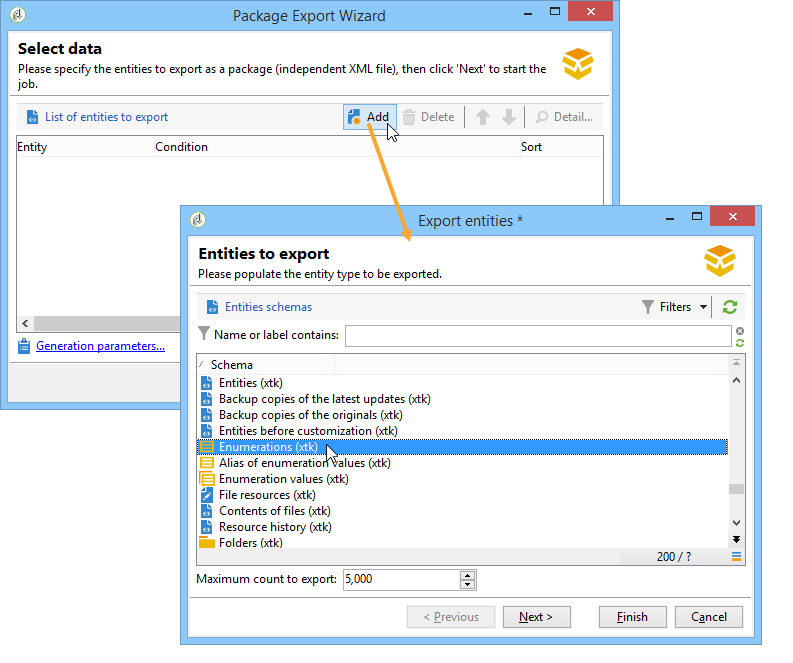

# Arbeta med datapaket{#working-with-data-packages}

## Om datapaket {#about-data-packages}

Med Adobe Campaign kan ni exportera eller importera plattformskonfigurationen och data via ett paketsystem. Paket kan innehålla olika typer av konfigurationer, element, filtrerade eller inte.

Med datapaket kan enheter i Adobe Campaign-databasen visas med filer i XML-format. Varje entitet i ett paket representeras med alla dess data.

Principen med **datapaket** är att exportera en datakonfiguration och integrera den i ett annat Adobe Campaign-system. Mer information om hur du upprätthåller en enhetlig uppsättning datapaket finns i den här [tekniken](https://docs.campaign.adobe.com/doc/AC/en/technicalResources/Technotes/AdobeCampaign_How_to_maintain_a_consistent_set_of_data_packages.pdf).

### Typ av paket {#types-of-packages}

Det finns tre typer av paket som kan exporteras: användarpaket, plattformspaket och administratörspaket.

* **Användarpaket**: gör att du kan välja en lista över enheter som ska exporteras. Den här typen av paket hanterar beroenden och verifierar fel.
* **Plattformspaket**: Den innehåller alla tillagda tekniska resurser (inte standard): scheman, JavaScript-kod osv.

   

* **Administratörspaket**: innehåller alla tillagda mallar och affärsobjekt (inte standard): mallar, bibliotek osv.

   

>[!CAUTION]
>
>Typerna **Plattform** och **Administratör** innehåller en fördefinierad lista över enheter som ska exporteras. Varje entitet är länkad till filtervillkor som gör att du kan ta bort de färdiga resurserna i det skapade paketet.

## Datastruktur {#data-structure}

Beskrivningen av ett datapaket är ett strukturerat XML-dokument som överensstämmer med grammatiken i **xrk:navtree** -dataschemat.

Exempel på datapaket:

```
<package>
  <entities schema="nms:recipient">
    <recipient email="john.smith@adobe.com" lastName="Smith" firstName="John">      
      <folder _operation="none" name="nmsRootFolder"/>      
      <company _operation="none" name="Adobe"/>
    </recipient>
  </entities>
  <entities schema="sfa:company">
    <company name="Adobe">
      location city="London" zipCode="W11 2BQ"/>
    </company>
  </entities>
</package>
```

XML-dokumentet måste börja och sluta med **`<package>`** -elementet. Alla **`<entities>`** element som följer distribuerar data efter dokumenttyp.

Ett **`<entities>`** element innehåller data från paketet i det format som datarammet som anges i **schemaattributet** .

Data i ett paket får inte innehålla interna nycklar som inte är kompatibla mellan baser, t.ex. autogenererade nycklar (**autopk** -alternativ).

I det här exemplet har kopplingarna på länkarna &quot;mapp&quot; och &quot;företag&quot; ersatts med så kallade &quot;hög nivå&quot; i måltabellerna:

```
<recipient>
  <folder _operation="none" name="nmsRootFolder"/>
  <company _operation="none" name="Adobe"/>
</recipient>
```

Attributet **`operation`** med värdet &quot;none&quot; definierar en avstämningslänk.

Ett datapaket kan skapas manuellt från valfri textredigerare. Se bara till att XML-dokumentets struktur överensstämmer med dataschemat &quot;xtk:navtree&quot;. Adobe Campaign-konsolen har en export- och importmodul för datapaket.

## Exportera paket {#exporting-packages}

### Om paketexport {#about-package-export}

Paket kan exporteras på tre olika sätt:

* Med den här funktionen kan du **[!UICONTROL Package Export Wizard]** exportera en uppsättning objekt i ett enda paket. Mer information finns i [Exportera en uppsättning objekt i ett paket](#exporting-a-set-of-objects-in-a-package)
* Ett **enskilt objekt** kan exporteras direkt i ett paket genom att högerklicka på det och välja **[!UICONTROL Actions > Export in a package]**.
* **Med paketdefinitioner** kan du skapa en paketstruktur där du lägger till objekt som ska exporteras senare i ett paket. Mer information finns i [Hantera paketdefinitioner](#managing-package-definitions)

När ett paket har exporterats kan du importera det och alla tillagda enheter till en annan Campaign-instans.

### Exportera en uppsättning objekt i ett paket {#exporting-a-set-of-objects-in-a-package}

Guiden för paketexport är tillgänglig via **[!UICONTROL Tools > Advanced > Export package...]** menyn i Adobe Campaign-klientkonsolen.


För de tre typerna av paket innehåller guiden följande steg:

1. Lista de enheter som ska exporteras efter dokumenttyp:

   

   >[!CAUTION]
   >
   >Om du exporterar en **[!UICONTROL Offer category]**-, **[!UICONTROL Offer environment]****[!UICONTROL Program]** - eller **[!UICONTROL Plan]** typmapp ska du aldrig markera mappen **xtk:folder** eftersom du kan förlora vissa data. Välj den enhet som motsvarar mappen: **nms:offerCategory** för erbjudandekategorier, **nms:offerEnv** för erbjudandemiljöer, **nms:program** för program och **nms:plan** för planer.

   Med listhantering kan du lägga till eller ta bort enheter för export från konfigurationen. Klicka **[!UICONTROL Add]** för att välja en ny enhet.

   Knappen **[!UICONTROL Detail]** redigerar den valda konfigurationen.

   >[!NOTE]
   >
   >Beroendemekanismen styr entitetens exportsekvens. Mer information finns i [Hantera beroenden](#managing-dependencies).

1. Enhetskonfigurationsskärmen definierar filterfrågan för den typ av dokument som ska extraheras.

   Du måste konfigurera filtersatsen för dataextrahering.

   

   >[!NOTE]
   >
   >Frågeredigeraren visas i [det här avsnittet](../../platform/using/about-queries-in-campaign.md).

1. Klicka på **[!UICONTROL Next]** och markera sorteringskolumnerna för att ordna data under extraheringen:

   

1. Förhandsgranska de data som ska extraheras innan du kör exporten.

   

1. På den sista sidan i guiden för paketexport kan du starta exporten. Data lagras i den fil som anges i **[!UICONTROL File]** fältet.

   

### Hantera beroenden {#managing-dependencies}

Exportmekanismen gör att Adobe Campaign kan spåra länkarna mellan de olika exporterade elementen.

Den här mekanismen definieras av två regler:

* objekt som är länkade till en länk med en **egen** eller **egen** textintegritet exporteras i samma paket som det exporterade objektet.
* objekt som är länkade till en länk med en **neutral** eller **definierad** textintegritet (definierad länk) måste exporteras separat.

>[!NOTE]
>
>Integritetstyper som är länkade till schemaelement definieras i [det här avsnittet](../../configuration/using/database-mapping.md#links--relation-between-tables).

#### Exportera en kampanj {#exporting-a-campaign}

Här är ett exempel på hur du exporterar en kampanj. Marknadsföringskampanjen som ska exporteras innehåller en aktivitet (etikett: &quot;MyTask&quot;) och ett arbetsflöde (etikett: &quot;CampaignWorkflow&quot;) i mappen &quot;MyWorkflow&quot; (nod: Administration / produktion / Tekniska arbetsflöden / Kampanjprocesser / MittArbetsflöde).

Uppgiften och arbetsflödet exporteras i samma paket som kampanjen eftersom matchande scheman kopplas samman med länkar med en egen typ av integritet.

Paketinnehåll:

```
<?xml version='1.0'?>
<package author="Administrator (admin)" buildNumber="7974" buildVersion="6.1" img=""
label="" name="" namespace="" vendor="">
 <desc></desc>
 <version buildDate="2013-01-09 10:30:18.954Z"/>
 <entities schema="nms:operation">
  <operation duration="432000" end="2013-01-14" internalName="OP1" label="MyCampaign"
  modelName="opEmpty" start="2013-01-09">
   <controlGroup>
    <where filteringSchema=""/>
   </controlGroup>
   <seedList>
    <where filteringSchema="nms:seedMember"></where>
    <seedMember internalName="SDM1"></seedMember>
   </seedList>
   <parameter useAsset="1" useBudget="1" useControlGroup="1" useDeliveryOutline="1"
   useDocument="1" useFCPValidation="0" useSeedMember="1" useTask="1"
   useValidation="1" useWorkflow="1"></parameter>
   <fcpSeed>
    <where filteringSchema="nms:seedMember"></where>
   </fcpSeed>
   <owner _operation="none" name="admin" type="0"/>
   <program _operation="none" name="nmsOperations"/>
   <task end="2013-01-17 10:07:51.000Z" label="MyTask" name="TSK2" start="2013-01-16 10:07:51.000Z"
   status="1">
    <owner _operation="none" name="admin" type="0"/>
    <operation _operation="none" internalName="OP1"/>
    <folder _operation="none" name="nmsTask"/>
   </task>
   <workflow internalName="WKF12" label="CampaignWorkflow" modelName="newOpEmpty"
   order="8982" scenario-cs="Notification of the workflow supervisor (notifySupervisor)"
   schema="nms:recipient">
    <scenario internalName="notifySupervisor"/>
    <desc></desc>
    <folder _operation="none" name="Folder4"/>
    <operation _operation="none" internalName="OP1"/>
   </workflow>
  </operation>
 </entities>
</package>   
```

Anslutning till en typ av paket definieras i ett schema med attributen **@pkgAdmin och @pkgPlatform** . Båda dessa attribut får ett XTK-uttryck som definierar villkoren för anslutning till paketet.

```
<element name="offerEnv" img="nms:offerEnv.png" 
template="xtk:folder" pkgAdmin="@id != 0">
```

Slutligen kan du med **@pkgStatus** -attributet definiera exportreglerna för dessa element eller attribut. Beroende på attributets värde finns elementet eller attributet i det exporterade paketet. De tre möjliga värdena för det här attributet är:

* **aldrig**: exporterar inte fältet/länken
* **always**: tvingar export för det här fältet
* **preCreate**: tillåter skapande av den länkade entiteten

>[!NOTE]
>
>Värdet **preCreate** tillåts bara för länktypshändelser. Du kan skapa eller peka mot en enhet som ännu inte har lästs in i det exporterade paketet.

## Hantera paketdefinitioner {#managing-package-definitions}

### Om paketdefinitioner {#about-package-definitions}

Med paketdefinitioner kan du skapa en paketstruktur där du lägger till entiteter som ska exporteras senare i ett paket. Du kan sedan importera det här paketet och alla tillagda enheter till en annan Campaign-instans.

**Relaterade ämnen:**

* [Skapa en paketdefinition](#creating-a-package-definition)
* [Lägga till enheter i en paketdefinition](#adding-entities-to-a-package-definition)
* [Konfigurera generering av paketdefinitioner](#configuring-package-definitions-generation)
* [Exportera paket från en paketdefinition](#exporting-packages-from-a-package-definition)

### Skapa en paketdefinition {#creating-a-package-definition}

Du kommer åt paketdefinitioner på **[!UICONTROL Administration > Configuration > Package management > Package definitions]** menyn.

Om du vill skapa en paketdefinition klickar du på **[!UICONTROL New]** knappen och fyller sedan i den allmänna paketdefinitionsinformationen.


Du kan sedan lägga till enheter i paketdefinitionen och exportera den till ett XML-filpaket.

**Relaterade ämnen:**

* [Lägga till enheter i en paketdefinition](#adding-entities-to-a-package-definition)
* [Konfigurera generering av paketdefinitioner](#configuring-package-definitions-generation)
* [Exportera paket från en paketdefinition](#exporting-packages-from-a-package-definition)

### Lägga till enheter i en paketdefinition {#adding-entities-to-a-package-definition}

Klicka på **[!UICONTROL Content]** knappen på fliken **[!UICONTROL Add]** för att markera de enheter som ska exporteras med paketet. De bästa sätten att välja enheter visas i avsnittet [Exportera en uppsättning objekt i ett paketavsnitt](#exporting-a-set-of-objects-in-a-package) .


Enheter kan läggas till i en paketdefinition direkt från sin plats i instansen. Gör så här:

1. Högerklicka på önskad enhet och välj sedan **[!UICONTROL Actions > Export in a package]**.

   

1. Markera **[!UICONTROL Add to a package definition]** och välj sedan den paketdefinition som du vill lägga till enheten i.

   

1. Entiteten läggs till i paketdefinitionen, den exporteras med paketet (se [Exportera paket från en paketdefinition](#exporting-packages-from-a-package-definition)).

   

### Konfigurera generering av paketdefinitioner {#configuring-package-definitions-generation}

Paketgenerering kan konfigureras på **[!UICONTROL Content]** fliken Paketdefinition. Klicka på **[!UICONTROL Generation parameters]** länken om du vill göra det.


* **[!UICONTROL Include the definition]**: innehåller den definition som för närvarande används i paketdefinitionen.
* **[!UICONTROL Include an installation script]**: I kan du lägga till ett javascript-skript som ska köras vid paketimporten. När du väljer det här alternativet läggs en **[!UICONTROL Script]** flik till på paketdefinitionsskärmen.
* **[!UICONTROL Include default values]**: lägger till värdena för alla entiteters attribut i paketet.

   Det här alternativet är inte markerat som standard för att undvika långa exporter. Det innebär att entiteternas attribut med standardvärden (tom sträng, 0 och false om de inte definieras på annat sätt i schemat) inte läggs till i paketet och därför inte exporteras.

   >[!CAUTION]
   >
   >Om du avmarkerar det här alternativet kan lokala och importerade versioner sammanfogas.
   >
   >Om instansen som paketet importeras till innehåller entiteter som är identiska med de i paketet (till exempel med samma externa ID) uppdateras inte deras attribut. Detta kan inträffa om attributen från den tidigare instansen har standardvärden eftersom de inte ingår i paketet.
   >
   >Om du väljer det här alternativet **[!UICONTROL Include default values]** förhindrar du att versionerna sammanfogas, eftersom alla attribut från den tidigare instansen exporteras med paketet.

### Exportera paket från en paketdefinition {#exporting-packages-from-a-package-definition}

Om du vill exportera ett paket från en paketdefinition följer du stegen nedan:

1. Markera den paketdefinition som ska exporteras, klicka sedan på **[!UICONTROL Actions]** -knappen och välj **[!UICONTROL Export the package]**.
1. En XML-fil som motsvarar det exporterade paketet markeras som standard. Det namnges enligt paketdefinitionens namnutrymme och namn.
1. När paketnamnet och platsen har definierats klickar du på **[!UICONTROL Start]** knappen för att starta exporten.

   

## Importera paket {#importing-packages}

### Om paketimport {#about-package-import}

Guiden för paketimport är tillgänglig via huvudmenyn **[!UICONTROL Tools > Advanced > Package import...]** i Adobe Campaign-klientkonsolen.

Du kan importera ett paket från en tidigare export, t.ex. från en annan Adobe Campaign-instans eller ett standardpaket, beroende på villkoren i licensen.


### Installera ett paket från en fil {#installing-a-package-from-a-file}

Om du vill importera ett befintligt datapaket markerar du XML-filen och klickar på **[!UICONTROL Open]**.


Innehållet i det paket som ska importeras visas sedan i mitten av redigeraren.

Klicka på **[!UICONTROL Next]** och **[!UICONTROL Start]** starta importen.


### Installera ett standardpaket {#installing-a-standard-package}

Standardpaket installeras när Adobe Campaign konfigureras. Beroende på din behörighet och distributionsmodell kan du importera nya standardpaket om du skaffar nya alternativ eller tillägg, eller om du uppgraderar till ett nytt erbjudande.

Se licensavtalet för att se vilka paket du kan installera.

Mer information om standardpaket finns på [den här sidan](../../installation/using/installing-campaign-standard-packages.md).

## Bästa praxis för datapaket {#data-package-best-practices}

I det här avsnittet beskrivs hur du organiserar datapaket på ett konsekvent sätt under projektets hela livslängd.

<!--Adobe Campaign allows you to export or import the platform configuration through a package system.-->

Paket kan innehålla olika typer av konfigurationer och element, filtrerade eller inte. Om du saknar vissa element eller inte importerar element/paket i rätt ordning kan plattformskonfigurationen brytas.

Dessutom kan paketspecifikationsmappen snabbt bli komplex om flera personer arbetar på samma plattform med många olika funktioner.

Även om det inte är obligatoriskt att göra det erbjuder det här avsnittet en lösning för att ordna och använda paket i Adobe Campaign för storskaliga projekt.

<!--This solution has been used with a project involving more than 10 consultants.-->

De huvudsakliga begränsningarna är följande:
* Ordna paketen och håll reda på vad som ändrats och när
* Om en konfiguration uppdateras minimerar du risken för att något som inte är direkt kopplat till uppdateringen bryts

>[!NOTE]
>
>Mer information om hur du konfigurerar ett arbetsflöde för automatisk export av paket finns på [den här sidan](https://helpx.adobe.com/campaign/kb/export-packages-automatically.html).

### Rekommendationer {#data-package-recommendations}

Importera alltid i samma version av plattformen. Du måste kontrollera att du distribuerar dina paket mellan två instanser som har samma programversion. Tvinga aldrig importen och uppdatera alltid plattformen först (om bygget är annorlunda).

>[!IMPORTANT]
>
>Import mellan olika versioner stöds inte av Adobe.
<!--This is not allowed. Importing from 6.02 to 6.1, for example, is prohibited. If you do so, R&D won’t be able to help you resolve any issues you encounter.-->

Var uppmärksam på schema- och databasstrukturen. Import av paket med schema måste följas av schemagenerering.

### Lösning {#data-package-solution}

#### Pakettyper {#package-types}

Börja med att definiera olika typer av paket. Endast fyra typer kommer att användas:

**Enheter**
* Alla xtk- och nms-specifika element i Adobe Campaign, som scheman, formulär, mappar, leveransmallar osv.
* Du kan betrakta en entitet som både ett admin- och plattformselement.
* Du bör inte inkludera mer än en enhet i ett paket när du överför det till en Campaign-instans.

<!--Nothing “works” alone. An entity package does not have a specific role or objective.-->

Om du behöver distribuera konfigurationen på en ny instans kan du importera alla enhetspaket.

**Funktioner** Den här typen av paket:
* Besvarar ett klientbehov/en kundspecifikation.
* Innehåller en eller flera funktioner.
* Bör innehålla alla beroenden för att kunna köra funktionen utan något annat paket.

**Kampanjer** Det här paketet är inte obligatoriskt. Ibland kan det vara användbart att skapa en specifik typ för alla kampanjer, även om en kampanj kan ses som en funktion.

**Uppdateringar** När de har konfigurerats kan en funktion exporteras till en annan miljö. Paketet kan till exempel exporteras från en utvecklingsmiljö till en testmiljö. I det här testet avslöjas en defekt. Först måste den korrigeras i utvecklingsmiljön. Sedan ska plåstret appliceras på testplattformen.

Den första lösningen är att exportera hela funktionen igen. Men för att undvika risker (uppdatera oönskade element) är det säkrare att ha ett paket som bara innehåller korrigeringen.

Därför rekommenderar vi att du skapar ett uppdateringspaket som bara innehåller en enhetstyp av funktionen.

En uppdatering kan inte bara vara en korrigering, utan även ett nytt element i ditt enhets-/funktions-/kampanjpaket. Du kan undvika att distribuera hela paketet genom att exportera ett uppdateringspaket.

### Namnkonventioner {#data-package-naming}

Nu när typerna är definierade bör vi ange en namnkonvention. I Adobe Campaign går det inte att skapa undermappar för paketspecifikationer, vilket innebär att nummer är den bästa lösningen för att hålla ordning. Numreringsprefixpaketnamn. Du kan använda följande konvention:

* Enhet: från 1 till 99
* Funktion: från 100 till 199
* Campaign: från 200 till 299
* Uppdatering: från 5000 till 5999

### Paket {#data-packages}

>[!NOTE]
>
>Det är bättre att ställa in regler för att definiera rätt antal paket.

#### Ordning för enhetspaket {#entity-packages-order}

För att underlätta importen bör entitetspaketen sorteras när de importeras. Exempel:
* 001 - Schema
* 002 - Formulär
* 003 - Bilder
* osv.

>[!NOTE]
>
>Formulär ska bara importeras efter schemauppdateringar.

#### Package 200 {#package-200}

Paketnummer 200 ska inte användas för en viss kampanj: det här numret kommer att användas för att uppdatera något som gäller alla kampanjer.

#### Uppdatera paket {#update-package}

Den sista punkten gäller uppdateringspaketnumreringen. Det är ditt paketnummer (enhet, funktion eller kampanj) med prefixet&quot;5&quot;. Exempel:
* 5001 för att uppdatera ett schema
* 5200 för att uppdatera alla kampanjer
* 5101 för att uppdatera funktionen 101

Uppdateringspaketet ska bara innehålla en specifik entitet för att vara enkelt att återanvända. Om du vill dela upp dem lägger du till ett nytt nummer (börja från 1). Det finns inga särskilda beställningsregler för dessa paket. Tänk dig att vi har en 101-funktion, en social tillämpning:
* Den innehåller en webApp och ett externt konto.
   * Paketetiketten är: 101 - Social tillämpning (socialApplication).
* Det finns en defekt i webApp.
   * The wepApp is correction.
   * Ett korrigeringspaket måste skapas med följande namn: 5101 - 1 - Webbapp för sociala program (socialApplication_webApp).
* Ett nytt externt konto måste läggas till för den sociala funktionen.
   * Ett externt konto skapas.
   * Det nya paketet är: 5101 - 2 - externt konto för sociala program (socialApplication_extAccount).
   * Parallellt uppdateras 101-paketet för att läggas till det externa kontot, men det distribueras inte.
      

#### Paketdokumentation {#package-documentation}

När du uppdaterar ett paket bör du alltid placera en kommentar i beskrivningsfältet för att beskriva eventuella ändringar och orsaker (till exempel&quot;lägg till ett nytt schema&quot; eller&quot;åtgärda ett fel&quot;).


Du bör också datera kommentaren. Rapportera alltid din kommentar om ett uppdateringspaket till det överordnade paketet (paket utan prefixet 5).

>[!IMPORTANT]
>
>Beskrivningsfältet får innehålla högst 2 000 tecken.