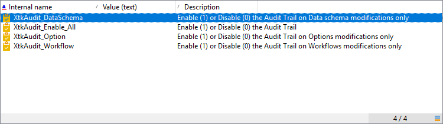

# Granskningskedja{#audit-trail}

I Adobe Campaign **[!UICONTROL Audit trail]** ger dig tillgång till den fullständiga historiken över ändringar som gjorts i instansen.

**[!UICONTROL Audit trail]** i realtid innehåller en omfattande lista över åtgärder och händelser som inträffar i din Adobe Campaign-instans. Det innehåller ett självbetjäningssätt att komma åt en datahistorik som kan hjälpa dig att besvara frågor som: vad som hände med dina arbetsflöden och vem som senast uppdaterade dem eller vad gjorde användarna i instansen.

>[!NOTE]
>
>Adobe Campaign granskar inte ändringar som gjorts i användarrättigheter, mallar, personalisering eller kampanjer.\
>Granskningsspårning kan bara hanteras av administratörer för instansen.

Granskningsspårning består av tre komponenter:

* **Schema - granskningsspår**: Kontrollera aktiviteterna och de senaste ändringarna av dina scheman.

   Mer information om scheman finns i [page](../../configuration/using/data-schemas.md).

* **Granskningsspår för arbetsflöde**: Kontrollera aktiviteter och de senaste ändringarna av arbetsflöden, och dessutom status för dina arbetsflöden, till exempel:

   * Starta
   * Pausa
   * Stoppa
   * Starta om
   * Rensa som är lika med åtgärden Rensa historik
   * Simulera vilket motsvarar åtgärden Starta i simuleringsläge
   * Aktivering som är lika med åtgärden Kör väntande uppgifter nu
   * Ovillkorligt stopp

   Mer information om arbetsflöden finns i [page](../../workflow/using/about-workflows.md).

   Mer information om hur du övervakar arbetsflöden finns i [dedikerad sektion](../../workflow/using/monitoring-workflow-execution.md).

* **Alternativ granskningsspår**: Kontrollera aktiviteterna och de senaste ändringarna som du gjort.

   Mer information om alternativen finns i [page](../../installation/using/configuring-campaign-options.md).

## Åtkomst till granskningsspår {#accessing-audit-trail}

Så här kommer du åt instansens **[!UICONTROL Audit trail]** :

1. Öppna **[!UICONTROL Explorer]** -menyn för instansen.
1. Under **[!UICONTROL Administration]** meny, välja **[!UICONTROL Audit]** .

   

1. The **[!UICONTROL Audit trail]** öppnas med listan över dina enheter. Adobe Campaign granskar åtgärderna för att skapa, redigera och ta bort för arbetsflöden, alternativ och scheman.

   Välj en av enheterna om du vill veta mer om de senaste ändringarna.

   

1. The **[!UICONTROL Audit entity]** I fönstret finns mer detaljerad information om den valda enheten, till exempel:

   * **[!UICONTROL Type]** : Arbetsflöde, alternativ eller scheman.
   * **[!UICONTROL Entity]** : Internt namn på dina aktiviteter.
   * **[!UICONTROL Modified by]** : Användarnamn för den senaste personen som senast ändrade den här entiteten.
   * **[!UICONTROL Action]** : Senaste åtgärden som utfördes på den här entiteten, antingen Skapad, Redigerad eller Borttagen.
   * **[!UICONTROL Modification date]** : Datum för den senaste åtgärden som utfördes på den här entiteten.

   Kodblocket ger dig mer information om exakt vad som har ändrats i din enhet.

   

>[!NOTE]
>
>Som standard är kvarhållningsperioden inställd på 180 dagar för **[!UICONTROL Audit logs]** . Mer information om hur du ändrar kvarhållningsperioden finns i [page](../../production/using/database-cleanup-workflow.md#deployment-wizard).

## Aktivera/inaktivera granskningsspår {#enable-disable-audit-trail}

Granskningsspårning kan enkelt aktiveras eller inaktiveras för en viss aktivitet om du t.ex. vill spara utrymme i databasen.

För att göra detta:

1. Öppna **[!UICONTROL Explorer]** -menyn för instansen.
1. Under **[!UICONTROL Administration]** meny, välja **[!UICONTROL Platform]** sedan **[!UICONTROL Options]** .

   

1. Välj något av följande alternativ beroende på vilken enhet du vill aktivera/inaktivera:

   * För arbetsflöde: **[!UICONTROL XtkAudit_Workflows]**
   * För scheman: **[!UICONTROL XtkAudit_DataSchema]**
   * För alternativ: **[!UICONTROL XtkAudit_Option]**
   * För varje enhet: **[!UICONTROL XtkAudit_Enable_All]**

   

1. Ändra **[!UICONTROL Value]** till 1 om du vill aktivera enheten eller till 0 om du vill inaktivera den.

   

1. Klicka på **[!UICONTROL Save]** .
