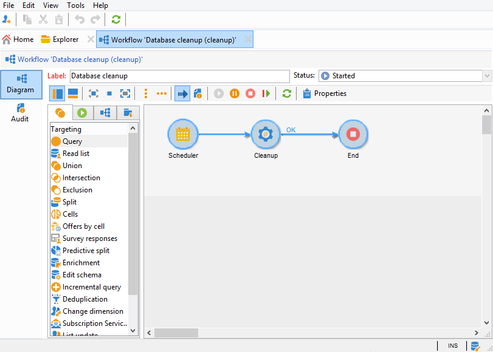

# Arbetsflöde för databasrensning{#database-cleanup-workflow}

## Introduktion {#introduction}

Med det arbetsflöde som är tillgängligt via **[!UICONTROL Database cleanup]** **[!UICONTROL Administration > Production > Technical workflows]** noden kan du ta bort föråldrade data för att undvika exponentiell tillväxt i databasen. Arbetsflödet utlöses automatiskt utan att användaren behöver göra något.



## Konfiguration {#configuration}

Databasrensningen är konfigurerad på två nivåer: i arbetsflödets schemaläggare och i distributionsguiden.

### Schemaläggaren {#the-scheduler}

>[!NOTE]
>
>Mer information om schemaläggaren finns i [det här avsnittet](../../workflow/using/scheduler.md).

Som standard är arbetsflödet konfigurerat så att det startar varje dag kl. 4.00. **[!UICONTROL Database cleanup]** Med schemaläggaren kan du ändra arbetsflödets utlösande frekvens. Följande frekvenser är tillgängliga:

* **[!UICONTROL Several times a day]**
* **[!UICONTROL Daily]**
* **[!UICONTROL Weekly]**
* **[!UICONTROL Once]**


>[!CAUTION]
>
>Arbetsflödesmotorn (wfserver) måste startas för att arbetsflödet ska kunna starta vid det datum och den tid som anges i schemaläggaren. **[!UICONTROL Database cleanup]** Om så inte är fallet kommer ingen databasrensning att utföras förrän nästa gång arbetsflödesmotorn startas.

### Distributionsguide {#deployment-wizard}

Med **[!UICONTROL Deployment wizard]** , som du kommer åt via **[!UICONTROL Tools > Advanced]** menyn, kan du konfigurera hur länge data ska sparas. Värdena anges i dagar. Om dessa värden inte ändras används standardvärdena i arbetsflödet.


Fönstrets fält **[!UICONTROL Purge of data]** sammanfaller med följande alternativ. Dessa används av vissa av de åtgärder som utförs i **[!UICONTROL Database cleanup]** arbetsflödet:

* Konsoliderad spårning: **NmsCleanup_TrackingStatPurgeDelay** (se [Rensa spårningsloggar](#cleanup-of-tracking-logs))
* Leveransloggar: **NmsCleanup_BroadLogPurgeDelay** (se [Rensa leveransloggar](#cleanup-of-delivery-logs))
* Spårningsloggar: **NmsCleanup_TrackingLogPurgeDelay** (se [Rensa spårningsloggar](#cleanup-of-tracking-logs))
* Borttagna leveranser: **NmsCleanup_RecycledDeliveryPurgeDelay** (se [Rensa leveranser som ska tas bort eller återvinnas](#cleanup-of-deliveries-to-be-deleted-or-recycled))
* Importavvisanden: **NmsCleanup_RejectsPurgeDelay** (se [Rensa nekanden som genererats av importer](#cleanup-of-rejects-generated-by-imports-))
* Besökarprofiler: **NmsCleanup_VisitorPurgeDelay** (se [Rensa besökare](#cleanup-of-visitors))
* Erbjudandeförslag: **NmsCleanup_PropositionPurgeDelay** (se [Rensa förslag](#cleanup-of-propositions))

   >[!NOTE]
   >
   >Fältet är bara tillgängligt när **[!UICONTROL Offer propositions]** interaktionsmodulen **** är installerad.

* Händelser: **NmsCleanup_EventPurgeDelay** (se [Rensa utgångna händelser](#cleansing-expired-events))
* Arkiverade händelser: **NmsCleanup_EventHistoryPurgeDelay** (se [Rensa utgångna händelser](#cleansing-expired-events))

   >[!NOTE]
   >
   >Fälten **[!UICONTROL Events]** och **[!UICONTROL Archived events]** är bara tillgängliga om **meddelandecentermodulen** är installerad.

* Granskningsspår: **XTKCleanup_AuditTrailPurgeDelay** (se [Rensa granskningsspår](#cleanup-of-audit-trail))

Alla åtgärder som utförs av **[!UICONTROL Database cleanup]** arbetsflödet beskrivs i följande avsnitt.

## Uppgifter som utförs i arbetsflödet för databasrensning {#tasks-carried-out-by-the-database-cleanup-workflow}

På det datum och den tid som definieras i arbetsflödets schemaläggare (se [Schemaläggaren](#the-scheduler)) startar arbetsflödesmotorn databasrensningsprocessen. Rensningen av databasen ansluter till databasen och utför åtgärderna i den sekvens som visas nedan.

>[!CAUTION]
>
>Om någon av dessa uppgifter misslyckas kommer följande inte att utföras.\
>SQL-frågor med ett **LIMIT** -attribut körs upprepade gånger tills all information har bearbetats.

>[!NOTE]
>
>Avsnitten nedan som beskriver de åtgärder som utförs i arbetsflödet för databasrensning är reserverade för databasadministratörer eller användare som är bekanta med SQL-språk.

### Listor som ska tas bort {#lists-to-delete-cleanup}

Den första åtgärden som utförs av **[!UICONTROL Database cleanup]** arbetsflödet tar bort alla grupper med **deleteStatus != 0** -attribut från **NmsGroup**. Poster som är länkade till de här grupperna och som finns i andra tabeller tas också bort.

1. Listor som ska tas bort återställs med följande SQL-fråga:

   ```
   SELECT iGroupId, sLabel, iType FROM NmsGroup WHERE iDeleteStatus <> 0 OR tsExpirationDate <= GetDate() 
   ```

1. Varje lista har flera länkar till andra tabeller. Alla länkarna tas bort i grupp med följande fråga:

   ```
   DELETE FROM $(relatedTable) WHERE iGroupId=$(l) IN (SELECT iGroupId FROM $(relatedTable) WHERE iGroupId=$(l) LIMIT 5000) 
   ```

   där **$(relatedTable)** är en tabell som är relaterad till **NmsGroup** och **$(l)** är listidentifieraren.

1. När listan är en lista av typen List tas den associerade tabellen bort med följande fråga:

   ```
   DROP TABLE grp$(l)
   ```

1. Alla **** typlistor som har återställts av åtgärden tas bort med följande fråga:

   ```
   DELETE FROM NmsGroup WHERE iGroupId=$(l) 
   ```

   där **$(l)** är listidentifieraren

### Rensa leveranser som ska raderas eller återvinnas {#cleanup-of-deliveries-to-be-deleted-or-recycled}

Den här aktiviteten rensar alla leveranser som ska tas bort eller återvinnas.

1. Arbetsflödet **[!UICONTROL Database cleanup]** väljer alla leveranser för vilka **deleteStatus** -fältet har värdet **[!UICONTROL Yes]** eller **[!UICONTROL Recycled]** borttagningsdatumet och vars borttagningsdatum är tidigare än den period som definieras i **[!UICONTROL Deleted deliveries]** fältet (**NmsCleanup_RecycledDeliveryPurgeDelay**) i distributionsguiden. Mer information finns i [Distributionsguiden](#deployment-wizard). Perioden beräknas i relation till aktuellt serverdatum.
1. För varje server med mellanleverantörer väljer aktiviteten listan över leveranser som ska tas bort.
1. Arbetsflödet **[!UICONTROL Database cleanup]** tar bort leveransloggar, bilagor, information om spegelsidor och alla andra relaterade data.
1. Innan leveransen tas bort rensas länkad information från följande tabeller bort:

   * Följande fråga används i tabellen för uteslutning av leverans (**NmsDlvExclusion**):

      ```
      DELETE FROM NmsDlvExclusion WHERE iDeliveryId=$(l)
      ```

      där **$(l)** är leveransens identifierare.

   * I kupongtabellen (**NmsCouponValue**) används följande fråga (med massborttagningar):

      ```
      DELETE FROM NmsCouponValue WHERE iMessageId IN (SELECT iMessageId FROM NmsCouponValue WHERE EXISTS (SELECT B.iBroadLogId FROM $(BroadLogTableName) B WHERE B.iDeliveryId = $(l) AND B.iBroadLogId = iMessageId ) LIMIT 5000)
      ```

      där **$(l)** är leveransens identifierare.

   * I leveransloggtabellerna (**NmsBroadlogXx**) utförs massborttagningar i grupper om 20 000 poster.
   * I offert-förslagstabellerna (**NmsPropositionXx**) utförs massborttagningar i grupper om 20 000 poster.
   * I spårningsloggtabellerna (**NmsTrackinglogXx**) utförs massborttagningar i grupper om 20 000 poster.
   * I leveransfragmenttabellen (**NmsDeliveryPart**) utförs massborttagningar i grupper om 500 000 poster. Tabellen innehåller information om personalisering av de meddelanden som återstår att leverera.
   * I spegelsidans datagragmenttabell (**NmsMirrorPageInfo**) utförs massborttagningar i grupper om 20 000 poster för utgångna leveransdelar och för avslutade eller annullerade delar. Den här tabellen innehåller personaliseringsinformation om alla meddelanden som används för att generera spegelsidor.
   * I söktabellen med spegelsidor (**NmsMirrorPageSearch**) utförs massborttagningar i grupper om 20 000 poster. Det här registret är ett sökindex som ger åtkomst till anpassningsinformation som lagras i **tabellen NmsMirrorPageInfo** .
   * I loggtabellen för gruppbearbetning (**XtkJobLog**) utförs massborttagningar i grupper om 20 000 poster. Det här registret innehåller loggen över leveranser som ska tas bort.
   * I URL-spårningstabellen för leverans (**NmsTrackingUrl**) används följande fråga:

      ```
      DELETE FROM NmsTrackingUrl WHERE iDeliveryId=$(l)
      ```

      där **$(l)** är leveransens identifierare.

      Den här tabellen innehåller de URL:er som finns i leveranserna som ska tas bort för att aktivera spårning av dem.

1. Leveransen tas bort från leveranstabellen (**NmsDelivery**):

   ```
   DELETE FROM NmsDelivery WHERE iDeliveryId = $(l)
   ```

   där **$(l)** är leveransens identifierare.

#### Leveranser med medelhög källkod {#deliveries-using-mid-sourcing}

Arbetsflödet tar också bort leveranser från **[!UICONTROL Database cleanup]** servern/servrarna med mellankällor.

1. För att göra detta kontrollerar arbetsflödet att varje leverans är inaktiv (baserat på dess status). Om en leverans är aktiv stoppas den innan den tas bort. Kontrollen utförs genom att följande fråga körs:

   ```
   SELECT iState FROM NmsDelivery WHERE iDeliveryId = $(l) AND iState <> 100;
   ```

   där **$(l)** är leveransens identifierare.

1. Om statusvärdet är **[!UICONTROL Start pending]** , **[!UICONTROL In progress]** , **[!UICONTROL Recovery pending]** , **[!UICONTROL Recovery in progress]** , **[!UICONTROL Pause requested]** , **[!UICONTROL Pause in progress]** eller **[!UICONTROL Paused]** (värdena 51, 55, 61, 62, 71, 72, 75) stoppas leveransen och aktiviteten rensar den länkade informationen.

### Rensa utgångna leveranser {#cleanup-of-expired-deliveries}

Den här aktiviteten stoppar leveranser vars giltighetsperiod har gått ut.

1. Arbetsflödet **[!UICONTROL Database cleanup]** skapar en lista över leveranser som har upphört att gälla. Den här listan innehåller alla utgångna leveranser med en annan status än **[!UICONTROL Finished]** samt nyligen stoppade leveranser med över 10 000 obearbetade meddelanden. Följande fråga används:

   ```
   SELECT iDeliveryId, iState FROM NmsDelivery WHERE iDeleteStatus=0 AND iIsModel=0 AND iDeliveryMode=1 AND ( (iState >= 51 AND iState < 85 AND tsValidity IS NOT NULL AND tsValidity < $(currentDate) ) OR (iState = 85 AND DateMinusDays(15) < tsLastModified AND iToDeliver - iProcessed >= 10000 ))
   ```

   där **leveransläge 1** matchar **[!UICONTROL Mass delivery]** läget, **läge 51** matchar **[!UICONTROL Start pending]** läget, **läge 85** matchar **[!UICONTROL Stopped]** läget och det högsta antalet massuppdateringar av leveransloggar på leveransservern är 10 000.

1. Arbetsflödet innehåller sedan en lista över nyligen utgångna leveranser som använder mellanleverantörer. Leveranser för vilka inga leveransloggar har återställts via servern med mellanlagring är undantagna.

   Följande fråga används:

   ```
   SELECT iDeliveryId, tsValidity, iMidRemoteId, mData FROM NmsDelivery WHERE (iDeliveryMode = 4 AND (iState = 85 OR iState = 95) AND tsValidity IS NOT NULL AND (tsValidity < SubDays(GetDate() , 15) OR tsValidity < $(DateOfLastLogPullUp)) AND tsLastModified > SubDays(GetDate() , 15))
   ```

1. Följande fråga används för att identifiera om det externa kontot fortfarande är aktivt eller inte, för att filtrera leveranser efter datum:

   ```
   SELECT iExtAccountId FROM NmsExtAccount WHERE iActive<>0 AND sName=$(providerName)
   ```

1. I listan över utgångna leveranser växlar leveransloggar med statusen **[!UICONTROL Pending]** , växlar till **[!UICONTROL Delivery cancelled]** och alla leveranser i listan till **[!UICONTROL Finished]** .

   Följande frågor används:

   ```
   UPDATE $(BroadLogTableName) SET tsLastModified=$(curdate), iStatus=7, iMsgId=$(bl) WHERE iDeliveryId=$(dl) AND iStatus=6
   ```

   där **$(curdate)** är databasserverns aktuella datum, **$(bl)** är identifieraren för leveransloggmeddelandet, **$(dl)** är leveransidentifieraren, **leveransstatus 6** matchar **[!UICONTROL Pending]** status och **** **[!UICONTROL Delivery cancelled]** leveransstatus 7¥ matchar¥-statusen.

   ```
   UPDATE NmsDelivery SET iState = 95, tsLastModified = $(curdate), tsBroadEnd = tsValidity WHERE iDeliveryId = $(dl)
   ```

   där **leveransstatus 95** matchar **[!UICONTROL Finished]** status och **$(dl)** är leveransens identifierare.

1. Alla fragment (**deliveryParts**) av föråldrade leveranser tas bort och alla föråldrade fragment av pågående meddelandeleveranser tas bort. Massborttagning används för båda dessa uppgifter.

   Följande frågor används:

   ```
   DELETE FROM NmsDeliveryPart WHERE iDeliveryPartId IN (SELECT iDeliveryPartId FROM NmsDeliveryPart WHERE iDeliveryId IN (SELECT iDeliveryId FROM NmsDelivery WHERE iState=95 OR iState=85) LIMIT 5000)
   ```

   ```
   DELETE FROM NmsDeliveryPart WHERE iDeliveryPartId IN (SELECT iDeliveryPartId FROM NmsDeliveryPart WHERE tsValidity < $(curDate) LIMIT 500000)
   ```

   där **leveransstatus 95** matchar **[!UICONTROL Finished]** status, **leveransstatus 85** matchar **[!UICONTROL Stopped]** status och **$(curDate)** är aktuellt serverdatum.

### Rensa spegelsidor {#cleanup-of-mirror-pages}

Den här uppgiften tar bort de webbresurser (spegelsidor) som används av leveranser.

1. Först och främst återställs listan över leveranser som ska rensas med följande fråga:

   ```
   SELECT iDeliveryId, iNeedMirrorPage FROM NmsDelivery WHERE iWebResPurged = 0 AND tsWebValidity IS NOT NULL AND tsWebValidity < $(curdate)"
   ```

   där **$(curDate)** är aktuellt serverdatum.

1. Tabellen **NmsMirrorPageInfo** rensas, om det behövs med hjälp av identifieraren för den tidigare återskapade leveransen. Massborttagning används för att generera följande frågor:

   ```
   DELETE FROM NmsMirrorPageInfo WHERE iMirrorPageInfoId IN (SELECT iMirrorPageInfoId FROM NmsMirrorPageInfo WHERE iDeliveryId = $(dl)) LIMIT 5000)
   ```

   ```
   DELETE FROM NmsMirrorPageSearch WHERE iMessageId IN (SELECT iMessageId FROM NmsMirrorPageSearch WHERE iDeliveryId = $(dl)) LIMIT 5000)
   ```

   där **$(dl)** är leveransens identifierare.

1. En post läggs sedan till i leveransloggen.
1. Rensade leveranser identifieras sedan så att de inte behöver bearbetas igen senare. Följande fråga körs:

   ```
   UPDATE NmsDelivery SET iWebResPurged = 1 WHERE iDeliveryId IN ($(strIn))
   ```

   där **$(strIn)** är listan över leveransidentifierare.

### Rensa arbetsregister {#cleanup-of-work-tables}

Den här uppgiften tar bort alla arbetsregister som matchar leveranser vars status är **[!UICONTROL Being edited]** , **[!UICONTROL Stopped]** eller **[!UICONTROL Deleted]** .

1. Listan med tabeller med namn som börjar med **wkDlv_** återställs först med följande fråga (postgresql):

   ```
   SELECT relname FROM pg_class WHERE relname LIKE Lower('wkDlv_') ESCAPE E'\\' AND relkind IN ('r','v') AND pg_get_userbyid(relowner)<>'postgres'
   ```

1. Tabellerna som används av pågående arbetsflöden exkluderas sedan. För att göra detta återställs listan över pågående leveranser med följande fråga:

   ```
   SELECT iDeliveryId FROM NmsDelivery WHERE iDeliveryId<>0 AND iDeleteStatus=0 AND iState NOT IN (0,85,100);
   ```

   där 0 är värdet som matchar **[!UICONTROL Being edited]** leveransstatusen, matchar 85 **[!UICONTROL Stopped]** statusen och 100 matchar **[!UICONTROL Deleted]** statusen.

1. Tabeller som inte längre används tas bort med följande fråga:

   ```
   DROP TABLE wkDlv_15487_1;
   ```

### Rensa nekanden som genererats av import {#cleanup-of-rejects-generated-by-imports-}

I det här steget kan du ta bort poster som inte bearbetades av alla data under importen.

1. Massborttagning utförs i **XtkReject** -tabellen med följande fråga:

   ```
   DELETE FROM XtkReject WHERE iRejectId IN (SELECT iRejectId FROM XtkReject WHERE tsLog < $(curDate)) LIMIT $(l))
   ```

   där **$(curDate)** är det aktuella serverdatumet från vilket vi subtraherar den period som är definierad för alternativet **NmsCleanup_RejectsPurgeDelay** (se [distributionsguiden](#deployment-wizard)) och **$(l)** är det högsta antalet poster som kan masstas bort.

1. Alla ignorerade objekt tas sedan bort med följande fråga:

   ```
   DELETE FROM XtkReject WHERE iJobId NOT IN (SELECT iJobId FROM XtkJob)
   ```

### Rensa arbetsflödesinstanser {#cleanup-of-workflow-instances}

Den här aktiviteten rensar varje arbetsflödesinstans med dess identifierare (**lWorkflowId**) och historik (**lHistory**). Den tar bort inaktiva tabeller genom att köra arbetstabellrensningsåtgärden igen.

>[!NOTE]
>
>Historikens tömningsfrekvens anges för varje arbetsflöde i fältet **Historik i dagar** (standardvärde 30 dagar). Det här fältet finns på fliken **Körning** i arbetsflödesegenskaperna. Mer information finns i [det här avsnittet](../../workflow/using/workflow-properties.md#execution).

1. Följande fråga används för att återställa listan med arbetsflöden som ska tas bort:

   ```
   SELECT iWorkflowId, iHistory FROM XtkWorkflow WHERE iWorkflowId<>0
   ```

1. Den här frågan genererar en lista över arbetsflöden som kommer att användas för att ta bort alla länkade loggar, slutförda uppgifter och slutförda händelser med hjälp av följande frågor:

   ```
   DELETE FROM XtkWorkflowLog WHERE iWorkflowId=$(lworkflow) AND tsLog < DateMinusDays($(lhistory))
   ```

   ```
   DELETE FROM XtkWorkflowTask WHERE iWorkflowId=$(lworkflow) AND iStatus<>0 AND tsCompletion < DateMinusDays($(lhistory)) 
   ```

   ```
   DELETE FROM XtkWorkflowEvent WHERE iWorkflowId=$(l) AND iStatus>2 AND tsProcessing < DateMinusDays($(lHistory))
   ```

   där **$(lworkflow)** är arbetsflödets identifierare och **$(lhistory)** historikens identifierare.

1. Alla oanvända tabeller tas bort. För detta ändamål samlas alla tabeller in tack vare en **wkf%** -typmask med hjälp av följande fråga (postgresql):

   ```
   SELECT relname FROM pg_class WHERE relname LIKE Lower('wkf%') ESCAPE E'\\' AND relkind IN ('r','v') AND pg_get_userbyid(relowner)<>'postgres'
   ```

1. Därefter exkluderas alla tabeller som används av en väntande arbetsflödesinstans. Listan över aktiva arbetsflöden återställs med följande fråga:

   ```
   SELECT iWorkflowId FROM XtkWorkflow WHERE iWorkflowId<>0 AND iState<>20
   ```

1. Varje arbetsflödes-ID återställs sedan för att hitta namnet på tabellerna som används i pågående arbetsflöden. Dessa namn tas inte med i listan över tidigare återställda tabeller.
1. Aktivitetshistoriktabeller av typen &quot;inkrementell fråga&quot; exkluderas med hjälp av följande frågor:

   ```
   SELECT relname FROM pg_class WHERE relname LIKE Lower('wkfhisto%') ESCAPE E'\\' AND relkind IN ('r','v') AND pg_get_userbyid(relowner)<>'postgres'
   ```

   ```
   SELECT iWorkflowId FROM XtkWorkflow WHERE iWorkflowId IN ($(strCondition))
   ```

   där **$(strcondition)** är listan med tabeller som matchar **wkfhisto%** -masken.

1. De återstående tabellerna tas bort med följande fråga:

   ```
   DROP TABLE wkf15487_12;
   ```

### Rensa arbetsflödesinloggningar {#cleanup-of-workflow-logins}

Den här uppgiften tar bort arbetsflödesinloggningar med följande fråga:

```
DELETE FROM XtkWorkflowLogin WHERE iWorkflowId NOT IN (SELECT iWorkflowId FROM XtkWorkflow)
```

### Rensa tabeller över överblivna arbeten {#cleanup-of-orphan-work-tables}

Den här aktiviteten tar bort överblivna arbetsregister som är länkade till grupper. Registret **NmsGroup** lagrar de grupper som ska rensas (med en annan typ än 0). Prefixet för tabellnamnen är **grp**. Följande fråga används för att identifiera de grupper som ska rensas:

```
SELECT iGroupId FROM NmsGroup WHERE iType>0"
```

### Rensa besökare {#cleanup-of-visitors}

Den här uppgiften tar bort inaktuella poster från besökstabellen med massborttagning. Föråldrade poster är poster för vilka den senaste ändringen är tidigare än den bevarandeperiod som definierats i distributionsguiden (se [distributionsguiden](#deployment-wizard)). Följande fråga används:

```
DELETE FROM NmsVisitor WHERE iVisitorId IN (SELECT iVisitorId FROM NmsVisitor WHERE iRecipientId = 0 AND tsLastModified < $(tsDate) LIMIT 5000)
```

där **$(tsDate)** är det aktuella serverdatumet, från vilket vi subtraherar den period som definierats för alternativet **NmsCleanup_VisitorPurgeDelay** .

### Rengöring av NPAI {#cleanup-of-npai}

Med den här aktiviteten kan du ta bort poster som matchar giltiga adresser från **NmsAddress** -tabellen. Följande fråga används för att utföra massborttagning:

```
DELETE FROM NmsAddress WHERE iAddressId IN (SELECT iAddressId FROM NmsAddress WHERE iStatus=2 AND tsLastModified < $(tsDate1) AND tsLastModified >= $(tsDate2) LIMIT 5000)
```

där **status 2** matchar **[!UICONTROL Valid]** status, **$(tsDate1)** är det aktuella serverdatumet och **$(tsDate2)** matchar alternativet **NmsCleanup_LastCleanup** .

### Rensa prenumerationer {#cleanup-of-subscriptions-}

Den här aktiviteten tar bort alla prenumerationer som tagits bort av användaren från **NmsSubscription** -tabellen med massborttagning. Följande fråga används:

```
DELETE FROM NmsSubscription WHERE iDeleteStatus <>0
```

### Rensa spårningsloggar {#cleanup-of-tracking-logs}

Den här uppgiften tar bort inaktuella poster från loggtabellerna för spårning och webbspårning. Föråldrade poster är poster som är tidigare än den bevarandeperiod som definieras i distributionsguiden (se [distributionsguiden](#deployment-wizard)).

1. Först återställs listan med spårningsloggtabeller med följande fråga:

   ```
   SELECT distinct(sTrackingLogSchema) FROM NmsDeliveryMapping WHERE sTrackingLogSchema IS NOT NULL;
   ```

1. Massborttagning används för att rensa alla tabeller i listan med tidigare återskapade tabeller. Följande fråga används:

   ```
   DELETE FROM XtkTrackingLogRcp WHERE iTrackingLogId IN (SELECT iTrackingLogId FROM XtkTrackingLogRcp WHERE tsLog < $(tsDate) LIMIT 5000) 
   ```

   där **$(tsDate)** är det aktuella serverdatumet från vilket vi subtraherar den period som definierats för alternativet **NmsCleanup_TrackingLogPurgeDelay** .

1. Registret för spårningsstatistik rensas med massborttagning. Följande fråga används:

   ```
   DELETE FROM NmsTrackingStats WHERE iTrackingStatsId IN (SELECT iTrackingStatsId FROM NmsTrackingStats WHERE tsStart < $(tsDate) LIMIT 5000) 
   ```

   där **$(tsDate)** är det aktuella serverdatumet från vilket vi subtraherar den period som definierats för alternativet **NmsCleanup_TrackingStatPurgeDelay** .

### Rensa leveransloggar {#cleanup-of-delivery-logs}

Med den här uppgiften kan du rensa leveransloggarna som lagras i olika tabeller.

1. För detta ändamål återställs listan med leveransloggscheman med följande fråga:

   ```
   SELECT distinct(sBroadLogSchema) FROM NmsDeliveryMapping WHERE sBroadLogSchema IS NOT NULL UNION SELECT distinct(sBroadLogExclSchema) FROM NmsDeliveryMapping WHERE sBroadLogExclSchema IS NOT NULL
   ```

1. När du använder mellanleverantörer refereras inte **NmsBroadLogMid** -tabellen i leveransmappningar. Schemat **nms:broadLogMid** läggs till i listan som återställdes av föregående fråga.
1. Arbetsflödet för rensning **av** databas tar sedan bort föråldrade data från tidigare återställda tabeller. Följande fråga används:

   ```
   DELETE FROM $(tableName) WHERE iBroadLogId IN (SELECT iBroadLogId FROM $(tableName) WHERE tsLastModified < $(option) LIMIT 5000) 
   ```

   där **$(tableName)** är namnet på varje tabell i schemalistan, och **$(option)** är det datum som definieras för alternativet **NmsCleanup_BroadLogPurgeDelay** (se [distributionsguiden](#deployment-wizard)).

1. Arbetsflödet kontrollerar slutligen om **NmsProviderMsgId** -tabellen finns. Om så är fallet tas alla föråldrade data bort med följande fråga:

   ```
   DELETE FROM NmsProviderMsgId WHERE iBroadLogId IN (SELECT iBroadLogId FROM NmsProviderMsgId WHERE tsCreated < $(option) LIMIT 5000)
   ```

   där **$(option)** matchar det datum som definierats för alternativet **NmsCleanup_BroadLogPurgeDelay** (se [distributionsguiden](#deployment-wizard)).

### Rensning av tabellen NmsEmailErrorStat {#cleanup-of-the-nmsemailerrorstat-table-}

Den här aktiviteten rensar **tabellen NmsEmailErrorStat** . Huvudprogrammet (**coalesceErrors**) definierar två datum:

* **Startdatum**: datum för nästa process som matchar alternativet **NmsLastErrorStatusCoalesce** eller det senaste datumet i tabellen.
* **Slutdatum**: aktuellt serverdatum.

Om startdatumet är senare än eller lika med slutdatumet utförs ingen process. I det här fallet visas **meddelandet coalesceUpToDate** .

Om startdatumet är tidigare än slutdatumet rensas tabellen **NmsEmailErrorStat** .

Det totala antalet fel i **tabellen NmsEmailErrorStat** mellan start- och slutdatum återställs med följande fråga:

```
"SELECT COUNT(*) FROM NmsEmailErrorStat WHERE tsDate>= $(start) AND tsDate< $(end)"
```

där **$end** och **$start** är de start- och slutdatum som definierats tidigare.

Om summan är större än 0:

1. Följande fråga utförs för att bara hålla fel utanför ett visst tröskelvärde (vilket är lika med 20):

   ```
   "SELECT iMXIP, iPublicId, SUM(iTotalConnections), SUM(iTotalErrors), SUM(iMessageErrors), SUM(iAbortedConnections), SUM(iFailedConnections), SUM(iRefusedConnections), SUM(iTimeoutConnections) FROM NmsEmailErrorStat WHERE tsDate>=$(start ) AND tsDate<$(end ) GROUP BY iMXIP, iPublicId HAVING SUM(iTotalErrors) >= 20"
   ```

1. Meddelandet **coalescingErrors** visas.
1. En ny anslutning skapas för att ta bort alla fel som inträffade mellan start- och slutdatumet. Följande fråga används:

   ```
   "DELETE FROM NmsEmailErrorStat WHERE tsDate>=$(start) AND tsDate<$(end)"
   ```

1. Varje fel sparas i **tabellen NmsEmailErrorStat** med följande fråga:

   ```
   "INSERT INTO NmsEmailErrorStat(iMXIP, iPublicId, tsDate, iTotalConnections, iTotalErrors, iTimeoutConnections, iRefusedConnections, iAbortedConnections, iFailedConnections, iMessageErrors) VALUES($(lmxip ), $(lpublicId ), $(tsstart ), $(lconnections ), $(lconnectionErrors ),$(ltimeoutConnections ), $(lrefusedConnections ), $(labortedConnections ), $(lfailedConnections ), $(lmessageErrors))"
   ```

   där varje variabel matchar ett värde som återställdes av föregående fråga.

1. Startvariabeln **uppdateras** med värdena från föregående process för att slutföra slingan.

Slingan och aktivitetsstoppet.

Rensningar utförs i **tabellerna NmsEmailError** och **cleanupNmsMxDomain** .

### Rensning av tabellen NmsEmailError {#cleanup-of-the-nmsemailerror-table-}

Följande fråga används:

```
DELETE FROM NmsEmailError WHERE iMXIP NOT IN (SELECT DISTINCT iMXIP FROM NmsEmailErrorStat)
```

Den här frågan tar bort alla rader utan länkade poster i **NmsEmailErrorStat** från **tabellen NmsEmailError** .

### Rensa NmsMxDomain-tabellen {#cleanup-of-the-nmsmxdomain-table-}

Följande fråga används:

```
DELETE FROM NmsMxDomain WHERE iMXIP NOT IN (SELECT DISTINCT iMXIP FROM NmsEmailErrorStat)
```

Den här frågan tar bort alla rader utan en länkad post i **tabellen NmsEmailErrorStat** från **tabellen NmsMxDomain** .

### Rensa förslag {#cleanup-of-propositions}

Om **interaktionsmodulen** är installerad körs den här aktiviteten för att rensa **NmsPropositionXx** -tabellerna.

Listan med förslagstabeller återställs och massborttagning utförs för var och en av dem med hjälp av följande fråga:

```
DELETE FROM NmsPropositionXxx WHERE iPropositionId IN (SELECT iPropositionId FROM NmsPropositionXxx WHERE tsLastModified < $(option) LIMIT 5000) 
```

där **$(option)** är det datum som definieras för alternativet **NmsCleanup_PropositionPurgeDelay** (se [distributionsguiden](#deployment-wizard)).

### Rensa simuleringstabeller {#cleanup-of-simulation-tables}

Den här aktiviteten rensar överblivna simuleringstabeller (som inte längre är länkade till en erbjudandesimulering eller en leveranssimulering).

1. Följande fråga används för att återställa listan med simuleringar som behöver rensas:

   ```
   SELECT iSimulationId FROM NmsSimulation WHERE iSimulationId<>0
   ```

1. Namnet på tabellerna som ska tas bort består av prefixet **wkSimu_** följt av simuleringens identifierare (till exempel: **wkSimu_456831_aggr**):

   ```
   DROP TABLE wkSimu_456831_aggr
   ```

### Rensa granskningsspår {#cleanup-of-audit-trail}

Följande fråga används:

```
DELETE FROM XtkAudit WHERE tsChanged < $(tsDate)
```

där **$(tsDate)** är det aktuella serverdatumet från vilket den period som definierats för alternativet **XtkCleanup_AuditTrailPurgeDelay** delats.

### Rensa Nmsaddress {#cleanup-of-nmsaddress}

Följande fråga används:

```
DELETE FROM NmsAddress WHERE iAddressId IN (SELECT iAddressId FROM NmsAddress WHERE iStatus=STATUS_QUARANTINE AND tsLastModified < $(NmsCleanup_AppSubscriptionRcpPurgeDelay + 5d) AND iType IN (MESSAGETYPE_IOS, MESSAGETYPE_ANDROID ) LIMIT 5000)
```

Den här frågan tar bort alla poster som är relaterade till iOS och Android.

### Statistikuppdatering och lagringsoptimering {#statistics-update}

Med alternativet **XtkCleanup_NoStats** kan du styra beteendet för lagringsoptimeringssteget i rensningsarbetsflödet.

Om alternativet **XtkCleanup_NoStats** inte finns, eller om värdet är 0, kommer detta att köra lagringsoptimeringen i utförligt läge (VACUUM VERBOSE ANALYZE) på PostgreSQL och uppdatera statistik för alla andra databaser. Kontrollera PostgreSQL-loggarna för att se till att kommandot körs. VACUUM kommer att visa rader i formatet: `INFO: vacuuming "public.nmsactivecontact"` och ANALYZE kommer att visa rader i formatet: `INFO: analyzing "public.nmsactivecontact"`.

Om värdet för alternativet är 1 utförs ingen statistikuppdatering i någon databas. Följande loggrad visas i arbetsflödesloggarna: `Option 'XtkCleanup_NoStats' is set to '1'`.

Om värdet för alternativet är 2 körs lagringsanalysen i detaljerat läge (ANALYZE VERBOSE) på PostgreSQL och statistik uppdateras för alla andra databaser. Kontrollera PostgreSQL-loggarna för att se till att kommandot körs. ANALYZE kommer att visa rader i formatet: `INFO: analyzing "public.nmsactivecontact"`.

### Rensning av prenumeration (NMAC) {#subscription-cleanup--nmac-}

Den här uppgiften tar bort alla prenumerationer som rör borttagna tjänster eller mobilprogram.

Följande fråga används för att återställa listan med sändningsscheman:

```
SELECT distinct(sBroadLogSchema) FROM NmsDeliveryMapping WHERE sBroadLogSchema IS NOT NULL
```

Uppgiften återställer sedan namnen på de tabeller som är länkade till **appSubscription** -länken och tar bort dessa tabeller.

Det här rensningsarbetsflödet tar också bort alla poster där inaktiverat = 1 som inte har uppdaterats sedan den tid som angetts i alternativet **NmsCleanup_AppSubscriptionRcpPurgeDelay** .

### Rensar sessionsinformation {#cleansing-session-information}

Den här aktiviteten rensar information från **sessionInfo** -tabellen. Följande fråga används:

```
 DELETE FROM XtkSessionInfo WHERE tsexpiration < $(curdate) 
```

### Rensar utgångna händelser {#cleansing-expired-events}

Den här aktiviteten rensar de händelser som tas emot och lagras på körningsinstanserna och de händelser som arkiveras på en kontrollinstans.

### Rensningsreaktioner {#cleansing-reactions}

Den här aktiviteten rensar de reaktioner ( **NmsRemaMatchRcp**) i vilka hypoteserna har tagits bort.
