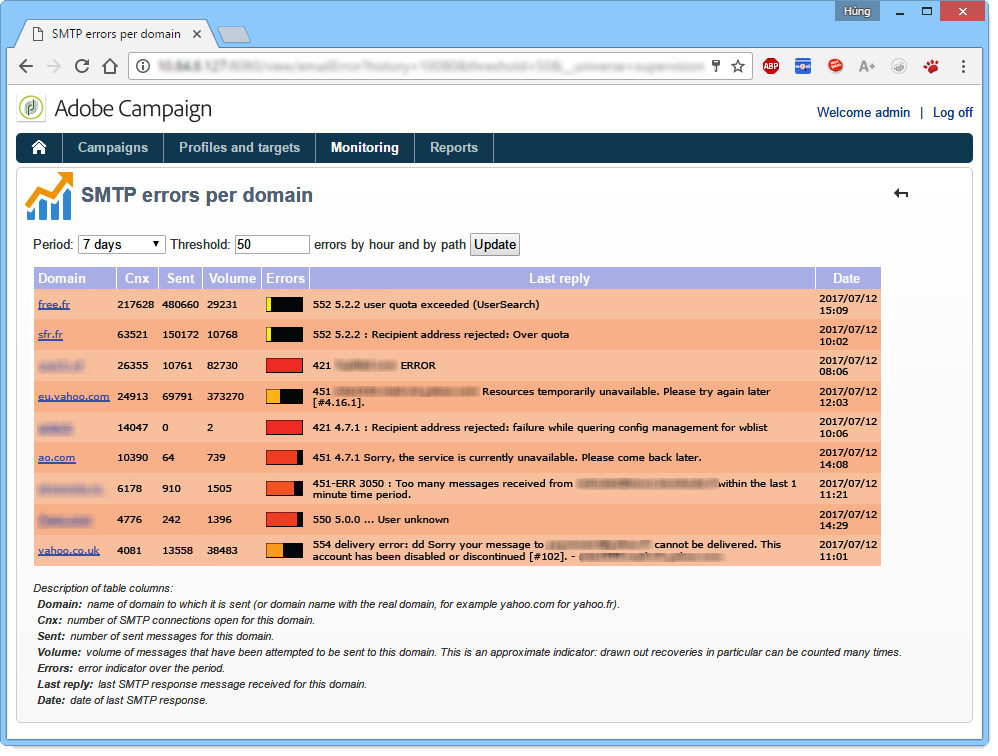

# Övervaka processer{#monitoring-processes}

Programservern och omdirigeringsservern (**spårning**) kan övervakas manuellt eller automatiskt.

## Manuell övervakning {#manual-monitoring}

Gå till **[!UICONTROL Monitoring]** och klicka på **[!UICONTROL Overview]** länken för att visa sidan för processövervakning i Adobe Campaign.


På den sida som visas kan du visa den anslutna instansens tillstånd, dvs:

* information om instansen: version, namn, databasmotor, installerade paket, serversystemindikatorer,
* En förteckning över saknade processer och körningsinformation (startdatum, PID osv.).
* en översikt över arbetsflöden och leveranser.

Ytterligare sätt att övervaka olika Campaign-processer presenteras på [den här sidan](https://helpx.adobe.com/campaign/kb/acc-maintenance.html).

### Loggjournal {#log-journal}

Det går att visa loggjournalen som hör till en process. Det gör du genom att klicka på processen, till **exempel** , och sedan klicka på **[!UICONTROL Open the log journal]** .


### Systemindikatorer {#system-indicators}

Listan med systemindikatorer gör att du kan visa information om datorn, t.ex. dess fysiska och virtuella minne, aktiva processer och tillgängliga diskutrymme. Indikatorer är olika för Linux och Windows. Gå till **[!UICONTROL Instance Monitoring]** sidan och klicka på **[!UICONTROL Display]** länken för att öppna listan över indikatorer

#### I Windows {#in-windows}

* **[!UICONTROL Pending events queued]** : -indikator som är specifik för **meddelandecentret**. Mer information finns i [det här avsnittet](../../message-center/using/monitoring-thresholds.md) .
* **[!UICONTROL Memory]** : Information om det fysiska minnet.

   **[!UICONTROL Current value]** : faktisk minnesförbrukning.

   **[!UICONTROL Max Value]** : den totala mängden installerat minne.

   **[!UICONTROL Available]** : mängden tillgängligt minne.

   **[!UICONTROL Warning]** : den här indikatorn visas när minnesförbrukningen når 80 % av den totala mängden.

   **[!UICONTROL Alert]** : den här indikatorn visas när minnesförbrukningen når 90 % av den totala mängden.

   När indikatorerna **[!UICONTROL Warning]** och **[!UICONTROL Alert]** indikatorerna visas kan du lösa problemet genom att lägga till RAM-minne på datorn som Adobe Campaign-servern är installerad på. Du kan också välja att installera Adobe Campaign-servern på en dedikerad dator.

* **[!UICONTROL Swap Memory]** : information om det virtuella minnet som matchar en växlingsfil: ett område på hårddisken som används som RAM.

   **[!UICONTROL Current value]** : faktisk minnesförbrukning.

   **[!UICONTROL Max Value]** : den totala mängden minne.

   **[!UICONTROL Available]** : mängden tillgängligt minne.

   **[!UICONTROL Warning]** : den här indikatorn visas när minnesförbrukningen når 80 % av den totala mängden.

   **[!UICONTROL Alert]** : den här indikatorn visas när minnesförbrukningen når 90 % av den totala mängden.

   När indikatorerna **[!UICONTROL Warning]** och **[!UICONTROL Alert]** indikatorerna visas kan du lösa problemet genom att öka utbytesfilens storlek i de avancerade Windows-inställningarna.

* **[!UICONTROL Disk XXX]** : information om maskinläsare.

   **[!UICONTROL Current value]** : diskutrymme som faktiskt används.

   **[!UICONTROL Max Value]** : total diskkapacitet.

   **[!UICONTROL Available]** : ledigt diskutrymme

   **[!UICONTROL Used]** : procentandel av disken som används.

   **[!UICONTROL Warning]** : den här indikatorn visas när det tillgängliga diskutrymmet når 80 % av den totala kapaciteten.

   **[!UICONTROL Alert]** : den här indikatorn visas när det tillgängliga diskutrymmet når 90 % av den totala kapaciteten.

* **[!UICONTROL Number of processes too old]** : information om Adobe Campaign-processer som har varit aktiva i mer än en dag.

   **[!UICONTROL Current value]** : antalet aktiva processer.

   **[!UICONTROL Max Value]** : maximalt antal godkända processer (1).

   **[!UICONTROL Alert]** : den här indikatorn visas om antalet processer är lika med 1.

   När indikatorn visas kan det bero på att den berörda processen är låst av SQL-databasmotorn eller att den sitter fast i en oändlig slinga. **[!UICONTROL Alert]** Den **övervakningsprocess** som Adobe Campaign erbjuder startar automatiskt om alla processer varje dag och gör att ni kan lösa det här problemet. Du kan också stoppa den berörda processen själv för att tvinga fram en omstart.

#### I Linux {#in-linux}


* **[!UICONTROL Pending events queued]** : -indikator som är specifik för **meddelandecentret**. Mer information finns i [det här avsnittet](../../message-center/using/monitoring-thresholds.md) .
* **[!UICONTROL Load average (1/5/15 minutes)]** : Uppgifter om belastningen, dvs. processorns användningshastighet för de processer som körs på maskinen under den senaste minuten, fem minuter eller femton minuter.

   **[!UICONTROL Current value]** : maskinens faktiska belastning.

   **[!UICONTROL Max value]** : högsta användningsbelastning för processen/processerna på datorn

   **[!UICONTROL Warning]** : den här indikatorn visas när belastningen når 80 % av det högsta tillåtna värdet under den senaste minuten, fem minuter eller femton minuter.

   **[!UICONTROL Alert]** : den här indikatorn visas när belastningen når 90 % av det högsta tillåtna värdet för den sista minuten, fem minuter eller femton minuter.

* **[!UICONTROL Memory]** : Information om det fysiska minnet.

   **[!UICONTROL Current value]** : faktisk minnesförbrukning.

   **[!UICONTROL Max Value]** : den totala mängden installerat minne.

   **[!UICONTROL Available]** : mängden tillgängligt minne.

   **[!UICONTROL Warning]** : den här indikatorn visas när minnesförbrukningen når 80 % av den totala mängden.

   **[!UICONTROL Alert]** : den här indikatorn visas när minnesförbrukningen når 90 % av den totala mängden.

   När indikatorerna **[!UICONTROL Warning]** och **[!UICONTROL Alert]** indikatorerna visas kan du lösa problemet genom att lägga till RAM-minne på datorn som Adobe Campaign-servern är installerad på. Du kan också välja att installera Adobe Campaign-servern på en dedikerad dator.

* **[!UICONTROL Swap Memory]** : information om det virtuella minnet som matchar en växlingsfil: ett område på hårddisken som används som RAM.

   **[!UICONTROL Current value]** : faktisk minnesförbrukning.

   **[!UICONTROL Max Value]** : den totala mängden minne.

   **[!UICONTROL Available]** : mängden tillgängligt minne.

   **[!UICONTROL Warning]** : den här indikatorn visas när minnesförbrukningen når 80 % av den totala mängden.

   **[!UICONTROL Alert]** : den här indikatorn visas när minnesförbrukningen når 90 % av den totala mängden.

   När indikatorerna **[!UICONTROL Warning]** och **[!UICONTROL Alert]** indikatorerna visas kan du lösa problemet genom att öka utbytesfilens storlek.

* **[!UICONTROL Core Files]** : Information om de filer som genererats efter kraschen i en Adobe Campaign-process. Med de här filerna kan du diagnostisera orsaken till kraschen.

   **[!UICONTROL Current Value]** : antal befintliga filer.

   **[!UICONTROL Max Value]** : maximalt antal tillåtna filer (1).

   **[!UICONTROL Warning]** : den här indikatorn visas när antalet filer blir 1.

   **[!UICONTROL Alert]** : den här indikatorn visas när antalet filer är lika med 1.

   När en process saknas på grund av en krasch visas den i rött i listan över processer och startas om automatiskt av den **övervakningsprocess** som tillhandahålls av Adobe Campaign.

* **[!UICONTROL Number of shared memory segments]** : Information om de minnessegment som delas av alla Adobe Campaign-processer.

   **[!UICONTROL Current value]** : antalet minnessegment som används.

   **[!UICONTROL Max Value]** : maximalt antal tillåtna minnessegment (2).

   **[!UICONTROL Warning]** : den här indikatorn visas när antalet minnessegment når 1.

   **[!UICONTROL Alert]** : den här indikatorn visas när antalet minnessegment når 2.

* **[!UICONTROL Number of processes too old]** : Information om processer som har varit aktiva i över en dag.

   **[!UICONTROL Current value]** : antalet aktiva processer.

   **[!UICONTROL Max Value]** : maximalt antal auktoriserade processer.

   **[!UICONTROL Warning]** : den här indikatorn visas när antalet processer når 80 % av det godkända tröskelvärdet.

   **[!UICONTROL Alert]** : den här indikatorn visas när antalet processer når 90 % av det godkända tröskelvärdet.

* **[!UICONTROL File Handles]** : Information om filbeskrivningarna, dvs. antalet filer som öppnas per process.

   **[!UICONTROL Current value]** : aktuellt antal filbeskrivare.

   **[!UICONTROL Max Value]** : maximalt antal filbeskrivare som tillåts av operativsystemet.

   **[!UICONTROL Warning]** : den här indikatorn visas när antalet godkända filbeskrivare når 80 %-tröskelvärdet.

   **[!UICONTROL Alert]** : den här indikatorn visas när antalet godkända filbeskrivare når tröskelvärdet 90 %.

* **[!UICONTROL Processes]** : Information om maskinprocesserna.

   **[!UICONTROL Current value]** : antalet aktiva processer.

   **[!UICONTROL Max Value]** : maximalt antal auktoriserade processer.

   **[!UICONTROL Active Processes]** : antal aktiva processer.

   **[!UICONTROL Inactive Processes]** : antal inaktiva processer.

   **[!UICONTROL Warning]** : den här indikatorn visas när antalet auktoriserade processer når 80 %-tröskelvärdet.

   **[!UICONTROL Alert]** : den här indikatorn visas när antalet auktoriserade processer når tröskelvärdet på 90 %.

* **[!UICONTROL Zombie Processes]** : information om processer som har stoppats men fortfarande har en process-ID (PID) och som fortfarande är synlig i processtabellen.

   **[!UICONTROL Current value]** : antalet zoomprocesser som för närvarande är aktiva.

   **[!UICONTROL Max Value]** : maximalt antal auktoriserade zombieprocesser (2).

   **[!UICONTROL Warning]** : den här indikatorn visas när antalet zoomprocesser närmar sig 2.

   **[!UICONTROL Alert]** den här indikatorn visas när antalet zoomprocesser når 2.

#### Anpassade indikatorer {#customized-indicators}

Med Adobe Campaign kan ni anpassa indikatorerna. Så här gör du:

1. Skapa en **.sh** -fil och ge den ett namn **[!UICONTROL cust_indicators.sh]** .
1. Lägg till anpassade indikatorer i den här filen. Till exempel:

   ```
   #!/bin/bash 
   echo "<indicator name='Zombie Processes'>  
   <current label='Current Value' value='0' display=''/>  
   <warning value='2'/>  <alert value='2'/>  
   <max label='Max Value' value='2'/>
   </indicator>"
   ```

   eller

   ```
   #!/bin/bash 
   echo "<indicator name='Availability'>  
   <current label='Last update of data' display='2012-09-03 10:00'/>  
   <current label='Availability last month' display='100.00%'/>  
   <current label='Availability this month' display='100.00%'/> 
   <current label='Recent downtime periods' display='2012-07-04 11:10:00 - 11:19:59'/>
   </indicator>"
   ```

1. Placera filen i **[!UICONTROL usr/local/neolane/nl6]** mappen.

Den här filen anropas av Adobe Campaign.

## SMTP-rapporter {#smtp-reports}

Rapporterna om övervakning av SMTP-leveranser är integrerade i Adobe Campaign-plattformen. De kan nås via konsolen eller via webben.

Dessa rapporter visar SMTP-leveransstatistik och SMTP-fel per domän.

Operatorn måste ha administratörsbehörighet för att få åtkomst till dem.

De grupperas under **Övervakning** > SMTP-övervakning.


>[!CAUTION]
>
>* Information om SMTP-övervakning är bara tillgänglig om e-postkanalen har aktiverats.
>* De **[!UICONTROL SMTP sending statistics]** visas bara om statistikservern har startats på instansen.
>


### SMTP-överföringsstatistik {#smtp-sending-statistics}

Med **[!UICONTROL SMTP sending statistics]** rapporten kan du styra serveraktiviteten. Den visar en syntes av varje dator.


Listan över indikatorer för den här rapporten visas under diagrammet.

1. Totalt antal skickade meddelanden.
1. 
   * Blå linje: meddelanden som är klara att skickas och som anlänt till Shaper, dvs. sista steget innan SMTP skickas (sammanfaller med inkommande data).

   * Grön linje: meddelanden har skickats (sammanfaller med utgående data).

   * Röd linje: meddelanden som överges av Shaper, som returneras till **mta** (sammanfaller med data som underkänns vid denna återställning).
   Dessa värden uttrycks i antal meddelanden per timme.

1. Representerar två köer i Shaper:

   * Blå kurva: kön med aktiva meddelanden. Dessa meddelanden skickas så snart som möjligt.

   * Kaki-kurva: kön med fördröjda överföringar. Dessa meddelanden kan inte returneras för tillfället på grund av begränsning eller på grund av att det inte finns någon anslutning till målet. Försök görs var femte, tionde, tionde, 20:e, 40:e, 2:a minut, osv. för den definierade **MaxAgeSec** -tiden innan den överges.

1. I den här tabellen visas en detalj av övergivna meddelanden (röd kurva i det andra diagrammet): visar hur många meddelanden som har övergetts utan återförsök (mauve) jämfört med meddelanden vars sändning misslyckades (red). På så sätt kan du visa andelen meddelanden som inte har bearbetats inom den angivna perioden på grund av begränsningar i statistikservern (strypning) eller på grund av att fjärrservern inte är tillgänglig.
1. SMTP-anslutningar öppnas eller öppnas.
1. Uppskattning av antalet **datorer**.

>[!NOTE]
>
>Den här rapporten är relaterad till statusen för komponenten Email Traffic Shaper.

### SMTP-fel per domän {#smtp-errors-per-domain}

Med den här rapporten kan du visa leveransfel, under en angiven period, uppdelade efter domän.

>[!NOTE]
>
>Alternativen **minConnectionsToLog**, **minErrorsToLog** och **minMessagesToLog** i filen **serverConf.xml** definierar de tröskelvärden över vilka anslutningsstatistik ska beaktas.



Förteckningen över indikatorer för denna rapport visas under tabellen.

* Kolumnen **Domän** innehåller namnet på den domän som meddelandena skickas till (eller det riktiga domännamnet yahoo.com för yahoo.fr till exempel),
* Kolumnen **Sammanhang** visar antalet SMTP-anslutningar som är öppna för den här domänen,
* Kolumnen **Skickat** motsvarar antalet meddelanden som skickas till den här domänen.
* I kolumnen **Volym** visas mängden meddelanden som har försökt skickas till den här domänen (ungefärligt värde).
* I kolumnen **Fel** visas en volymindikator för fel i den här domänen under perioden.
* I kolumnen **Senaste svar** visas det senaste SMTP-svarsmeddelandet som tagits emot för den här domänen.
* I kolumnen **Datum** visas datumet för det senaste SMTP-svaret som tagits emot för den här domänen.

>[!NOTE]
>
>Värdena som visas i kolumnerna **Sammanhang**, **Skickat** och **Volym** beräknas med hänsyn till den period som är vald i **[!UICONTROL Period]** fältet.

Klicka på ett domännamn för att visa felen.

De kategoriseras av PublicId: Den här identifieraren motsvarar en IP-adress som delas av flera Adobe Campaign-metoder bakom en router. Statistikservern använder den här identifieraren för att memorera anslutningen och leveransstatistiken mellan den här startpunkten och målservern.


I **[!UICONTROL Owner of domain]** fältet kan du gruppera olika domännamn under samma etikett. I den inledande rapportvyn kopplas alla MX-domännamn till den här ägaren.

Klicka på en PublicId-identifierare för att visa mer information.


>[!NOTE]
>
>Procentandelen fel representeras av två diagram. Den första är en vågrät förloppsindikator på en svart bakgrund. Det andra diagrammet är kronologiskt. Den markerade perioden delas in i tolv tidsintervall, som alla representeras av en lodrät förloppsindikator. I båda representationerna är stapeln svart om inget fel har identifierats. Färgen på stapeln beror på hur många procent fel som har inträffat (gult, orange och slutligen rött). Färggrått innebär att ingen signifikant datavolym har hittats. Du kan visa den exakta procentandelen fel genom att placera markören i diagrammet.

>[!NOTE]
>
>Mer information om SMTP-fel och hur du hanterar dem i Adobe Campaign finns i [det här avsnittet](../../installation/using/email-deliverability.md).

## Faktureringsrapport {#billing-report}

Det **[!UICONTROL Billing]** tekniska arbetsflödet skickar systemaktivitetsrapporten till faktureringsoperatorn via e-post. Den aktiveras som standard den 25:e varje månad.

Det tekniska arbetsflödet finns i en undermapp till följande nod: **Administration** > **Produktion** > **Tekniska arbetsflöden**.


När arbetsflödet har startats var 25:e månad får din faktureringsoperatör följande rapport i inkorgen.


Följande mätvärden finns för att spåra dina leveranser:

* **[!UICONTROL Start date]** : Startdatum för leveransen. Observera att det kan vara tidigare än rapportens &quot;från&quot;-datum.
* **[!UICONTROL Label]** : Leveransens etikett. Leveranser som har färre än 100 meddelanden att skicka anses vara för små och därmed aggregerade efter startdatum. I så fall visas antalet aggregat i etiketten, t.ex. [aggregation av 3 små leveranser].
* **[!UICONTROL Total volume]** : Total volym överförda byte för leveransen.
* **[!UICONTROL Avg volume]** : Genomsnittlig volym överförda byte. Detta är resultatet av följande formel **(total volym/meddelanden)**, som är beräkningsgrunden för **[!UICONTROL Multiplier]** mätvärdet.
* **[!UICONTROL Messages]** : Antal skickade meddelanden. Detta inkluderar både meddelanden som har skickats och försök igen (efter att ett studsmeddelande har tagits emot från den kontaktade servern).
* **[!UICONTROL Multiplier (x)]** : Multiplikatorns värde dras från meddelandets genomsnittliga volym.
* **[!UICONTROL Count]** : Resultat av multiplikationen av meddelandena och multiplikatorn.

## Automatisk övervakning {#automatic-monitoring}

Adobe Campaign erbjuder flera automatiska övervakningsmetoder som presenteras nedan.

### Kommandorad {#command-line}

Kommando

**nlserver monitor**

Här kan du visa en uppsättning indikatorer för Adobe Campaign-modulerna och systemet.

Det genererar utdata i ett enkelt bearbetat XML-format.

Det här kommandot kan även köras med parametern **-missing** , som listar de processer som saknas i den här instansen när konfigurationsfilerna anger att de ska köras.

```
nlserver monitor -missing
HH:MM:SS > Application server for Adobe Campaign Classic (7.X YY.R build XXX@SHA1) of DD/MM/YYYY
mta@prod
stat@prod
wfserver@prod
```

### Information som publiceras av servern {#information-published-by-the-server}

#### /r/test {#r-test}

Sidan **http(s)://`<application>`/r/test** används för att testa omdirigeringsservern. Vi rekommenderar att du använder samma metod för att testa frontservrarna som används för spårning. Den här sidan kan även användas för att testa en lastdispatcher.

Här visas en rad som den här i XML-format:

```
<redir status='OK' date='YYYY-MM-DD HH:MM:SS.112Z' build='XXXX' host='<hostname>' localHost='<servername>'/>
```

**Frekvens**: Denna provning kräver ingen belastning och kan därför köras mycket ofta (t.ex. en gång i sekunden).

#### /nl/jsp/ping.jsp {#nl-jsp-ping-jsp}

Den här **/nl/jsp/ping.jsp`<Application server url>`-sidan fungerar på samma sätt som motsvarande nätverkstjänst://** : Den testar en fullständig fråga som går igenom apache/tomcat/web module/database och överför till klienten. Om allt fungerar som det ska returneras&quot;OK&quot;. Vi rekommenderar att du kör det här testet på datorer med tillgång till databaser (t.ex. matriser och enkäter).

**Användning**: en sessionstoken som är associerad med en användarinloggning måste skickas som ett argument för att fjärrinloggning ska kunna ske (se tips i [Automatisk övervakning via Adobe Campaign-skript](#automatic-monitoring-via-adobe-campaign-scripts)).

Till exempel:


Operatornamnet och inloggningen måste tidigare konfigureras i Adobe Campaign-klientkonsolen med databasrättigheter.


**Frekvens**: detta är ett test som använder mycket liten bandbredd. Den kan därför köras ganska ofta, men inte mer än en gång per minut.

#### /nl/jsp/monitor.jsp {#nl-jsp-monitor-jsp}

Detta är ett test för att kontrollera att en operatör har tillgång till Adobe Campaign-servern via en webbsida. samma webbsida som den som öppnas via klientkonsolmenyerna. Du kan ringa upp den här sidan från dina övervakningsverktyg (Tivoli, Nagios, etc.).


**Användning**: en sessionstoken som är associerad med en användarinloggning, som gör att du kan ansluta till instansen måste användas som ett argument (se tips i [Automatisk övervakning via Adobe Campaign-skript](#automatic-monitoring-via-adobe-campaign-scripts)).

Operatorn och inloggningen måste konfigureras tidigare i Adobe Campaign-klientkonsolen med rätt databasbehörighet och databasbegränsningar.

**Frekvens**: detta är ett fullständigt servertest och behöver inte köras ofta (det kan till exempel utföras en gång var tionde minut).

#### /nl/jsp/soaprouter.jsp {#nl-jsp-soaprouter-jsp}

Denna **jsp** representerar ingångspunkten för API:er för Adobe Campaign-program. Den kan därför ge detaljerad övervakning av ansökan. Det kan också användas för att övervaka Adobe Campaign-webbtjänster. Det används i våra övervakningsskript, men observera att det endast är för avancerade användare.

### Övervakning baserad på distributionstyper {#monitoring-based-on-deployment-types}

Adobe Campaign möjliggör olika distributionskonfigurationer (mer information finns i [det här avsnittet](../../installation/using/hosting-models.md)). I det här avsnittet beskrivs de olika automatiska övervakningstekniker som ska användas beroende på vilken typ av installation du har.

<table> 
 <thead> 
  <tr> 
   <th> Distributionstyp </th> 
   <th> Övervakning </th> 
  </tr> 
 </thead> 
 <tbody> 
  <tr> 
   <td> Fristående </td> 
   <td> 
    <ul> 
     <li><p> <span class="uicontrol">/r/test</span> och <span class="uicontrol">/nl/jsp/monitor.jsp</span> på Adobe Campaign-servern</p> </li> 
    </ul> </td> 
  </tr> 
  <tr> 
   <td> Standard </td> 
   <td> 
    <ul> 
     <li><p> <span class="uicontrol">/r/test</span> och <span class="uicontrol">/nl/jsp/ping.jsp</span> på frontservrarna</p> </li> 
     <li><p> <span class="uicontrol">/nl/jsp/monitor.jsp</span> på programservern</p> </li> 
    </ul> </td> 
  </tr> 
  <tr> 
   <td> Enterprise </td> 
   <td> 
    <ul> 
     <li><p> <span class="uicontrol">/r/test</span> och <span class="uicontrol">/nl/jsp/ping.jsp</span> på frontservrarna</p> </li> 
     <li><p> <span class="uicontrol">/r/test</span> och <span class="uicontrol">/nl/jsp/monitor.jsp</span> på programservern</p> </li> 
    </ul> </td> 
  </tr> 
  <tr> 
   <td> Mid-sourcing </td> 
   <td> 
    <ul> 
     <li><p> <span class="uicontrol">/nl/jsp/monitor.jsp</span> på programservern</p> </li> 
    </ul> </td> 
  </tr> 
 </tbody> 
</table>

## Automatisk övervakning via skript i Adobe Campaign {#automatic-monitoring-via-adobe-campaign-scripts}

Adobe Campaign kan tillhandahålla ett instansövervakningsverktyg (netreport) som gör att du kan skicka en rapport via e-post om de identifierade avvikelserna.


>[!CAUTION]
>
>Det här verktyget kan användas för att övervaka instanser, men stöds inte av Adobe Campaign. Kontakta er Campaign-administratör om du vill ha mer information.

### Obligatoriska element {#required-elements}

Följande förinstallationsanvisningar krävs för automatisk övervakning:

* Du måste ha **netreport.tgz **(Linux-installation) eller **netreport.zip** (Windows-installation),
* Vi rekommenderar att du inte installerar övervakning på den dator som ska övervakas,
* Den måste vara installerad på en dator med JRE eller JDK.
* i Linux måste den dator som ska övervakas ha paketet **bc** . Mer information finns i [det här avsnittet](../../installation/using/installing-packages-with-linux.md#distribution-based-on-rpm--packages).

### Installationsprocedur {#installation-procedure}

Installationsproceduren är följande:

1. I konsolen skapar du en ny operator om det behövs (övervakningsanvändaren finns redan), men tilldelar inga rättigheter.
1. Kör arkivextrahering.
1. Läs filen **Viktigt** .
1. Uppdatera konfigurationsfilen **netconf.xml** .
1. Uppdatera filen **netreport.bat** (Windows) eller **netreport.sh **(Linux).

### Konfigurera filen netconf.xml {#configuring-the-netconf-xml-file}

XML-konfigurationsfilen innehåller följande element:

* [Elementet &#39;Egenskaper&#39;](#properties--element)
* [Instance-element](#instance--element)
* [Värdelement](#host--element)
* [Underelement](#sub-elements)

Här är ett konfigurationsexempel:

```
<?xml version="1.0" encoding="ISO-8859-1"?>
<netconf>
  <properties mailServer="mail.adobe.net" mailFrom="mail@adobe.com" recipientList="recipient@adobe.com">
    <nightMode start="00:00 am" end="07:00 am"/>
    <buildRange minimum="7829" maximum="8180"/>
    <buildRange minimum="8300" maximum="8400"/>
    <sla/>
  </properties>

  <instance name="dev" recipientList="mail@mail.com,mail2@mail.com">
                <host name="devrd.domain.com" alias="devrd" sessiontoken="monitoring" criticalLevel="1" filter="wkf;new">
                                <ncs instance="devrd" url="/nl/jsp/soaprouter.jsp" includeDead="false" isSecure="false"/>
                                <redir url="/r/test"/>
                                <http url="/nl/jsp/ping.jsp"/>
                </host>
                <host name="devtrk.domain.com" alias="devtrk" sessiontoken="monitoring" criticalLevel="0" filter="wkf;new">
                                <ncs instance="devrd" url="/nl/jsp/soaprouter.jsp" includeDead="true" isSecure="false"/>
                </host>
  </instance>
  <host name="dev-test" alias="dev-test" sessiontoken="monitoring" criticalLevel="2">
                <ncs instance="dev" url="/nl/jsp/soaprouter.jsp" includeDead="false"/>
  </host>
</netconf>
```

>[!NOTE]
>
>Du kan ange olika konfigurationer genom att lägga till ett suffix till **netconf.xml** -filen, till exempel **netconf-dev.xml**, **netconf-prod.xml** osv. Ange sedan den konfiguration som ska användas för att köra netreport i **netreport.bat** - eller **netreport.sh** -filerna genom att till exempel lägga till **$JAVA_HOME/bin/java netreport dev** eller **@%JAVA_HOME%binjava netreport** .

>[!CAUTION]
>
>För att **övervakningsoperatorn** ska fungera måste datorn som netreport körs på finnas i en säkerhetszon som är i **sessionTokenOnly** -läge. Om ingen betrodd IP-mask har angetts för den här operatorn måste säkerhetszonen också vara i **läget allowEmptyPassword** och **allowUserPassword** .

#### Elementet &#39;Egenskaper&#39; {#properties--element}

Det här elementet används för att fylla i konfigurationen av e-postmeddelanden, dvs.

* **mailServer**: SMTP-server som används för att skicka e-post (t.ex.: smtp.domain.net).
* **mailFrom**: Rapportavsändarens e-postadress (t.ex.: monitoring@domain.net).
* **receiveList**: en lista över e-postadresser till mottagare som övervakas. Adresser måste avgränsas med kommatecken (inga blanksteg).
* &quot;**night**&quot; (valfritt) används för att undvika att skicka e-post mellan den angivna tidsperioden. I stället konsolideras data och ett e-postmeddelande om nattens aktivitet skickas efter sluttiden (7:00 som standard).
* Med underelementet **buildRange** (valfritt) kan du ange ett lägsta och högsta build-nummer. Ett fel genereras för alla datorer vars build-nummer inte faller inom detta intervall

   ```
   <buildRange minimum="0000" maximum="9999"/>
   ```

* Du kan lägga till ett **`<sla>`** (valfritt) underelement i **egenskapselementet** . En loggfil genereras varje gång netreport körs. Namnet på filen innehåller konfigurationsnamnet samt datum och tid, t.ex. **dev_06_12_13_16_47_05.tmp**. Filen innehåller följande information: instansnamn, datornamn, allvarlighetsgrad, (0 till 3, från minst kritiskt till mest kritiskt), datum (tidsstämpelformat), förfluten tid (i millisekunder) mellan frågan och svaret, vilken tjänst som används (http, ncs, ncsex, redir). Den här informationen avgränsas av tabellmärken och radbrytningar i slutet av varje tjänst.

>[!NOTE]
>
>Attributet **persistHtmlFile** med värdet &quot;true&quot; för **`<property>`** -elementet används för att registrera den senaste övervakningsstatusen i filen **netreport.md**. Filen sparas i installationskatalogen.

#### Instance-element {#instance--element}

Med det här elementet kan du gruppera om flera datorer (värdar) till samma instans. Instansnamnen visas i den första delen av övervaknings-e-postmeddelandet. Du kan klicka på namnet på en instans för att få information om varje dator.

```
instance name="instanceName" recipientList="mail@mail.com,mail2@mail.com">
                <host name="devcamp.domain.com" ...>
                       ...
                </host>
                <host name="devtrack.domain.com" ...>
                       ...
                </host>
</instance
```

* **namn**: instansnamn som ska visas i den första delen av e-postmeddelandet.
* **receiveList** (valfritt): Med kan du skicka en övervakningsrapport för en viss instans via e-post.

#### Värdelement {#host--element}

Detta element konfigurerar övervakningen av en viss server på värden, dvs.

* **namn**: namnet på datorn som ska övervakas.
* **alias** (valfritt): namnet på den övervakade datorn så som den kommer att visas i rapporten.
* **sessionToken**: tillhandahåller inloggningsautentisering via en auktoriserad sessionstoken.

   Om du vill konfigurera sessionstoken väljer du **övervakningsoperatorn** i Adobe Campaign-konsolen. Ange IP-adresserna till de datorer som har behörighet att övervaka den här instansen på fliken **Åtkomstbehörighet** . Du kan sedan ansluta till övervakningssidan från dessa datorer med **övervaknings** -ID:t och utan att behöva ange ett lösenord.

   

* **criticalLevel** (valfritt): I kan du sortera fel som ska visas efter allvarlighetsgrad. Möjliga värden är &#39;0&#39; (alla nivåer visas), &#39;1&#39; (endast stora och kritiska fel visas) och &#39;2&#39; (endast kritiska fel visas). Om attributet inte anges visas alla felnivåer.
* **filter** (valfritt): I kan du utesluta vissa arbetsflödesfel, till exempel **filter=&quot;wkf;wkf1&quot;**. Arbetsflödesetiketter måste separeras med semikolon.

#### Underelement {#sub-elements}

* **tcp**: kontrollerar om servern är upp eller ned. Du måste ange ett portnummer.
* **http**: kontrollerar att webbservern finns (programservern fungerar).
* **ncs**: kontrollerar processerna för instansen som anges i instansattributet (arbetsflödesfel, minnesanvändning osv.). Attributet **include** (mandatory) ger dig möjlighet att visa döda processer (true- eller false-värden).
* **redir**: kontrollerar spårningen.

I de flesta fall kan endast underelementen **ncs** och **redir** behållas.

I alla fall kan vissa noder överlagras i underelementen (t.ex. nodporten **=75** för att överlagra porten som används för http-, ncs- eller redir-anslutningen):

```
<ncs instance="clap40" url="/nl/jsp/soaprouter.jsp" includeDead="false" port="80"/>
```

I underelementen **ncs**, **redir** och **http** kan du lägga till attributet **isSecure** (valfritt) för att välja om du vill använda https-protokollet (&#39;true&#39; eller &#39;false&#39;). Om attributet inte anges används http-protokollet.

### Konfigurera filen netreport.bat eller netreport.sh {#configuring-the-netreport-bat-or-netreport-sh--file}

Om du vill konfigurera den redigerar du den här filen och anger vilken katalog som JRE eller JDK är installerad i.

### Startar övervakning {#launching-monitoring}

Kör filen **netreport.bat** eller **netreport.sh** med regelbundna intervall via ett skript för att starta övervakningen. En rapport skickas efter den första körningen och sedan endast om statusen ändras.

### Testövervakning {#testing-monitoring}

Testa övervakningen genom att köra **netreport.bat** - eller **netreport.sh** -filen.

Ett e-postmeddelande skickas till mottagarna som anges i **mottagarlistan** för **netconf.xml** -filen.
