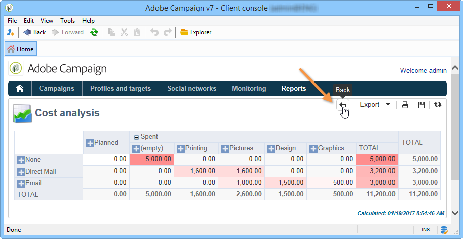

# Om inbyggda rapporter för Campaign{#about-campaign-built-in-reports}

I det här kapitlet finns en lista med Adobe Campaign inbyggda rapporter, deras innehåll och sammanhang. Med hjälp av informationen nedan kan du undvika att skapa rapporter som redan är tillgängliga på plattformen.

>[!NOTE]
>
>Du kan även lära dig hur du lägger till egna rapporter på fliken **[!UICONTROL Reports]**. Mer information finns på [sidan](../../reporting/using/configuring-access-to-the-report.md#defining-the-filtering-options).

Rapporterna och deras innehåll beskrivs närmare i dokumenten om de funktioner de avser.

Adobe Campaign erbjuder flera typer av rapporter som är tillgängliga via kundkonsolen eller en webbläsare.

Följande typer av rapporter är tillgängliga:

* Rapporter om hela plattformen finns i [Globala rapporter](../../reporting/using/global-reports.md).
* Leveransrapporter, se [Leveransrapporter](../../reporting/using/delivery-reports.md).
* Ackumulerade rapporter, se [Kumulativa rapporter](../../reporting/using/cumulative-reports.md).

Du kan få åtkomst till rapporter från klientkonsolens hemsida, rapportkontrollpanelen eller leveranslistan. Visningsläget för en rapport beror på dess sammanhang. Listan med huvudrapporter är tillgänglig på startsidan och ger dig snabb åtkomst till leveransdata. Listan kan ändras efter dina behov. Mer information finns i [det här avsnittet](../../reporting/using/about-reports-creation-in-campaign.md).

Få tillgång till inbyggda rapporter för Campaign:

1. Välj fliken **[!UICONTROL Reports]** i Adobe Campaign-gränssnittet.

   

1. Använd sökfälten för att filtrera de visade rapporterna.

1. Klicka sedan på den rapport som du vill visa.

   

1. Klicka på länken **[!UICONTROL Back]** högst upp på skärmen så visas rapportlistan igen.

   

Andra möjliga åtgärder för en rapport som redigeras finns på [den här sidan](../../reporting/using/actions-on-reports.md).

Rapporter som är specifika för en kampanj eller leverans är tillgängliga via respektive instrumentpanel.

Principen är densamma för listor, tjänster, erbjudanden osv. enligt nedan:

