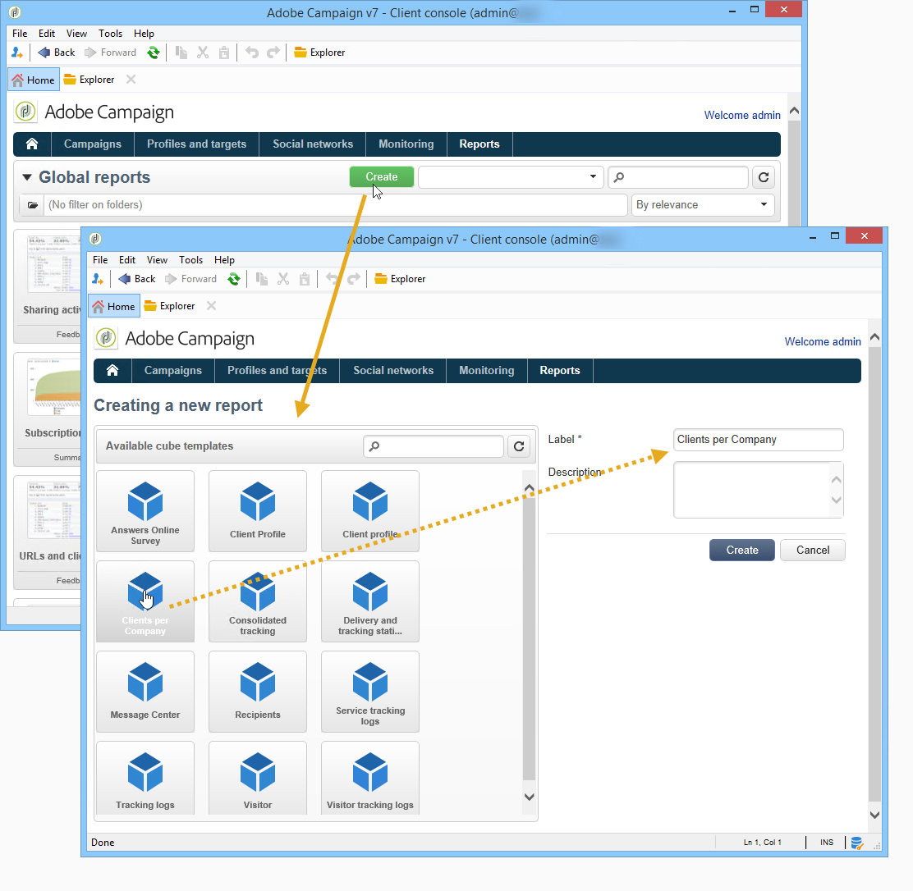

# Om kuber{#about-cubes}

Utforska data i databasen via modulen **Marketing Analytics** . Det gör att ni kan analysera och mäta data, beräkna statistik, förenkla och optimera framtagning och beräkning av rapporter. Förutom detta kan ni med Marketing Analytics skapa rapporter och bygga upp målpopulationer. När de har identifierats lagras de i listor som kan användas i Adobe Campaign (målgruppsanpassning, segmentering osv.).

Kuber används för att generera vissa inbyggda rapporter, inklusive leveransrapporter (leveransspårning, klickningar, öppningar osv.). Rapporter som baseras på kuber får endast användas som standard för datavolymer under 5 miljoner faktarader.

Du kan utöka databasens undersöknings- och analyskapacitet samtidigt som det blir enklare för slutanvändarna att konfigurera rapporter och tabeller: Allt de behöver göra är att välja en befintlig (helt konfigurerad) kub när de skapar sin rapport eller tabell för att bearbeta beräkningar, mått och statistik.

När de har skapats och konfigurerats används kuber i rapportrutor och webbprogram. De kan användas och ändras i pivottabeller.

>[!CAUTION]
>
>**Marketing Analytics** är en Adobe Campaign-modul. Den måste installeras på din instans så att du kan använda de funktioner som beskrivs nedan.

Med modulen Marketing Analytics kan ni med Campaign

1. Skapa kuber i vyn:

   * sammanställa data och lagra dessa i en arbetstabell för att på förhand beräkna indikatorer utifrån användarnas behov,
   * minska mängden data som ingår i de olika beräkningar som används för rapporter och frågor, vilket avsevärt optimerar beräkningstiderna för indikatorn,
   * förenkla tillgången till data, så att användarna kan hantera data (oavsett om de är i förväg aggregerade eller inte) beroende på olika dimensioner.
   Mer information finns i [Skapa indikatorer](../../reporting/using/creating-indicators.md).

1. Skapa pivottabeller i vyn:

   * utforska beräknade data, konfigurerade mått,
   * välja vilka data som ska visas samt dess visningsläge,
   * personalisering av de åtgärder och indikatorer som används,
   * erbjuder interaktiva analysverktyg till användare med icke-teknisk bakgrund.
   Mer information finns i [Använda kuber för att utforska data](../../reporting/using/using-cubes-to-explore-data.md).

1. Bygg en fråga med data som beräknas och aggregeras i en kub.
1. Identifiera populationer och referera till dem i listor.

##  Terminologi {#terminology}

När du arbetar med kuber måste du känna till följande begrepp:

* Kub

   En kub är en representation av flerdimensionell information: ger slutanvändarna strukturer som utformats för interaktiv dataanalys.

* Faktatabell/schema

   Faktatabellen (eller faktaschemat) innehåller rådata eller elementära data som analyserna ska baseras på. Dessa är huvudsakligen stora volymtabeller (möjligen med länkade tabeller) med potentiellt långa beräkningar.

   En faktatabell kan till exempel vara: sändningstabellen, inköpstabellen osv.

* Dimension

   Med dimensioner kan ni gruppera data i grupper: När de har skapats fungerar dimensionerna som analysaxlar. I de flesta fall definieras flera nivåer för en viss dimension. För en tidsdimension är nivåerna till exempel månader, dagar, timmar, minuter och så vidare. Den här nivåuppsättningen representerar dimensionshierarkin och möjliggör olika nivåer av dataanalys.

* Bindning

   För vissa fält kan du definiera bindning till gruppvärden och göra det enklare att läsa information. Bindning används på nivåer

   Vi rekommenderar att du definierar bindning när det kan finnas många olika värden.

* Mät

   De vanligaste måtten är summa, genomsnitt, maximum, minimum, standardavvikelse osv.

   Mått kan beräknas: Antagandegraden för ett erbjudande är förhållandet mellan antalet gånger det presenterades och antalet gånger det accepterades.

## Arbetsytan Kub {#cube-workspace}

Kuber lagras i **[!UICONTROL Administration > Configuration > Cubes]** noden.

De huvudsakliga användningsområdena för kuber är följande:

* Dataexport kan utföras direkt i en rapport som utformats i **[!UICONTROL Reports]** hela Adobe Campaign-plattformen.

   Om du vill göra det skapar du en ny rapport och väljer den kub som du vill använda.

   

   Kuber visas som mallar baserade på vilka rapporter skapas. När du har valt en mall klickar du på **[!UICONTROL Create]** för att konfigurera och visa den matchande rapporten.

   Du kan anpassa mått, ändra visningsläge eller konfigurera tabellen och sedan visa rapporten med huvudknappen.

   

* Du kan också referera till en kub i rutan **[!UICONTROL Query]** för en rapport för att använda dess indikatorer, vilket visas nedan:

   

* Du kan också infoga en pivottabell baserad på en kub på en rapportsida. Det gör du genom att referera till den kub som ska användas på fliken **[!UICONTROL Data]** i pivottabellen på den aktuella sidan.

   

   Mer information finns i [Utforska data i en rapport](../../reporting/using/using-cubes-to-explore-data.md#exploring-the-data-in-a-report).

