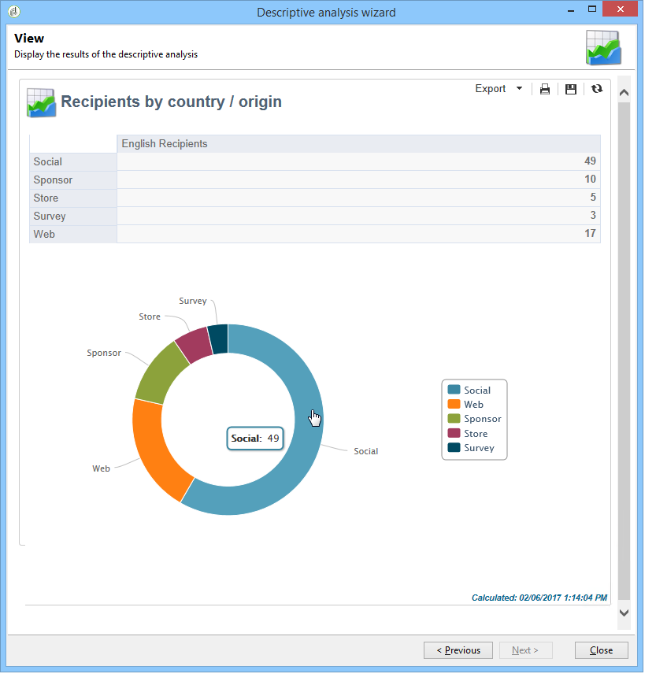

# Om beskrivande analys{#about-descriptive-analysis}

Om du vill producera statistik över data i databasen skapar du beskrivande analysrapporter med den dedikerade guiden och anpassar innehållet och presentationen efter dina behov.

Rapporterna gäller populationer och bör endast användas för att analysera små datavolymer.

Du kan generera kvantitativa eller kvalitativa analysrapporter. Med kvalitativa analyser kan du representera data enligt följande:

* Tabell och histogram:

   

* Ackumulerade värden, utan tabellen:

   

* Uppdelning efter affärsgren

   

Kvantitativa analyser ger övergripande statistik om de numeriska uppgifterna i urvalet, vilket visas nedan:

Rapporterna skapas med hjälp av guiden för beskrivande analys, som bygger på olika steg, där du kan välja vilken typ av rapport du vill skapa samt data och layout. Rapporten visas i det sista steget. Om det behövs kan rapporten publiceras och delas med andra operatorer, skrivas ut, exporteras i Excel-, PDF- eller OpenDocument-format.

Guider för beskrivande analys är inte lika kraftfulla som Adobe Campaign-rapporter, men de ger en snabb översikt av databasinnehållet eller ett urval data.

>[!CAUTION]
>
>Med en beskrivande analys kan du inte utforska stora datavolymer.
