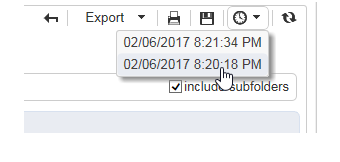

# Åtgärder på rapporter{#actions-on-reports}


När du visar en rapport kan du utföra ett visst antal åtgärder med verktygsfältet. Dessa beskrivs nedan.


Med verktygsfältet kan du till exempel exportera, skriva ut, arkivera eller visa rapporten i en webbläsare.


## Exportera en rapport {#exporting-a-report}

Välj det format som du vill exportera rapporten till i listrutan. (.xls, .pdf eller .ods).


När en rapport innehåller flera sidor måste du upprepa åtgärden för varje sida.

Du kan konfigurera rapporten så att den exporteras i PDF-, Excel- eller OpenOffice-format. Öppna Adobe Campaign Utforskaren och välj rapporten.

Du hittar exportalternativen via **[!UICONTROL Page]** verksamheter i rapporten, i **[!UICONTROL Advanced]** -fliken.

Ändra inställningarna för **[!UICONTROL Paper]** och **[!UICONTROL Margins]** för att passa dina behov. Du kan också tillåta export av en sida endast i PDF-format. Om du vill göra det avmarkerar du **[!UICONTROL Activate OpenOffice/Microsoft Excel export]** alternativ.


### Exportera till Microsoft Excel {#exporting-into-microsoft-excel}

För **[!UICONTROL List with group]** typrapporter som ska exporteras till Excel, följande rekommendationer och begränsningar gäller:

* Rapporterna får inte innehålla tomma rader.

  

* Förklaringen till listan måste vara dold.

  

* Rapporterna behöver inte använda specifik formatering som definierats på cellnivå. Rekommenderas för användning **[!UICONTROL Form rendering]** för att definiera formatet för cellerna i tabellen. The **[!UICONTROL Form rendering]** kan nås via **[!UICONTROL Administration > Configuration > Form rendering]**.
* Vi rekommenderar inte att du infogar HTML innehåll.
* Om en rapport innehåller flera tabeller, diagram osv. textelement exporteras de ena under de andra.
* Du kan tvinga vagnreturen i celler: den här konfigurationen behålls i Excel. Mer information om detta finns i [det här avsnittet](../../reporting/using/creating-a-table.md#defining-cell-format).

### Skjut upp exporten {#postpone-the-export}

Du kan skjuta upp exporten av en rapport, t.ex. för att vänta på asynkrona anrop. Om du vill göra det anger du följande parameter i initieringsskriptet på sidan:

```
document.nl_waitBeforeRender = true;
```

Om du vill aktivera exporten och börja konvertera till PDF använder du **document.nl_renderToPdf()** utan någon parameter.

### Minnesallokering {#memory-allocation}

När du exporterar vissa stora rapporter kan minnesallokeringsfel uppstå.

I vissa instanser är standardvärdet **maxMB** (**SKISSER** för värdbaserade instanser) av JavaScript som anges i **serverConf.xml** konfigurationsfilen är inställd på 64 MB. Om du råkar ut för otillräckligt minne när du exporterar en rapport kan det rekommenderas att du ökar den här siffran till 512 MB:

```
<javaScript maxMB="512" stackSizeKB="8"/>
```

Om du vill tillämpa ändringar som gjorts i konfigurationen, **nlserver** måste startas om.

Läs mer om **serverConf.xml** -fil, se [det här avsnittet](../../production/using/configuration-principle.md).

Läs mer om **nlserver** tjänst, se [det här avsnittet](../../production/using/administration.md).

## Skriva ut en rapport {#printing-a-report}

Du kan skriva ut rapporten genom att klicka på skrivarikonen. Då öppnas dialogrutan.

Du får ett bättre resultat om du redigerar utskriftsalternativen i Utforskaren och väljer **[!UICONTROL Print background colors and images]**.


## Skapa rapportarkiv {#creating-report-archives}

Genom att arkivera en rapport kan du skapa en vy av rapporten under olika perioder, t.ex. för att visa statistik för en viss tidsperiod.

Om du vill skapa ett arkiv öppnar du den aktuella rapporten och klickar på lämplig ikon.


Om du vill visa eller dölja befintliga arkiv klickar du på ikonen Visa/dölj.


Arkivdatumen visas under ikonen för att visa/dölja. Klicka på arkivet för att visa det.



Det går att ta bort ett rapportarkiv. Det gör du genom att gå till noden Adobe Campaign där dina rapporter lagras. Klicka på **[!UICONTROL Archives]** markerar du den du vill ta bort och klickar på **[!UICONTROL Delete]**.


