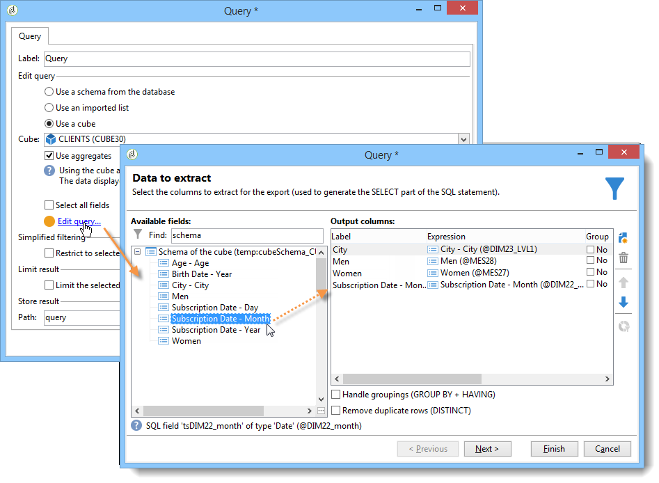

# Samla in data som ska analyseras{#collecting-data-to-analyze}

De data som ska användas för att skapa rapporten kan väljas direkt på rapportsidan (mer information finns i [Använda kontexten](../../reporting/using/using-the-context.md)) eller samlas in via en eller flera frågor.

Den här aktiviteten erbjuder tre olika metoder:

1. Skapa en fråga med hjälp av data i databasen.
1. Bearbetar data i en lista.
1. Använda data i en befintlig kub.

Vilken metod som väljs beror på vilken typ av beräkning det är, datavolymen och hur länge de är giltiga osv. Alla dessa parametrar måste granskas noggrant för att undvika att överbelasta Adobe Campaign-databasen och för att optimera genereringen och hanteringen av de skapade rapporterna. Mer information finns på [den här sidan](../../reporting/using/best-practices.md#optimizing-report-creation).

I samtliga fall samlas data in via en aktivitet av typen **[!UICONTROL Query]**.

Det här datamarkeringsläget är relevant när data i rapporten behöver samlas in eller byggas med data i databasen. I vissa fall kan du även välja data direkt från elementen som används i rapporten. Du kan till exempel markera källdata direkt när du infogar ett diagram. Mer information finns i [Använda kontexten](../../reporting/using/using-the-context.md).

## Använd data från ett schema {#using-the-data-from-a-schema}

Om du vill använda data som är länkade till ett databasschema väljer du lämpligt alternativ i frågeredigeraren och konfigurerar frågan som ska användas.

I följande exempel kan du samla in antalet mottagare för varje land, bland profilerna i databasen. De kan sedan visas i en rapport i form av en tabell.

## Använda en importerad lista {#using-an-imported-list}

Om du vill skapa en rapport kan du använda data från en lista med importerade data.

Om du vill göra det väljer du alternativet **[!UICONTROL Use an imported list]** i frågerutan och väljer den aktuella listan.

Klicka på länken **[!UICONTROL Edit query...]** för att definiera de data som ska samlas in bland elementen i listan för att skapa rapporten.

## Använd en kub {#using-a-cube}

Du kan välja en kub som definierar frågan.

Med kuber kan du utöka databasens utforsknings- och analyskapacitet samtidigt som det blir enklare att konfigurera rapporter och tabeller för slutanvändare: välj bara en befintlig, fullt konfigurerad kub och använd beräkningar, mått och statistik. Mer information om hur du skapar kuber finns i [det här avsnittet](../../reporting/using/ac-cubes.md).

Klicka på länken **[!UICONTROL Edit query...]** och välj de indikatorer som du vill visa eller använda i rapporten.

## Filtreringsalternativ i frågor {#filtering-options-in-the-queries}

För att undvika att frågor körs i hela databasen måste data filtreras.

### Förenklat filter {#simplified-filter}

Du kan välja alternativet **[!UICONTROL Filter automatically with the context]** om du vill att rapporten ska vara tillgänglig via en viss nod i trädet, till exempel en lista, en mottagare eller en leverans.

Med alternativet **[!UICONTROL Filter with the folder]** kan du ange en mapp och endast ta hänsyn till dess innehåll. Detta gör att du kan filtrera rapportdata så att endast data från en av mapparna i trädet visas, vilket visas nedan:

### Begränsa mängden data som samlas in {#limiting-the-amount-of-data-collected}

Konfigurera antalet poster som ska extraheras via frågan med hjälp av alternativen för resultatbegränsning:

* **[!UICONTROL Limit to first record]** om du vill extrahera ett resultat,
* **[!UICONTROL Size]** om du vill extrahera ett visst antal poster.
