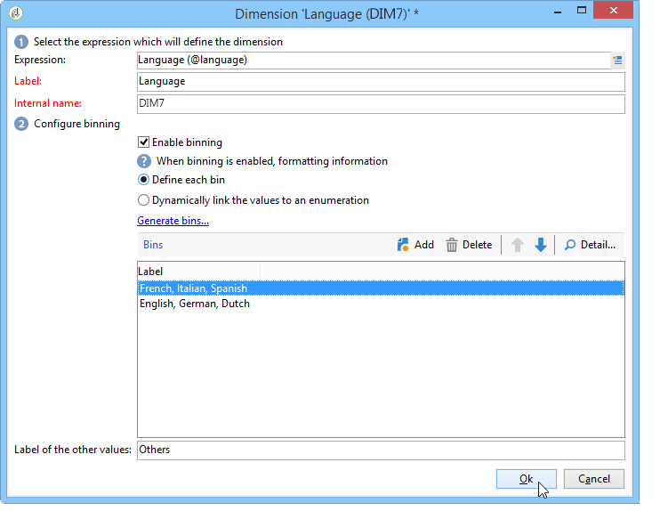
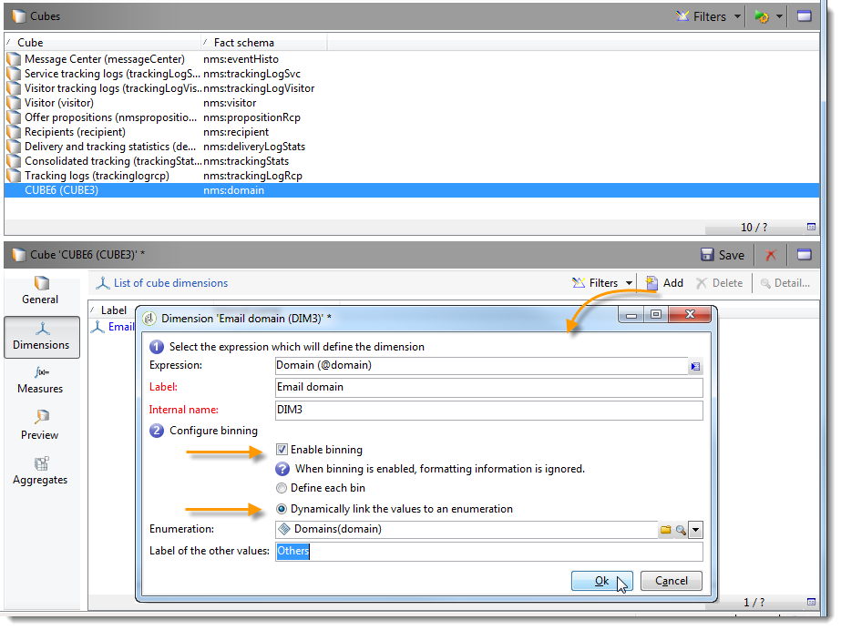

# Bästa tillvägagångssätt för kuber{#concepts-and-methodology}

## Databindning {#data-binning}

Med bindning kan du förenkla visningen av data genom att gruppera värden enligt villkor. Beroende på vilken information som är tillgänglig för dig kan du definiera åldersgrupper, gruppera e-postdomäner tillsammans, begränsa till en värdeuppräkning, uttryckligen begränsa data till att visa och gruppera alla andra data på en dedikerad rad eller kolumn, osv.

Sammantaget finns det tre typer av bindning:

1. Använda manuellt definierade värdeintervall. Exempel: ålder, genomsnittlig kundvagn, antal öppnade leveranser osv.). Mer information finns i [Definiera varje behållare](#defining-each-bin).
1. Beroende på värdena för en uppräkning: bara de värden som finns i uppräkningen visas, grupperas alla andra värden i Övrigt. Mer information finns i [Hantera behållare dynamiskt](#dynamically-managing-bins).
1. Med värdeintervall grupperas alla andra. Exempel: 18 till 25 åringar, 26 till 59 åringar och andra. Mer information finns i [Skapa värdeintervall](#creating-value-ranges).

Om du vill aktivera bindning markerar du lämplig ruta när du skapar dimensionen.

Du kan antingen skapa bindningar manuellt eller länka dem till en befintlig uppräkning.

Adobe Campaign har också en assistent för automatisk bindning: värden kan delas upp i N-grupper eller grupperas enligt de vanligaste värdena i databasen.

### Definiera varje behållare {#defining-each-bin}

Om du vill skapa varje behållare individuellt väljer du **[!UICONTROL Define each bin]** och använd tabellen för att skapa de olika behållarna.

Klicka på **[!UICONTROL Add]** om du vill skapa en ny behållare och lista de värden som ska grupperas i behållaren.

I följande exempel grupperas språken i tre kategorier: engelska/tyska/nederländska, franska/italienska/spanska och andra.

Du kan använda en SQL-mask för att kombinera flera värden till ett filter. Om du vill göra det markerar du **[!UICONTROL Yes]** i **[!UICONTROL Use an SQL mask]** och ange det SQL-filter som ska användas i **[!UICONTROL Value or expression]** kolumn.

I exemplet nedan börjar alla e-postdomäner med **yahoo** (yahoo.fr, yahoo.com, yahoo.be osv.), eller med **ymail** (ymail.com, ymail.eu osv.) grupperas under etiketten **YAHOO!**, samt adresser med **rocketmail.com** domän.

### Hantera behållare dynamiskt {#dynamically-managing-bins}

Värden kan hanteras dynamiskt via uppräkningar. Det innebär att bara värdena i uppräkningen visas. När uppräkningsvärdena ändras anpassas innehållet i kuben automatiskt.

Så här skapar du den här typen av värdebindning:

1. Skapa en ny dimension och aktivera bindning.
1. Välj **[!UICONTROL Dynamically link the values to an enumeration]** och välj matchande uppräkning.

   

   När uppräkningsvärdena uppdateras anpassas de matchande binderna automatiskt.

### Skapa värdeintervall {#creating-value-ranges}

Du kan gruppera värdena i intervall baserat på önskat intervall.

Om du vill definiera intervall manuellt klickar du på **[!UICONTROL Add]** knapp och markera **[!UICONTROL Define a range]** :

Ange sedan de nedre och övre gränserna och klicka på **[!UICONTROL Ok]** för att bekräfta.

### Generera behållare automatiskt {#generating-bins-automatically}

Det går också att generera behållare automatiskt. Klicka på **[!UICONTROL Generate bins...]** länk.

Du kan antingen:

* Återställa de mest använda värdena

  I följande exempel visas de fyra vanligaste värdena, medan de andra räknas och grupperas i kategorin Övrigt.

* Generera behållare i form av fack

  I följande exempel skapar Adobe Campaign automatiskt fyra värdekortsplatser i samma storlek för att visa värdena i databasen.

I det här fallet ignoreras filtret som är markerat i faktaschemat.

### Uppräkningar {#enumerations}

För att förbättra en rapports relevans och läsbarhet kan du i Adobe Campaign skapa specifika uppräkningar för att gruppera om olika värden till samma behållare. Dessa uppräkningar, som är reserverade för bindning, refereras i kuber som sedan visas i rapporterna.

Adobe Campaign erbjuder även en uppräkning i domäner, som gör att du kan visa en lista över e-postdomänerna för alla kontakter i databasen, som har grupperats av Internet-leverantören, vilket visas i följande exempel:

Den har skapats med följande mall:

Skapa en kub med **[!UICONTROL Email domain]** dimension. Välj **[!UICONTROL Enable binning]** option then **[!UICONTROL Dynamically link the values to an enumeration]**. Välj sedan **Domäner** uppräkning enligt ovan. Alla värden som saknar angivet alias grupperas om under **Övriga** etikett.

Skapa sedan en rapport baserad på den här kuben för att visa värdena.

Du behöver bara ändra uppräkningen för att uppdatera den relaterade rapporten. Skapa till exempel **Adobe** och lägg till **adobe.com** och rapporten uppdateras automatiskt med Adobe på uppräkningsnivån.

The **[!UICONTROL Domains]** uppräkningen används för att generera inbyggda rapporter som visar listan över domäner. Om du vill anpassa innehållet i dessa rapporter kan du redigera den här listan.

Du kan skapa andra uppräkningar som är reserverade för bindning och använda dem i andra kuber: alla aliasvärden grupperas om i de biner som anges på den första uppräkningsfliken.

## Beräkna och använda aggregat {#calculating-and-using-aggregates}

Den största datavolymen kan beräknas i aggregat.

Aggregat är användbara när du hanterar stora datavolymer. De uppdateras automatiskt baserat på inställningarna som anges i den dedikerade arbetsflödesrutan, så att de data som samlats in senast kan integreras med indikatorerna

Aggregat definieras på den relevanta fliken för varje kub.

>[!NOTE]
>
>Arbetsflödet för uppdatering av sammanställningsberäkningar kan konfigureras i själva sammanställningen eller så kan sammanställningen uppdateras via ett externt arbetsflöde som är länkat till den relevanta kuben.

Så här skapar du en ny sammanställning:

1. Klicka på **[!UICONTROL Aggregates]** -fliken i kuben och klicka sedan på **[!UICONTROL Add]** -knappen.

   

1. Ange en etikett för sammanställningen och lägg sedan till de dimensioner som ska beräknas.

   

1. Välj en dimension och en nivå. Upprepa den här processen för varje dimension och nivå.
1. Klicka på **[!UICONTROL Workflow]** för att skapa sammanställningsarbetsflödet.

   

   * The **[!UICONTROL Scheduler]** kan du definiera frekvensen för uppdateringar av beräkningar. Schemaläggaren beskrivs i [det här avsnittet](../../workflow/using/scheduler.md).
   * The **[!UICONTROL Aggregate update]** Med -aktiviteten kan du välja det uppdateringsläge som du vill använda: helt eller delvis.

     Som standard utförs en fullständig uppdatering under varje beräkning. Om du vill aktivera en partiell uppdatering väljer du det relevanta alternativet och definierar uppdateringsvillkoren.

     

## Definiera mått {#defining-measures}

Typerna av mått definieras i **[!UICONTROL Measures]** -fliken i kuben. Du kan beräkna summor, medelvärden, avvikelser osv.

Du kan skapa så många mått som behövs. Välj sedan det mått som du vill visa eller dölja i tabellen. Mer information finns i [Visa mått](#displaying-measures).

Så här definierar du ett nytt mått:

1. Klicka på **[!UICONTROL Add]** ovanför listan över mått och välj vilken typ av mått och formel som ska beräknas.

   

1. Om det behövs, och beroende på operatorn, väljer du det uttryck som operationen gäller.

   The **[!UICONTROL Advanced selection]** kan du skapa komplexa beräkningsformler. Mer information om detta finns i [det här avsnittet](../../platform/using/about-queries-in-campaign.md).

   

1. The **[!UICONTROL Filter the measure data...]** kan du begränsa beräkningsfältet och bara använda det på vissa data i databasen.

   

1. Ange måttets etikett och lägg till en beskrivning och klicka sedan på **[!UICONTROL Finish]** för att skapa den.

## Visningsmått {#displaying-measures}

Du kan konfigurera visningen av mått i tabellen beroende på dina behov:

* Mätenas visningssekvens (se [Visningssekvens](#display-sequence)),
* den information som ska visas/döljas i rapporten (se [Konfigurera skärmen](#configuring-the-display))
* vilka mått som ska visas: procent, summa, antal decimaler osv. (se [Ändra vilken typ av mått som visas](#changing-the-type-of-measure-displayed)).

### Visningssekvens {#display-sequence}

De mått som beräknas i kuben konfigureras via **[!UICONTROL Measures]** -knappen.

Flytta runt linjerna för att ändra visningssekvensen. I följande exempel flyttas franska data längst ned i listan, vilket innebär att de visas i den sista kolumnen.

### Konfigurera skärmen {#configuring-the-display}

Mätningarna, linjerna och kolumnerna kan konfigureras individuellt för varje mått eller totalt. En specifik ikon ger dig åtkomst till markeringsfönstret för visningsläge.

* Klicka på **[!UICONTROL Edit the configuration of the pivot table]** -ikonen för att komma åt konfigurationsfönstret.

  Du kan välja om etiketterna för måtten ska visas eller inte och konfigurera deras layout (rader eller kolumner).

Med färgalternativen kan du markera viktiga värden för enkel läsning.

### Ändra vilken typ av mått som visas {#changing-the-type-of-measure-displayed}

I varje mått kan du definiera vilken enhet och formatering som ska användas.

## Dela din rapport {#sharing-a-report}

När rapporten har konfigurerats kan du spara den och dela den med andra operatorer.

Klicka på **[!UICONTROL Show the report properties]** -ikonen och aktivera **[!UICONTROL Share this report]** alternativ.

Ange kategorin som rapporten tillhör samt dess relevans. Mer information finns i [den här sidan](../../reporting/using/configuring-access-to-the-report.md#report-display-context) till **Visningssekvens** och **Definiera filtreringsalternativen** -avsnitt.

Om du vill bekräfta dessa ändringar måste du spara rapporten.

## Skapa filter {#creating-filters}

Det går att skapa filter för att visa en del av data.

Så här gör du:

1. Klicka på **[!UICONTROL Add a filter]** -ikon.

   

1. Välj den dimension som filtret gäller

   

1. Välj typ av filter och dess precisionsnivå.

   

1. När den har skapats visas filtret ovanför rapporten.

   

   Klicka på filtret för att redigera det.

   Klicka på krysset för att ta bort det.

   Du kan kombinera så många filter som behövs: alla visas i det här området.

   

Varje gång ett filter ändras (lägg till, ta bort, ändra) måste rapporten beräknas om.

Du kan också skapa filter baserat på en markering. Det gör du genom att markera källceller, rader och kolumner och sedan klicka på **[!UICONTROL Add a filter]** -ikon.

Om du vill markera en rad, kolumn eller cell vänsterklickar du på den. Om du vill avmarkera klickar du igen.

Filtret tillämpas automatiskt och läggs till i filterzonen ovanför rapporten.

