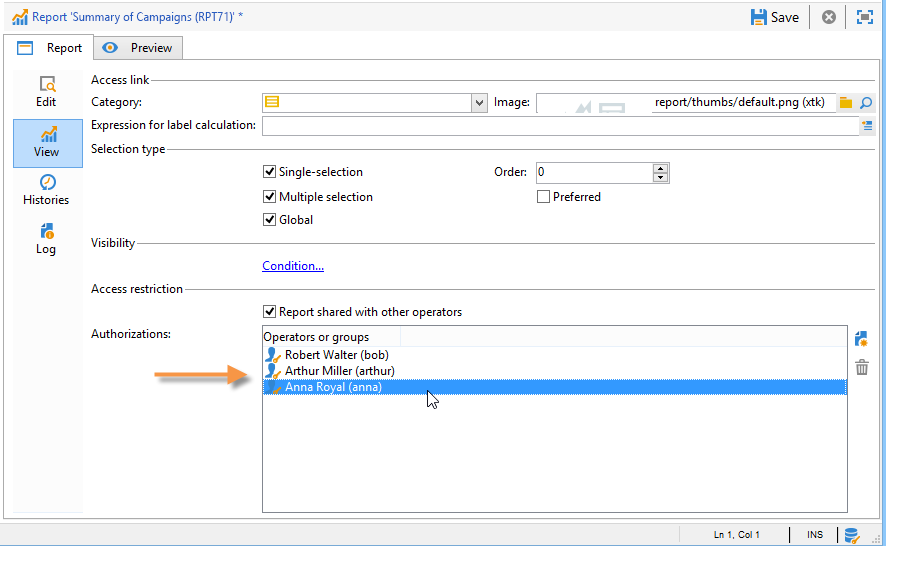
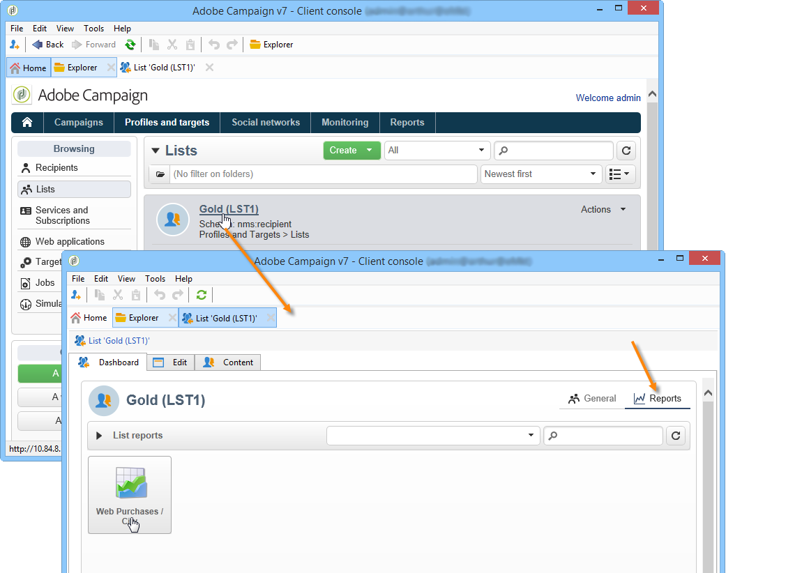

# Konfigurera åtkomst till rapporten{#configuring-access-to-the-report}

## Rapportens visningssammanhang {#report-display-context}

Definiera rapportens visningssammanhang på Adobe Campaign-plattformen med hjälp av **[!UICONTROL Display]** -fliken. Åtkomsten till en rapport beror på dess urvalstyp, visningsvillkor och åtkomstauktoriseringar.

### Markeringstyp {#selection-type}

Åtkomsten till rapporten kan begränsas till ett specifikt sammanhang eller ett visst utrymme för erbjudandet, t.ex. en leverans, en mottagare, ett urval av mottagare. Åtkomsten konfigureras i **[!UICONTROL Selection type]** avsnittet på **[!UICONTROL Display]** fliken.

* **[!UICONTROL Single selection]** : rapporten är bara tillgänglig när en viss enhet har valts.
* **[!UICONTROL Multiple selection]** : rapporten nås när flera enheter väljs.
* **[!UICONTROL Global]** : rapporten hämtas via en lista över tillgängliga rapporter i rapportuniversum.

### Visningssekvens {#display-sequence}

I **[!UICONTROL Sequence]** fältet kan du ange ett numeriskt värde som anger rapportens visningssekvens i listan.

Som standard visas rapporter efter relevans: Med det värde som anges i det här fältet kan du sortera rapporter från det högsta (högsta värdet) till det minsta (minsta värdet) som är relevant.

Du kan välja vilken skala som ska användas beroende på dina behov: 1 till 10, 0 till 100, -10 till 10 osv.

### Visningsvillkor {#display-conditions}

Du kan även ställa in hur rapporten ska visas via en fråga.

I följande exempel visas rapporten om huvudkampanjkanalen är e-post.

Det innebär att om kampanjens huvudkanal är direktreklam kommer rapporten inte att vara tillgänglig i kampanjrapporterna.

### Åtkomstbehörighet {#access-authorization}

Rapporten kan delas med andra operatorer.

Markera **[!UICONTROL Report shared with other operators]** alternativet om du vill att rapporten ska vara tillgänglig. Om det här alternativet inte är markerat kan bara den operator som skapade rapporten få åtkomst till rapporten.

Rapporten kan också delas med specifika operatorer eller grupper av operatorer som läggs till via tillståndsfönstret.

### Definiera filtreringsalternativen {#defining-the-filtering-options}

Universum visar alla tillgängliga rapporter på plattformen och för vilka den anslutna operatorn har åtkomstbehörighet. **[!UICONTROL Reports]**

Som standard sorteras de efter relevans, men du kan använda andra typer av filter: i bokstavsordning, efter ålder osv.

Du kan även filtrera visningen baserat på rapportkategorin:

Om du vill definiera kategorin för en rapport väljer du den via **[!UICONTROL Display]** fliken enligt nedan:

Du kan ange en ny kategori här och lägga till den i listan över tillgängliga kategorier. Den matchande uppräkningen uppdateras automatiskt.

## Skapa en länk till en rapport {#creating-a-link-to-a-report-}

Det går att göra en rapport tillgänglig via en viss nod i trädet, som en lista, en mottagare, en leverans osv. Det gör du genom att skapa en länk till den aktuella rapporten och ange den enhet där du vill göra den tillgänglig.

Vi ska till exempel skapa en länk till en rapport som gör den tillgänglig via en lista över mottagare.

1. Klicka **[!UICONTROL New]** och välj **[!UICONTROL Create a link to an existing report]** i guiden för att skapa rapport.

   

1. Välj den rapport som du vill skapa en länk till med hjälp av listrutan. I det här exemplet ska vi välja rapporten **Uppdelning per land** .

   

1. Ange en etikett och välj schemat. I det här exemplet ska vi välja tabellen med mottagarlistor.

   

   Det innebär att rapporten kommer att vara tillgänglig via en mottagarlista och att statistiken kommer att beröra mottagarna i den valda listan.

1. Spara och visa rapporten.
1. Ange länknyckeln. I det här fallet sekundärnyckeln för länken &quot;Mappar&quot;.

   

1. Publicera rapporten.
1. Gå till en av mottagarlistorna och klicka på **[!UICONTROL Reports]** länken: den rapport du just har skapat är tillgänglig.

   

## Förhandsgranskning av rapporten {#preview-of-the-report}

Innan du publicerar rapporten bör du kontrollera att den visas korrekt på **[!UICONTROL Preview]** fliken.

Om du vill visa förhandsgranskningen av rapporten markerar du **[!UICONTROL Global]** eller **[!UICONTROL Selection]** alternativet.

Dessa två alternativ väljs baserat på rapportens visningsinställningar. Om visningsinställningen är **[!UICONTROL Global]** markerad måste du välja **[!UICONTROL Global]** förhandsvisningsalternativet. Om visningsinställningarna är **[!UICONTROL Single selection]** eller **[!UICONTROL Multiple selection]** så måste alternativet för **[!UICONTROL Selection]** förhandsgranskning vara markerat.

Mer information finns i [Rapportvisningssammanhang](#report-display-context).

Med specifika inställningar kan du kontrollera fel. Inställningen **_uid** finns i rapportens URL. Du kan lägga till inställningarna **&amp;_preview** eller **&amp;_debug** i den.

Mer information om de här inställningarna finns i avsnittet **Definiera egenskaper** för webbformulär i kapitlet [Webbformulär](../../web/using/about-web-forms.md) .

## Publicera rapporten {#publishing-the-report}

Det är obligatoriskt att publicera rapporten för att dela den med andra operatorer och visa den i listan över tillgängliga rapporter (se även [Rapportens visningssammanhang](#report-display-context)). Denna åtgärd måste utföras igen varje gång rapporten ändras.

1. Öppna publiceringsguiden genom att klicka **[!UICONTROL Publish]** i verktygsfältet.

   

1. Klicka **[!UICONTROL Start]** för att publicera.

   

1. Klicka på **[!UICONTROL Enlarge]** ikonen för att öppna rapporten i en webbläsare.

