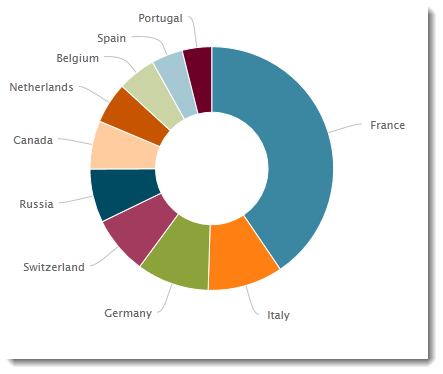
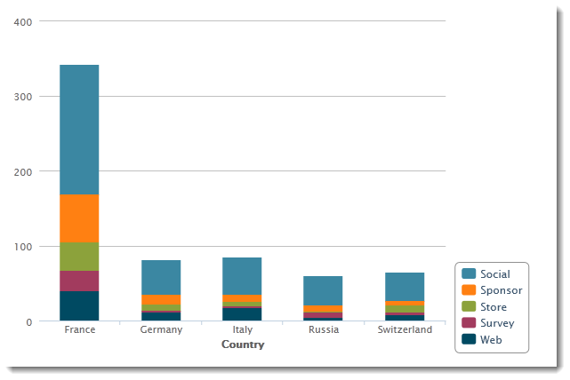

# Skapa ett diagram{#creating-a-chart}

Data i databasen kan också samlas in och visas i ett diagram. Adobe Campaign har en uppsättning grafiska representationer. Deras konfiguration beskrivs nedan.

Diagram infogas direkt på en rapportsida via högerklicksmenyn eller verktygsfältet.

## Skapa steg {#creation-steps}

Så här skapar du ett diagram i en rapport:

1. Redigera den sida där du vill visa diagrammet och välj diagramtyp i verktygsfältet.

   

1. Ange ett namn och en beskrivning. Om det behövs kan du ändra bildtextens position med hjälp av listrutan.

   

1. Klicka på fliken **[!UICONTROL Data]** för att definiera datakällan och serien som ska beräknas.

   Statistiken som ska visas i diagrammet kan beräknas utifrån en fråga eller kontextdata, dvs. data från den inkommande övergången på den aktuella sidan (mer information finns i [Använda kontextdata](../../reporting/using/using-the-context.md#using-context-data)).

   * Klicka på länken **[!UICONTROL Filter data...]** för att definiera filtervillkor för data i databasen.

      

   * Om du vill använda sammanhangsberoende data markerar du det här alternativet och klickar på länken **[!UICONTROL Advanced settings...]**. Välj sedan de data som statistiken ska beröra.

      

      Du kan sedan komma åt kontextdata för att definiera de värden som ska visas i diagrammet:

      

## Diagramtyper och varianter {#chart-types-and-variants}

Adobe Campaign erbjuder olika typer av grafiska representationer. De beskrivs nedan.

Diagramtypen väljs när den infogas på sidan.

Den kan också ändras via **[!UICONTROL Chart type]**-delen av fliken **[!UICONTROL General]** i diagrammet.

Varianterna beror på den markerade diagramtypen. De markeras via länken **[!UICONTROL Variants...]**.

### Uppdelning: cirkeldiagram {#breakdown--pie-charts}

Med den här typen av grafisk representation kan du visa en översikt över de uppmätta elementen.

Cirkeldiagram gör bara att du kan analysera en variabel.

Med länken **[!UICONTROL Variants]** kan du anpassa den övergripande återgivningen av diagrammet.

Med cirkeldiagram kan du ange värdet för innerradien i lämpligt fält.

Exempel:

0,00 skriver ut en hel cirkel.

0,40 spårar en cirkel med en radie på 40 %.

1.00 skriver bara ut utsidan av cirkeln.

### Utveckling: kurvor och områden {#evolution--curves-and-areas}

Med den här typen av grafisk representation kan du förstå hur ett eller flera mått utvecklas i tid.

### Jämförelse: histogram {#comparison--histograms}

Med hjälp av histogram kan du jämföra värden för en eller flera variabler.

För den här typen av diagram finns följande alternativ i **[!UICONTROL Variants]**-fönstret:

Markera alternativet **[!UICONTROL Display caption]** om du vill visa bildtexten med diagrammet och välja dess position:

När det är lämpligt kan du stapla värden tillsammans.

Om det behövs kan du invertera värdevisningssekvensen. Om du vill göra det väljer du alternativet **[!UICONTROL Reverse stacking]**.

### Konvertering: tratt {#conversion--funnel}

Med den här typen av diagram kan du spåra konverteringsgraden för uppmätta element.

### Förlopp: mått {#progress--gauge}

Med den här typen av diagram kan du visa förloppet för ett värde jämfört med ett definierat mål. I exemplet nedan visar det svarta numret hur många leveranser som har skickats (76) av målet 100 leveranser. Mätaren är uppdelad i tre intervall som motsvarar specifika statusvärden.

Dessa element definieras när diagrammet konfigureras.

* Fältet **[!UICONTROL Value]** representeras av en svart uppringning i diagrammet. Den representerar det element vars förlopp du vill beräkna. Värdet som ska representeras måste redan ha sparats för att kunna användas.
* Fältet **[!UICONTROL Goal]** representerar det högsta värdet som ska uppnås.
* Med fältet **[!UICONTROL Other mark]** kan du lägga till en andra indikator i diagrammet.
* I fälten **[!UICONTROL Display range]** kan du ange de värden mellan vilka rapporten beräknas.
* I fältet **[!UICONTROL Value ranges]** kan du attribuera statusvärden (None, Bad, Acceptable, Good) till en uppsättning värden som bättre visar förloppet.

I avsnittet **[!UICONTROL Display settings]** kan du med **[!UICONTROL Change appearance...]** konfigurera hur diagrammet visas.

Med alternativet **[!UICONTROL Display the value below the gauge]** kan du visa värdeförloppet nedanför diagrammet.

Med fältet **[!UICONTROL Aperture ratio]**, som måste vara mellan 0 och 1, kan du redigera rapportens bländare i en cirkel som är mer eller mindre fullständig. I exemplet ovan motsvarar värdet 0,50 en halvcirkel.

I fältet **[!UICONTROL Width]** kan du redigera diagramstorleken.

## Interaktion med diagrammet {#interaction-with-the-chart}

Du kan definiera en åtgärd när användaren klickar på diagrammet. Öppna fönstret **[!UICONTROL Interaction events]** och välj den åtgärd som du vill utföra.

Möjliga interaktionstyper och deras konfigurationer beskrivs i [det här avsnittet](../../web/using/static-elements-in-a-web-form.md#inserting-html-content).

## Beräknar statistik {#calculating-statistics}

Med diagram kan du visa statistik om insamlade data.

Statistiken definieras via **[!UICONTROL Series parameters]**-avsnittet på fliken **[!UICONTROL Data]**.

Om du vill skapa en ny statistik klickar du på ikonen **[!UICONTROL Add]** och konfigurerar lämpligt fönster. De tillgängliga beräkningstyperna beskrivs nedan.

Mer information om detta finns i [det här avsnittet](../../reporting/using/using-the-descriptive-analysis-wizard.md#statistics-calculation).
