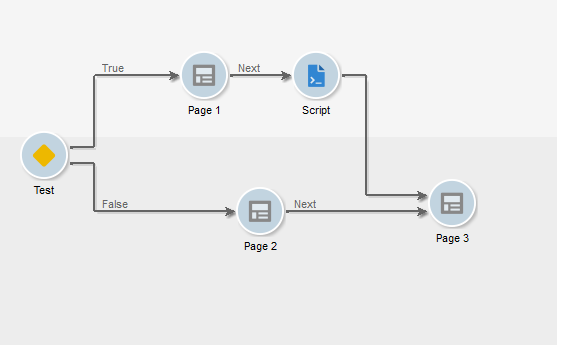
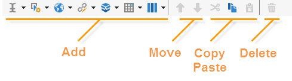

# Skapa en ny rapport{#creating-a-new-report}

Så här skapar du en rapport:

1. Öppna Adobe Campaign Explorer och från **[!UICONTROL Administration > Configuration]** noden och markera sedan **[!UICONTROL Reports]** mappen.
1. Klicka på **[!UICONTROL New]** knappen ovanför listan med rapporter.
1. Markera **[!UICONTROL Create a new report from a template]** och klicka **[!UICONTROL Next]**.

   

1. Välj rapportmallen i listrutan.

   * Med **[!UICONTROL Extended report]** den kan du skapa en rapport som har konfigurerats med hjälp av ett diagram.
   * Med **[!UICONTROL Qualitative distribution]** rapporten kan du skapa statistik baserat på alla typer av data (företagsnamn, e-postdomän, osv.).
   * Med **[!UICONTROL Quantitative distribution]** rapporten kan du skapa statistik för data som kan mätas eller räknas (fakturabelopp, mottagarålder osv.).
   Mer information om de här rapportmallarna finns i [det här avsnittet](../../reporting/using/about-descriptive-analysis.md).

1. Ange rapportnamnet och dess beskrivning i motsvarande fält. Ange **[!UICONTROL schema]** på vilken rapport ska användas.

   

1. Spara den här rapporten.

## Flyttar diagrammet {#modelizing-the-chart}

När du har sparat rapporten ska den visas. Nu kan du skapa diagram för din rapport.

Diagrammet för att skapa rapporten består av en serie aktiviteter.

Aktiviteter länkas med övergångar, som representeras av pilar.

Om du vill skapa en rapport, beroende på dess art och sammanhang, måste du identifiera de användbara elementen och ändra deras logiska sekvens.

1. Använd aktiviteten Start för att materialisera den första processen som ska utföras för att skapa rapporten. Du kan bara använda en av dessa aktiviteter per rapport.

   Det är obligatoriskt om diagrammet innehåller en slinga.

1. Lägg till en eller flera &#39;Fråga&#39;-aktiviteter för att samla in data som är användbara när du skapar rapporten. Data kan samlas in antingen direkt via en fråga i ett databasschema eller via en importerad lista eller en befintlig kub.

   Mer information finns i [Samla in data som ska analyseras](../../reporting/using/collecting-data-to-analyze.md).

   Dessa data visas (eller inte) i rapporten beroende på sidkonfigurationen.

1. Placera en eller flera aktiviteter på sidan för att definiera den grafiska representationen av insamlade data. Du kan infoga tabeller, diagram, inmatningsfält och villkora visningen av en eller flera sidor eller element på sidan. Innehållet som visas kan konfigureras fullständigt.

   Mer information finns i [Statiska element](#static-elements).

1. Använd aktiviteten Testa för att definiera villkoren för att visa eller komma åt data.

   Mer information finns i [Villkorlig sidvisning](../../reporting/using/defining-a-conditional-content.md#conditioning-page-display).

1. Om det behövs lägger du till anpassade skript via aktiviteten Skript, t.ex. för att beräkna namnet på en rapport, för att filtrera visningen av resultatet i en viss kontext osv.

   Mer information finns i [Skriptaktivitet](../../reporting/using/advanced-functionalities.md#script-activity).

1. Slutligen kan du enklare läsa komplexa rapporter genom att infoga en eller flera hoppaktiviteter. På så sätt kan du gå från en aktivitet till en annan utan att behöva materialisera övergången i rapporten. Du kan även använda&quot;Hoppa&quot; för att visa en annan rapport.

   Mer information finns i [Hoppaktivitet](../../reporting/using/advanced-functionalities.md#jump-activity).

Du kan inte köra flera grenar samtidigt. Det innebär att en sådan här rapport inte fungerar:

Du kan dock placera flera grenar. Endast en av dem kommer att köras:

## Skapa en sida {#creating-a-page}

Innehållet konfigureras via aktiviteter som finns i diagrammet. Mer information finns i [Skapa diagram](#modelizing-the-chart).

Om du vill konfigurera en aktivitet dubbelklickar du på dess ikon.

Det visade innehållet definieras i **sidtypsaktiviteterna** .

En rapport kan innehålla en eller flera sidor. Sidorna skapas med en dedikerad redigerare där du kan infoga inmatningsfält, urvalsfält, statiska element, diagram eller tabeller i en trädstruktur. Behållare hjälper dig att definiera layouten. Mer information finns i [Elementlayout](../../reporting/using/element-layout.md).

Om du vill lägga till en komponent på sidan använder du ikonerna i verktygsfältets övre vänstra del.

Du kan också högerklicka på noden där du vill lägga till komponenten och välja den i listan.

>[!CAUTION]
>
>Om rapporten ska exporteras i Excel-format rekommenderar vi att du inte använder komplex HTML-formatering. Mer information finns i [Exportera en rapport](../../reporting/using/actions-on-reports.md#exporting-a-report).

Ett **[!UICONTROL Page]** exempel kan innehålla följande element:

* Stolpdiagram, cirkeldiagram, kurvtyp **[!UICONTROL charts]** osv.
* pivottar; Lista med grupp eller uppdelning **[!UICONTROL tables]**.
* Text- eller nummertyp **[!UICONTROL Input controls]**.
* Nedrullningsbar lista, kryssruta, alternativknapp, flerval, datum eller matristyp **[!UICONTROL Selection controls]**.
* Länkredigerare, konstant, mappvalstyp **[!UICONTROL Advanced controls]**.
* Värde, länk, HTML, bild osv. **[!UICONTROL Static elements]**.
* **[!UICONTROL Containers]** som gör att du kan styra komponentlayouten.

Konfigurationsläget för en sida och dess komponenter beskrivs i [det här avsnittet](../../web/using/about-web-forms.md).

Med verktygsfältet kan du lägga till eller ta bort kontroller och ordna deras sekvenser på rapportsidorna.

### Statiska element {#static-elements}

Med statiska element kan du visa information i rapporten, t.ex. grafiska element eller skript, som användaren inte interagerar med. Mer information finns i [det här avsnittet](../../web/using/static-elements-in-a-web-form.md#inserting-html-content) .

### Filtrera information i en rapport {#filtering-information-in-a-report}

Med indata- och markeringskontrollerna kan du filtrera den information som visas i rapporten. Mer information om hur du implementerar den här typen av filtrering finns i [Filtreringsalternativ i frågorna](../../reporting/using/collecting-data-to-analyze.md#filtering-options-in-the-queries).

Mer information om hur du skapar och konfigurerar inmatningsfält och urvalsfält finns i [det här avsnittet](../../web/using/about-web-forms.md).

Du kan integrera en eller flera indatakontroller i dina rapporter. Med den här typen av kontroll kan du filtrera information som visas enligt ett angivet värde.

Du kan även integrera en eller flera markeringskontroller i dina rapporter. Med den här typen av kontroll kan du filtrera informationen i rapporten baserat på de valda värdena, till exempel:

* via alternativknappar eller kryssrutor:

   

* via en nedrullningsbar lista:

   

* via en kalender:

   

Slutligen kan du integrera en eller flera avancerade kontroller i dina rapporter. Med den här typen av kontroll kan du infoga en länk, en konstant eller välja en mapp.

Här kan du filtrera data i rapporten så att endast information som finns i en av trädets mappar visas:

