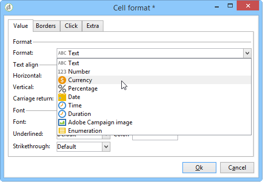
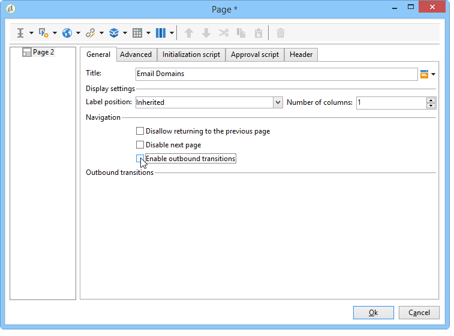

# Skapa en tabell{#creating-a-table}

Du kan lägga till en tabell i en rapport för att visa data. Detta kan vara en pivottabell som skapas baserat på kubmått, en lista med en grupp eller en tabell som innehåller en uppdelning av värden.


## Skapa en lista med en grupp {#creating-a-list-with-group}

Med en **[!UICONTROL List with group]** typtabell kan du gruppera data i tabellen och producera statistik för den. Du kan t.ex. skapa summor och delsummor för data. Varje grupp har sin egen rubrik, detalj- och sidfotsrad.

>[!CAUTION]
>
>Den **[!UICONTROL Page]** aktivitet som innehåller tabellen måste föregås av en **[!UICONTROL Query]** eller **[!UICONTROL Script]** aktivitet för att samla in de data som ska analyseras i rapporten. Mer information om de här aktiviteterna finns i [Samla in data för analys](../../reporting/using/collecting-data-to-analyze.md) - och [skriptaktivitet](../../reporting/using/advanced-functionalities.md#script-activity).

### Verksamhetsprincip {#operating-principle}

Det kan hända att du måste analysera flera datakategorier samtidigt. Med en lista med grupper kan du kombinera data och skapa statistik för olika grupper av data i samma tabell. Det gör du genom att skapa en grupp i tabellen.

I följande exempel visar gruppen alla kampanjer i databasen, leveranser och antalet meddelanden som skickas per leverans och per kampanj.

Här kan du lista de kampanjer (**[!UICONTROL Label (Campaign)]** listan över leveranser (**[!UICONTROL Label]** ) som är kopplade till kampanjen och räkna antalet meddelanden som skickas per leverans (**[!UICONTROL Processed)]** innan de läggs till för varje kampanj (**[!UICONTROL Sum(@processed)]** ).


### Implementeringssteg {#implementation-steps}

Ett exempel på fullständig implementering finns här: [Användningsfall: Skapa en rapport med en grupplista](#use-case--create-a-report-with-a-group-list).

Observera följande steg för att skapa en List med group-typtabell:

1. Gå till rapportdiagrammet och placera en **[!UICONTROL Query]** aktivitet. Se [Samla in data för analys](../../reporting/using/collecting-data-to-analyze.md).
1. Fyll i källtabellen och markera fälten i tabellen som statistiken ska beröra.
1. Placera en **[!UICONTROL Page]** aktivitet i diagrammet. Mer information finns i [Statiska element](../../reporting/using/creating-a-new-report.md#static-elements).
1. Infoga en **[!UICONTROL List with group]** typtabell på sidan.
1. Ange datasökvägen eller den tabell som har valts som datakälla i frågan.

   Det här steget är obligatoriskt om du vill återställa fälten i källtabellen senare och infoga dem i tabellens celler.

1. Skapa tabellen och dess innehåll.
1. Visa den färdigställda rapporten på **[!UICONTROL Preview]** fliken. Du kan sedan publicera rapporten och exportera den till ett annat format om det behövs. Mer information finns i [Exportera en rapport](../../reporting/using/actions-on-reports.md#exporting-a-report).

### Lägga till rader och kolumner {#adding-lines-and-columns}

Som standard innehåller en **[!UICONTROL List with group]** typtabell ett sidhuvud, en detaljrad och en sidfotsrad.

Själva gruppen innehåller rubrik-, detalj- och sidfotsrader.

* **Rubrikrad**: På den här raden kan du ge tabellkolumnerna en rubrik.

   

* **Detaljrad**: den här raden innehåller statistiska värden.

   

* **Sidfotsrad**: På den här raden kan du visa de totala värdena.

   

Linjer och kolumner kan läggas till efter behov.

Gruppen kan placeras på vilken rad som helst i tabellen och innehåller egna huvud-, detalj- och sidfotsrader.


**Rad och kolumn**: Om du vill lägga till eller ta bort en rad eller en kolumn går du till en befintlig rad eller kolumn och använder högerklicksmenyn.


Vilken typ av rad du lägger till beror på var markören är placerad. Om du till exempel vill lägga till en rubrikrad placerar du markörerna i en rubrik och klickar sedan på **[!UICONTROL Add > A line above/below]**.


Bredden på kolumnerna kan ändras via **[!UICONTROL Column format]** objektet.

**Grupp**: Om du vill lägga till en grupp går du till en rad och väljer matchande alternativ i listrutan.


### Definiera cellinnehåll {#defining-cell-content}

Om du vill redigera en cell i tabellen och definiera dess innehåll och format går du till cellen och använder högerklicksmenyn.

Använd **[!UICONTROL Expression]** menyposten för att välja de värden som ska visas.


* Om du vill infoga värdena som ska analyseras direkt i tabellen markerar du dem bland de tillgängliga fälten.

   Listan med tillgängliga fält sammanfaller med innehållet i frågan före tabellen i rapportkonstruktionsdiagrammet.

   

* Ange en etikett för en cell, till exempel rubrikens.

   Om du vill göra det använder du samma process som när du infogar ett fält i databasen, men markerar inget uttryck. Ange etiketten i **[!UICONTROL Label]** fältet. Den visas som den är.

* Beräkna ett aggregat (ett genomsnitt, en summa osv.) och visa den i cellen.

   Det gör du genom att använda **[!UICONTROL Aggregates]** menyposten och välja önskad kampanj.

   

### Definiera cellformat {#defining-cell-format}


Om du vill definiera cellformatet kan du på **[!UICONTROL Cell format...]** menyn komma åt alla formateringsalternativ som är tillgängliga för den markerade cellen.

Med dessa alternativ kan du anpassa den slutliga återgivningen av rapporten och göra det enklare att läsa information.

Använd **[!UICONTROL Carriage return]** fältet när du exporterar data till Excel: markera det **[!UICONTROL Yes]** värde som ska framtvinga vagnreturen. Detta värde behålls vid export. Mer information finns i [Exportera en rapport](../../reporting/using/actions-on-reports.md#exporting-a-report).

Du kommer åt följande flik i **[!UICONTROL Cell format]** fönstret:

* Fliken **[!UICONTROL Value]**
* Fliken **[!UICONTROL Borders]**
* Fliken **[!UICONTROL Click]**
* Fliken **[!UICONTROL Extra]**

På fliken **[!UICONTROL Value]** kan du ändra teckensnitt och olika värdeattribut eller definiera ett format baserat på deras egenskaper.



Formatet ändrar visningen av data: Med formaten **[!UICONTROL Number]**, **[!UICONTROL Monetary]** och **[!UICONTROL Percentage]** kan du till exempel justera siffrorna åt höger och visa decimalpunkter.

Exempel på hur du konfigurerar ett valutaformat: Du kan ange i vilken valuta värdena ska uttryckas, välja om du vill separera tusentals och visa negativa värden i rött. Valutasymbolens position beror på vilket språk operatorn har i sin profil.


Konfigurationsexempel för datum: du kan välja om du vill visa tiden eller inte.


På fliken **Kantlinjer** kan du lägga till kantlinjer till raderna och kolumnerna i tabellen. Om du lägger till kantlinjer i cellerna kan det leda till prestandaproblem när du exporterar stora rapporter till Excel.


Om det behövs kan du definiera kantlinjer i tabellmallen (**[!UICONTROL Administration > Configuration > Form rendering]** ).

I det här fallet har du följande syntax:

På fliken Webb:

```
 .tabular td {
 border: solid 1px #000000;
 }
```

På fliken Excel:

```
 <style name="odd" fillColor="#fdfdfd">
  <border>
   <borderTop value="solid 0.05pt #000000" />
   <borderBottom value="solid 0.05pt #000000" />
   <borderLeft value="solid 0.05pt #000000" />
   <borderRight value="solid 0.05pt #000000" />
  </border>
 </style> 
 
 <style name="even" fillColor="#f7f8fa">
  <border>
   <borderTop value="solid 0.05pt #000000" />
   <borderBottom value="solid 0.05pt #000000" />
   <borderLeft value="solid 0.05pt #000000" />
   <borderRight value="solid 0.05pt #000000" />
  </border>
 </style> 
```

På fliken **[!UICONTROL Click]** kan du definiera en åtgärd när användaren klickar på innehållet i en cell eller i tabellen.

I exemplet nedan kan du klicka på värdet i cellen för att visa den andra sidan i rapporten: den kommer att innehålla information om leveransen i cellen.


På fliken **Extra** kan du länka en bild till dina data, t.ex. en färgmarkering eller ett värdefält. Färgmarkeringen används när tabellen visas som en förklaring i ett diagram. Mer information finns i implementeringsexemplet: [Steg 5 - Skapa den andra sidan](#step-5---create-the-second-page)


## Användningsfall: Skapa en rapport med en grupplista {#use-case--create-a-report-with-a-group-list}

I det här exemplet ska vi skapa en tvåsidig rapport: den första sidan innehåller listan och de totala leveranserna per kampanj samt antalet skickade meddelanden. Leveransnamnen är klickbara länkar och du kan gå vidare till den andra sidan av rapporten för att visa fördelningen av leveranser per e-postdomän för den valda leveransen med en tabell och ett diagram. På den andra sidan fungerar tabellen som förklaring för diagrammet.


### Steg 1 - Skapa en rapport {#step-1---create-a-report}

Skapa en ny rapport som gäller kampanjschemat **[!UICONTROL Campaigns (nms)]**.


Klicka **[!UICONTROL Save]** för att skapa rapporten.

Gå till diagrammet och lägg till de första komponenterna som ska användas för att utforma rapportinnehållet: en första fråga och en första sida.


### Steg 2 - Skapa den första frågan {#step-2---create-the-first-query}

Med den första frågan kan ni samla in leveranser som är länkade till varje kampanj. Målet är att visa en rapport om de olika leveranserna av Adobe Campaign-databasen som är länkad till varje kampanj.

Dubbelklicka på den första frågan för att redigera den och använd sedan följande steg för att konfigurera den:

1. Börja med att ändra schemat som frågans källa ska användas på: välj **[!UICONTROL Deliveries (nms)]** schema.
1. Klicka på **[!UICONTROL Edit query]** länken och visa de avancerade fälten.

   

1. Markera följande fält:

   * Leveransetiketten.
   * Leveransens primärnyckel.
   * kampanjetiketten,
   * Indikatorn för bearbetade leveranser.
   * den utländska nyckeln för Campaign-länken,
   * Indikatorn för felfrekvens.
   

   Länka ett alias till varje fält: Vi rekommenderar att du gör det enklare att välja data från tabellen som ska läggas till på rapportens första sida.

   I det här exemplet använder vi följande alias:

   * Etikett: **@label**
   * Primär nyckel: **@deliveryId**
   * Etikett (Campaign): **@label1**
   * Behandlad: **@bearbetad**
   * Sekundärnyckel för länken&quot;Campaign&quot; (ID-fält): **@operationId**
   * Felfrekvens: **@errorRatio**


1. Klicka på **[!UICONTROL Next]** knappen två gånger för att komma till **[!UICONTROL Data filtering]** steget.

   Lägg till ett filtreringsvillkor om du bara vill samla in de leveranser som är kopplade till en kampanj.

   Syntaxen för det här filtret är följande: &quot;Sekundärnyckel för länken &#39;Campaigns&#39; som är större än 0&quot;.

   

1. Klicka **[!UICONTROL Finish]** för att spara dessa villkor och klicka sedan på **[!UICONTROL Ok]** för att stänga frågeredigeraren.

### Steg 3: Skapa den första sidan {#step-3--create-the-first-page}

I det här steget ska vi konfigurera den första sidan i rapporten. Så här konfigurerar du den:

1. Öppna **[!UICONTROL Page]** aktiviteten och ange dess titel, t.ex. **Leveranser** i det här fallet.

   

1. Infoga en lista med grupper via verktygsfältet och ange dess etikett, till exempel: Lista över leveranser per kampanj.

   

1. Klicka på **[!UICONTROL Table data XPath...]** länken och välj leveranslänken, dvs. `[query/delivery]`.

   

1. Klicka på **[!UICONTROL Data]** fliken och ändra tabellens layout: lägg till tre kolumner till höger.

   

1. Lägg till en grupp.

   

   Med den här gruppen kan ni gruppera kampanjer och de leveranser som är kopplade till dem.

1. I gruppfönstret refererar du till **sekundärnyckeln för länken** Campaign och stänger fönstret.

   

1. Redigera den första cellen i grupprubriken och infoga fältet **[!UICONTROL Label]** för kampanjerna som ett uttryck.

   

1. Redigera den andra cellen på informationsraden och välj leveranser **[!UICONTROL Label]**.

   

1. Redigera cellens format och öppna **[!UICONTROL Click]** fliken. Konfigurera lämpliga alternativ så att den öppnas i samma fönster när användaren klickar på namnet på en leverans.

   

   Det gör du genom att välja en **[!UICONTROL Next page]** typåtgärd och välja **[!UICONTROL In the same window]** som ett öppet alternativ.

   

1. Klicka på **[!UICONTROL Add]** och ange den **`/vars/selectedDelivery`** sökväg och det **[!UICONTROL @deliveryId]** uttryck som matchar aliaset för leveransens primärnyckel enligt den fråga som skapades tidigare i det nedre avsnittet av fönstret. Med den här formeln kan du komma åt den valda leveransen.

   

1. Redigera den andra cellen i sidfotsraden i gruppen och ange **[!UICONTROL Total per campaign]** som etikett.

   

1. Redigera den tredje cellen i rubrikraden i gruppen och ange **[!UICONTROL Number of messages sent]** som etikett.

   

   Den här informationen sammanfaller med kolumnrubriken.

1. Redigera den tredje cellen på detaljraden och välj den bearbetade meddelandeindikatorn som ett uttryck.

   

1. Redigera den tredje cellen i sidfotsraden i gruppen, markera indikatorn för bearbetad leverans och tillämpa sammanställningen på den **[!UICONTROL Sum]** .

   

1. Redigera den fjärde cellen på detaljraden och välj felets **leveransfelfrekvens** som ett uttryck.

   

1. Markera den här cellen om du vill visa ett värdefält som representerar leveransfelprocenten.

   Det gör du genom att gå till cellformatet och sedan till **[!UICONTROL More]** fliken. Markera **[!UICONTROL Value bar]** posten i listrutan och välj **[!UICONTROL Hide the cell value]** alternativet.

   

   Nu kan du visa en återgivning av rapporten. Klicka på **[!UICONTROL Preview]** fliken och välj **[!UICONTROL Global]** alternativet: Här visas en lista över alla leveranser i Adobe Campaign-databasen som är länkade till en kampanj.

   

   Vi rekommenderar att du använder fliken **[!UICONTROL Preview]** för att kontrollera att data i tabellen är korrekt markerade och konfigurerade. När du är klar kan du fortsätta formatera tabellen.

1. Använd **[!UICONTROL Bold]** formatet på cellerna som visar det totala antalet per kampanj och det totala antalet bearbetade meddelanden.

   

1. Klicka på den första cellen i grupprubrikraden, den som visar kampanjnamnet, och välj **[!UICONTROL Edit > Merge to right]**.

   

   Om du sammanfogar de två första cellerna i grupprubrikraden justeras kampanjtiteln och listan över leveranser som är länkade till den på nytt.

   

   >[!CAUTION]
   >
   >Vi rekommenderar att du väntar tills rapporten har byggts innan du sammanfogar celler eftersom sammanfogningen är oåterkallelig.

### Steg 4 - Skapa den andra frågan {#step-4---create-the-second-query}

Vi vill lägga till en andra fråga och en andra sida för att visa detaljerna för en leverans när rapportanvändaren klickar på den. Innan du lägger till frågan redigerar du sidan som du har skapat och aktiverar den utgående övergången så att den kan länkas till frågan.

1. Lägg till en ny fråga efter **[!UICONTROL Page]** aktiviteten och redigera dess schema: välj **[!UICONTROL Recipient delivery logs]** schema.

   

1. Redigera frågan och definiera utdatakolumner. Om du vill visa antalet leveranser per e-postdomän måste du:

   * beräkna summan av primärnycklar för att räkna antalet leveransloggar:

      

   * samla in mottagarnas e-postdomäner och gruppinformation om detta fält: Om du vill göra det väljer du **[!UICONTROL Group]** alternativet i kolumnen Domännamn.
   

   Länka följande alias till fälten:

   * count(primär nyckel): **@count**
   * E-postdomän (mottagare): **@domän**

      


1. Klicka två gånger på **[!UICONTROL Next]** knappen: så kommer du till **[!UICONTROL Data filtering]** steget.

   Lägg till ett filtreringsvillkor om du bara vill samla in den information som är länkad till den valda leveransen.

   Syntaxen är följande: Sekundärnyckeln för länken &#39;Leverans&#39; är lika med värdet för inställningen `$([vars/selectedDelivery])`

   

1. Stäng frågekonfigurationsfönstret och lägg till en sida i diagrammet, precis efter den andra frågan.

### Steg 5 - Skapa den andra sidan {#step-5---create-the-second-page}

1. Redigera sidan och ange dess etikett: E- **postdomäner**.
1. Avmarkera **[!UICONTROL Enable output transitions]** alternativet: detta är sista sidan i rapporten och kommer inte att följas av någon annan aktivitet.

   

1. Lägg till en ny lista med en grupp med högerklicksmenyn och anropa den med **E-postdomäner per mottagare**.
1. Klicka på **[!UICONTROL Table data XPath...]** och markera **[!UICONTROL Recipient delivery logs]** länken.

   

1. Anpassa tabellen på följande sätt på **[!UICONTROL Data]** fliken:

   * Lägg till två kolumner till höger.
   * I den första cellen på detaljraden lägger du till **[!UICONTROL rowNum()-1]** uttrycket för att räkna antalet rader. Ändra sedan cellens format: på **[!UICONTROL Extra]** fliken markerar du **[!UICONTROL Color tab]** och klickar **[!UICONTROL Ok]**.

      

      Med den här konfigurationen kan du använda tabellen som bildtext för diagrammet.

   * Lägg till **[!UICONTROL Email domain(Recipient)]** uttrycket i den andra cellen på detaljraden.
   * Lägg till **[!UICONTROL count(primary key)]** uttrycket i den tredje cellen på detaljraden.
   

1. Lägg till ett cirkeldiagram på sidan med högerklicksmenyn och tilldela etiketten **E-postdomäner** till den. Mer information finns i [Diagramtyper och varianter](../../reporting/using/creating-a-chart.md#chart-types-and-variants).
1. Klicka på **[!UICONTROL Variants]** länken och avmarkera alternativen **[!UICONTROL Display label]** och **[!UICONTROL Display caption]** .
1. Kontrollera att ingen värdesortering har konfigurerats. Mer information finns i [det här avsnittet](../../reporting/using/processing-a-report.md#configuring-the-layout-of-a-descriptive-analysis-report).

   

1. Ändra datakällan på **[!UICONTROL Data]** fliken: i **[!UICONTROL Context data]** listrutan.

   

1. Klicka sedan på **[!UICONTROL Advanced settings]** och välj länken till mottagarens leveransloggar.

   

1. Markera **[!UICONTROL Chart type]** variabeln i **[!UICONTROL Email domain]** avsnittet.
1. Lägg sedan till den beräkning som ska utföras: markera summan som en operator.

   

1. Klicka på **[!UICONTROL Detail]** knappen för att markera fältet som räkningen ska gälla för och stäng sedan konfigurationsfönstret.

   

1. Spara rapporten.

   Sidan är nu konfigurerad.

### Steg 6 - Visa rapporten {#step-6---viewing-the-report}

Om du vill visa resultatet av den här konfigurationen klickar du på **[!UICONTROL Preview]** fliken och väljer **[!UICONTROL Global]** alternativet.

Den första sidan i rapporten innehåller en lista över alla leveranser som ingår i databasen.


Om du klickar på länken för någon av dessa leveranser visas ett diagram med uppdelningen av e-postdomäner för den här leveransen. Du är nu på andra sidan av rapporten och kan gå tillbaka till föregående sida genom att klicka på lämplig knapp.


## Skapa en detaljtabell eller pivottabell {#creating-a-breakdown-or-pivot-table}

Med den här tabelltypen kan du visa statistik som beräknas på data i databasen.

Konfigurationen för de här typerna av rapporter liknar den som används för den beskrivande analysguiden. Mer information finns på [den här sidan](../../reporting/using/using-the-descriptive-analysis-wizard.md#configuring-the-quantitative-distribution-template).

Mer information om hur du skapar en pivottabell finns i [det här avsnittet](../../reporting/using/using-cubes-to-explore-data.md).
