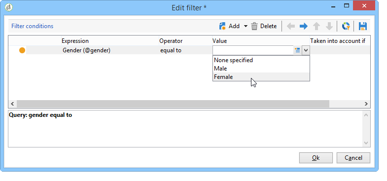
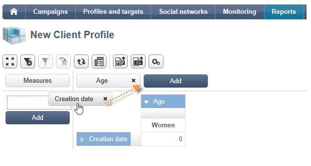

# Skapa indikatorer{#creating-indicators}

Om du vill göra en kub funktionell måste du identifiera relevanta mått och mått och skapa dem i kuben.

Så här skapar du en kub:

1. Markera arbetsregistret. Se [Välja arbetstabell](#selecting-the-work-table).
1. Definiera dimensioner. Se [Definiera dimensioner](#defining-dimensions).
1. Definiera mått. Se [Byggnadsindikatorer](#building-indicators).
1. Skapa aggregat (valfritt). Se [Beräkna och använda aggregat](../../reporting/using/concepts-and-methodology.md#calculating-and-using-aggregates).

I det här exemplet visas hur du snabbt skapar en enkel kub i en rapport för att exportera måtten.

Implementeringsstegen beskrivs nedan. Det finns omfattande alternativ och beskrivningar i de andra avsnitten i detta kapitel.

## Välja arbetstabell {#selecting-the-work-table}

Om du vill skapa en kub klickar du på **[!UICONTROL New]** ovanför listan med kuber.

Välj faktchemat, d.v.s. schemat som innehåller elementen som du vill utforska. I det här exemplet ska vi välja tabellen **Mottagare**.

Klicka på **[!UICONTROL Save]** för att skapa kuben: visas i listan över kuber och kan sedan konfigureras med lämpliga flikar.

Klicka på länken **[!UICONTROL Filter the source data...]** för att använda beräkningar för den här kuben på ett dataurval i databasen.

## Definiera dimensioner {#defining-dimensions}

Dimensioner sammanfaller med analysaxlar som definierats för varje kub baserat på deras relaterade faktaschema. Detta är de dimensioner som undersöks i analysen, t.ex. tid (år, månad, datum...), en produktklassificering (familj, referens osv.), ett populationssegment (per ort, åldersgrupp, status osv.).

Dessa analysaxlar definieras på fliken **[!UICONTROL Dimension]** i kuben.

Klicka på knappen **[!UICONTROL Add]** för att skapa en ny dimension och klicka sedan på ikonen **[!UICONTROL Edit expression]** i **[!UICONTROL Expression field]** för att markera fältet som innehåller aktuella data.

* Börja med att markera mottagaren **Ålder**. I det här fältet kan du definiera bindning till gruppsidor och göra det enklare att läsa information. Vi rekommenderar att du använder bindning när det är möjligt att använda flera olika värden.

   Det gör du genom att markera alternativet **[!UICONTROL Enable binning]**. Bindningslägena beskrivs i [Databindning](../../reporting/using/concepts-and-methodology.md#data-binning).

   

* Lägg till en **Date**-typdimension. Här vill vi visa datum då mottagarprofilen skapades

   Det gör du genom att klicka på **[!UICONTROL Add]** och markera fältet **[!UICONTROL Creation date]** i mottagartabellen.

   

   Det går att välja datumvisningsläge. Om du vill göra det väljer du den hierarki som ska användas och de nivåer som ska genereras:

   

   I vårt exempel vill vi bara visa år, månader och dagar eftersom det inte går att arbeta med veckor och semestrar/månader samtidigt: dessa nivåer är inte kompatibla.

* Skapa en annan dimension för att analysera data i förhållande till mottagarens ort

   Lägg till en ny dimension och markera staden i noden **[!UICONTROL Location]** i mottagarschemat.

   

   Du kan aktivera bindning för att göra det enklare att läsa information och länka värdena till en uppräkning.

   

   Välj uppräkningen i listrutan

   

   Endast värdena i uppräkningen visas. De andra grupperas under den etikett som definieras i fältet **[!UICONTROL Label of the other values]**.

   Mer information finns i [Hantera behållare dynamiskt](../../reporting/using/concepts-and-methodology.md#dynamically-managing-bins).

## Byggindikatorer {#building-indicators}

När dimensionerna har definierats måste du ange ett beräkningssätt för de värden som ska visas i cellerna. Det gör du genom att skapa matchande indikatorer på fliken **[!UICONTROL Measures]**: skapa så många mått som det finns kolumner att visa i rapporten som ska använda kuben.

Gör så här:

1. Klicka på knappen **[!UICONTROL Add]**.
1. Välj typ av mått och formel som ska användas. Här vill vi räkna antalet kvinnor bland mottagarna.

   Vårt mått baseras på faktchemat och använder operatorn **[!UICONTROL Count]**.

   

   Med länken **[!UICONTROL Filter the measure data...]** kan du bara välja kvinnor. Mer information om hur du definierar mått och tillgängliga alternativ finns i [Definiera mått](../../reporting/using/concepts-and-methodology.md#defining-measures).

   

1. Ange måttets etikett och spara det.

   

1. Spara kuben.

## Skapa en rapport baserad på en kub {#creating-a-report-based-on-a-cube}

När kuben har konfigurerats kan den användas som mall för att skapa en ny rapport.

Så här gör du:

1. Klicka på knappen **[!UICONTROL Create]** på fliken **[!UICONTROL Reports]** och välj den kub du just har skapat.

   

1. Klicka på **[!UICONTROL Create]**-knappen för att bekräfta: kommer du till sidan för rapportkonfiguration och visning.

   Som standard visas de två första tillgängliga dimensionerna i rader och kolumner, men inget värde visas i tabellen. Klicka på huvudikonen om du vill generera tabellen:

   

1. Du kan ändra dimensionens axlar, ta bort dem, lägga till nya mått osv. Möjliga åtgärder beskrivs här: [Använda kuber för att utforska data](../../reporting/using/using-cubes-to-explore-data.md).

   Använd lämpliga ikoner för att göra detta.

   

