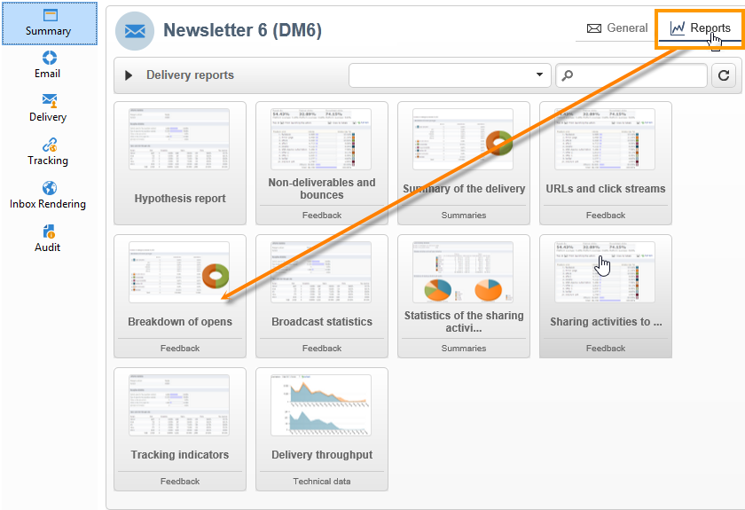

# Leveransrapporter {#delivery-reports}

Du kan spåra leveransen via olika rapporter som du når via leveransöversikten. Gör så här för att visa rapporter:

1. Gå till **[!UICONTROL Campaigns]** universum och klicka på **[!UICONTROL Delivery]** länken för att visa listan över leveranser.
1. Klicka på namnet på den leverans som du vill visa för att visa informationen.

   

1. Markera **[!UICONTROL Summary]** fliken och klicka på **[!UICONTROL Reports]** länken för att komma åt rapporter som är specifika för leveransen.

   

   Som standard är följande rapporter tillgängliga:

   * **[!UICONTROL Delivery throughput]** : se [Leveransflöde](#delivery-throughput).
   * **[!UICONTROL Sharing to social networks]** : se [Delning till sociala nätverk](#sharing-to-social-networks).
   * **[!UICONTROL Statistics on sharing activities]** : se [Statistik om delning av aktiviteter](#statistics-on-sharing-activities).
   * **[!UICONTROL Hot clicks]** : referera till [snabbklickningar](#hot-clicks).
   * **[!UICONTROL Tracking statistics]** : se [Spårningsstatistik](#tracking-statistics)
   * **[!UICONTROL URLs and click streams]** : se [URL:er och klicka på strömmar](#urls-and-click-streams).
   * **[!UICONTROL Tracking indicators]** : se [Spårningsindikatorer](#tracking-indicators).
   * **[!UICONTROL Non-deliverables and bounces]** : hänvisa till [Ej levererbara produkter och studsar](#non-deliverables-and-bounces).
   * **[!UICONTROL User activities]** : se [Användaraktiviteter](#user-activities).
   * **[!UICONTROL Delivery summary]** : se [Leveranssammanfattning](#delivery-summary).
   * **[!UICONTROL Subscription tracking]** : se [Prenumerationsspårning](#subscription-tracking).
   * **[!UICONTROL Delivery statistics]** : se [Leveransstatistik](#delivery-statistics).
   * **[!UICONTROL Breakdown of opens]** : se [Indelning av öppningar](#breakdown-of-opens).

## Spårningsindikatorer {#tracking-indicators}

I den här rapporten kombineras de viktigaste indikatorerna för att spåra mottagarnas beteende när de tar emot leveransen. Den ger tillgång till leverans- och mottagningsstatistik, öppnings- och klickfrekvens, genererade klickströmmar, webbspårning samt delar aktiviteter till sociala nätverk.

>[!NOTE]
>
>Värden som beräknas baserat på meddelandeöppning är alltid uppskattningar på grund av den felmarginal som är länkad till e-postmeddelanden i textformat. Indikatorerna **[!UICONTROL Distinct opens/Sum of opens for the population reached]** tar hänsyn till denna felmarginal. Mer information om att spåra öppningar finns i [Spåra öppningar](#tracking-opens-).

**[!UICONTROL 1. Delivery statistics]**

* **[!UICONTROL Messages to deliver]** : Totalt antal meddelanden som ska levereras efter leveransanalys.
* **[!UICONTROL Success]** : Antal meddelanden som har bearbetats.

**[!UICONTROL 2. Reception statistics]**

>[!NOTE]
>
>De relaterade procentsatserna beräknas baserat på antalet meddelanden som har vidarebefordrats.

* **[!UICONTROL Distinct opens for the population reached]** : Uppskattning av antalet målmottagare som har öppnat ett meddelande minst en gång. Klicka på länkar för att ta bort prenumerationen och spegelsidor beaktas.
* **[!UICONTROL Sum of opens for the population reached]** : Uppskattning av det totala antalet öppningar av målmottagare.
* **[!UICONTROL Clicks on opt-out link]** :Antal klick på länken för att avbryta prenumerationen.
* **[!UICONTROL Clicks on the mirror page link]** : Antal klick på länken till spegelsidan. För att länken ska kunna beaktas måste den definieras som sådan i leveransguiden (spårade URL:er). Se den här [sidan](../../delivery/using/monitoring-a-delivery.md).
* **[!UICONTROL Estimation of forwards]** : Uppskattning av antalet e-postmeddelanden som vidarebefordrats av målmottagarna. Det här värdet beräknas genom att subtrahera antalet distinkta personer och antalet distinkta mottagare som klickade i e-postmeddelandet.

   >[!NOTE]
   >
   >Mer information om skillnaden mellan distinkta personer och målmottagare finns i [Målgrupper/mottagare](#targeted-persons---recipients).

**[!UICONTROL 3. Open and click-through rate]**

Den här värdetabellen visar hur leveranser, öppningar, klickningar och råreaktivitet per Internetdomän är fördelade. Följande indikatorer används:

* **[!UICONTROL Sent]** : Totalt antal meddelanden som skickats på den här domänen.
* **[!UICONTROL Complaints]** : Antal meddelanden för den här domänen som har rapporterats som oönskade av mottagaren. Frekvensen beräknas baserat på det totala antalet meddelanden som skickas på den här domänen.
* **[!UICONTROL Opens]** : Antal distinkta målmottagare för den här domänen som har öppnat ett meddelande minst en gång. Frekvensen beräknas baserat på det totala antalet meddelanden som skickas på den här domänen.
* **[!UICONTROL Clicks]** : Antal distinkta mottagare som klickat på samma leverans minst en gång. Frekvensen beräknas baserat på det totala antalet meddelanden som skickas på den här domänen
* **[!UICONTROL Raw reactivity]** : Procentandel av antalet mottagare som klickade på en leverans minst en gång jämfört med antalet mottagare som öppnade en leverans minst en gång.

>[!NOTE]
>
>Domännamnen som visas i den här rapporten definieras i den specificerade lista som används på kubnivå. Om du vill ändra, lägga till eller ta bort standarddomäner redigerar du den **[!UICONTROL Domains]** specificerade listan och ändrar värden och alias. Mer information finns i [det här avsnittet](../../platform/using/managing-enumerations.md). Kategorin innehåller **[!UICONTROL Others]** domännamn som inte tillhör något värde i den specificerade listan.

**[!UICONTROL 4. Generated click streams]**

>[!NOTE]
>
>De relaterade procentsatserna beräknas baserat på antalet meddelanden som har vidarebefordrats.

* **[!UICONTROL Distinct clicks for the population reached]** : Antal distinkta personer som klickat på en leverans minst en gång.
* **[!UICONTROL Cumulated clicks]** : Totalt antal klick per målmottagare, exklusive prenumerationslänkar och spegelsidor.
* **[!UICONTROL Recipient clicks]** : Antal distinkta mottagare som klickat på samma leverans minst en gång.
* **[!UICONTROL Estimated recipient reactivity]** : Förhållandet mellan antalet mottagare som har klickat minst en gång i en leverans och det uppskattade antalet mottagare som har öppnat en leverans minst en gång. Klickningar på avanmälnings- och spegelsidlänkar beaktas inte.

**[!UICONTROL 5. Web tracking]**

* **[!UICONTROL Visited pages]** : Antal webbsidor som besökts efter att meddelanden tagits emot.
* **[!UICONTROL Transactions]** : Antal inköp efter att meddelandet tagits emot.
* **[!UICONTROL Total amount]** : Totalt antal inköp efter mottagning av meddelanden.
* **[!UICONTROL Average transaction amount]** : Genomsnittligt inköp från distinkta mottagare.
* **[!UICONTROL Articles]** : Antal artiklar som köpts av leveransmottagarna.
* **[!UICONTROL Average count of articles per transaction]** : Genomsnittligt antal artiklar per inköp som gjorts av distinkta mottagare.
* **[!UICONTROL Average amount per message]** : Genomsnittligt antal inköp som genereras per meddelande.

   >[!NOTE]
   >
   >För att en besökt sida, transaktion, belopp eller artikel ska kunna beaktas måste en webbspårningstagg infogas på den matchande webbsidan. Konfigurationen av webbspårning visas i [det här avsnittet](../../configuration/using/about-web-tracking.md).

**[!UICONTROL 6. Sharing activities to email and social networks]**

I det här avsnittet visas antalet meddelanden som delas i alla sociala nätverk. Mer information finns i [Dela till sociala nätverk](#sharing-to-social-networks).

## URL:er och klickbara strömmar {#urls-and-click-streams}

Den här rapporten innehåller en lista över besökta sidor efter en leverans.

Du kan konfigurera innehållet i den här rapporten genom att välja: det poängdiagram som ska visas, tidsfiltret (sedan åtgärden startades, under de första 6 timmarna efter start osv.) och datavisningsläget (per etikett, per URL, per kategori - mer information finns på [den här sidan](../../delivery/using/monitoring-a-delivery.md)). Klicka **[!UICONTROL Refresh]** för att bekräfta valet.

Följande frekvenser visas i rapportens övre del:

* **[!UICONTROL Reactivity]** : Förhållandet mellan antalet målmottagare som klickat på en leverans, i förhållande till det uppskattade antalet målmottagare som öppnat en leverans. Klickningar på länken för avanmälan och på spegelsidan beaktas inte.

   >[!NOTE]
   >
   >Mer information om att spåra öppningar finns i [Spåra öppningar](#tracking-opens-).

* **[!UICONTROL Distinct clicks]** : Antal distinkta personer som har klickat minst en gång (exklusive länk för att avbryta prenumerationen och spegelsida) i en leverans. Den frekvens som visas beräknas baserat på antalet meddelanden som levereras.
* **[!UICONTROL Cumulated clicks]** : Totalt antal klick per målmottagare (exklusive länk för avprenumeration och spegelsida). Den frekvens som visas beräknas baserat på antalet meddelanden som vidarebefordrats.

**[!UICONTROL Platform average]** : Denna genomsnittliga hastighet, som visas för varje frekvens (reaktivitet, distinkta klick och kumulerade klick), beräknas för leveranser som skickats under de senaste sex månaderna. Endast leveranser med samma typologi och i samma kanal beaktas. Korrektur ingår inte.

Den centrala tabellen innehåller följande information:

* **[!UICONTROL Clicks]** : Antal kumulerade klick per länk.
* **[!UICONTROL Clicks (in %)]** : Uppdelning av antalet klick per länk i förhållande till det totala antalet klick.

**[!UICONTROL Breakdown of clicks in time]**

I det här diagrammet visas indelningen av kumulerade klickningar per dag.

## Sammanfattning av leverans {#delivery-summary}

Den här rapporten innehåller all huvudinformation om leveransen.

**[!UICONTROL Target population]**

Det här avsnittet har två indikatorer:

* **[!UICONTROL Initial population]** : Totalt antal mottagare som leveransmålet gäller.
* **[!UICONTROL Messages rejected by the rule]** : Antal adresser som ignoreras under analysen när typologiregler tillämpas: adress saknas, är i karantän, svartlistad osv. Mer information om typologiregler finns på den här [sidan](../../delivery/using/steps-validating-the-delivery.md#validation-process-with-typologies).

**[!UICONTROL Causes of exclusion]**

I mittdiagrammet visas uppdelningen per regel för meddelanden som avvisats under analysen.

**[!UICONTROL Delivery statistics]**

Detta avsnitt innehåller följande indikatorer:

* **[!UICONTROL Messages to be delivered]** : Totalt antal meddelanden som ska levereras efter leveransanalys.
* **[!UICONTROL Success]** : Antal meddelanden som har bearbetats. Den associerade frekvensen är förhållandet till antalet meddelanden som ska levereras.
* **[!UICONTROL Errors]** : Totalt antal fel som ackumulerats under leveranser och automatisk återinläsning. Den associerade frekvensen är förhållandet till antalet meddelanden som ska levereras.
* **[!UICONTROL New quarantines]** : Antal adresser i karantän efter misslyckad leverans (okänd användare, ogiltig domän). Den associerade frekvensen är förhållandet till antalet meddelanden som ska levereras.

## Snabbklickningar {#hot-clicks}

Den här rapporten visar meddelandeinnehållet (HTML och/eller text) med procentandelen klickningar på länkar för varje länk. Personalisering blockerar prenumerationslänkar, länkar till spegelsidor och erbjudandelänkar som tas med i beräkningen i det totala antalet klickningar, men visas inte i rapporten.

>[!NOTE]
>
>Om leveransen innehåller erbjudanden (interaktion) visas en ruta i delen ovanför rapporten med procentandelen klick på erbjudandena.

## Spårningsstatistik {#tracking-statistics}

Den här rapporten innehåller statistik om öppningar, klick och transaktioner.

Med den kan ni spåra effekten av leveransen på marknaden. Du kan konfigurera hur värden visas genom att ändra tidsskalan (1 timme, 3 timmar eller 24 timmar). Klicka **[!UICONTROL Refresh]** för att bekräfta valet.

Den här rapporten innehåller en värdetabell och ett Pareto-diagram som visar hur lång tid det tar att leverera för att uppnå maximal effektivitet. Följande indikatorer används:

* **[!UICONTROL Opens]** : Uppskattning av den tid som krävs för att nå en procentandel av det totala antalet meddelanden som öppnas. E-post i textformat tas inte med i beräkningen. Mer information om att spåra öppningar finns i [Spåra öppningar](#tracking-opens-).
* **[!UICONTROL Clicks]** : Uppskattning av den tid som krävs för att nå en procentandel av det totala antalet inspelade klick. Klicka på länken för avanmälan och spegelsidan beaktas inte.
* **[!UICONTROL Transactions]** : Den tid som krävs för att uppnå en procentandel av det totala antalet transaktioner efter att meddelandet tagits emot. För att en transaktion ska kunna beaktas måste en webbspårningstagg för transaktionstypen infogas på den matchande webbsidan. Konfigurationen av webbspårning visas i [det här avsnittet](../../configuration/using/about-web-tracking.md).
