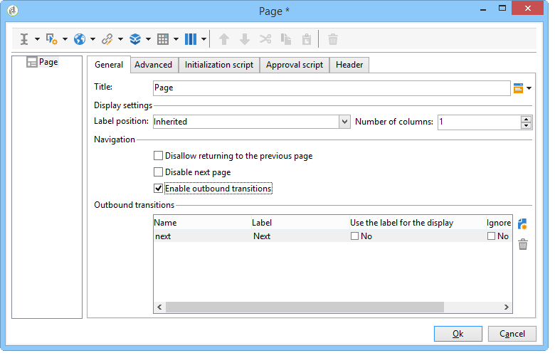

# Elementlayout{#element-layout}

Förutom de olika diagrammen [här](../../reporting/using/creating-a-chart.md#chart-types-and-variants)kan du anpassa visningen och lägga till element på rapportsidorna.

Du kan använda behållare: med dessa kan du länka flera element på en sida och konfigurera deras layout i kolumner och/eller celler. Hur du använder dem beskrivs i [det här avsnittet](../../web/using/defining-web-forms-layout.md#creating-containers).

Du kan konfigurera rapportlayouten i roten av trädet och överlagra den för varje behållare. Sidorna sorteras i kolumner. Behållare sorteras också i kolumner. Endast statiska och grafiska objekt sorteras i celler.

## Definiera alternativ för varje sida {#defining-the-options-for-each-page}

Du kan använda alternativen på varje sida i rapporten.

The **[!UICONTROL General]** Med -fliken kan du ändra sidans titel, samt konfigurera förklaringspositioner och bläddra mellan rapportsidorna.

The **[!UICONTROL Title]** kan du anpassa etiketten i rubriken på rapportsidan. Fönstrets titel kan konfigureras via **[!UICONTROL Properties]** rapportens fönster. Mer information finns i [Lägga till ett sidhuvud och en sidfot](#adding-a-header-and-a-footer).

The **[!UICONTROL Display settings]** Med kan du välja placering för kontrollbildtexten på en rapportsida och definiera antalet kolumner på sidan. Mer information om sidlayout finns i **Artikellayout** avsnitt i [det här avsnittet](../../web/using/defining-web-forms-layout.md#positioning-the-fields-on-the-page).

Välj de olika alternativen i dialogrutan **[!UICONTROL Browse]** för att godkänna bläddring från en rapportsida till en annan. Om **[!UICONTROL Disable next page]** eller **[!UICONTROL Disable previous page]** är markerat, **[!UICONTROL Next]** och **[!UICONTROL Previous]** försvinner från rapportsidan.

## Lägga till ett sidhuvud och en sidfot {#adding-a-header-and-a-footer}

I fönstret för rapportegenskaper kan du också definiera layoutelement, t.ex. fönstrets titel och HTML i sidhuvuden och sidfötter.

Om du vill öppna egenskapsfönstret klickar du på **[!UICONTROL Properties]** rapportknappen.

The **[!UICONTROL Page]** kan du anpassa visningen.

Innehållet som är konfigurerat på den här fliken visas på alla rapportsidor.

The **[!UICONTROL Texts]** Med subtab kan du definiera variabelt innehåll: det kommer att tas med i beräkningen under översättningscykeln om rapporten är avsedd att användas på flera språk.

Detta gör att du kan skapa en lista med textfragment och länka dem till identifierare:

Infoga sedan dessa identifierare i HTML i rapportens innehåll:

De ersätts automatiskt med rätt innehåll när rapporten visas.

Precis som för HTML-texter kan du med det här operativsystemet centralisera texterna som används i rapporten och hantera översättningen av dem. Texten som skapas på den här fliken samlas automatiskt in med det inbyggda Adobe Campaign-översättningsverktyget.
