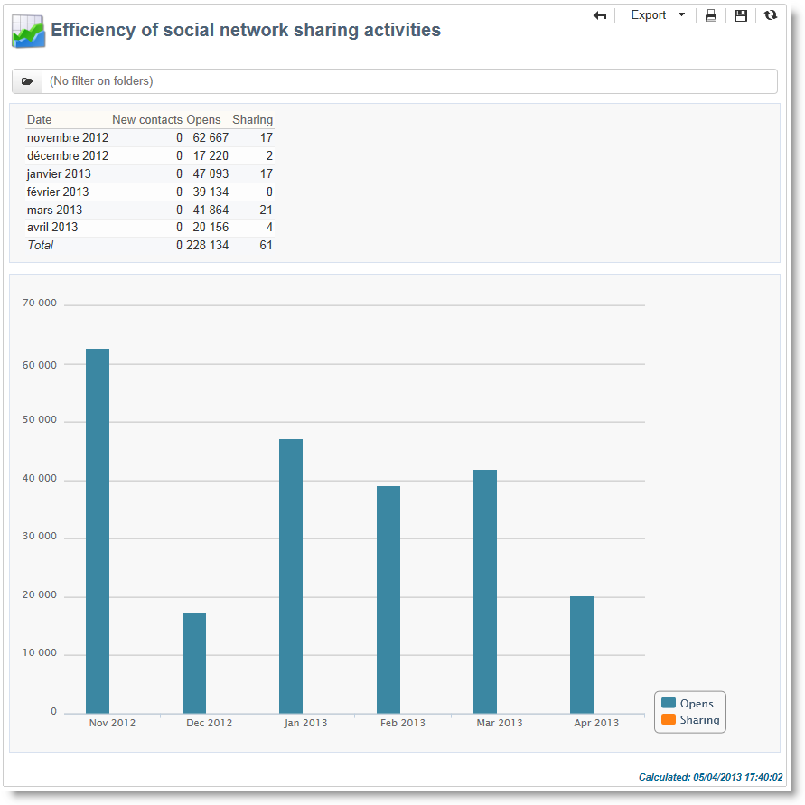

# Globala rapporter {#global-reports}

Dessa rapporter gäller aktiviteten hos data i hela databasen. Om du vill visa rapportkontrollpanelen går du till **[!UICONTROL Reports]** fliken.

Om du vill visa rapporter klickar du på deras namn. Följande rapporter är tillgängliga som standard:

>[!CAUTION]
>
>I det här avsnittet visas endast rapporter som är länkade till leveranser.

* **[!UICONTROL Delivery throughput]** : se [Leveransflöde](#delivery-throughput).
* **[!UICONTROL Browsers]** : se [Webbläsare](#browsers).
* **[!UICONTROL Sharing to social networks]** : se [Delning till sociala nätverk](#sharing-to-social-networks).
* **[!UICONTROL Statistics on sharing activities]** : se [Statistik om delning av aktiviteter](#statistics-on-sharing-activities).
* **[!UICONTROL Operating systems]** : se [Operativsystem](#operating-systems).
* **[!UICONTROL URLs and click streams]** : se [URL:er och klicka på strömmar](#urls-and-click-streams).
* **[!UICONTROL Tracking indicators]** : se [Spårningsindikatorer](#tracking-indicators).
* **[!UICONTROL Non-deliverables and bounces]** : hänvisa till [Ej levererbara produkter och studsar](#non-deliverables-and-bounces).
* **[!UICONTROL User activities]** : se [Användaraktiviteter](#user-activities).
* **[!UICONTROL Subscription tracking]** : se [Prenumerationsspårning](#subscription-tracking).
* **[!UICONTROL Delivery summary]** : se [Leveranssammanfattning](#delivery-summary).
* **[!UICONTROL Delivery statistics]** : se [Leveransstatistik](#delivery-statistics).
* **[!UICONTROL Breakdown of opens]** : se [Indelning av öppningar](#breakdown-of-opens).

## Leveransflöde {#delivery-throughput}

Den här rapporten innehåller information om leveransflödet för hela plattformen under en viss period. För att mäta den hastighet med vilken meddelandena levereras är kriterierna antalet meddelanden som skickas per timme och meddelandets storlek (i bitar per sekund). I exemplet nedan visar det första diagrammet de lyckade leveranserna i blått och antalet felaktiga leveranser i orange.

Du kan konfigurera de värden som visas genom att ändra tidsskalan: 1-timmars vy, 3-timmars vy, 24-timmars vy osv. Klicka **[!UICONTROL Refresh]** för att bekräfta valet.

## Användaraktiviteter {#user-activities}

Den här rapporten visar hur öppningar, klick och transaktioner per halvtimme, timme eller dag delas upp i ett diagram.

Följande alternativ är tillgängliga:

* **[!UICONTROL Opens]** : Totalt antal öppnade meddelanden. E-post i textformat tas inte med i beräkningen. Mer information om att spåra öppningar finns i [Spåra öppningar](#tracking-opens-).
* **[!UICONTROL Clicks]** : Totalt antal klick på länkar i leveranser. Klickningar på prenumerationslänkar och spegelsidor beaktas inte.
* **[!UICONTROL Transactions]** : Totalt antal transaktioner efter att ett meddelande har tagits emot. För att en transaktion ska kunna beaktas måste en webbspårningstagg för transaktionstypen infogas på den matchande webbsidan. Konfigurationen av webbspårning visas i [det här avsnittet](../../configuration/using/about-web-tracking.md).

## Ej levererbara produkter och studsar {#non-deliverables-and-bounces}

I den här rapporten visas uppdelningen av icke-levererbara produkter samt en uppdelning av studenterna per Internetdomän.

Det här **[!UICONTROL Number of messages processed]** representerar det totala antalet meddelanden som bearbetas av leveransservern. Värdet är lägre än antalet meddelanden som ska levereras när vissa leveranser har stoppats eller pausats (innan de bearbetas av servern).

**[!UICONTROL Breakdown of errors by type]**

>[!NOTE]
>
>Felen som visas i den här rapporten utlöser karantänprocessen. Mer information om karantänhantering finns i [Karantänhantering](../../delivery/using/understanding-quarantine-management.md).

I det första avsnittet i den här rapporten visas uppdelningen av icke-levererbara produkter i form av en värdetabell och ett diagram.

För varje feltyp har vi:

* antalet felmeddelanden av den här typen,
* Andelen meddelanden med fel av den här typen jämfört med det totala antalet meddelanden med fel.
* procentandelen felmeddelanden av den här typen jämfört med det totala antalet bearbetade meddelanden.

Följande indikatorer används:

* **[!UICONTROL User unknown]** : Feltypen som genererades under leveransen för att ange att e-postadressen är ogiltig.
* **[!UICONTROL Invalid domain]** : Feltypen som genererades när en leverans skickades för att ange att domänen för e-postadressen är fel eller inte finns.
* **[!UICONTROL Inbox full]** : Feltyp som genererats efter fem leveransförsök för att ange att mottagarens inkorg innehåller för många meddelanden.
* **[!UICONTROL Account disabled]** : Feltyp som genereras när en leverans skickas för att ange att adressen inte längre finns.
* **[!UICONTROL Rejected]** : Feltyp som genereras när en adress nekas av IAP (Internet Access Provider), till exempel efter att en säkerhetsregel (antispam-program) har tillämpats.
* **[!UICONTROL Unreachable]** : Feltyp som inträffar i meddelandedistributionssträngen: incident på SMTP-reläet, domän som tillfälligt inte kan nås osv.
* **[!UICONTROL Not connected]** : Feltyp för att ange att mottagarens mobiltelefon är avstängd eller frånkopplad från nätverket när den skickas.

   >[!NOTE]
   >
   >Denna indikator gäller endast leveranser i mobilkanaler. Mer information finns i [det här avsnittet](../../delivery/using/sms-channel.md).

   Du kan öppna varje rad i värdetabellen genom att klicka på [+] -symbolen. För varje feltyp kan du visa hur felmeddelandena är uppdelade efter domän.

   

**[!UICONTROL Breakdown of errors per domain]**

I det andra avsnittet i den här rapporten visas uppdelningen av fel per Internetdomän i form av en värdetabell och ett diagram.

För varje domännamn har vi:

* antalet meddelanden med fel för den här domänen,
* Andelen meddelanden med fel för den här domänen jämfört med det totala antalet meddelanden som bearbetats för den här domänen.
* procentandelen felmeddelanden för den här domänen jämfört med det totala antalet felmeddelanden.

Du kan öppna varje rad i värdetabellen genom att klicka på [+] -symbolen. För varje domäntyp kan du visa hur felmeddelanden är uppdelade efter feltyp.

>[!NOTE]
>
>Domännamnen som visas i den här rapporten definieras på kubnivå. Om du vill ändra dessa värden redigerar du **[!UICONTROL Delivery logs (broadlogrcp)]** kuben. Mer information finns i [det här avsnittet](../../reporting/using/about-cubes.md). Kategorin innehåller **[!UICONTROL Others]** domännamn som inte tillhör en viss klass.

## Webbläsare {#browsers}

Denna rapport visar hur de webbläsare som används av de som tar emot leveransen under den aktuella perioden har delats upp.

>[!NOTE]
>
>Värdena i den här rapporten är uppskattningar: endast mottagare som har klickat i en leverans kommer att tas med i beräkningen.

**Global statistik**

Den globala statistiken om webbläsaranvändning presenteras i form av en värdetabell och ett diagram.

Följande indikatorer används:

* **[!UICONTROL Visitors]** : Totalt antal mottagare (per webbläsare) som har klickat på en leverans minst en gång.
* **[!UICONTROL Pages viewed]** : Totalt antal klick på länkar i en leverans (per webbläsare) för alla leveranser.
* **[!UICONTROL Usage rate]** : Denna frekvens motsvarar fördelningen av besökare (per webbläsare) i förhållande till det totala antalet besökare.

**Statistik per webbläsare**

I tabellen med globala statistikvärden kan du klicka på varje webbläsarnamn för att visa användningsstatistik.

Statistiken presenteras i form av en kurva, ett diagram och en värdetabell.

Kurvan **[!UICONTROL History]** representerar närvarofrekvensen för den här webbläsaren per dag. Frekvensen är förhållandet mellan antalet besökare per dag (i den här webbläsaren) och antalet besökare som mäts på dagen med den högsta närvarofrekvensen.

Diagrammet visar hur många besökare som har delat upp sig per version jämfört med det totala antalet besökare (i den här webbläsaren). **[!UICONTROL Breakdown per version]**

I värdetabellen används följande indikatorer:

* **[!UICONTROL Global rate]** : Frekvensen representerar fördelningen av besökare per version jämfört med det totala antalet besökare (i alla webbläsare).
* **[!UICONTROL Relative rate]** : Frekvensen representerar fördelningen av besökare per version jämfört med det totala antalet besökare (i den här webbläsaren).

### Delning till sociala nätverk {#sharing-to-social-networks}

Med virusmarknadsföring kan mottagarna dela information med sina kontaktnätverk: kan de lägga till en länk till sin profil (Facebook, Twitter osv.) eller skicka ett meddelande till en vän. Varje resurs och varje åtkomst till delad information spåras inom leveransen. Mer information om viral marknadsföring finns i [detta avsnitt](../../delivery/using/viral-and-social-marketing.md).

Den här rapporten visar hur delade och öppna meddelanden per socialt nätverk (Facebook, Twitter osv.) delas upp och/eller per e-post.

**[!UICONTROL Email delivery statistics]**

I e-postleveransstatistiken visas två värden:

* **[!UICONTROL Number of messages to be delivered]** : Totalt antal meddelanden som bearbetats under leveransanalysen.
* **[!UICONTROL Number of successful deliveries]** : Antal meddelanden som har bearbetats.

**[!UICONTROL Sharing activities and mail open statistics]**

Den centrala tabellen visar statistik om e-postdelningar och öppningar.

I **[!UICONTROL Shares]** kolumnen har vi följande indikatorer:

* **[!UICONTROL No. of sharing activities]** : Totalt antal meddelanden som delas på varje socialt nätverk. Det här värdet är lika med det totala antalet klick på ikonen för det matchande **[!UICONTROL Links for sharing to social networks]** anpassningsblocket.
* **[!UICONTROL Breakdown]** : Denna räntesats motsvarar fördelningen av aktier per socialt nätverk i förhållande till det totala antalet aktier.
* **[!UICONTROL Sharing rate]** : Denna räntesats motsvarar fördelningen av aktier per socialt nätverk i förhållande till antalet meddelanden som ska levereras.

I **[!UICONTROL Opens]** kolumnen har vi följande indikatorer:

* **[!UICONTROL No. of opens]** : Totalt antal meddelanden som har öppnats av personer som meddelandet har vidarebefordrats till (via **[!UICONTROL Links for sharing to social networks]** anpassningsblocket). Det här värdet är lika med antalet gånger som spegelsidan visades. Öppnar av leveransmottagare beaktas inte.
* **[!UICONTROL Breakdown]** : Denna frekvens representerar fördelningen av öppningar per socialt nätverk i förhållande till det totala antalet öppningar.
* **[!UICONTROL Rate of opens]** : Denna räntesats motsvarar fördelningen av öppningar per socialt nätverk i förhållande till det totala antalet aktier.

**[!UICONTROL Breakdown of sharing activities and opens]**

I det här avsnittet finns två diagram som visar hur delningsaktiviteter delas upp och öppnas per socialt nätverk.

## Statistik om delningsaktiviteter {#statistics-on-sharing-activities}

Den här rapporten visar hur delningar har utvecklats till sociala nätverk (Facebook, Twitter, e-post osv.) i tid.

Mer information om viral marknadsföring finns i [detta avsnitt](../../delivery/using/viral-and-social-marketing.md).

Statistiken presenteras i form av en värdetabell och ett diagram.

Följande indikatorer används:

* **[!UICONTROL New contacts]** : Antal nya prenumerationer efter att ett meddelande som delats via e-post har tagits emot. Det här värdet matchar antalet personer som fick ett meddelande som delades via e-post, klickade på **[!UICONTROL Subscription link]** och fyllde i prenumerationsformuläret.
* **[!UICONTROL Opens]** : Totalt antal meddelanden som öppnats av personer som meddelandet överfördes till (via **[!UICONTROL Link for sharing to social networks]** anpassningsblocket). Det här värdet är lika med antalet gånger som spegelsidan visades. Öppnar av leveransmottagare beaktas inte.
* **[!UICONTROL Sharing activities]** : Totalt antal meddelanden som delas via sociala nätverk. Det här värdet matchar det totala antalet klick på ikonen i **[!UICONTROL Links for sharing to social networks]** anpassningsblocket.

## Operativsystem {#operating-systems}

I den här rapporten visas uppdelningen av operativsystem som används av leveransmottagarna under den aktuella perioden.

>[!NOTE]
>
>Värdena i den här rapporten är uppskattningar: endast mottagare som har klickat i en leverans kommer att tas med i beräkningen.

**Global statistik**

Den globala användningsstatistiken för operativsystem presenteras i form av en värdetabell och ett diagram.

Följande indikatorer används:

* **[!UICONTROL Visitors]** : Dagsgenomsnitt av det totala antalet målmottagare (per operativsystem) som klickade på en leverans minst en gång.
* **[!UICONTROL Pages viewed]** : Dagsgenomsnitt av det totala antalet klick på leveranslänkar (per operativsystem) för alla leveranser.
* **[!UICONTROL Rate of use]** : Den här taxan visar fördelningen av besökare (per operativsystem) i förhållande till det totala antalet besökare.

**Statistik per operativsystem**

I tabellen med globala statistikvärden klickar du på namnet på varje operativsystem för att visa statistiken per operativsystem.

Statistiken presenteras i form av en kurva, ett diagram och en värdetabell.

Kurvan visar hur ofta operativsystemet används per dag. **[!UICONTROL History]** Den här frekvensen är förhållandet mellan antalet besökare per dag (i det här operativsystemet) och antalet besökare som mäts på dagen med den högsta närvaron.

Diagrammet visar **[!UICONTROL Breakdown by version]** fördelningen av besökare per version i förhållande till det totala antalet besökare i det här operativsystemet.

I värdetabellen används följande indikatorer:

* **[!UICONTROL Global rate]** : Den här prisnivån visar fördelningen av besökare (per version) i förhållande till det totala antalet besökare i operativsystemen.
* **[!UICONTROL Relative rate]** : Den här frekvensen representerar fördelningen av besökare (per version) i förhållande till det totala antalet besökare för det här operativsystemet.

## Prenumerationsspårning {#subscription-tracking}

I den här rapporten kan du övervaka prenumerationer på informationstjänster. Prenumerationer och prenumerationer visas.

Den kan visas för en prenumeration genom att klicka på **[!UICONTROL Profiles and targets > Services and subscriptions]** noden på hemsidan eller utforskaren. Välj önskad prenumeration och klicka sedan på **[!UICONTROL Reports]** fliken. Rapporten är som standard **[!UICONTROL Subscriptions tracking]** tillgänglig. Här kan du se trender för prenumeration och avprenumeration samt lojalitetsnivån under en period. Du kan konfigurera representationen av dessa data via listrutan. Klicka **[!UICONTROL Refresh]** för att validera den valda konfigurationen.

Mer information finns på [den här sidan](../../delivery/using/managing-subscriptions.md).

Det här **[!UICONTROL Number subscribed to date]** representerar det totala antalet personer som för närvarande prenumererar.

**[!UICONTROL Overall evolution of subscriptions]**

I värdetabellen används följande indikatorer:

* **[!UICONTROL Subscribers]** : Totalt antal abonnenter under den berörda perioden.
* **[!UICONTROL Subscriptions]** : Antal prenumerationer för den berörda perioden.
* **[!UICONTROL Unsubscriptions]** : Antal avbeställningar under den aktuella perioden.
* **[!UICONTROL Evolution]** : Antal avbeställningar minus antal prenumerationer. Kursen beräknas utifrån det totala antalet prenumeranter.
* **[!UICONTROL Loyalty]** : Abonnenternas lojalitetsgrad under den berörda perioden.

**[!UICONTROL Subscription evolution curves]**

Diagrammet visar utvecklingen av prenumerationer och avbeställningar för den aktuella perioden.

## Leveransstatistik {#delivery-statistics}

Den här rapporten visar hur alla meddelanden som bearbetas och skickas har delats upp per Internetdomän, både när det gäller hårda och mjuka studsar, öppningar, klick och prenumerationer.

Följande indikatorer används:

* **[!UICONTROL Emails processed]** : Totalt antal meddelanden som har bearbetats av leveransservern.
* **[!UICONTROL Delivered]** : Andel av antalet meddelanden som har bearbetats jämfört med det totala antalet meddelanden som har bearbetats.
* **[!UICONTROL Hard bounces]** : procentandelen av antalet&quot;hårda&quot; studsar jämfört med det totala antalet bearbetade meddelanden.
* **[!UICONTROL Soft bounces]** : procentandel av antalet &quot;mjuka&quot; studsar jämfört med det totala antalet bearbetade meddelanden.

   >[!NOTE]
   >
   >Mer information om hårda och mjuka studsar finns i [Karantänhantering](../../delivery/using/understanding-quarantine-management.md).

* **[!UICONTROL Opens]** : procentandel av antalet målmottagare som öppnade ett meddelande minst en gång jämfört med antalet meddelanden som bearbetades.
* **[!UICONTROL Clicks]** : procentandelen personer som klickade på en leverans minst en gång jämfört med antalet meddelanden som bearbetades.
* **[!UICONTROL Unsubscription]** : procent av antalet klick på en länk för att avbryta prenumerationen jämfört med antalet meddelanden som har bearbetats.

## Indelning av öppningar {#breakdown-of-opens}

Denna rapport visar hur öppningarna fördelats efter operativsystem, enhet och webbläsare under den aktuella perioden. För varje kategori används två diagram. Den första visar statistik om öppningar på datorer och mobila enheter. Den andra visar statistik som endast gäller öppningar på mobila enheter.

Antalet öppningar motsvarar det totala antalet öppnade meddelanden. E-postmeddelanden i textformat räknas inte. Mer information om att spåra öppnas finns i avsnittet [Spåra öppningar](#tracking-opens-) .

>[!NOTE]
>
>Namnen på webbläsare och operativsystem utgör en del av den information som skickas av webbläsarens användaragent som spiken har öppnats till. Adobe Campaign minskar enhetstypen med hjälp av enhetsinformationen.