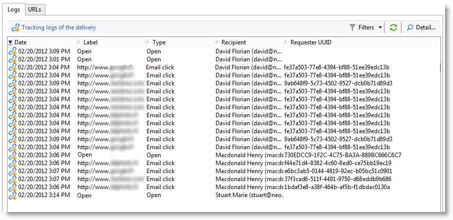
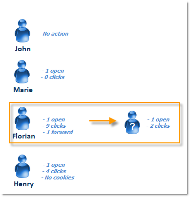

# Person/personer och mottagare {#person-people-and-recipients}

Det här exemplet hjälper dig att förstå skillnaden mellan en person/en person och en mottagare i Adobe Campaign. Vi kommer att skicka en leverans till flera personer för att markera skillnaden mellan människor och mottagare samtidigt som vi beskriver beräkningsmetoden för följande indikatorer:

* **[!UICONTROL Clicks]**
* **[!UICONTROL Distinct clicks for the population reached]**
* **[!UICONTROL Distinct opens for the population reached]**
* **[!UICONTROL Estimation of forwards]**
* **[!UICONTROL Raw reactivity]**

>[!NOTE]
>
>Dessa indikatorer används i rapporten **[!UICONTROL Tracking indicators]**. Mer information finns i [Spårningsindikatorer](../../reporting/using/delivery-reports.md#tracking-indicators).

Tre länkar läggs till i en leverans. Det skickas till fyra mottagare:

* **[!UICONTROL John Davis]** : den här mottagaren öppnar inte e-postmeddelandet (och klickar därför inte på några länkar).
* **[!UICONTROL Marie Stuart]** : öppnar e-postmeddelandet men klickar inte på några länkar.
* **[!UICONTROL Florian David]** : öppnar e-postmeddelandet och klickar på länkarna 9 gånger. Han vidarebefordrar också e-postmeddelandet till någon som öppnar det och klickar två gånger.
* **[!UICONTROL Henry Macdonald]** : den här mottagaren har konfigurerat sin webbläsare att avvisa cookies. Han öppnar e-postmeddelandet och klickar på länkarna fyra gånger.

Följande spårningsloggar returneras:

För att få en tydligare bild av hur människor och mottagare räknas kommer vi att analysera loggarna för varje profil.

## Steg 1: John {#step-1--john}

**[!UICONTROL John Davis]** öppnar inte e-postmeddelandet (och klickar därför inte på några länkar).

Eftersom John varken öppnade eller klickade i e-postmeddelandet visas han inte i loggarna.

**Mellanliggande beräkning:**

|   | Mottagare som klickade | Personer som klickade | Mottagare som öppnat |
|---|---|---|---|
| John | - | - | - |
| Mellanliggande summa | 0 | 0 | 0 |

## Steg 2: Marie {#step-2--marie}

**[!UICONTROL Marie Stuart]** öppnar e-postmeddelandet men klickar inte på några länkar.

Marie&#39;s open visas i följande logg:

Öppningen tilldelas en mottagare: Marie. Adobe Campaign lägger därför till en ny mottagare i räkningen.

**Mellanliggande beräkning:**

|   | Mottagare som klickade | Personer som klickade | Mottagare som öppnat |
|---|---|---|---|
| John | - | - | - |
| Marie | - | - | +1 |
| Mellanliggande summa | 0 | 0 | 1 |

## Steg 3: Florian {#step-3--florian}

**[!UICONTROL Florian David]** öppnar e-postmeddelandet och klickar på länkarna 9 gånger. Han vidarebefordrar också e-postmeddelandet till någon som öppnar det och klickar två gånger.

Florians åtgärder (ett öppet och nio klick) visas i följande loggar:

**Mottagare**: öppna och klickningar tilldelas samma mottagare (Florian). Eftersom den här mottagaren inte är samma som den tidigare (Marie) lägger Adobe Campaign till en ny mottagare i räkningen.

Folk: Eftersom den här mottagarens webbläsare accepterar cookies ser vi att samma identifierare (UUID) har tilldelats alla klickningsloggar: **`fe37a503 [...]`**. Adobe Campaign identifierar dessa klickningar som tillhör samma person. En ny person läggs till i antalet.

**Mellanliggande beräkning:**

|   | Mottagare som klickade | Personer som klickade | Mottagare som öppnat |
|---|---|---|---|
| John | - | - | - |
| Marie | - | - | +1 |
| Florian | +1 | +1 | +1 |
| Mellanliggande summa | 1 | 1 | 2 |

Följande loggar sammanfaller med de öppna och två klick som utförts av den person som Florian vidarebefordrade e-postmeddelandet till:

**Mottagare**: dess öppna och klickningar tilldelas mottagaren som vidarebefordrade e-postmeddelandet (Florian). Eftersom den här mottagaren redan har räknats förblir antalet mottagare detsamma.

**Personer**: När det gäller klickningar ser vi att samma identifierare (UUID) har tilldelats alla loggar: **`9ab648f9 [...]`**. Den här identifieraren har inte räknats än. En ny person läggs därför till i räkningen.

**Mellanliggande beräkning:**

|   | Mottagare som klickade | Personer som klickade | Mottagare som öppnat |
|---|---|---|---|
| John | - | - | - |
| Marie | - | - | +1 |
| Florian | +1 | +1 | +1 |
| Okänd person | - | +1 | - |
| Mellanliggande summa | 1 | 2 | 2 |

## Steg 4: Henry {#step-4--henry}

**[!UICONTROL Henry Macdonald]** har konfigurerat sin webbläsare att avvisa cookies. Han öppnar e-postmeddelandet och klickar på länkarna fyra gånger.

De öppna och fyra klick som Henry utför visas i följande loggar:

**Mottagare**: Samma mottagare (Henry) tilldelas både öppna och klickade. Eftersom den här mottagaren inte har räknats ännu lägger Adobe Campaign till en mottagare i räkningen.

**Folk**: Eftersom Henrys webbläsare inte accepterar cookies genereras en ny identifierare (UID) för varje klick. Var och en av de fyra klickningarna tolkas som att de kommer från en annan person. Eftersom dessa identifierare inte har räknats än läggs de till i räkningen.

**Mellanliggande beräkning:**

|   | Mottagare som klickade | Personer som klickade | Mottagare som öppnat |
|---|---|---|---|
| John | - | - | - |
| Marie | - | - | +1 |
| Florian | +1 | +1 | +1 |
| Okänd person | - | +1 | - |
| Henry | +1 | +4 | +1 |
| Mellanliggande summa | 2 | 6 | 3 |

## Sammanfattning {#summary}

På leveransnivå har vi följande resultat:

* **[!UICONTROL Clicks]** (mottagare som klickade): 2
* **[!UICONTROL Distinct clicks for the population reached]** (personer som klickade): 6
* **[!UICONTROL Distinct opens for the population reached]** (mottagare som öppnat): 3

Raw-reaktivitet och uppskattning av framåtriktade beräkningar görs enligt följande:

* **[!UICONTROL Estimation of forwards]** = **B - A** (därmed 6 - 2 = 4)
* **[!UICONTROL Raw reactivity]** = **A / C** (alltså 2 / 3 = 66,67%)

>[!NOTE]
>
>I följande formler:
>
>* A representerar indikatorn **[!UICONTROL Clicks]** (mottagarna som klickade).
>* B representerar indikatorn **[!UICONTROL Distinct clicks for the population reached]** (personer som klickade).
>* C representerar indikatorn **[!UICONTROL Distinct opens for the population reached]** (mottagarna som öppnade).
