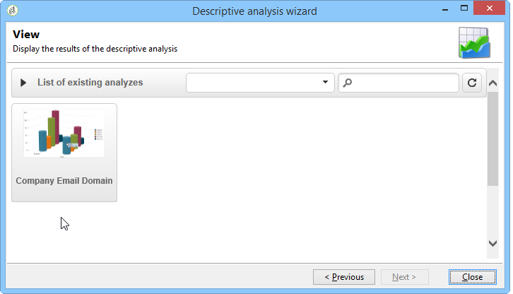

# Använd en analysrapport{#processing-a-report}

## Spara en analysrapport {#saving-an-analysis-report}

Om du har rätt behörighet kan du spara en analysrapport som har skapats från en mall eller exportera den i Excel-, PDF- eller OpenOffice-format.

Spara rapporten genom att klicka på **[!UICONTROL Save]** och ge rapporten en etikett.

Välj **[!UICONTROL Also save data]** om du vill skapa en historik över rapporten och se rapportens värden när du sparar den. Mer information finns i [Arkivera analysrapporter](#archiving-analysis-reports).

The **[!UICONTROL Share this report]** gör det möjligt för andra operatorer att komma åt rapporten.

När den har sparats kan den här rapporten återanvändas för att generera andra analysrapporter:

Om du vill göra ändringar i den här rapporten redigerar du **[!UICONTROL Administration > Configuration > Adobe Campaign tree reports]** noden i Adobe Campaign-trädet (eller den första mappen av typen Rapporter som operatorn har redigeringsbehörighet för). Mer information finns i [Konfigurera layouten för en beskrivande analysrapport](#configuring-the-layout-of-a-descriptive-analysis-report).

## Ytterligare inställningar för analysrapport {#analysis-report-additional-settings}

När en beskrivande analysrapport har sparats kan du redigera dess egenskaper och få tillgång till ytterligare alternativ.

Dessa alternativ är desamma som standardrapporter och beskrivs i [den här sidan](../../reporting/using/properties-of-the-report.md).

## Konfigurera layouten för en beskrivande analysrapport {#configuring-the-layout-of-a-descriptive-analysis-report}

Du kan anpassa visningen och layouten av data i diagram och tabeller i den beskrivande analysen. Alla alternativ är tillgängliga via Adobe Campaign-trädet i **[!UICONTROL Edit]** -fliken för varje rapport.

### Visningsläge för analysrapport {#analysis-report-display-mode}

När du skapar en rapport med **[!UICONTROL qualitative distribution]** Visningslägena för mallar, tabeller och diagram är markerade som standard. Om du bara vill ha ett visningsläge avmarkerar du lämplig ruta. Det innebär att bara fliken för det markerade visningsläget är tillgänglig.

Om du vill ändra schemat för rapporten klickar du på **[!UICONTROL Select the link]** och väljer en annan tabell i databasen.

### Visningsinställningar för analysrapport {#analysis-report-display-settings}

Du kan dölja eller visa statistik och delsummor samt välja statistikens orientering.

När du skapar statistik kan du anpassa deras etikett.

Deras namn visas i rapporten.

Om du avmarkerar alternativet för etikett och delsummor visas de inte i rapporten. Namnet visas i ett verktygstips när du håller muspekaren över en cell i tabellen.

Som standard visas statistiken online. Om du vill ändra orienteringen väljer du lämpligt alternativ i listrutan.

I följande exempel visas statistiken i kolumner.

### Datalayout för analysrapport {#analysis-report-data-layout}

Du kan anpassa datalayouten direkt i de beskrivande analystabellerna. Det gör du genom att högerklicka på variabeln som du vill arbeta med. Välj tillgängliga alternativ i listrutan:

* **[!UICONTROL Pivot]** om du vill ändra variabelns axel.
* **[!UICONTROL Up]** / **[!UICONTROL Down]** om du vill byta ut variablerna mot varandra.
* **[!UICONTROL Move to the right]** / **[!UICONTROL Move to the left]** om du vill byta ut variablerna i kolumner.
* **[!UICONTROL Turn]** för att invertera variabelaxlarna.
* **[!UICONTROL Sort from A to Z]** om du vill sortera variabelvärdena från låg till hög.
* **[!UICONTROL Sort from Z to A]** för att sortera variabelvärdena high till low.

   

Uppdatera vyn om du vill återgå till den ursprungliga visningen.

### Alternativ för analysrapportdiagram {#analysis-report-chart-options}

Det går att anpassa visningen av data i diagrammet. Om du vill göra det klickar du på **[!UICONTROL Variables...]** länk som är tillgänglig under urvalsfasen för diagramtyp.

Följande alternativ är tillgängliga:

* I fönstrets övre del kan du ändra diagrammets visningsområde.
* Etiketter visas som standard i diagrammet. Du kan dölja dem genom att avmarkera **[!UICONTROL Show values]** alternativ.
* The **[!UICONTROL Accumulate values]** kan du lägga till värden från en serie till en annan.
* Du kan välja om du vill visa diagramförklaringen eller inte: om du vill dölja den avmarkerar du lämpligt alternativ. Som standard visas teckenförklaringen utanför diagrammet i det övre högra hörnet.

   Förklaringen kan också visas ovanpå diagrammet för att spara på visningsutrymmet. Välj alternativet **[!UICONTROL Include in the chart]**

   Markera den lodräta och vågräta justeringen i dialogrutan **[!UICONTROL Caption position]** nedrullningsbar lista.

   

## Exportera en analysrapport {#exporting-an-analysis-report}

Om du vill exportera data från en analysrapport klickar du på listrutan och väljer önskat utdataformat.

Mer information finns på [den här sidan](../../reporting/using/actions-on-reports.md).

## Återanvänd befintliga rapporter och analyser {#re-using-existing-reports-and-analyses}

Du kan skapa beskrivande analysrapporter om data med hjälp av befintliga rapporter som redan lagrats i Adobe Campaign. Det här läget är möjligt när analyser har sparats eller när rapporter har skapats och konfigurerats för att nås via den beskrivande analysguiden.

Information om hur du sparar beskrivande analyser finns i [Spara en analysrapport](#saving-an-analysis-report).

Om du vill skapa beskrivande analysrapporter måste den beskrivande analysguiden köras via en arbetsflödesövergång eller via **[!UICONTROL Tools > Descriptive analysis]** -menyn.

1. Markera **[!UICONTROL Existing analyses and reports]** och klicka på **[!UICONTROL Next]**.
1. På så sätt kan du komma åt listan med tillgängliga rapporter. Välj den rapport som du vill generera.

   

## Arkivera analysrapporter {#archiving-analysis-reports}

När du skapar en beskrivande analys baserad på en befintlig analys kan du skapa arkiv för att lagra data och jämföra rapportresultat.

Så här skapar du en historik:

1. Öppna en befintlig analys eller skapa en ny beskrivande analysguide.
1. Klicka på knappen för att skapa en historik i verktygsfältet på rapportvisningssidan och bekräfta sedan enligt nedan:

   

1. Använd arkivåtkomstknappen för att visa tidigare analyser.

   
