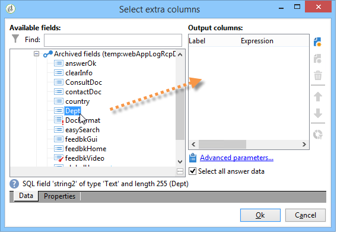

# Användningsfall: visa en rapport om svar på en onlineundersökning{#use-case-displaying-report-on-answers-to-an-online-survey}

Svar på Adobe Campaign enkäter kan samlas in och analyseras med hjälp av särskilda rapporter.

I följande exempel vill vi samla in svar på en onlineundersökning och visa dem i en pivottabell

Använd följande steg:

1. Skapa ett arbetsflöde för att återskapa svar på enkäten och lagra dem i en lista.
1. Skapa en kub med data i listan.
1. Skapa en rapport med pivottabellen och visa detaljerna för svaren.

Innan du börjar använda det här användningsexemplet måste du ha tillgång till en enkät och en uppsättning svar som du kan analysera.

>[!NOTE]
>
>Det här användningsexemplet kan bara implementeras om du har skaffat **Survey Manager** alternativ. Kontrollera licensavtalet.

## Steg 1 - Skapa arbetsflödet för datainsamling och lagring {#step-1---creating-the-data-collection-and-storage-workflow}

Så här samlar du in svaren på enkäten:

1. Skapa ett arbetsflöde och montera en **[!UICONTROL Answers to a survey]** aktivitet. Mer information om hur du använder den här aktiviteten finns i [det här avsnittet](../../surveys/using/publish-track-and-use-collected-data.md#using-the-collected-data).
1. Redigera aktiviteten och välj den undersökning vars svar du vill analysera.
1. Aktivera **[!UICONTROL Select all the answer data]** möjlighet att samla in all information.

   

1. Markera de kolumner som ska extraheras (i det här fallet: markera: alla arkiverade fält. Det här är fälten som innehåller svaren.

   

1. När svarssamlingsrutan har konfigurerats placerar du en **[!UICONTROL List update]** typaktivitet för att spara data.

   

   I den här aktiviteten anger du listan som ska uppdateras och avmarkerar **[!UICONTROL Purge and re-use the list if it exists (otherwise add to the list)]** alternativ: svaren läggs till i den befintliga tabellen. Med det här alternativet kan du referera till listan i en kub. Schemat som är länkat till listan genereras inte om för varje uppdatering, vilket garanterar integriteten för kuben som använder den här listan.

   

1. Starta arbetsflödet för att bekräfta dess konfiguration.

   

   Den angivna listan skapas och innehåller schemat för svaren på enkäten.

1. Lägg till en schemaläggare för att automatisera den dagliga samlingen av svar och uppdateringen av listan.

   The **[!UICONTROL List update]** och **[!UICONTROL Scheduler]** aktiviteter beskrivs närmare i .

## Steg 2 - Skapa kuben, dess mått och indikatorer {#step-2---creating-the-cube--its-measures-and-its-indicators}

Du kan sedan skapa kuben och konfigurera mått: de används för att skapa indikatorer som visas i rapporten. Mer information om hur du skapar och konfigurerar kuber finns i [Om kuber](../../reporting/using/ac-cubes.md).

I det här exemplet baseras kuben på data i listan som matats av det arbetsflöde som skapats tidigare.

Definiera måtten och måtten som ska visas i rapporten. Här vill vi visa avtalsdatumet och svarandens land.

The **[!UICONTROL Preview]** Med -fliken kan du styra rapportens återgivning.

## Steg 3 - Skapa rapporten och konfigurera datalayouten i tabellen {#step-3---creating-the-report-and-configuring-the-data-layout-within-the-table}

Du kan sedan skapa en rapport baserad på den här kuben och bearbeta data och information.

Anpassa informationen efter era behov.

