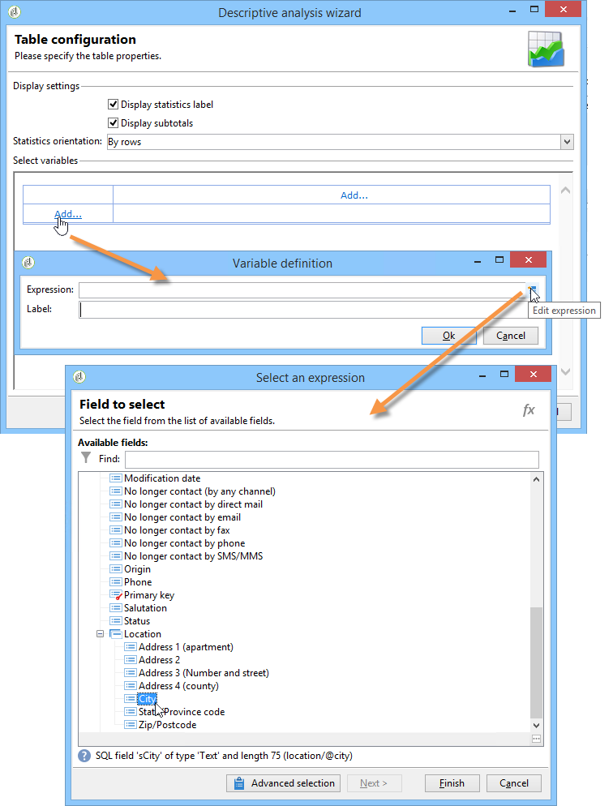
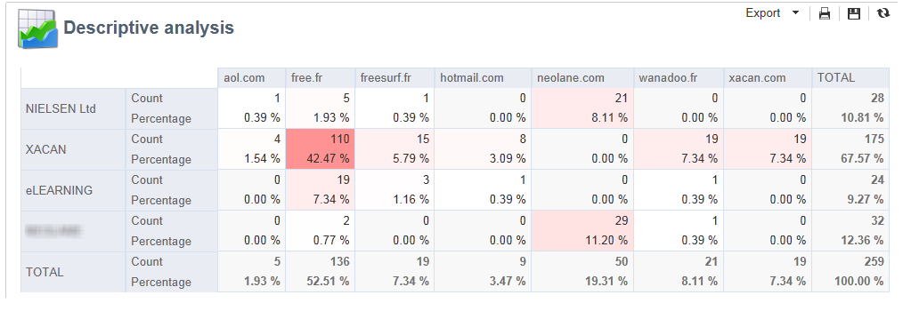
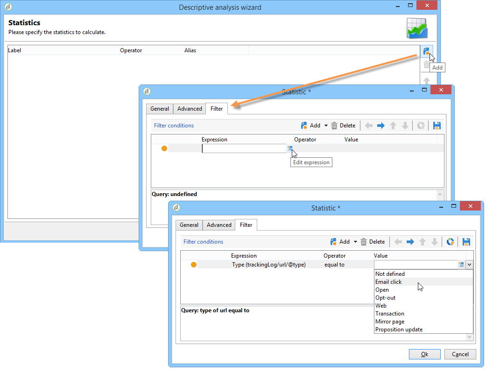
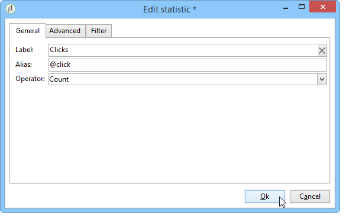
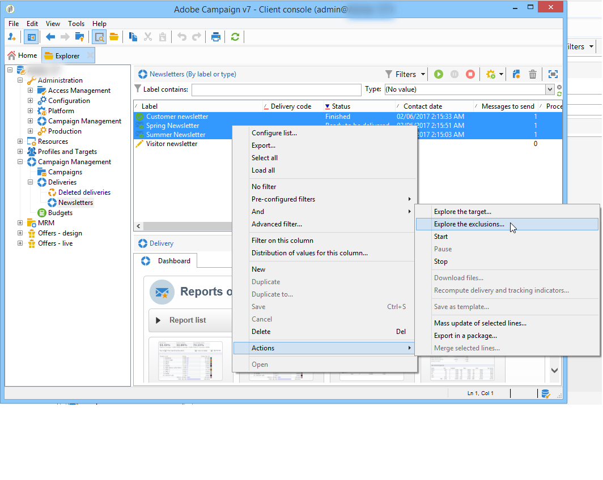

# Användningsexempel{#use-cases}

## Analysera en population {#analyzing-a-population}

I följande exempel kan du utforska populationen som har en uppsättning nyhetsbrev som mål med hjälp av den beskrivande analysguiden.

Implementeringsstegen beskrivs nedan, medan en uttömmande lista över alternativ och beskrivningar finns i de andra avsnitten i detta kapitel.

### Identifiera populationen som ska analyseras {#identifying-the-population-to-analyze}

I det här exemplet vill vi utforska målpopulationen för de leveranser som ingår i mappen **Newsletters** .

För att göra detta väljer du de aktuella leveranserna, högerklickar och väljer **[!UICONTROL Action > Explore the target...]**.


### Välja en analystyp {#selecting-a-type-of-analysis}

I det första steget i assistenten kan du välja den beskrivande analysmall som ska användas. Adobe Campaign har som standard två mallar: **[!UICONTROL Qualitative distribution]** och **[!UICONTROL Quantitative distribution]**. Mer information finns i avsnittet [Konfigurera den kvalitativa distributionsmallen](../../reporting/using/using-the-descriptive-analysis-wizard.md#configuring-the-qualitative-distribution-template) . De olika återgivningarna presenteras i avsnittet [Om beskrivande analys](../../reporting/using/about-descriptive-analysis.md) .

I det här exemplet markerar du **[!UICONTROL Qualitative distribution]** mallen och väljer en visning med ett diagram och en tabell (matris). Ge rapporten ett namn (&quot;Beskrivning analys&quot;) och klicka på **[!UICONTROL Next]**.


### Välja vilka variabler som ska visas {#selecting-the-variables-to-display}

I nästa steg kan du markera de data som ska visas i tabellen.

Klicka på **[!UICONTROL Add...]** länken för att markera variabeln som innehåller de data som ska visas. Här vill vi visa städerna för våra mottagare på en rad:



Kolumnerna visar antalet inköp per företag. I det här exemplet sammanställs belopp i fältet **Webbinköp** .

Här vill vi definiera resultatbindning för att förtydliga hur de visas. Om du vill göra det väljer du **[!UICONTROL Manual]** bindningsalternativet och anger beräkningsklasserna för segmenten som ska visas:


Klicka sedan på **[!UICONTROL Ok]** för att godkänna konfigurationen.

När linjerna och kolumnerna har definierats kan du ändra, flytta eller ta bort dem med verktygsfältet.


### Definiera visningsformatet {#defining-the-display-format}

I nästa steg i guiden kan du välja vilken typ av diagram du vill generera.

I det här fallet väljer du histogrammet.


Möjliga konfigurationer av de olika bilderna finns i avsnittet Alternativ för [analysrapportdiagram](../../reporting/using/processing-a-report.md#analysis-report-chart-options) .

### Konfigurera statistiken som ska beräknas {#configuring-the-statistic-to-calculate}

Ange sedan de beräkningar som ska tillämpas på de insamlade uppgifterna. Som standard utför den beskrivande analysguiden ett enkelt antal värden.

I det här fönstret kan du definiera en lista med statistik som ska beräknas.


Om du vill skapa en ny statistik klickar du på **[!UICONTROL Add]** . Mer information finns i [Statistikberäkning](../../reporting/using/using-the-descriptive-analysis-wizard.md#statistics-calculation).

### Visa och använda rapporten {#viewing-and-using-the-report}

I det sista steget i guiden visas tabellen och diagrammet.

Du kan lagra, exportera och skriva ut data med verktygsfältet ovanför tabellen. Mer information finns i [Bearbeta en rapport](../../reporting/using/processing-a-report.md).


## Kvalitativ dataanalys {#qualitative-data-analysis}

### Exempel på en diagramvisning {#example-of-a-chart-display}

**Mål**: generera en analysrapport om var potentiella kunder eller kunder befinner sig.

1. Öppna den beskrivande analysguiden och välj **[!UICONTROL Chart]** bara.

   

   Klicka **[!UICONTROL Next]** för att godkänna det här steget.

1. Välj sedan **[!UICONTROL 2 variables]** alternativet och ange att **[!UICONTROL First variable (abscissa)]** ska hänvisa till mottagarstatus (presumtiva/kunder) och den andra variabeln ska hänvisa till landet.
1. Välj **[!UICONTROL Cylinders]** som typ.

   

1. Klicka **[!UICONTROL Next]** och lämna standardvärdet för **[!UICONTROL Simple count]** statistik.
1. Klicka **[!UICONTROL Next]** för att visa rapporten.

   

   Håll muspekaren över en bar för att se det exakta antalet kunder eller potentiella kunder för det här landet.

1. Aktivera eller inaktivera visning av ett av länderna baserat på teckenförklaringen.

   

### Exempel på en tabellvisning {#example-of-a-table-display}

**Mål**: analysera företagets e-postdomäner.

1. Öppna den beskrivande analysguiden och välj endast **[!UICONTROL Array]** visningsläget.

   

   Klicka på **[!UICONTROL Next]** knappen för att godkänna det här steget.

1. Markera **[!UICONTROL Company]** variabeln som en kolumn och **[!UICONTROL Email domain]** variabeln som en rad.
1. Behåll alternativet **[!UICONTROL By rows]** för statistikorientering: Den statistiska beräkningen visas till höger om **[!UICONTROL Email domain]** variabeln.

   

   Klicka **[!UICONTROL Next]** för att godkänna det här steget.

1. Ange sedan statistiken som ska beräknas: behålla standardantalet och skapa en ny statistik. Det gör du genom att klicka **[!UICONTROL Add]** och välja **[!UICONTROL Total percentage distribution]** som operator.

   

1. Ange en etikett för statistiken så att det inte blir ett tomt fält när rapporten visas.

   

1. Klicka **[!UICONTROL Next]** för att visa rapporten.

   

1. När analysrapporten har skapats kan du anpassa visningen efter dina behov utan att ändra konfigurationen. Du kan till exempel byta axlar: högerklicka på domännamnen och välj **[!UICONTROL Turn]** på snabbmenyn.

   

   Tabellen visar informationen enligt följande:

   

## Kvantitativ dataanalys {#quantitative-data-analysis}

**Mål**: generera en kvantitativ analysrapport om mottagarnas ålder

1. Öppna guiden för beskrivande analys och välj **[!UICONTROL Quantitative distribution]** i listrutan.

   

   Klicka på **[!UICONTROL Next]** knappen för att godkänna det här steget.

1. Markera **[!UICONTROL Age]** variabeln och ange dess etikett. Ange om det är ett heltal eller inte och klicka sedan på **[!UICONTROL Next]**.

   

1. Radera **[!UICONTROL Deciles]**, **[!UICONTROL Distribution]** och **[!UICONTROL Sum]** statistik: De behövs inte här.

   

1. Klicka **[!UICONTROL Next]** för att visa rapporten.

   

## Analysera ett övergångsmål i ett arbetsflöde {#analyzing-a-transition-target-in-a-workflow}

**Mål**: för att generera rapporter om målarbetsflödets befolkning

1. Öppna önskat målarbetsflöde.
1. Högerklicka på en övergång som pekar på mottagartabellen.
1. Välj **[!UICONTROL Analyze target]** i listrutan för att öppna det beskrivande analysfönstret.

   

1. Nu kan du antingen välja **[!UICONTROL Existing analyses and reports]** alternativet och använda rapporter som skapats tidigare (se [Återanvända befintliga rapporter och analyser](../../reporting/using/processing-a-report.md#re-using-existing-reports-and-analyses)) eller skapa en ny beskrivande analys. Det gör du genom att låta alternativet vara **[!UICONTROL New descriptive analysis from a template]** markerat som standard.

   Resten av konfigurationen är densamma som för alla beskrivande analyser.

### Rekommendationer för målanalys {#target-analyze-recommendations}

Analysen av en population i ett arbetsflöde kräver att populationen fortfarande finns i övergången. Om arbetsflödet startas kan resultatet som gäller populationen rensas från övergången. Om du vill göra en analys kan du antingen:

* Koppla loss övergången från målaktiviteten och starta arbetsflödet för att aktivera den. När övergången börjar blinka startar du guiden på det vanliga sättet.

   

* Ändra arbetsflödets egenskaper genom att markera **[!UICONTROL Keep the result of interim populations between two executions]** alternativet. Detta gör att du kan starta en analys av den övergång du vill använda, även om arbetsflödet är färdigt.

   

   Om populationen rensades från övergången uppmanas du att välja det aktuella alternativet innan du startar den beskrivande analysguiden.

   

>[!CAUTION]
>
>Alternativet får endast användas i utvecklingsfaser, men aldrig för en produktionsmiljö. **[!UICONTROL Keep the result of interim populations between two executions]**\
>Interimspopulationerna rensas automatiskt när tidsgränsen för kvarhållande har uppnåtts. Den här tidsgränsen anges på **[!UICONTROL Execution]** fliken för arbetsflödesegenskaper.

## Analyserar loggar för mottagarspårning {#analyzing-recipient-tracking-logs}

Den beskrivande analysguiden kan generera rapporter för andra arbetsregister. Det innebär att du kan analysera leveransloggar genom att skapa en dedikerad rapport.

I det här exemplet vill vi analysera reaktivitetsfrekvensen för nyhetsbrevets mottagare.

Gör så här:

1. Öppna den beskrivande analysguiden via **[!UICONTROL Tools > Descriptive analysis]** menyn och ändra standardarbetstabellen. Välj **[!UICONTROL Recipient tracking log]** och lägg till ett filter för att exkludera korrektur och inkludera nyhetsbrev.

   

   Markera en tabellvisning och klicka på **[!UICONTROL Next]**.

1. I nästa fönster anger du att analysen avser leveranser.

   

   Här visas leveransetiketter i den första kolumnen.

1. Ta bort standardantalet och skapa tre statistiker för att konfigurera den statistik som ska visas i tabellen.

   Här visas följande för varje nyhetsbrev: antalet öppningar, antalet klickningar och reaktivitetsfrekvensen (i procent).

1. Lägg till statistik för att räkna antalet klick: Definiera det relevanta filtret på **[!UICONTROL Filter]** fliken.

   

1. Klicka sedan på **[!UICONTROL General]** fliken för att byta namn på statistiketiketten och aliaset:

   

1. Lägg till en andra statistik för att räkna antalet öppningar:

   

1. Klicka sedan på **[!UICONTROL General]** fliken för att byta namn på statistiketiketten och dess alias:

   

1. Lägg till den tredje statistiken och välj den **[!UICONTROL Calculated field]** operator som ska mäta reaktivitetsfrekvensen.

   

   Gå till **[!UICONTROL User function]** fältet och ange följande formel:

   ```
   @clic / @open * 100
   ```

   Anpassa statistiketiketten enligt nedan:

   

   Slutligen anger du om värdena ska visas i procent: Om du vill göra det avmarkerar du **[!UICONTROL Default formatting]** alternativet på **[!UICONTROL Advanced]** fliken och väljer **[!UICONTROL Percentage]** utan decimaltecken.

   

1. Klicka **[!UICONTROL Next]** för att visa rapporten.

   

## Analyserar exkluderingsloggar för leverans {#analyzing-delivery-exclusion-logs}

Om analysen gäller en leverans kan du analysera den uteslutna populationen. Välj de leveranser som ska analyseras och högerklicka för att öppna **[!UICONTROL Action > Explore exclusions]** menyn.



Detta tar dig till den beskrivande analysguiden och analysen rör undantagsloggarna för mottagare.

Du kan till exempel visa domänerna för alla utelämnade adresser och sortera dem efter exkluderingsdatum.


Detta skulle generera följande typ av rapport:


