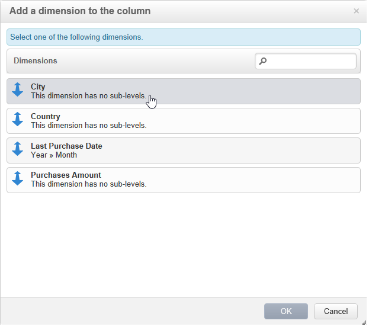

# Använda kuber för att utforska data{#using-cubes-to-explore-data}

Marknadsföringsanalys gör det enklare att skapa rapporter och att identifiera och välja data från databasen via kuber. Detta gör att du kan:

* Skapa rapporter baserade på kuber. Processen beskrivs här: [Utforska data i en rapport](#exploring-the-data-in-a-report).
* Samla in data i databasen och gruppera dem i listor, t.ex. för att identifiera och bygga mål och leveranser. Mer information finns i [Skapa en målpopulation](#building-a-target-population).
* Infoga en pivottabell i en rapport och referera till en befintlig kub i den. Mer information finns i [Infoga en pivottabell i en rapport](#inserting-a-pivot-table-into-a-report).

>[!NOTE]
>
>Marknadsföringsanalys krävs för att skapa eller ändra kuber. Mer information finns i [Om kuber](../../reporting/using/about-cubes.md).

## Utforska data i en rapport {#exploring-the-data-in-a-report}

### Steg 1 - Skapa en rapport baserad på en kub {#step-1---creating-a-report-based-on-a-cube}

Om du vill skapa en rapport baserad på en kub klickar du på knappen **[!UICONTROL Create]** på fliken **[!UICONTROL Reports]** och väljer den kub som du vill använda.

Processen beskrivs här: [Skapa en rapport baserad på en kub](../../reporting/using/creating-indicators.md#creating-a-report-based-on-a-cube).

### Steg 2 - Markera rader och kolumner {#step-2---selecting-lines-and-columns}

Standardvisningen visar de två första måtten för kuben (ålder och stad, i det här fallet).

Med knapparna **[!UICONTROL Add]** på varje axel kan du lägga till dimensioner.

1. Markera de dimensioner som du vill visa i tabellens rader och kolumner. Det gör du genom att dra och släppa de tillgängliga måtten enligt nedan:
1. Välj de dimensioner som du vill lägga till i tabellen i listan:

   

1. Välj sedan parametrarna för dimensionen.

   

   Parametrarna beror på datatypen för den valda dimensionen.

   För datum kan till exempel flera nivåer vara tillgängliga. Mer information finns i [Visa mått](../../reporting/using/concepts-and-methodology.md#displaying-measures).

   Följande alternativ erbjuds i det här fallet:

   

   Du kan antingen:

   * Expandera data vid inläsning: värdena visas som standard varje gång rapporten uppdateras (standardvärde: nej).
   * Visa summan i slutet av raden: När data visas i kolumner kan du med ett extra alternativ visa summan i slutet av raden: en kolumn läggs till i tabellen (standardvärde: ja).
   * Använd en sortering: värdena i kolumnen kan sorteras efter värde, etikett eller baserat på ett mått (standardvärde: efter värde).
   * Visa värdena i stigande (a-z, 0-9) eller fallande (z-a, 9-0) ordning.
   * Ändra antalet kolumner som ska visas vid inläsning (som standard: 200).

1. Bekräfta genom att klicka på **[!UICONTROL Ok]**: dimensionen läggs till i de befintliga dimensionerna.

   Den gula banderollen ovanför tabellen visar att du har gjort ändringar: klicka på knappen **[!UICONTROL Save]** för att spara dem.

   

### Steg 3 - Konfigurera de mått som ska visas{#step-3---configuring-the-measures-to-display}

När raderna och kolumnerna är på plats anger du de mått som du vill visa samt deras visningsläge.

Som standard visas bara ett mått. Så här lägger du till eller konfigurerar mått:

1. Klicka på knappen **[!UICONTROL Measures]**.

   

1. Med knappen **[!UICONTROL Use a measure]** kan du välja ett av de befintliga måtten.

   

   Markera den information som du vill visa och typen av formatering. Listan med alternativ beror på vilken typ av mått som har konfigurerats.

   

   Den övergripande mätkonfigurationen är också tillgänglig via ikonen **[!UICONTROL Edit the configuration of the pivot table]** i sidhuvudet.

   

   Du kan sedan välja om måttetiketter ska visas eller inte. Mer information finns i [Konfigurera visningen](../../reporting/using/concepts-and-methodology.md#configuring-the-display).

1. Det går att bygga nya mått med hjälp av befintliga. Om du vill göra det klickar du på **[!UICONTROL Create a measure]** och konfigurerar det.

   

   Följande typer av åtgärder är tillgängliga:

   * En kombination av åtgärder: den här typen av åtgärd gör det möjligt att bygga den nya åtgärden med hjälp av befintliga åtgärder:

      De tillgängliga operatorerna är: summa, differens, multiplikation och ränta.

   * Andel: Med den här typen av mått kan du beräkna antalet poster som mäts för en given dimension. Du kan beräkna proportionaliteten baserat på en dimension eller en underdimension.
   * Variation: Med det här måttet kan du beräkna variationen i värden för en nivå.
   * Standardavvikelse: Med den här typen av mått kan du beräkna avvikelser inom varje cellgrupp jämfört med medelvärdet för värdena. Du kan till exempel jämföra inköpsvolymen för alla befintliga segment.

   Det skapade måttet läggs till i rapporten.

   

   När du har skapat ett mått kan du redigera det och vid behov ändra dess konfiguration. Det gör du genom att klicka på knappen **[!UICONTROL Measures]** och sedan gå till fliken för det mått som du vill redigera.

   Klicka sedan på **[!UICONTROL Edit the dynamic measure]** för att öppna inställningsmenyn.

## Bygga en målpopulation {#building-a-target-population}

Rapporter som byggs med kuber gör att du kan samla in data från tabellen och spara dem i en lista.

Lägg dem i en kundvagn och bearbeta innehållet.

Gör så här om du vill gruppera en population i en lista:

1. Klicka på cellerna som innehåller de ifyllningar som ska samlas för att markera dem och klicka sedan på ikonen **[!UICONTROL Add to cart]**.

   

   Så många gånger som krävs för att samla in olika profiler

1. Klicka på knappen **[!UICONTROL Show cart]** för att visa innehållet innan du kör exporten.

   

1. Med knappen **[!UICONTROL Export]** kan du gruppera objekten i vagnen i en lista.

   Du måste ange namnet på listan och vilken typ av export som ska utföras.

   

   Klicka på **[!UICONTROL Start]** för att köra exporten.

1. När exporten är klar bekräftar ett meddelande att den har körts och hur många poster som har bearbetats.

   

   Du kan antingen spara innehållet i kundvagnen eller tömma den.

   Den relevanta listan nås via fliken **[!UICONTROL Profiles and targets]**.

   

## Infoga en pivottabell i en rapport {#inserting-a-pivot-table-into-a-report}

Så här skapar du en tabell och utforskar data i en kub:

1. Skapa en ny rapport med en enda sida och infoga en pivottabell i den. Se denna [sida](../../reporting/using/creating-a-table.md#creating-a-breakdown-or-pivot-table) för mer information om detta.

   

1. På fliken **[!UICONTROL Data]** på sidan väljer du en kub för att bearbeta dimensionerna som den innehåller och visa beräknade mått.

   

   Detta gör att du kan skapa rapporten som ska visas. Mer information finns i [Steg 2 - Markera rader och kolumner](#step-2---selecting-lines-and-columns).
