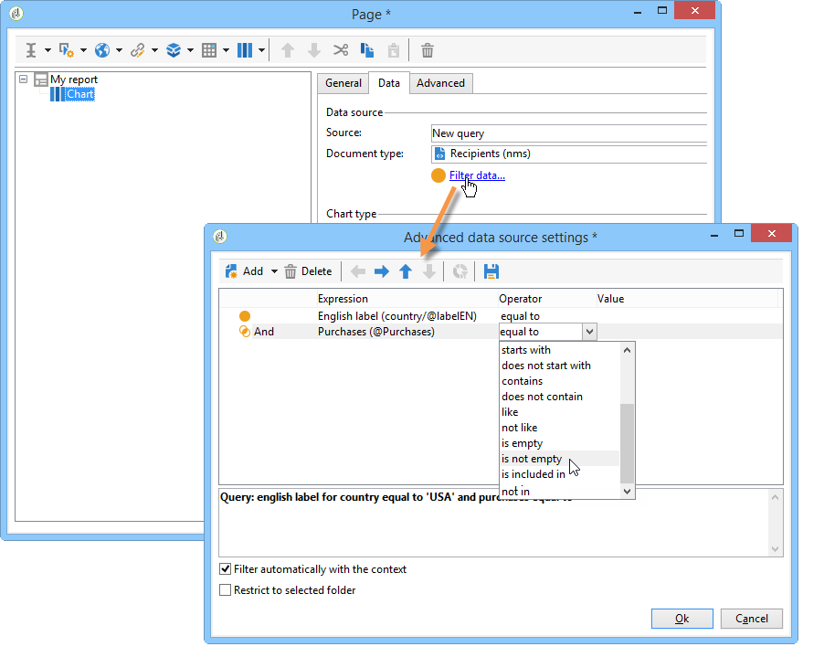

# Använd kontexten i dina rapporter{#using-the-context}

När du vill representera data i form av **[!UICONTROL tables]** eller **[!UICONTROL charts]** kan den hämtas från två källor: en ny fråga (se [Definiera ett direktfilter på data](#defining-a-direct-filter-on-data)) eller rapportsammanhanget (se [Använd kontextdata](#using-context-data)).

## Definiera ett direktfilter på data {#defining-a-direct-filter-on-data}

### Filtrera data {#filtering-data}

Använda **[!UICONTROL Query]** typaktivitet är inte obligatoriskt när du skapar en rapport. Data kan filtreras direkt i de tabeller och diagram som rapporten består av.

Detta gör att du kan välja vilka data som ska visas i rapporten direkt via **[!UICONTROL Page]** rapportens aktivitet.

Klicka på **[!UICONTROL Filter data...]** i **[!UICONTROL Data]** tab: this link allows you access the expressions editor to define a query on the data to be analyzed.

### Exempel: använd ett filter i ett diagram {#example--use-a-filter-in-a-chart}

I följande exempel vill vi att diagrammet bara ska visa mottagarprofiler som bor i Frankrike och som har köpt något under året.

Om du vill definiera det här filtret placerar du en sida i diagrammet och redigerar den. Klicka på **[!UICONTROL Filter data]** och skapa det filter som matchar de data som du vill visa. Mer information om hur du skapar frågor i Adobe Campaign finns i [det här avsnittet](../../platform/using/about-queries-in-campaign.md).

Här vill vi visa uppdelningen efter ort för de valda mottagarna.

Återgivningen ser ut så här:

### Exempel: använd ett filter i en pivottabell {#example--use-a-filter-in-a-pivot-table}

I det här exemplet kan du bara visa icke-parisiska kunder i pivottabellen, utan att använda en annan fråga i förväg.

Använd följande steg:

1. Placera en sida i diagrammet och redigera den.
1. Skapa en pivottabell.
1. Gå till **[!UICONTROL Data]** och välj den kub som ska användas.
1. Klicka på **[!UICONTROL Filter data...]** och definiera följande fråga för att ta bort Adobe från listan över företag.

   

Endast mottagare som uppfyller filtervillkoren visas i rapporten.

## Använd kontextdata {#using-context-data}

Representera data i form av en **[!UICONTROL table]** eller en **[!UICONTROL chart]** kan data hämtas från rapportkontexten.

På sidan som innehåller tabellen eller diagrammet, **[!UICONTROL Data]** kan du välja datakälla.

* The **[!UICONTROL New query]** kan du skapa en fråga för datainsamling. Mer information finns i [Definiera ett direktfilter på data](#defining-a-direct-filter-on-data).
* The **[!UICONTROL Context data]** kan du använda indata: rapportens kontext sammanfaller med informationen i den inkommande övergången på sidan som innehåller diagrammet eller tabellen. Det här sammanhanget kan t.ex. innehålla data som samlats in via en **[!UICONTROL Query]** aktivitet som placerats före **[!UICONTROL Page]** och för vilken du måste ange tabellen och fälten som rapporten gäller.

Bygg till exempel följande fråga för mottagarna i en frågeruta:

Ange sedan datakällan i rapporten, i det här fallet: **[!UICONTROL Data from the context]**.

Dataplatsen härleds automatiskt. Om det behövs kan du tvinga fram datasökvägen.

När du väljer vilka data som statistiken ska gälla, sammanfaller de tillgängliga fälten med de data som anges i frågan.

