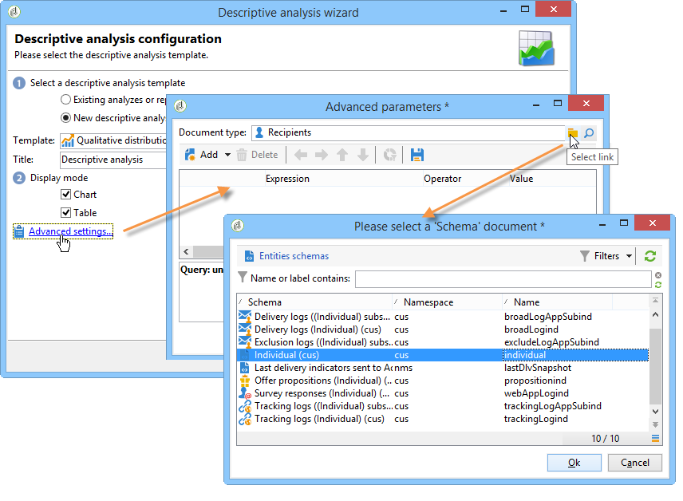

# Använd guiden för beskrivande analys{#using-the-descriptive-analysis-wizard}

Använd den dedikerade guiden för att skapa en beskrivande analysrapport. Konfigurationen beror på vilka data som ska analyseras och på önskad återgivning.

## Analysera data i databasen {#analyzing-data-in-the-database}

Den beskrivande analysguiden kan startas via menyn **[!UICONTROL Tools > Descriptive analysis]**: i det här fallet gäller analysen mottagare som standard (**nms:mottagare**). Det gäller alla data i Adobe Campaign-databasen.

Om du vill analysera en annan tabell än standardmottagarna en (**nms:receiver**) klickar du på länken **[!UICONTROL Advanced settings...]** i det sista steget i guiden och väljer den tabell som matchar dina inställningar, i det här fallet **cus:individual** :

Om du vill producera statistik för en del av data kan du definiera ett filter: om du vill göra det klickar du på länken **[!UICONTROL Advanced settings...]** och definierar det filter som ska användas, så som visas nedan:

Analysen gäller endast mottagare som är 16 år eller äldre och som bor i London.

## Analysera en uppsättning data {#analyzing-a-set-of-data}

Du kan använda den beskrivande analysguiden i ett annat sammanhang: en lista, en arbetsflödesövergång, en eller flera leveranser, ett urval av mottagare osv.

Det är tillgängligt via flera noder i Adobe Campaign-trädet som pekar på mottagartabellen.

Öppna den beskrivande analysguiden genom att markera objekt och högerklicka. Endast markerade data kommer att analyseras.

* För en uppsättning med **mottagare** väljer du de mottagare som ska analyseras, högerklickar och väljer **[!UICONTROL Actions > Explore...]**, vilket visas ovan. Om ett filter används i listan med mottagare analyseras bara dess innehåll.

  Om du vill markera alla mottagare i mappen eller det aktuella filtret använder du kortkommandot CTRL+A. Detta innebär att även mottagare som inte visas markeras.

  Ett exempel på den beskrivande analysen av mottagare finns i: [Kvalitativ dataanalys](../../reporting/using/use-cases.md#qualitative-data-analysis).

* Placera markören på en övergång som pekar mot mottagartabellen i ett **arbetsflöde**, högerklicka och välj **[!UICONTROL Analyze target]**. Mer information finns i exemplet i [Analysera ett övergångsmål i ett arbetsflöde](../../reporting/using/use-cases.md#analyzing-a-transition-target-in-a-workflow).
* För **listor** väljer du en eller flera listor och använder samma process som för mottagare.
* I kontexten för en **leverans** väljer du de leveranser vars mål du vill analysera, högerklickar och väljer **[!UICONTROL Actions > Explore the target]** enligt nedan:

  

  Här finns exempel på beskrivande analyser av leveranser: [Analysera en population](../../reporting/using/use-cases.md#analyzing-a-population) och här: [Analysera mottagarspårningsloggar](../../reporting/using/use-cases.md#analyzing-recipient-tracking-logs).

## Konfigurera den kvalitativa distributionsmallen {#configuring-the-qualitative-distribution-template}

Med mallen **[!UICONTROL Qualitative distribution]** kan du skapa statistik för alla typer av data (t.ex. företagsnamn, e-postdomän).

Konfigurationsalternativ som är tillgängliga för en rapport som skapats med mallen **[!UICONTROL Qualitative distribution]** finns i [Visa data i tabellen](#displaying-data-in-the-table). Ett fullständigt exempel finns i [Analysera en population](../../reporting/using/use-cases.md#analyzing-a-population).

När du använder den beskrivande analysguiden för att analysera dina data, beror de tillgängliga alternativen på de valda inställningarna. Dessa beskrivs nedan.

### Databindning {#data-binning}

När du väljer vilka variabler som ska visas kan du definiera databindning, d.v.s. konfigurera grupperingskriterier för de markerade data.

>[!NOTE]
>
>När fältet som berörs av beräkningen beräknas med en mängd kontrollerar du **[!UICONTROL The data is already aggregated]** för att förbättra prestanda.

Alternativen varierar beroende på fältets innehåll:

* **[!UICONTROL None]** : Med det här alternativet kan du visa alla värden som är tillgängliga för variabeln, utan bindning.

  >[!CAUTION]
  >
  >Det här alternativet bör användas med försiktighet: det kan ha stor inverkan på rapporten och på datorns prestanda.

* **[!UICONTROL Auto]** : Med det här alternativet kan du visa de n värden som representeras mest. De beräknas automatiskt och var och en representerar en procentandel av variablerna jämfört med antalet behållare. För numeriska värden genererar Adobe Campaign automatiskt n klasser att sortera data i.
* **[!UICONTROL Manual]** : Det här alternativet fungerar som alternativet **[!UICONTROL Auto]** förutom att du kan ange dessa värden manuellt. Det gör du genom att klicka på knappen **[!UICONTROL Add]** till höger om värdetabellen.

  Värden kan initieras automatiskt av Adobe Campaign före personalisering: om du vill göra det anger du antalet behållare som du vill generera och klickar på länken **[!UICONTROL Initialize with]**, vilket visas nedan:

  

  Anpassa sedan innehållet efter dina behov:

  

  Beroende på den önskade precisionsnivån kan fält som innehåller datum grupperas efter tid, dag, månad, år osv.

  

* **[!UICONTROL Modulo]** : gör att du kan skapa grupper med värden om numeriska värden används. Med en modulo med värdet 10 kan du till exempel skapa ett intervall med värden som ändras tio gånger tio.

  

  I det här exemplet kan du visa uppdelningen av mottagare per åldersgrupp.

  

### Visa data i tabellen {#displaying-data-in-the-table}

Använd verktygsfältet för att anpassa visningen av variabler i tabellen: ta bort en kolumn, visa data i rader i stället för kolumner, flytta en kolumn till vänster eller höger, visa eller ändra värdeberäkning.

I fönstrets övre del kan du välja visningsinställningar.

Du kan visa eller dölja namnet på statistiken och delsummorna och välja statistikens orientering. Mer information finns i [Visningsinställningar för analysrapport](../../reporting/using/processing-a-report.md#analysis-report-display-settings).

### Visa data i diagrammet {#displaying-data-in-the-chart}

I det första steget i guiden för beskrivande analys kan du välja att endast visa data i diagramformuläret, utan någon tabell. I det här fallet måste variabelval göras när bilden konfigureras. Du måste först välja antalet variabler som ska visas och välja fälten från den relevanta databasen.

Välj sedan önskad diagramtyp.

>[!NOTE]
>
>Du kan visa variablerna i ett diagram och i en tabell samtidigt. Om du vill göra det anger du variablerna i fönstret **[!UICONTROL Table configuration]**. Klicka på **[!UICONTROL Next]** och välj diagramtyp i diagramkonfigurationsfönstret. Om deldimensioner definieras i tabellen visas de inte i diagrammet.

Klicka på länken **[!UICONTROL Variants]** om du vill ändra diagramegenskaperna.

Vilka alternativ som visas beror på vilken typ av diagram som är vald. För mer information om detta hittar du i [det här avsnittet](../../reporting/using/creating-a-chart.md#chart-types-and-variants).

### Statistikberäkning {#statistics-calculation}

Med guiden för beskrivande analys kan du beräkna flera typer av statistik för data. Som standard konfigureras bara ett enkelt antal.

Klicka på **[!UICONTROL Add]** om du vill skapa en ny statistik.

Följande åtgärder är möjliga:

* **[!UICONTROL Count]** för att räkna alla värden som inte är null i det fält som ska aggregeras, inklusive dubblettvärden (för det aggregerade fältet),
* **[!UICONTROL Average]** för att beräkna medelvärdet för värdena i ett numeriskt fält,
* **[!UICONTROL Minimum]** för att beräkna det minsta värdet i ett numeriskt fält,
* **[!UICONTROL Maximum]** för att beräkna det maximala värdet för värden i ett numeriskt fält,
* **[!UICONTROL Sum]** för att beräkna summan av värdena i ett numeriskt fält,
* **[!UICONTROL Standard deviation]** för att beräkna hur de returnerade värdena fördelas runt genomsnittet,
* **[!UICONTROL Row percentage distribution]** för att beräkna förhållandet mellan värdet i en kolumn och värdet i en rad (endast tillgängligt för tabeller),
* **[!UICONTROL Column percentage distribution]** för att beräkna förhållandet mellan värdet i en rad och värdet i en kolumn (endast tillgängligt för tabeller),
* **[!UICONTROL Total percentage distribution]** för att beräkna fördelningen av mottagare som berörs av värdena,

  

* **[!UICONTROL Calculated field]** om du vill skapa en anpassad operator (endast tillgänglig för tabeller). I fältet **[!UICONTROL User function]** kan du ange den beräkning som ska användas för data.

  Exempel: Beräkna det genomsnittliga inköpsbeloppet per kund baserat på land och ursprung

  

  Om du vill visa ovanstående information i en tabell måste du skapa ett beräkningsfält för lagring av det genomsnittliga inköpsbeloppet per kund.

  Så här gör du:

   1. Beräkna inköpssumman.

      

   1. Den här statistiken visas inte i tabellen. Du måste avmarkera alternativet **[!UICONTROL Display in the table]** på fliken **[!UICONTROL Advanced]**.

      

   1. Skapa en ny **[!UICONTROL Calculated field]**-typstatistik och ange följande formel i fältet **[!UICONTROL User function]**: **@purchase/@count**.

      

### Visa rapporten {#displaying-the-report}

I det sista steget i guiden kan du visa rapporten, dvs. tabellen eller diagrammet som de har konfigurerats.

När rapporten innehåller en tabell färgas resultatcellen för beräkning. Ju högre resultat, desto intensivare färg.

Det går att ändra resultatlayouten. Om du vill göra det högerklickar du på variabeln och väljer indata på snabbmenyn.

När rapporten innehåller ett diagram kan du filtrera den visade informationen med etiketterna i förklaringen: klicka på en etikett för att aktivera/inaktivera visning i diagrammet.

## Konfigurera den kvantitativa distributionsmallen {#configuring-the-quantitative-distribution-template}

Om du vill generera en beskrivande analys själv väljer du alternativet **Ny beskrivande analys från en mall** om den inte är inställd som standard.

Mallen **[!UICONTROL Quantitative distribution]** som gör att du kan generera statistik om data som kan mätas eller räknas (t.ex. fakturabelopp, mottagarnas ålder).

Konfigurationsläget för en analysrapport som skapats med mallen **[!UICONTROL Quantitative distribution]** beskrivs i ett implementeringsexempel [Kvantitativ dataanalys](../../reporting/using/use-cases.md#quantitative-data-analysis).

De alternativ som är tillgängliga när du skapar en kvantitativ rapport med hjälp av den beskrivande analysguiden beskrivs nedan.

Börja med att markera variabeln som beräkningarna gäller:

Som standard erbjuder Adobe Campaign en serie statistik som ska beräknas för de valda uppgifterna. Du kan ändra den här listan, lägga till eller ta bort statistik beroende på dina behov.

Följande åtgärder är möjliga:

* **[!UICONTROL Count]** för att räkna alla värden som inte är null i det fält som ska aggregeras, inklusive dubblettvärden (för det aggregerade fältet),
* **[!UICONTROL Average]** för att beräkna medelvärdet för värdena i ett numeriskt fält,
* **[!UICONTROL Minimum]** för att beräkna det minsta värdet i ett numeriskt fält,
* **[!UICONTROL Maximum]** om du vill beräkna det maximala värdet i ett numeriskt fält.
* **[!UICONTROL Sum]** för att beräkna summan av värdena i ett numeriskt fält,
* **[!UICONTROL Standard deviation]** för att beräkna hur returnerade värden fördelas runt genomsnittet.
* **[!UICONTROL Number of missing values]** för att beräkna antalet numeriska fält utan definierade värden.
* **[!UICONTROL Decile distribution]** för att distribuera de returnerade värdena så att var och en representerar 1/10 av värdena i ett numeriskt fält.
* **[!UICONTROL Custom distribution]** för att distribuera de returnerade värdena baserat på användardefinierade tröskelvärden.

  Med knappen **[!UICONTROL Detail...]** kan du redigera en statistik och vid behov anpassa beräkningen eller visningen av den:

  

  I det sista steget i guiden visas den kvantitativa analysrapporten.

  

  Se [Bearbeta en rapport](../../reporting/using/processing-a-report.md) om du vill göra ändringar i rapporten.
