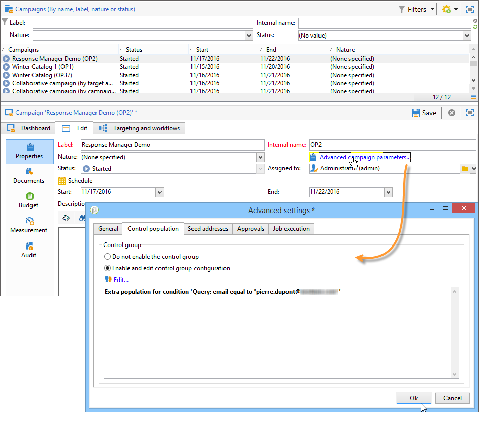

# Skapa hypoteser{#creating-hypotheses}

Det finns olika möjligheter att skapa/länka hypoteser till ett kampanjerbjudande eller en kampanjleverans:

* Via **[!UICONTROL Measurement hypotheses]** genom att skapa en ny hypotes baserad på en befintlig mall och länka den till en befintlig leverans.
* Via **[!UICONTROL Edit]** > **[!UICONTROL Measurement]** i en kampanj.
* Via **[!UICONTROL Measurement]** alternativ för en leverans som skapats från en kampanj.

Hypoeser kan bara beräknas när marknadsföringskampanjen har startats och mottagarna har fått leveransen. Om hypotesen bygger på ett erbjudande måste det åtminstone presenteras och fortfarande vara aktivt. Erbjudande och leveranssätt skapas via **[!UICONTROL Measurement hypotheses]** och baseras på en hypotesmall. Det är dock möjligt att hänvisa till en hypotes direkt i leveransen eller kampanjen innan kampanjen börjar. I det här fallet beräknas hypoteserna automatiskt när marknadsföringskampanjen startas, baserat på körningsinställningar. [Läs mer](hypothesis-templates.md#hypothesis-template-execution-settings)

## Skapa en hypotes direkt vid leverans {#creating-a-hypothesis-on-the-fly-on-a-delivery}

Gör så här om du vill skapa en hypotes om en befintlig leverans:

>[!NOTE]
>
>Den här åtgärden är bara möjlig för väntande leveranser.

1. Gå till Adobe Campaign **[!UICONTROL Campaign management > Measurement hypotheses]**.
1. Klicka på **[!UICONTROL New]** eller högerklicka på listan med hypoteser och välj **[!UICONTROL New]** i listrutan.

   

1. Välj en mall som du skapat tidigare i hypotesfönstret. [Läs mer](hypothesis-templates.md)

   

   Sammanhanget för hypotesen, så som den definierades i den valda modellen, visas i fönstret.

   >[!NOTE]
   >
   >Inställningarna som definieras i mallen och inte visas i det här steget sparas också i minnet och omtilldelas till den pågående hypotesen.

   

1. Välj den leverans som du vill skapa en hypotes för.

   

1. Du kan personalisera din hypotes genom att redigera **[!UICONTROL General]**, **[!UICONTROL Transactions]** och **[!UICONTROL Scope]** -tabbar. [Läs mer](hypothesis-templates.md#creating-a-hypothesis-model)
1. Börja hypotesen genom att klicka **[!UICONTROL Start]**.

   Ett arbetsflöde skapas automatiskt för att utföra mätningen. Namnet definieras automatiskt beroende på hypotesens konfiguration.

   >[!CAUTION]
   >
   >Du kan komma åt detta om du har markerat **[!UICONTROL Keep execution workflow]** box.\
   >Det här alternativet måste aktiveras endast i felsökningssyfte om fel uppstår när hypotesen körs. Arbetsflöden som genereras automatiskt sparas i **[!UICONTROL Administration]** > **[!UICONTROL Production]** > **[!UICONTROL Objects created automatically]** > **[!UICONTROL Campaign workflows]** i Adobe Campaign Utforskaren.
   > 
   >Dessutom får arbetsflöden som genereras automatiskt inte ändras. Eventuella ändringar kommer inte att beaktas någon annanstans vid senare beräkningar.
   >
   >Om du har markerat det här alternativet tar du bort arbetsflödet när det har körts.

   

   När beräkningen är klar uppdateras mätningsindikatorerna automatiskt.

   

1. Ändra inställningarna om det behövs och starta om hypotesen.

## Referera till en hypotes i en kampanjleverans {#referencing-a-hypothesis-in-a-campaign-delivery}

Du kan referera till en hypotes i en marknadsföringskampanj innan den börjar. I det här fallet kommer hypotesen att startas automatiskt när leveransen skickas, baserat på de körningsinställningar som definierats i hypotesmallen. Gör så här om du vill skapa en hypotes i en leverans:

1. Beroende på dina behov kan du skapa en eller flera **[!UICONTROL Delivery]** typmallar, enligt beskrivningen i [det här avsnittet](hypothesis-templates.md#creating-a-hypothesis-model)
1. Skapa en marknadsföringskampanj och arbetsflöden för målinriktning.
1. I leveransfönstret klickar du på **[!UICONTROL Delivery measurement]** ikon.
1. Välj hypotesmallen (frågan som är konfigurerad i modellen visas i hypotesfönstret).

   Hypotesen beräknas automatiskt när kampanjen är avslutad, baserat på de datum som konfigurerats i modellen. [Läs mer](hypothesis-templates.md#hypothesis-template-execution-settings)

   

## Lägga till en standardhypotes i leveranser för en kampanj {#adding-a-default-hypothesis-to-deliveries-for-a-campaign}

Ni kan hänvisa direkt till en hypotes på kampanjnivå. I det här fallet kommer hypotesen automatiskt att länkas till alla leveranser som skapats i kampanjen. Så här gör du:

1. Gå till **[!UICONTROL Edit]** -fliken i kampanjen.
1. Klicka på **[!UICONTROL Default hypotheses]** -fliken.

   

1. Klicka **[!UICONTROL Add]** och välja en hypotesmall.

   

   En hypotes som bygger på den här mallen kommer nu att refereras som standard i varje ny leverans för kampanjen.

   

Resultatet av hypotesen kan ses i **[!UICONTROL General]** och **[!UICONTROL Reactions]** hypotesens. [Läs mer](hypothesis-tracking.md)

Mer information finns i [det här exemplet](#example--creating-a-hypothesis-linked-to-a-delivery).

## Skapa en hypotes om ett erbjudande {#creating-a-hypothesis-on-an-offer}

Att skapa en hypotes om ett offertförslag liknar att skapa en hypotes på direkten. Hypotesen kan verkställas så länge som erbjudandet är aktivt. Beräkningsperioden baseras på offertens förslagsdatum. När hypotesen låter dig länka en mottagare till ett köp, kan status för det erbjudande som troligtvis godkänns ändras automatiskt. [Läs mer](hypothesis-templates.md#transactions)

1. Skapa en eller flera **[!UICONTROL Offer]** typmodeller enligt beskrivningen i [det här avsnittet](hypothesis-templates.md#creating-a-hypothesis-model).
1. Gå till **[!UICONTROL Campaign management > Measurement hypotheses]** nod.
1. Skapa en **[!UICONTROL Offers]** gör en typografi genom att markera den tidigare skapade modellen.

   

   Frågan som skapas i modellen visas i fönstret.

   

1. Välj det erbjudande du vill skapa en hypotes för.

   

1. Förfina frågan om det behövs.
1. Klicka **[!UICONTROL Start]** för att driva hypotesen.
1. Resultaten av hypoteserna kan ses i **[!UICONTROL General]** och **[!UICONTROL Reactions]** -tabbar. [Läs mer](hypothesis-tracking.md)

   Det finns referenser till hypoteser om ett erbjudande i **[!UICONTROL Measurement]** -fliken.

   

   Om **[!UICONTROL Update offer proposition status]** Alternativet aktiverades i hypotesmallen, status för erbjudandeförslaget ändras automatiskt, vilket ger återkoppling om kampanjens effekt (mer information om detta finns i [Transaktioner](hypothesis-templates.md#transactions)).

## Exempel: skapa en hypotes kopplad till en leverans {#example--creating-a-hypothesis-linked-to-a-delivery}

I det här exemplet vill vi skapa en hypotes kopplad till en leverans. Denna hypotes kommer att baseras på den modell som skapats tidigare. [Läs mer](hypothesis-templates.md#example--creating-a-hypothesis-template-on-a-delivery)

Därefter förfinar vi frågan som ärvts från modellen så att vi kan göra en hypotes om en viss artikel i inköpstabellen.

1. Skapa en kampanj och en leverans. [Läs mer](../../campaign/using/setting-up-marketing-campaigns.md#creating-a-campaign)

   Vi använder till exempel en direktutskick.

1. Konfigurera en startadress: den tidigare skapade hypotesmallen har konfigurerats för att ta hänsyn till en kontrollgrupp i reaktionsresultaten.

   

   >[!NOTE]
   >
   >Mer information hittar du i [det här avsnittet](../../campaign/using/marketing-campaign-deliveries.md#defining-a-control-group).

1. Öppna **[!UICONTROL Direct mail delivery]** och klicka på **[!UICONTROL Delivery measurement]** ikonen och klicka sedan på **[!UICONTROL Add]**.

   

1. Välj den tidigare skapade hypotesmallen i listrutan.

   

   Frågan som skapas i modellen visas.

   

1. Klicka **[!UICONTROL Edit query...]** och förfina frågan genom att ange den produkt som hypotesen gäller.

   

   Du kan kontrollera att hypotesen är kopplad till leveransen i **[!UICONTROL Edit]** > **[!UICONTROL Measurement]** -fliken i kampanjen.

   

1. Starta målarbetsflödet och kör de kontroller som krävs tills kampanjen är klar. [Läs mer](../../campaign/using/marketing-campaign-deliveries.md#starting-a-delivery)

   

1. Gå till Adobe Campaign **[!UICONTROL Campaign management > Measurement hypotheses]** nod för att kontrollera de indikatorer som beräknats av hypotesen.

   
