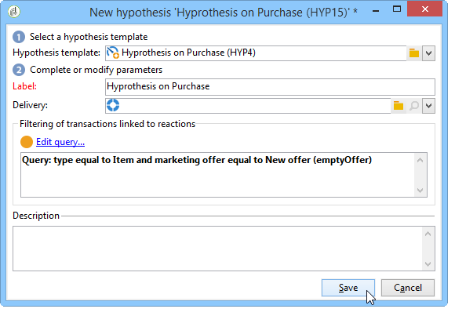
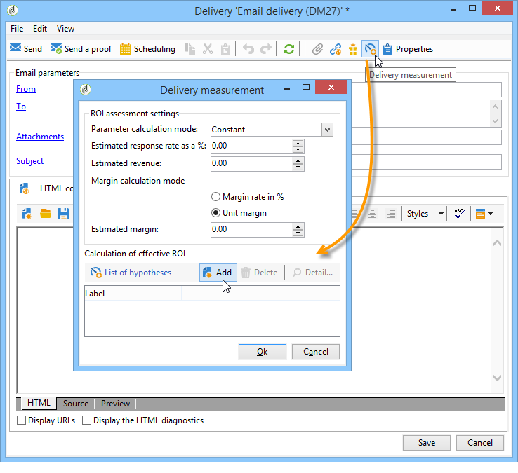
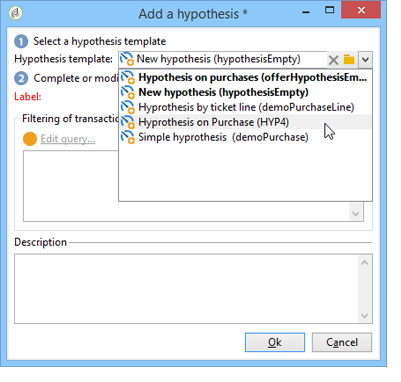

# Skapa hypoteser{#creating-hypotheses}

Det finns olika möjligheter att skapa/länka hypoteser till ett kampanjerbjudande eller en kampanjleverans:

* Via mappen **[!UICONTROL Measurement hypotheses]** genom att skapa en ny hypotes baserad på en befintlig mall och länka den till en befintlig leverans.
* Via fliken **[!UICONTROL Edit]** > **[!UICONTROL Measurement]** i en kampanj.
* Via alternativet **[!UICONTROL Measurement]** för en leverans som skapats från en kampanj.

Hypoeser kan bara beräknas när marknadsföringskampanjen har startats och mottagarna har fått leveransen. Om hypotesen bygger på ett erbjudande måste det åtminstone presenteras och fortfarande vara aktivt. Hypoteser om erbjudanden och leveranser skapas via mappen **[!UICONTROL Measurement hypotheses]** och baseras på en hypotesmall. Det är dock möjligt att hänvisa till en hypotes direkt i leveransen eller kampanjen innan kampanjen börjar. I det här fallet beräknas hypoteserna automatiskt när marknadsföringskampanjen startas, baserat på körningsinställningar. [Läs mer](hypothesis-templates.md#hypothesis-template-execution-settings)

## Skapa en hypotes direkt vid leverans {#creating-a-hypothesis-on-the-fly-on-a-delivery}

Gör så här om du vill skapa en hypotes om en befintlig leverans:

>[!NOTE]
>
>Den här åtgärden är bara möjlig för väntande leveranser.

1. Gå till **[!UICONTROL Campaign management > Measurement hypotheses]** i Adobe Campaign-trädet.
1. Klicka på knappen **[!UICONTROL New]** eller högerklicka på hypoteslistan och välj **[!UICONTROL New]** i listrutan.

   

1. Välj en mall som du skapat tidigare i hypotesfönstret. [Läs mer](hypothesis-templates.md)

   

   Sammanhanget för hypotesen, så som den definierades i den valda modellen, visas i fönstret.

   >[!NOTE]
   >
   >Inställningarna som definieras i mallen och inte visas i det här steget sparas också i minnet och omtilldelas till den pågående hypotesen.

   

1. Välj den leverans som du vill skapa en hypotes för.

   

1. Du kan anpassa din hypotes genom att redigera flikarna **[!UICONTROL General]**, **[!UICONTROL Transactions]** och **[!UICONTROL Scope]**. [Läs mer](hypothesis-templates.md#creating-a-hypothesis-model)
1. Börja hypotesen genom att klicka på **[!UICONTROL Start]**.

   Ett arbetsflöde skapas automatiskt för att utföra mätningen. Namnet definieras automatiskt beroende på hypotesens konfiguration.

   >[!CAUTION]
   >
   >Du kommer åt detta om du har markerat rutan **[!UICONTROL Keep execution workflow]**.\
   >Det här alternativet måste aktiveras endast i felsökningssyfte om fel uppstår när hypotesen körs. Arbetsflöden som genereras automatiskt sparas i mappen **[!UICONTROL Administration]** > **[!UICONTROL Production]** > **[!UICONTROL Objects created automatically]** > **[!UICONTROL Campaign workflows]** i Utforskaren i Adobe Campaign.
   > 
   >Dessutom får arbetsflöden som genereras automatiskt inte ändras. Eventuella ändringar kommer inte att beaktas någon annanstans vid senare beräkningar.
   >
   >Om du har markerat det här alternativet tar du bort arbetsflödet när det har körts.

   

   När beräkningen är klar uppdateras mätningsindikatorerna automatiskt.

   

1. Ändra inställningarna om det behövs och starta om hypotesen.

## Referera till en hypotes i en kampanjleverans {#referencing-a-hypothesis-in-a-campaign-delivery}

Du kan referera till en hypotes i en marknadsföringskampanj innan den börjar. I det här fallet kommer hypotesen att startas automatiskt när leveransen skickas, baserat på de körningsinställningar som definierats i hypotesmallen. Gör så här om du vill skapa en hypotes i en leverans:

1. Beroende på dina behov kan du skapa en eller flera **[!UICONTROL Delivery]**-typmallar, enligt beskrivningen i [det här avsnittet](hypothesis-templates.md#creating-a-hypothesis-model)
1. Skapa en marknadsföringskampanj och arbetsflöden för målinriktning.
1. Klicka på ikonen **[!UICONTROL Delivery measurement]** i leveransfönstret.
1. Välj hypotesmallen (frågan som är konfigurerad i modellen visas i hypotesfönstret).

   Hypotesen beräknas automatiskt när kampanjen är avslutad, baserat på de datum som konfigurerats i modellen. [Läs mer](hypothesis-templates.md#hypothesis-template-execution-settings)

   

## Lägga till en standardhypotes i leveranser för en kampanj {#adding-a-default-hypothesis-to-deliveries-for-a-campaign}

Ni kan hänvisa direkt till en hypotes på kampanjnivå. I det här fallet kommer hypotesen automatiskt att länkas till alla leveranser som skapats i kampanjen. Så här gör du:

1. Gå till fliken **[!UICONTROL Edit]** i kampanjen.
1. Klicka på fliken **[!UICONTROL Default hypotheses]** i mätningsavsnittet.

   

1. Klicka på **[!UICONTROL Add]** och välj en hypotesmall.

   

   En hypotes som bygger på den här mallen kommer nu att refereras som standard i varje ny leverans för kampanjen.

   

Trottoarresultaten kan visas på flikarna **[!UICONTROL General]** och **[!UICONTROL Reactions]** i hypotesen. [Läs mer](hypothesis-tracking.md)

Mer information finns också i [det här exemplet](#example--creating-a-hypothesis-linked-to-a-delivery).

## Skapa en hypotes om ett erbjudande {#creating-a-hypothesis-on-an-offer}

Att skapa en hypotes om ett offertförslag liknar att skapa en hypotes på direkten. Hypotesen kan verkställas så länge som erbjudandet är aktivt. Beräkningsperioden baseras på offertens förslagsdatum. När hypotesen låter dig länka en mottagare till ett köp, kan status för det erbjudande som troligtvis godkänns ändras automatiskt. [Läs mer](hypothesis-templates.md#transactions)

1. Skapa en eller flera **[!UICONTROL Offer]**-typmodeller enligt beskrivningen i [det här avsnittet](hypothesis-templates.md#creating-a-hypothesis-model).
1. Gå till noden **[!UICONTROL Campaign management > Measurement hypotheses]**.
1. Skapa en **[!UICONTROL Offers]**-typografi genom att välja den modell som skapades tidigare.

   

   Frågan som skapas i modellen visas i fönstret.

   

1. Välj det erbjudande du vill skapa en hypotes för.

   

1. Förfina frågan om det behövs.
1. Klicka på **[!UICONTROL Start]** för att köra hypotesen.
1. Trottoarresultaten kan visas på flikarna **[!UICONTROL General]** och **[!UICONTROL Reactions]**. [Läs mer](hypothesis-tracking.md)

   Det finns referenser till hypoteser om ett erbjudande på fliken **[!UICONTROL Measurement]**.

   

   Om alternativet **[!UICONTROL Update offer proposition status]** var aktiverat i hypotesmallen ändras status för erbjudandeförslaget automatiskt, vilket ger återkoppling om kampanjens effekt (mer information finns i [Transaktioner](hypothesis-templates.md#transactions)).

## Exempel: skapa en hypotes kopplad till en leverans {#example--creating-a-hypothesis-linked-to-a-delivery}

I det här exemplet vill vi skapa en hypotes kopplad till en leverans. Denna hypotes kommer att baseras på den modell som skapats tidigare. [Läs mer](hypothesis-templates.md#example--creating-a-hypothesis-template-on-a-delivery)

Därefter förfinar vi frågan som ärvts från modellen så att vi kan göra en hypotes om en viss artikel i inköpstabellen.

1. Skapa en kampanj och en leverans. [Läs mer](../../campaign/using/setting-up-marketing-campaigns.md#creating-a-campaign)

   Vi använder till exempel en direktutskick.

1. Konfigurera en startadress: den tidigare skapade hypotesmallen har konfigurerats för att ta hänsyn till en kontrollgrupp i reaktionsresultaten.

   

   >[!NOTE]
   >
   >Mer information hittar du i [det här avsnittet](../../campaign/using/marketing-campaign-deliveries.md#defining-a-control-group).

1. Öppna **[!UICONTROL Direct mail delivery]** och klicka på ikonen **[!UICONTROL Delivery measurement]** och klicka sedan på **[!UICONTROL Add]**.

   

1. Välj den tidigare skapade hypotesmallen i listrutan.

   

   Frågan som skapas i modellen visas.

   

1. Klicka på **[!UICONTROL Edit query...]** och förfina frågan genom att ange den produkt som hypotesen gäller.

   

   Du kan kontrollera att hypotesen är länkad till leveransen på fliken **[!UICONTROL Edit]** > **[!UICONTROL Measurement]** i kampanjen.

   

1. Starta målarbetsflödet och kör de kontroller som krävs tills kampanjen är klar. [Läs mer](../../campaign/using/marketing-campaign-deliveries.md#starting-a-delivery)

   

1. Gå till noden **[!UICONTROL Campaign management > Measurement hypotheses]** i Adobe Campaign-trädet för att kontrollera indikatorerna som beräknats med hypotesen.

   
