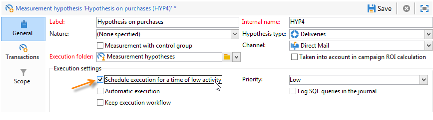
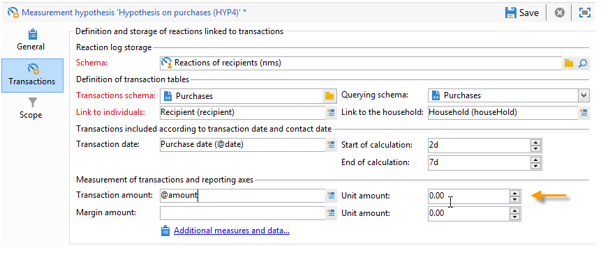
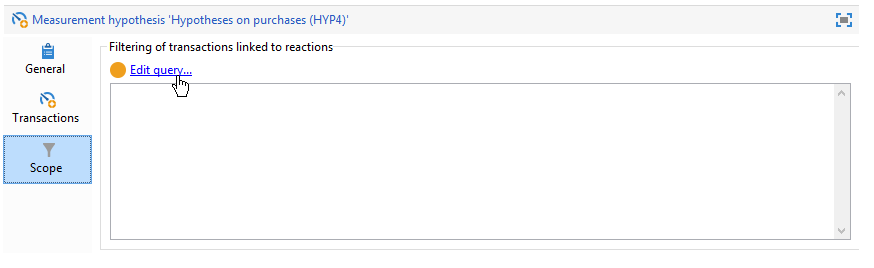
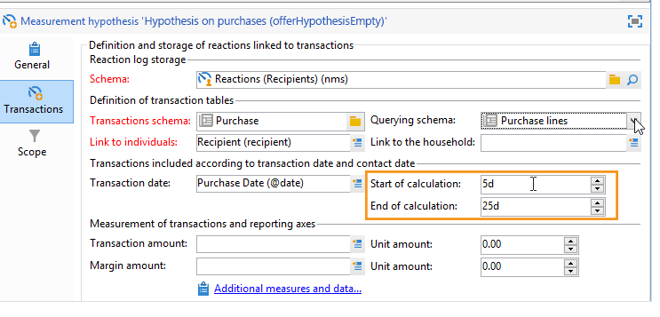

# Hypotesmallar{#hypothesis-templates}

## Skapa en hypotesmodell {#creating-a-hypothesis-model}

Genom att konfigurera mallen för hypoteser kan du definiera sammanhanget för att mäta reaktioner, oavsett om det gäller en leverans eller ett erbjudande. Här refereras de olika mättabellerna, inklusive de som används för att definiera relationer mellan individer, hypoteser och transaktionsregistret.

Så här skapar du en hypotesmall:

1. Klicka på **[!UICONTROL Resources>Templates>Hypothesis templates]** i Utforskaren i Adobe Campaign.

   

1. Klicka på **[!UICONTROL New]** eller högerklicka i listan med mallar och välj **[!UICONTROL New]** i listrutan.
1. Ange hypotessetiketten.
1. Ange om mallen är avsedd för hypoteser om erbjudanden eller leveranser via **[!UICONTROL Hypothesis type]**.
1. För **[!UICONTROL Delivery]**-typmallar anger du om mätningar ska utföras med eller utan en kontrollgrupp. [Läs mer](#properties-of-a-hypothesis-template)
1. För **[!UICONTROL Delivery]**-typmallar kan du välja en specifik kanal eller bestämma dig för att använda mallen på alla tillgängliga kanaler i Adobe Campaign med hjälp av listrutan **[!UICONTROL Channel]**. [Läs mer](#properties-of-a-hypothesis-template)
1. Välj den **[!UICONTROL Execution folder]** som du vill skapa och kör automatiskt de hypoteser som ska skapas från den här mallen.
1. Välj körningsinställningar. [Läs mer](#hypothesis-template-execution-settings)
1. Ange beräkningsperioden för hypotesen. [Läs mer](#hypothesis-template-execution-settings)

   >[!CAUTION]
   >
   >Perioden bestäms från kontaktdatumet.

1. På fliken **[!UICONTROL Transactions]** anger du de tabeller och fält som krävs för beräkningen av hypotesen. [Läs mer](#transactions)
1. Om mallen är konfigurerad för **[!UICONTROL Offer]**-typografi kan du aktivera alternativet **[!UICONTROL Update offer proposition status]**: I så fall väljer du status för det erbjudande du vill ändra.
1. Ange omfattningen av hypotestillämpningen. [Läs mer](#hypothesis-perimeter)
1. Använd vid behov ett skript för att slutföra filtreringen. [Läs mer](#hypothesis-perimeter)

### Egenskaper för en hypotesmall {#properties-of-a-hypothesis-template}

På mallens **[!UICONTROL General]**-flik kan du ange allmänna mallalternativ. De tillgängliga fälten är:

* **[!UICONTROL Hypothesis type]**: Här kan du bestämma om mallen ska vara avsedd för hypoteser om leveranser eller erbjudanden.

   Du kan också välja att skapa en hypotes som ska gälla för både leveranser och erbjudanden.

   >[!NOTE]
   >
   >Om mallen gäller för erbjudanden är alternativet **[!UICONTROL Update offer proposition status]** tillgängligt på fliken **[!UICONTROL Transactions]**.

* **[!UICONTROL Measurement with control group]**: kan ni ange om en kontrollgrupp har definierats för leveransen eller kampanjen och inkludera den i mätningsindikatorer. Med kontrollgruppen, som inte tar emot leveranser, kan ni mäta effekten av kampanjen efter leveransen genom att jämföra den med målpopulationen som fick leveransen.

   >[!NOTE]
   >
   >Om mallen är konfigurerad att ta hänsyn till en kontrollgrupp, men ingen grupp har definierats i leveransen som hypotesen gäller, kommer resultatet endast att baseras på målmottagarna.

   Mer information om hur du definierar och konfigurerar en kontrollgrupp finns i [det här avsnittet](../../campaign/using/marketing-campaign-deliveries.md#defining-a-control-group).

* **[!UICONTROL Channel]**: Du kan välja en viss kanal eller göra hypotesmallen tillgänglig för alla kanaler i Adobe Campaign-konsolen genom att välja  **[!UICONTROL All channels]** i listrutan. Om du konfigurerar mallen för en viss kanal kan du på så sätt automatiskt filtrera leveranser per kanal när du skapar hypotesen. [Läs mer](creating-hypotheses.md)

   

* **[!UICONTROL Execution folder]**: gör att du kan ange körningsmapp för hypotesen.
* **[!UICONTROL Taken into account in campaign ROI calculation]**: tar hänsyn till hypotesresultatet i ROI-beräkningen för den relaterade kampanjen.

### Körningsinställningar för hypostermallar {#hypothesis-template-execution-settings}

På mallens **[!UICONTROL General]**-flik kan du även ange parametrar för hypoteskörning. Följande alternativ är tillgängliga:

* **[!UICONTROL Schedule execution for a time of low activity]**: Med kan du schemalägga lanseringen av hypotesen för att optimera Adobe Campaign prestanda. När det här alternativet är markerat utför bearbetningsarbetsflödet för kampanjer en hypotesberäkning under driftstopp.

   

* **[!UICONTROL Priority]**: den nivå som tillämpas på hypotesen för att göra hypotesberäkningarna mer kortvariga om det finns samtidiga körningar.

   

* **[!UICONTROL Automatic execution]**: Om det behövs kan du schemalägga omräkning av hypoteser (om du till exempel vill uppdatera indikatorerna regelbundet till leveransslutet).

   

   Om du vill ange ett schema använder du följande process:

   1. Klicka på länken **[!UICONTROL Frequency of execution...]** och sedan på knappen **[!UICONTROL Change...]**.

      

   1. Konfigurera frekvens, relaterade händelser och giltighetsperiod.

      

   1. Klicka på **[!UICONTROL Finish]** för att spara schemat.

      

* **[!UICONTROL Log SQL queries in journal]**: den här funktionen är reserverad för expertanvändare. Här kan du lägga till en flik i mäthypotesgranskningen för att visa SQL-frågor. På så sätt kan eventuella felfunktioner identifieras om en simulering avslutas med fel.
* **[!UICONTROL Keep execution workflow]**: I kan du behålla det arbetsflöde som skapades automatiskt i början av hypotesberäkningen. I de hypoteser som skapas från en mall där det här alternativet är markerat är det genererade arbetsflödet tillgängligt för att följa processen.

   >[!CAUTION]
   >
   >Det här alternativet måste aktiveras endast i felsökningssyfte om fel uppstår när hypotesen körs.\
   >Dessutom får arbetsflöden som genereras automatiskt inte ändras. Eventuella ändringar kommer inte att beaktas någon annanstans vid senare beräkningar.\
   >Om du har markerat det här alternativet tar du bort arbetsflödet när det har körts.

### Transaktioner {#transactions}

Fliken innehåller de olika fälten och tabellerna som gör att du kan spara historiken över mottagarnas svar i termer av transaktioner. Mer information finns i [avsnittet](../../configuration/using/about-schema-reference.md) för tabeller som är dedikerade till svarshantering.

* **[!UICONTROL Schema (reaction log storage)]**: välj mottagarreaktionstabellen. Registret i körklart läge i Adobe Campaign är **NmsRemaMatchRcp**.
* **[!UICONTROL Transaction schema]**: Välj den tabell som hypoteserna ska avse, dvs. transaktionen eller inköpstabellen.
* **[!UICONTROL Querying schema]**: Välj villkor för att filtrera hypotesen.
* **[!UICONTROL Link to individuals]**: välj länken mellan individer och det register som används som transaktionsschema.
* **[!UICONTROL Link to the household]**: markera länken till hushållet i transaktionsschemat om du vill inkludera alla medlemmar i ett hushåll i en hypotes. Det här fältet är valfritt.
* **[!UICONTROL Transaction date]**: Detta fält är valfritt men rekommenderas eftersom det gör att du kan definiera ett omfång för hypotesberäkning.
* **[!UICONTROL Measurement period]**: I kan du konfigurera start- och slutdatum när hypoteser körs och inköpsrader återställs.

   När hypotesen är länkad till en leverans aktiveras mätningen automatiskt några dagar efter kontaktdatumet för direktreklam eller efter leveransdatumet för e-post- eller SMS-leveranser.

   

   Om hypotesen lanseras i farten kan den bli tvingad om den omedelbart skulle vilja utlösa den. I annat fall aktiveras den automatiskt baserat på det konfigurerade slutdatumet för beräkningen, som baseras på det datum då hypotesen skapades. [Läs mer](creating-hypotheses.md#creating-a-hypothesis-on-the-fly-on-a-delivery)).

* **[!UICONTROL Transaction/Margin amount]**: Dessa fält är valfria och gör att du kan beräkna omsättningsindikatorer automatiskt. [Läs mer](hypothesis-tracking.md#indicators)
* **[!UICONTROL Unit amount]**: gör att du kan ange ett belopp för beräkning av intäkter. [Läs mer](hypothesis-tracking.md#indicators)

   

* **[!UICONTROL Additional measures and data]**: I kan du ange ytterligare mått eller axlar från fält i de olika tabellerna.
* **[!UICONTROL Update offer proposition status]**: låter dig ändra status på erbjudandeförslaget om en erbjudandemottagare identifieras av hypotesen.

   

### Hyposterperimeter {#hypothesis-perimeter}

När du har definierat transaktionstabellen och de fält som hypotesen gäller, kan du förfina omfattningen av dina hypoteser genom att ange riktade transaktioner och leveranser med hjälp av filter. Du kan också använda ett JavaScript-skript för att uttryckligen peka på en produkt som det hänvisas till i transaktionstabellen.

* **Filter på transaktioner**: på  **[!UICONTROL Scope]** fliken kan du konfigurera ett filter enligt hypotesen. Så här gör du:

   1. Klicka på länken **[!UICONTROL Edit query]**.

      

   1. Ange filtreringsvillkoren.

      

   1. Välj transaktionen som hypotesen ska beröra.

      

* **Filter på mottagare**: på  **[!UICONTROL Scope]** fliken kan du begränsa din hypotes till all information som är länkad till ett meddelande (leverans, mottagare, e-postadress, tjänst osv.):

   1. Klicka på länken **[!UICONTROL Add a filter]** och sedan på **[!UICONTROL Edit query]**.

      

   1. Ange filtreringsvillkoren.

      

   1. Klicka på **[!UICONTROL Finish]** för att spara frågan.

      

* **Skript**: du kan använda ett JavaScript-skript för att dynamiskt överlagra hypotesinställningarna under körningen.

   Det gör du genom att klicka på länken **[!UICONTROL Advanced settings]** och sedan ange önskat skript.

   >[!NOTE]
   >
   >Det här alternativet är till för expertanvändare.

   

## Exempel: skapa en hypotesmall för en leverans {#example--creating-a-hypothesis-template-on-a-delivery}

I det här exemplet ska vi skapa en hypotesmall för direktreklam. Transaktionstabellen (**Inköp** i vårt exempel) som hypotesen baseras på innehåller inköpsrader som är länkade till artiklar eller produkter. Vi vill konfigurera vår modell för att skapa hypoteser om artiklar eller produkter i inköpstabellen.

1. Gå till noden **[!UICONTROL Resources > Templates > Hypothesis templates]** i Adobe Campaign Explorer.
1. Klicka på **[!UICONTROL New]** för att skapa en mall.

   

1. Ändra malletiketten.

   

1. Välj **[!UICONTROL Deliveries]** som en hypotestyp.
1. Ange att leveransen kan innehålla en kontrollgrupp genom att markera rutan.
1. Välj kanalen **[!UICONTROL Direct mail]**.

   >[!NOTE]
   >
   >Eftersom mallen är specifik för direktreklam är det inte säkert att hypoteser som skapas med den här modellen länkas till någon annan leveranstyp.

1. Markera mottagarsvarstabellen på fliken **[!UICONTROL Transactions]**.

   

1. Välj inköpstabell i fältet **[!UICONTROL Transactions schema]**.

   

1. Välj inköpsrader i fältet **[!UICONTROL Querying schema]**.

   

1. Välj de mottagare som är länkade till inköpstabellen.

   

1. Markera fältet som är länkat till inköpsdatumet.

   På så sätt kan du definiera en tidsram för hypoteser. Det här steget är inte obligatoriskt, men det rekommenderas.

   

1. Konfigurera beräkningsperioden i 5 till 25 dagar.

   

1. Klicka på **[!UICONTROL Edit query]** på fliken **[!UICONTROL Scope]** för att skapa ett filter för hypoteser.

   

   Den mall som skapas gör att du kan göra hypoteser om produkterna eller artiklarna i inköpstabellen.

1. Klicka på **[!UICONTROL Save]** för att spela in mallen.
