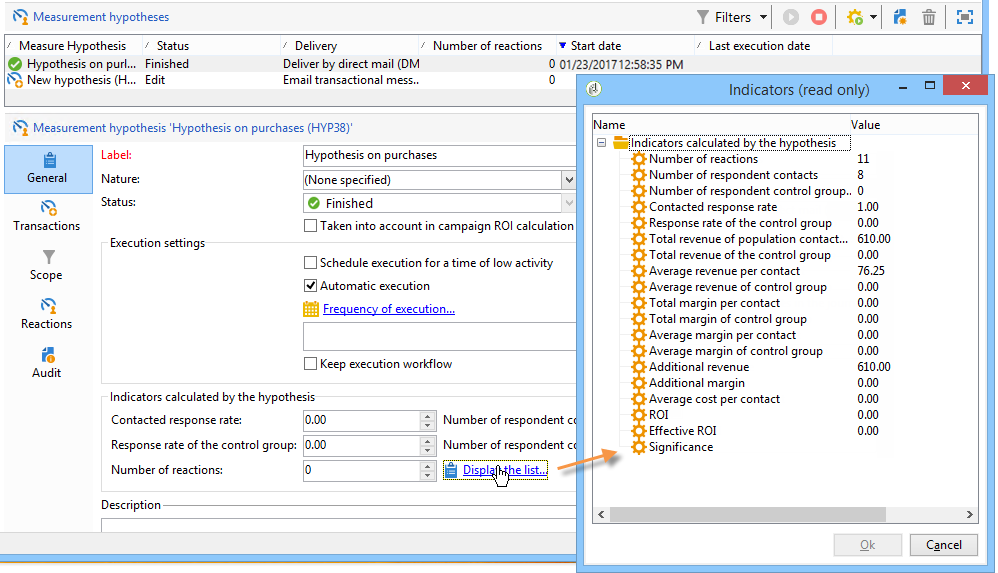

# Spårning av hypoteser{#hypothesis-tracking}

Resultatet av hypotesberäkningarna är tillgängligt på olika nivåer av Adobe Campaign: indikatorer som beräknas utifrån hypoteser och målpopulationens reaktioner är synliga via den faktiska hypotesen, liksom i hypoterapporterna som är tillgängliga via kampanjer och leveranser.

## Hyposterresultat {#hypothesis-results}

### Indikatorer {#indicators}

När hypotesen har beräknats uppdateras flera mätningsindikatorer automatiskt. Dessa finns på fliken **[!UICONTROL General]** i hypotesen.

Dessa indikatorer är:

* **Antal kontaktade**: antal kontaktade personer som matchar hypotesen.
* **Kontaktad svarsfrekvens**: antal kontaktpersoner/totalt antal kontaktade personer under leveransen.
* **Antal kontakter i kontrollgruppen för svarande**: antal kontrollgrupper som matchar hypotesen.
* **Svarsfrekvens för kontrollgruppen**: antal respondentkontrollgrupper/totalt antal leveranskontrollgrupper.
* **Antal reaktioner**: antal poster i tabellen som innehåller relationen mellan individer, hypotesen och transaktionstabellen.

Klicka på länken **[!UICONTROL Display the list]** om du vill se en fullständig lista över indikatorer:

Indikatorerna ger följande information:

* **Total intäkt för den kontaktade befolkningen**: totalt antal personer som kontaktats.
* **Total intäkt för kontrollgruppen**: totala belopp över antalet kontrollgrupper.
* **Genomsnittlig intäkt per kontakt**: totala belopp/kontaktade.
* **Genomsnittlig intäkt för kontrollgrupp**: totala belopp/kontrollgrupp.
* **Total marginal per kontakt**: total marginal som kontaktats.
* **Total marginal för kontrollgruppen**: total marginal över kontrollgruppen.
* **Genomsnittlig marginal per kontakt**: total marginal/kontaktad.
* **Genomsnittlig marginal för kontrollgrupper**: totala marginaler/kontrollgrupp.
* **Ytterligare intäkter**: (Genomsnittlig intäkt för kontaktad/genomsnittlig intäkt för kontrollgruppen)&#42;Antal kontaktade
* **Ytterligare marginal**: (genomsnittlig marginal för kontaktad/genomsnittlig marginal för kontrollgrupp) / antal kontaktade
* **Genomsnittskostnad per kontakt**: beräknad leveranskostnad/antal kontakter.
* **ROI**: beräknad kostnad för leveransen/total marginal per kontakt
* **Effektiv avkastning på investering**: beräknad leveranskostnad/tilläggsmarginal.
* **Signifikans**: innehåller värdena 0 till 3 beroende på kampanjens betydelse.

### Reaktioner {#reactions}

Du kan visa mottagarnas reaktioner på hypoteserna via fliken **[!UICONTROL Reactions]**.

1. När hypotesberäkningen är klar går du till noden **[!UICONTROL Campaign management > Measurement hypotheses]** i Adobe Campaign-trädet.
1. Välj önskad hypotes och klicka på fliken **[!UICONTROL Reactions]** för att visa en lista över mottagare som kan köpa något efter marknadsföringskampanjen.

   

## Rapporter {#reports}

Med **[!UICONTROL Hypothesis report]** kan du visa resultatet av de hypoteser som har utförts på kampanjer och leveranser. Den här rapporten innehåller de indikatorer som beräknats av hypotesen (mer information finns i [Indikatorer](#indicators)).

* **På kampanjnivå**: klicka på länken **[!UICONTROL Reports]** för den aktuella kampanjen och välj **[!UICONTROL Hypothesis report]**. Den här rapporten innehåller en lista över kampanjleveranser och de hypoteser som beräknas för varje leverans.

  

* **Vid leveransnivå**: öppna rapporten genom att öppna den aktuella leveransen, klicka på **[!UICONTROL Reports]** på fliken **[!UICONTROL Summary]** och markera **[!UICONTROL Hypothesis report]**. Om flera hypoteser har beräknats för samma leverans innehåller rapporten alla hypoteser.

  
