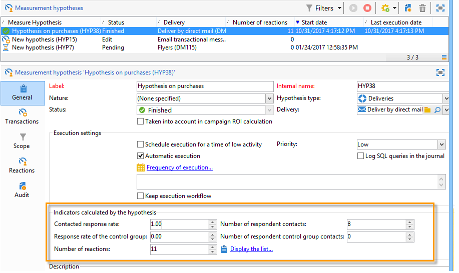

# Spårning av hypoteser{#hypothesis-tracking}

Resultatet av hypotesberäkningarna är tillgängligt på olika nivåer av Adobe Campaign: indikatorer som beräknas utifrån hypoteser och målpopulationens reaktioner är synliga via den faktiska hypotesen, liksom i hypoterapporterna som är tillgängliga via kampanjer och leveranser.

## Hyposterresultat {#hypothesis-results}

### Indikatorer {#indicators}

När hypotesen har beräknats uppdateras flera mätningsindikatorer automatiskt. Dessa finns i **[!UICONTROL General]** hypotesens.

Dessa indikatorer är:

* **Antal respondentkontakter**: antal kontaktade personer som matchar hypotesen.
* **Kontaktad svarsfrekvens**: antal kontaktpersoner/totalt antal kontaktpersoner under leveransen.
* **Antal kontakter i kontrollgruppen för svarande**: antal kontrollgrupper som matchar hypotesen.
* **Kontrollgruppens svarsfrekvens**: antal respondentkontrollgrupper/totalt antal leveranskontrollgrupper.
* **Antal reaktioner**: antal poster i tabellen som innehåller relationen mellan individer, hypotesen och transaktionsregistret.

Klicka på knappen **[!UICONTROL Display the list]** länk:

Indikatorerna ger följande information:

* **Den totala intäkten hos den kontaktade befolkningen**: totalt antal över antalet kontaktade personer.
* **Total intäkt för kontrollgruppen**: totala belopp över antalet kontrollgrupper.
* **Genomsnittlig intäkt per kontakt**: totalt antal/kontaktade.
* **Genomsnittlig intäkt för kontrollgruppen**: totalt belopp/kontrollgrupp.
* **Total marginal per kontakt**: total marginal över kontaktad.
* **Total marginal för kontrollgruppen**: total marginal över kontrollgrupp.
* **Genomsnittlig marginal per kontakt**: total marginal / kontaktad.
* **Genomsnittlig marginal för kontrollgrupper**: total marginal/kontrollgrupp.
* **Ytterligare intäkter**: (Genomsnittlig intäkt för kontaktad - Genomsnittlig intäkt för kontrollgruppen)&#42;Antal kontaktade
* **Ytterligare marginal**: (Genomsnittlig kontaktmarginal - genomsnittlig kontrollgruppsmarginal) / antal kontaktade
* **Genomsnittlig kostnad per kontakt**: beräknad leveranskostnad/antal kontakter.
* **avkastning**: beräknad kostnad för leveransen/total marginal per kontakt
* **Effektiv avkastning**: beräknad leveranskostnad/ytterligare marginal.
* **Signifikans**: innehåller värdena 0 till 3 beroende på kampanjens betydelse.

### Reaktioner {#reactions}

Du kan visa mottagarnas reaktioner på hypoteserna via **[!UICONTROL Reactions]** -fliken.

1. När hypotesberäkningen är klar går du till **[!UICONTROL Campaign management > Measurement hypotheses]** noden i Adobe Campaign-trädet.
1. Välj önskad hypotes och klicka på **[!UICONTROL Reactions]** för att visa en lista över mottagare som kan köpa något efter marknadsföringskampanjen.

   

## Rapporter {#reports}

The **[!UICONTROL Hypothesis report]** gör att du kan se resultatet av de hypoteser som utförts på kampanjer och leveranser. Denna rapport innehåller de indikatorer som beräknats av hypotesen (för mer information, se [Indikatorer](#indicators)).

* **På kampanjnivå**: klicka på **[!UICONTROL Reports]** länk till den relevanta kampanjen och välj **[!UICONTROL Hypothesis report]**. Den här rapporten innehåller en lista över kampanjleveranser och de hypoteser som beräknas för varje leverans.

  

* **På leveransnivå**: om du vill öppna rapporten öppnar du den aktuella leveransen klickar du på **[!UICONTROL Reports]** i **[!UICONTROL Summary]** och väljer **[!UICONTROL Hypothesis report]**. Om flera hypoteser har beräknats för samma leverans innehåller rapporten alla hypoteser.

  
